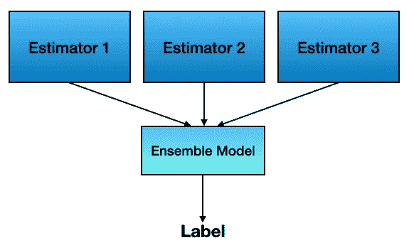
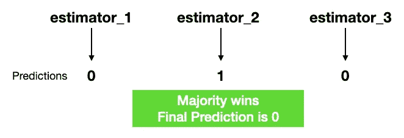
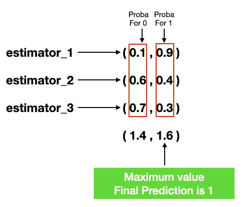
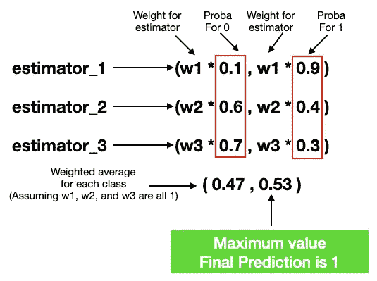

# sklearn 中的集成学习

> 原文：<https://towardsdatascience.com/ensemble-learning-in-sklearn-587f21246e8d>

## 了解如何在 sklearn 中与 pipelines 和 GridSearchCV 一起执行集成学习


照片由 [Unsplash](https://unsplash.com?utm_source=medium&utm_medium=referral) 上的[尼克·费因斯](https://unsplash.com/@jannerboy62?utm_source=medium&utm_medium=referral)拍摄

在我之前的文章中，我谈到了在 sklearn 中使用管道:

[](/using-sklearn-pipelines-to-streamline-your-machine-learning-process-a27721fdff1b)  

在那篇文章中，您学习了如何在 sklearn 中使用管道来简化您的机器学习工作流。您还了解了如何使用`GridSearchCV()`和管道来为您的数据集寻找最佳估计器。

如果能够利用多个机器学习模型(估计器)对数据集进行单独预测，而不是仅仅依赖于一个估计器，这将非常有用。然后，可以将这些结果结合起来进行最终预测:



作者图片

这就是所谓的*合奏学习*。总的来说，集成学习模型的性能通常比使用单个估计器要好。

因此，在本文中，我将向您展示如何在 sklearn 中使用集成学习来为您的数据做出更好的预测。对于代码的前几个部分，我将使用我在上一篇文章中创建的管道。因此，如果您不熟悉管道，请务必在继续之前先阅读这篇文章。

# 加载数据

对于本文，我们将使用流行的泰坦尼克号数据集，我们将从 ka ggle(【https://www.kaggle.com/c/titanic/data?select=train.csv】)下载:

```
import pandas as pd
import numpy as np
from sklearn.model_selection import train_test_splitdf = pd.read_csv('train.csv')
df = df[['Survived','Pclass','Sex','Age','Fare','Embarked']]X = df.iloc[:,1:]
y = df.iloc[:,0]X_train, X_test, y_train, y_test = train_test_split(X, y, 
                                                  test_size = 0.3, 
                                                  stratify = y, 
                                                  random_state = 0)
```

> ***数据来源*** *:本文数据来源于*[*https://www.kaggle.com/c/titanic/data.*](https://www.kaggle.com/c/titanic/data)

# 定义管道

接下来的两节将定义转换数据集中的列的管道。

## **定义变压器**

我们将首先为不同的列定义不同的转换器:

```
from sklearn.base import BaseEstimator, TransformerMixin
from sklearn.utils.validation import check_is_fitted
from sklearn.pipeline import Pipeline
from sklearn.impute import SimpleImputer
from sklearn.preprocessing import StandardScaler, OneHotEncoder**# custom transformer to select specific columns**
class FeatureSelector(BaseEstimator, TransformerMixin):
    def __init__(self, feature_names):
        self._feature_names = feature_names 

    def fit(self, X, y = None):
        return self def transform(self, X, y = None):
        return X[self._feature_names]**# define the transformer for numeric columns
# for 'Age' and 'Fare'** numeric_transformer = Pipeline(steps=[
    ('imputer', SimpleImputer(strategy='median')),
    ('scaler', StandardScaler())
])**# define the transformer for categorical columns
# for 'Sex' and 'Embarked'** categorical_transformer1 = Pipeline(steps=[
    ('imputer', SimpleImputer(strategy='most_frequent')),
    ('onehot', OneHotEncoder(handle_unknown='ignore'))
])**# define the transformer for categorical columns
# for 'Pclass'** categorical_transformer2 = Pipeline(steps=[
    ('imputer', SimpleImputer(strategy='most_frequent'))
])
```

如果您不熟悉自定义变压器，请参考本文:

[](/creating-custom-transformers-for-sklearn-pipelines-d3d51852ecc1)  

## 转换列

接下来我们将使用`ColumnTransformer`类来转换所有需要的列:

```
from sklearn.compose import ColumnTransformerfeatures_preprocessor = ColumnTransformer(
    transformers=[
        ('numeric',     numeric_transformer,       ['Age','Fare']),
        ('categorical1', categorical_transformer1, ['Sex',
                                                    'Embarked']),
        ('categorical2', categorical_transformer2, ['Pclass'])
    ], remainder='passthrough')
```

# 使用 GridSearchCV 为每个分类器寻找最佳估计量

现在我们已经定义了转换列的管道，是时候为我们的预测尝试不同的算法了。让我们一步一步来。

首先，导入所需的模块:

```
from sklearn.model_selection import GridSearchCV
from sklearn.linear_model import LogisticRegression
from sklearn.neighbors import KNeighborsClassifier
from sklearn.ensemble import RandomForestClassifier
from sklearn import svmimport warnings
warnings.filterwarnings('ignore')
```

然后，创建一个列表来存储要使用的算法(分类器)列表:

```
**# the list of classifiers to use**
# use random_state for reproducibility
classifiers = [
    LogisticRegression(random_state=0), 
    KNeighborsClassifier(), 
    RandomForestClassifier(random_state=0)
]
```

> 为了再现性，我将第一个和最后一个分类器的 random_state 设置为 0。

对于本例，我们将使用:

*   逻辑回归
*   k-最近邻(KNN)
*   随机森林

接下来，我们为每个分类器指定我们想要调整的各种超参数:

```
**# parameter grids for the various classifiers**
logregress_parameters = {
    '**classifier__**penalty' : ['l1','l2'],     
    '**classifier__**C'       : np.logspace(-3,3,7),
    '**classifier__**solver'  : ['newton-cg', 'lbfgs', 'liblinear'],
}knn_parameters = {
    '**classifier__**n_neighbors': np.arange(1, 25, 2)
}randomforest_parameters = {
    '**classifier__**n_estimators': [50, 100, 200, 300]
}
```

> 注意每个超参数的前缀`classifier__`。这个前缀与您稍后将在管道中使用的分类器的名称相关联。

然后，将所有这些超参数存储在一个列表中:

```
**# stores all the parameters in a list** 
parameters = [
    logregress_parameters, 
    knn_parameters, 
    randomforest_parameters
]
```

创建一个名为`estimators`的列表，它将存储所有调优的估计器。该列表将包含以下格式的元组集合:( *name_of_classifier* ， *tuned_estimator*

```
estimators = []
```

最后，创建一个循环来调整每个分类器。对于每个优化的分类器，打印出优化的超参数及其精度。此外，将分类器和调优的估计器的名称添加到`estimators`列表中:

```
**# iterate through each classifier and use GridSearchCV**
for i, classifier in enumerate(classifiers): **# create a Pipeline object**
    pipe = Pipeline(steps=[
        ('preprocessor', features_preprocessor),
        ('classifier', classifier)
    ]) clf = GridSearchCV(pipe,              # model
              param_grid = parameters[i], # hyperparameters
              scoring='accuracy',         # metric for scoring
              cv=10)                      # number of folds clf.fit(X, y)
    print("Tuned Hyperparameters :", clf.best_params_)
    print("Accuracy :", clf.best_score_) **# add the clf to the estimators list**
    estimators.append((classifier.__class__.__name__, clf))
```

整个代码块如下所示:

```
from sklearn.model_selection import GridSearchCV
from sklearn.linear_model import LogisticRegression
from sklearn.neighbors import KNeighborsClassifier
from sklearn.ensemble import RandomForestClassifier
from sklearn import svmimport warnings
warnings.filterwarnings('ignore')**# the list of classifiers to use**
# use random_state for reproducibility
classifiers = [
    LogisticRegression(random_state=0), 
    KNeighborsClassifier(), 
    RandomForestClassifier(random_state=0)
]**# parameter grids for the various classifiers**
logregress_parameters = {
    'classifier__penalty' : ['l1','l2'],     
    'classifier__C'       : np.logspace(-3,3,7),
    'classifier__solver'  : ['newton-cg', 'lbfgs', 'liblinear'],
}knn_parameters = {
    'classifier__n_neighbors': np.arange(1, 25, 2)
}randomforest_parameters = {
    'classifier__n_estimators': [50, 100, 200, 300]
}**# stores all the parameters in a list** 
parameters = [
    logregress_parameters, 
    knn_parameters, 
    randomforest_parameters
]# estimators is a list of tuple -> 
#   [(name_of_classifier, tuned_estimator)]
estimators = []**# iterate through each classifier and use GridSearchCV**
for i, classifier in enumerate(classifiers): **# create a Pipeline object**
    pipe = Pipeline(steps=[
        ('preprocessor', features_preprocessor),
        ('classifier', classifier)
    ]) clf = GridSearchCV(pipe,              # model
              param_grid = parameters[i], # hyperparameters
              scoring='accuracy',         # metric for scoring
              cv=10)                      # number of folds clf.fit(X, y)
    print("Tuned Hyperparameters :", clf.best_params_)
    print("Accuracy :", clf.best_score_) **# add the clf to the estimators list**
    estimators.append((classifier.__class__.__name__, clf)) 
```

运行这段代码后，您将看到以下输出:

```
Tuned Hyperparameters : {'classifier__C': 0.1, 'classifier__penalty': 'l2', 'classifier__solver': 'liblinear'}
Accuracy : 0.7934956304619226
Tuned Hyperparameters : {'classifier__n_neighbors': 5}
Accuracy : 0.8204619225967539
Tuned Hyperparameters : {'classifier__n_estimators': 50}
Accuracy : 0.8148564294631709
```

如您所见，性能最好的估计器是邻居为 5 的 KNN，精度为 0.82。

# 集成学习

现在您已经用`GridSearchCV()`调好了三个分类器的超参数，现在您可以使用`VotingClassifier`类将它们放在一起用于集成学习。使用这个类，您可以传入您的调优估计器，并选择如何使用它们进行预测:

```
from sklearn.ensemble import VotingClassifier**ensemble = VotingClassifier(estimators, voting='hard')**
```

`voting`参数有两个可能的值:

*   `hard` —也称为 ***多数表决*** ，这意味着每个估计器将继续做出自己的预测。在预测结束时，由大多数估计器预测的标签将是最终预测的标签:



参数投票= '硬'(图片由作者提供)

```
ensemble = VotingClassifier(estimators, **voting='hard'**)  # default is
                                                        # 'hard'
```

> 如果出现平局，预测的类标签将按升序排序，并将选择顶部的标签。

*   `soft` —也称为 ***加权平均概率投票*** ，这意味着每个估计器将生成每个类别的概率。

```
ensemble = VotingClassifier(estimators, **voting='soft'**)
```

> 要使用`*soft*`投票，您的所有评估人员必须支持`*predict_proba()*`方法。

在该过程结束时，对每个类的所有概率进行求和，并且具有最高求和概率的类将是最终的预测标签:



参数投票= '软'(图片由作者提供)

您还可以为每个评估者分配权重:

```
ensemble = VotingClassifier(estimators, 
                            voting='soft', 
                            **weights=[1,1,1]**)  # n-estimators
```

当您为每个估计值分配权重时，它们将应用于每个类的计算概率。然后计算每个类别的加权平均值，具有最高加权平均值的类别是最终预测的标签:



将权重应用于集合模型(图片由作者提供)

> 权重也可以应用于`hard`投票。

现在，您可以用您的训练数据来调整整体:

```
ensemble.fit(X_train, y_train)
```

然后用你的测试集来评分:

```
ensemble.score(X_test, y_test)# 0.8507462686567164
```

> 正如你所观察到的，集合模型的精度高于每个单独的估计量。

最后，您可以使用自己的数据进行预测:

```
# test data for 2 passengers
test_data = {
    'Pclass'   : [2,1],
    'Sex'      : ['male','female'],
    'Age'      : [35,15],
    'Fare'     : [90,20],
    'Embarked' : ['S','Q']
}ensemble.predict(pd.DataFrame.from_dict(test_data))
# array([0, 1])
```

在上面的输出中，第一个乘客没有幸存(`0`)，而第二个乘客幸存(`1`)。

# 摘要

这篇短文解释了集成学习是如何工作的。特别是，我将它与 pipelines 和`GridSearchCV()`结合起来，使你的机器学习工作流程正式化。如果你在你的机器学习项目中使用集成学习，请在评论中告诉我。

[](https://weimenglee.medium.com/membership) 