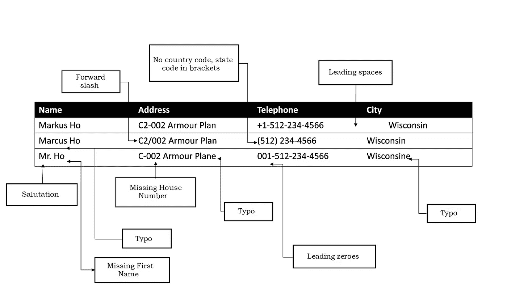
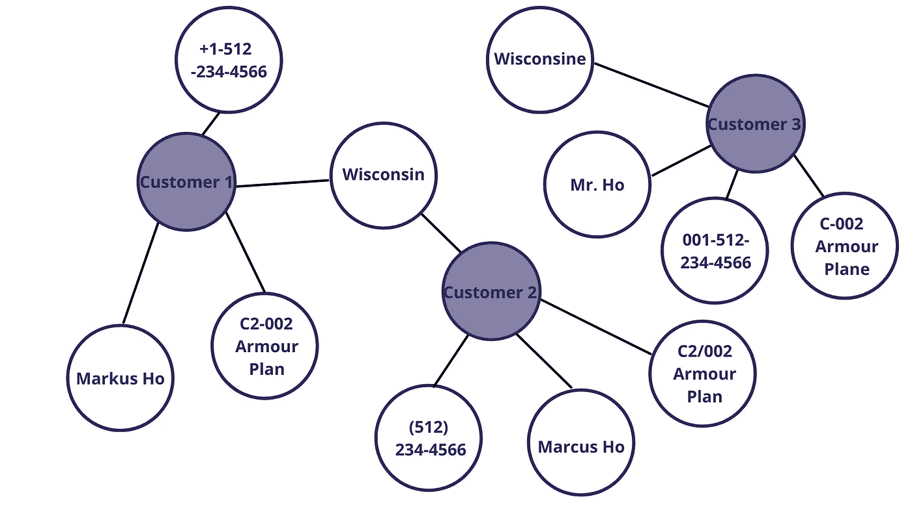
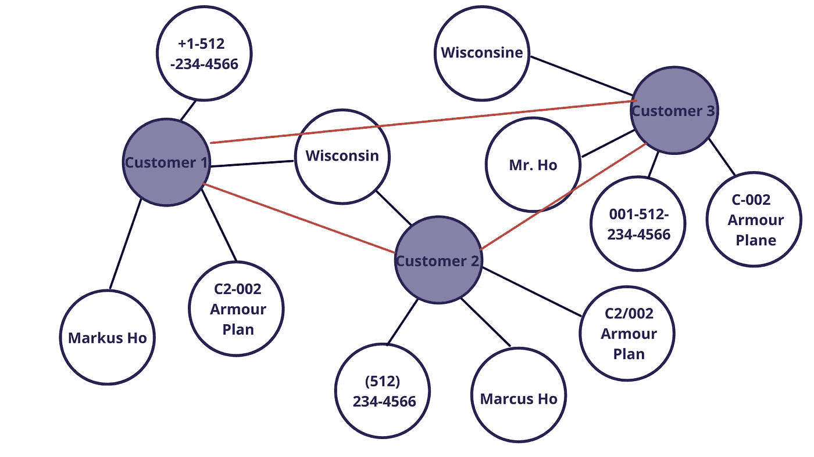

# 用 TigerGraph 进行实体解析？加入 Zingg 的组合！

> 原文：<https://towardsdatascience.com/entity-resolution-with-tigergraph-add-zingg-to-the-mix-95009471ca02>

# 用 TigerGraph 进行实体解析？加入 Zingg 的组合！

## 基于训练数据学习匹配什么(缩放)和如何匹配(相似性)的开源工具。

随着组织收集更多的数据并利用更多的内部和云工具，关于客户、供应商、合作伙伴和其他实体的可信信息变得越来越分散。如果没有核心业务实体的统一视图，分析就会受到影响。如果我们的客户数据是孤立的，我们就无法量化客户终身价值、每个季度增加的新客户、每个客户的平均重复订单以及其他关键的客户参与度指标。这导致对我们的业务和我们的客户缺乏了解，从而影响品牌价值。客户希望我们向他们提供个性化的产品和建议，但是如果我们的基础数据没有整合，我们就无法取悦客户，也无法发现交叉销售和追加销售的机会。

这种孤立数据的问题并不仅限于收入目的的客户信息。合规部门需要供应商的明确实体定义，以确保他们不与制裁名单上的人或组织打交道。反洗钱和 KYC 活动始于建立单一的真相来源。

解析没有唯一标识符且属于同一实体的多条记录被称为**实体解析**。从表面上看，实体解析似乎是一个容易解决的问题——从人的角度来看，识别有变化的记录是很直观的，所以计算机程序肯定能做得更好！也许我们在不同的系统和记录中有一些共同的标识符，我们可以利用它们来统一数据？不幸的是，即使有了像电子邮件这样的可信标识符，人们还是会使用工作、个人、学校和其他 id，这并不能完全解决问题。

由于我们的系统捕获和记录信息的[方式不同](https://medium.com/@sonalgoyal/deduplicating-records-is-machine-learning-the-answer-e9579cfda935)，我们现实世界的大部分数据看起来都是这样的。

作者图片

正如我们在上面的样本记录中看到的，我们没有**任何**单个属性在整个实体中完全匹配。这个例子只包含 3 条记录和 4 个属性，想象一下在 Python 或 SQL 这样的编程语言中精心设计相似性规则来匹配这些记录！

具有内置链接模式的图形数据库是消除记录歧义和解析实体的理想选择。TigerGraph 是一个领先的图形数据库，是一个强大的实体解析工具。正如在 [TigerGraph 博客文章](https://www.tigergraph.com/blog/using-a-graph-database-for-big-data-entity-resolution/)中概述的，我们可以通过定义五种类型的顶点来构建上述三个记录的图表模式，一种用于实际的客户，其余的用于四个属性——姓名、地址、电话和城市。通过将属性表示为顶点，将实体-has 关系表示为边，我们可以将上述三个记录转换为下图。

作者图片

然后，我们可以定义类似余弦或 Jaccard 的相似性度量来链接姓名、电话号码、城市和地址。匹配两个顶点后，我们可以在它们之间添加一条边来连接它们。然后，我们可以使用连接的组件将相似的实体组合在一起。

由于关系的传递性，这种方法比在关系数据库中运行查询要好得多。然而，在定义属性之间的相似性标准、将多个属性组合在一起以及将它们全部链接起来以推导实体关系方面，它仍然留给我们大量的工作。属性的成对相似性在计算上是禁止的，即使在利用分布式图之后，我们也面临着可伸缩性的挑战。如果我们能够以一种更简单的方式解析实体，然后将图形加载到 TigerGraph 中，用于我们的 KYC、AML 和客户 360°场景，会怎么样？

解决上述挑战的一种方法是使用专门的开源实体解析框架，如 [Zingg](https://github.com/zinggAI/zingg) 。这将我们从复杂的实体解析中解放出来，让我们有更多的时间进行推理。(充分披露:我是 Zingg 的作者)

使用 Zingg 解析实体的典型工作流如下所示。

1.我们构建一个[配置 json](https://docs.zingg.ai/docs/setup/configuration.html) ，指定我们的输入和输出数据位置，并定义我们想要配置哪些字段进行匹配。

2.我们通过 Zingg 的[互动学习者](https://docs.zingg.ai/docs/setup/training/createTrainingData.html)来训练它。这挑选出我们标记为可接受的匹配或不匹配的代表性样本对。我们可以通过贴标机标记多达 30-40 个匹配，Zingg 将自动计算出每个属性的相似性阈值和权重。

3.我们通过 Zingg 运行我们的数据，并获得解析的实体。我们可以将步骤 2 中创建的模型与更新的增量数据集一起重用。

当加载到 TigerGraph 时，Zingg 的输出如下所示:

作者图片

匹配的顶点由具有概率分数的边连接。我们现在可以引入我们的事务数据来进一步分析 TigerGraph 中已解析的实体图。

由于以下原因，这种方法优于单独使用图形的方法:

1.  我们不必担心属性级别的相似性度量。
2.  我们不必找出将不同属性的属性相似性组合成实体相似性的最佳方式。
3.  像 Zingg 这样的专门实体解析框架有内置的[阻塞机制](https://docs.zingg.ai/docs/zModels.html) s，它只对选择的记录计算成对相似性。这大大减少了计算时间，并帮助我们将实体分辨率扩展到更大的数据集。
4.  我们不必手动担心链接-分组方面，因为它由幕后的实体解析框架负责。

因此，实体解析的所有艰苦工作都可以卸载。

通过 Zingg 解析实体并在 Tigergraph 中利用它们，我们结合了两个世界的精华——通过 Zingg 的简单和可扩展的实体解析以及在 TigerGraph 中对图形的进一步分析。这让我们有更多的时间来处理我们的核心业务需求，因为这些实体现在可以用于我们的分析和运营需求。