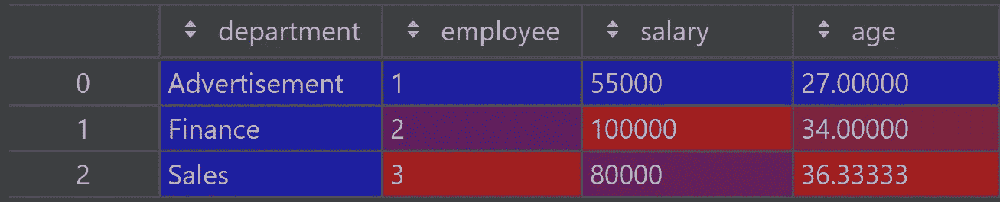
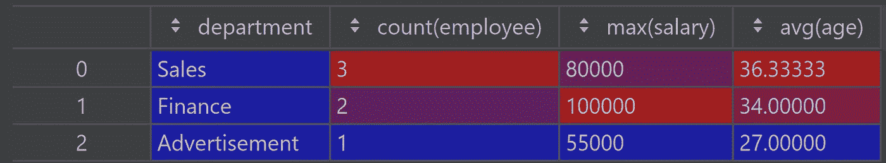
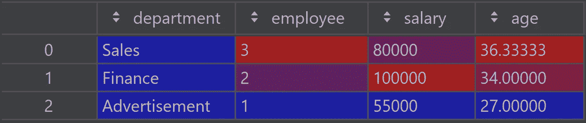

# 从熊猫到 PySpark 的平稳过渡

> 原文：<https://towardsdatascience.com/equivalents-between-pandas-and-pyspark-c8b5ba57dc1d>

## 熊猫大战 PySpark 101

作者:[阿玛尔·哈斯尼](https://medium.com/u/d38873cbc5aa?source=post_page-----40d1ab7243c2--------------------------------) & [迪亚·赫米拉](https://medium.com/u/7f47bdb8b8c0?source=post_page-----40d1ab7243c2--------------------------------)


[杰瑞米·托马斯](https://unsplash.com/@jeremythomasphoto?utm_source=unsplash&utm_medium=referral&utm_content=creditCopyText)在 [Unsplash](https://unsplash.com/s/photos/change?utm_source=unsplash&utm_medium=referral&utm_content=creditCopyText) 上拍照

熊猫是每个数据科学家的首选图书馆。对于每个希望操作数据和执行一些数据分析的人来说，这是必不可少的。

然而，尽管它的实用性和广泛的功能，我们很快就开始看到它在处理大型数据集时的局限性。在这种情况下，过渡到 PySpark 变得至关重要，因为它提供了在多台机器上运行操作的可能性，不像 Pandas。在本文中，我们将提供 PySpark 中 pandas 方法的等效方法，以及现成的代码片段，以便于 PySpark 新手完成任务😉

> PySpark 提供了在多台机器上运行操作的可能性，不像 Pandas

```
**Table Of Contents**
· [DataFrame creation](#8396)
· [Specifying columns types](#dfc7)
· [Reading and writing files](#7382)
· [Filtering](#710b)
    ∘ [Specific columns](#50d3)
    ∘ [Specific lines](#f04d)
    ∘ [Using a condition](#e50f)
· [Add a column](#901e)
· [Concatenate dataframes](#6990)
    ∘ [Two Dataframes](#0b25)
    ∘ [Multiple Dataframes](#da7a)
· [Computing specified statistics](#a849)
· [Aggregations](#8b6c)
· [Apply a transformation over a column](#27da)
```

# 入门指南

在深入研究对等物之前，我们首先需要为后面做准备。不言而喻，第一步是导入所需的库:

```
import pandas as pd
import pyspark.sql.functions as F
```

PySpark 功能的入口点是 SparkSession 类。通过 SparkSession 实例，您可以创建数据帧、应用各种转换、读写文件等。要定义 SparkSession，您可以使用以下内容:

```
from pyspark.sql import SparkSession
spark = SparkSession\
.builder\
.appName('SparkByExamples.com')\
.getOrCreate()
```

现在一切都准备好了，让我们直接进入熊猫大战 PySpark 的部分吧！

# 数据帧创建

首先，让我们定义一个我们将使用的数据样本:

```
columns = ["employee","department","state","salary","age"]
data = [("Alain","Sales","Paris",60000,34),
        ("Ahmed","Sales","Lyon",80000,45),
        ("Ines","Sales","Nice",55000,30),
        ("Fatima","Finance","Paris",90000,28),
        ("Marie","Finance","Nantes",100000,40)]
```

要创建一只**熊猫** `DataFrame`，我们可以使用下面的:

```
df = pd.DataFrame(data=data, columns=columns)

# Show a few lines
df.head(2)
```

**PySpark**

```
df = spark.createDataFrame(data).toDF(*columns)

# Show a few lines
df.limit(2).show()
```

# 指定列类型

**熊猫**

```
types_dict = {
    "employee": pd.Series([r[0] for r in data], dtype='str'),
    "department": pd.Series([r[1] for r in data], dtype='str'),
    "state": pd.Series([r[2] for r in data], dtype='str'),
    "salary": pd.Series([r[3] for r in data], dtype='int'),
    "age": pd.Series([r[4] for r in data], dtype='int')
}

df = pd.DataFrame(types_dict)
```

您可以通过执行以下代码行来检查您的类型:

```
df.dtypes
```

**PySpark**

```
from pyspark.sql.types import StructType,StructField, StringType, IntegerType

schema = StructType([ \
    StructField("employee",StringType(),True), \
    StructField("department",StringType(),True), \
    StructField("state",StringType(),True), \
    StructField("salary", IntegerType(), True), \
    StructField("age", IntegerType(), True) \
  ])

df = spark.createDataFrame(data=data,schema=schema)
```

您可以通过执行以下命令来检查数据帧的模式:

```
df.dtypes
# OR
df.printSchema()
```

# 读取和写入文件

熊猫和 PySpark 的阅读和写作是如此的相似。语法如下:**熊猫**

```
df = pd.read_csv(path, sep=';', header=True)
df.to_csv(path, ';', index=False)
```

**PySpark**

```
df = spark.read.csv(path, sep=';')
df.coalesce(n).write.mode('overwrite').csv(path, sep=';')
```

**注 1💡:**您可以指定要对其进行分区的列:

```
df.partitionBy("department","state").write.mode('overwrite').csv(path, sep=';')
```

**注 2💡:**您可以通过在上面的所有代码行中更改 CSV by parquet 来读写不同的格式，比如 parquet 格式

# 过滤

## 特定列

选择熊猫中的某些列是这样完成的:**熊猫**

```
columns_subset = ['employee', 'salary']

df[columns_subset].head()

df.loc[:, columns_subset].head()
```

而在 PySpark 中，我们需要对列列表使用 select 方法: **PySpark**

```
columns_subset = ['employee', 'salary']

df.select(columns_subset).show(5)
```

## 特定线路

要选择一系列线条，您可以在 Pandas 中使用`iloc`方法:

**熊猫**

```
# Take a sample ( first 2 lines )

df.iloc[:2].head()
```

在 Spark 中，不可能获得任何范围的行号。然而，可以像这样选择前 n 行:

**PySpark**

```
df.take(2).head()
# Or
df.limit(2).head()
```

**注**💡:请记住 spark，数据可能分布在不同的计算节点上，并且“第一”行可能会因运行而异，因为没有底层顺序

## 使用条件

可以根据特定条件过滤数据。Pandas 中的语法如下:

熊猫

```
# First method
flt = (df['salary'] >= 90_000) & (df['state'] == 'Paris')
filtered_df = df[flt]

# Second Method: Using query which is generally faster
filtered_df = df.query('(salary >= 90_000) and (state == "Paris")')
# Or
target_state = "Paris"
filtered_df = df.query('(salary >= 90_000) and (state == @target_state)')
```

在 Spark 中，通过使用`filter`方法或执行 SQL 查询可以得到相同的结果。语法如下:

**PySpark**

```
# First method
filtered_df = df.filter((F.col('salary') >= 90_000) & (F.col('state') == 'Paris'))

# Second Method:
df.createOrReplaceTempView("people")

filtered_df = spark.sql("""
SELECT * FROM people
WHERE (salary >= 90000) and (state == "Paris")
""") 

# OR
filtered_df = df.filter(F.expr('(salary >= 90000) and (state == "Paris")'))
```

# 添加列

在 Pandas 中，有几种方法可以添加列:

**熊猫**

```
seniority = [3, 5, 2, 4, 10]
# Method 1
df['seniority'] = seniority

# Method 2
df.insert(2, "seniority", seniority, True)
```

在 PySpark 中有一个叫做`withColumn`的特殊方法，可以用来添加一个列:

PySpark

```
from itertools import chainseniority= {
    'Alain': 3,
    'Ahmed': 5,
    'Ines': 2,
    'Fatima': 4,
    'Marie': 10,
}mapping = create_map([lit(x) for x in chain(*seniority.items())])df.withColumn('seniority', mapping.getItem(F.col("employee")))
```

# 连接数据帧

## 两个数据帧

**熊猫**

```
df_to_add = pd.DataFrame(data=[("Robert","Advertisement","Paris",55000,27)], columns=columns)
df = pd.concat([df, df_to_add], ignore_index = True)
```

**PySpark**

```
df_to_add = spark.createDataFrame([("Robert","Advertisement","Paris",55000,27)]).toDF(*columns)
df = df.union(df_to_add)
```

## 多个数据帧

熊猫

```
dfs = [df, df1, df2,...,dfn]
df = pd.concat(dfs, ignore_index = True)
```

PySpark 的方法`unionAll`只连接了两个数据帧。解决这一限制的方法是根据需要多次迭代连接。为了获得更简洁优雅的语法，我们将避免循环，并使用 reduce 方法来应用`unionAll`:

**PySpark**

```
from functools import reduce
from pyspark.sql import DataFrame

def unionAll(*dfs):
    return reduce(DataFrame.unionAll, dfs)

dfs = [df, df1, df2,...,dfn]
df = unionAll(*dfs)
```

## 计算指定的统计数据

在某些情况下，我们需要通过一些统计 KPI 来执行一些数据分析。Pandas 和 PySpark 都提供了非常容易地获得数据帧中每一列的以下信息的可能性:

*   列元素的计数
*   列元素的平均值
*   性传播疾病
*   最小值
*   三个百分点:25%、50%和 75%
*   最大值

您可以通过执行以下行来计算这些值:

**熊猫**和 **PySpark**

```
df.summary()
#OR
df.describe() # the method describe doesn't return the percentiles
```

## 聚集

为了执行一些聚合，语法几乎是 Pandas 和 PySpark: **Pandas**

```
df.groupby('department').agg({'employee': 'count', 'salary':'max', 'age':'mean'})
```

**PySpark**

```
df.groupBy('department').agg({'employee': 'count', 'salary':'max', 'age':'mean'})
```

然而，熊猫和 PySpark 的结果需要一些调整才能相似。1.在 pandas 中，分组依据的列成为索引:


要将它作为一个列取回，我们需要应用 `reset_index`方法:**熊猫**

```
df.groupby('department').agg({'employee': 'count', 'salary':'max', 'age':'mean'}).reset_index()
```



1.  在 **PySpark** 中，列名在结果数据帧中被修改，提到了执行的聚合:



如果您希望避免这种情况，您需要像这样使用别名方法:

```
df.groupBy('department').agg(F.count('employee').alias('employee'), F.max('salary').alias('salary'), F.mean('age').alias('age'))
```



## 对列应用变换

要对列应用某种转换，PySpark 中不再提供 apply 方法。相反，我们可以使用一个名为`udf`(或者用户定义的函数)的方法来封装 python 函数。

例如，如果工资低于 60000 英镑，我们需要增加 15%的工资，如果超过 60000 英镑，我们需要增加 5%的工资。

pandas 中的语法如下:

```
df['new_salary'] = df['salary'].apply(lambda x: x*1.15 if x<= 60000 else x*1.05)
```

PySpark 中的对等用法如下:

```
from pyspark.sql.types import FloatType

df.withColumn('new_salary', F.udf(lambda x: x*1.15 if x<= 60000 else x*1.05, FloatType())('salary'))
```

⚠️注意到`udf`方法需要明确指定数据类型(在我们的例子中是 FloatType)

## 最后的想法

总之，很明显，Pandas 和 PySpark 的语法有很多相似之处。这将极大地促进从一个到另一个的过渡。

使用 PySpark 在处理大型数据集时会给你带来很大的优势，因为它允许并行计算。但是，如果您正在处理的数据集很小，那么恢复到唯一的熊猫会很快变得更有效。

因为这篇文章是关于从 pandas 到 PySpark 的平稳过渡，所以有必要提到一个 Pandas 的等价 API，叫做[考拉](https://koalas.readthedocs.io/en/latest/)，它工作在 Apache Spark 上，因此填补了两者之间的空白。

谢谢你坚持到现在。注意安全，下一个故事再见😊！

如果您有兴趣了解关于 scikit-learn 的更多信息，请查看以下文章:

</4-scikit-learn-tools-every-data-scientist-should-use-4ee942958d9e>  </5-hyperparameter-optimization-methods-you-should-use-521e47d7feb0> 