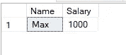
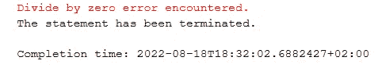
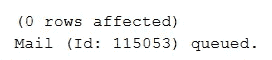
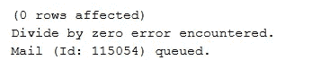

# SQL 中的错误处理—第 13 部分了解 SQL Server Management Studio

> 原文：<https://towardsdatascience.com/error-handling-in-sql-part-13-learn-sql-server-management-studio-94afb4cd1672>

## 实现这些简单的错误处理步骤来加强你的脚本


迈克尔·泽兹奇在 [Unsplash](https://unsplash.com/?utm_source=medium&utm_medium=referral) 上的照片

# 在最后几集里…

你好。欢迎来到 SQL 和 SQL Server Studio 系列教程的第 13 期。我的目标很简单:让你熟悉和适应这个工具和语言。“这有什么关系？”我知道你在问。事实证明，好奇心和副业往往是被新项目选中甚至获得新工作的关键。事实上，您已经使用了一个重要的工具，比如 SQL Server Studio，并且编写了一些 SQL 查询，这将会给您一个清晰的开端。

*   **在第 1 集**中，我将向您展示**如何设置我们的环境和本地服务器** — [第 1 部分逐步设置 SQL Server Studio](/getting-started-with-sql-server-management-studio-part-1-step-by-step-setup-63428650a1e0)
*   **在第 2 集**中，我们将讲述**如何创建数据库、表**、**和**关于**命名约定的重要注释—** [第 2 部分数据库、表&命名约定](/getting-started-with-sql-server-management-studio-5cd24bb1a87c)
*   **在第三集**中，我们介绍了 **CRUD 操作**和**主键和外键** — [第三部分 CRUD 操作，主键&外键](/learn-sql-server-management-studio-part-3-crud-operations-primary-foreign-keys-9d884b32ad70)
*   **在第 4 集**中，我们讨论了**模式&的主要规范化步骤** — [第 4 部分模式&规范化](/learn-sql-server-management-studio-part-4-schemas-normalization-80bcd6a5258)
*   **在第 5 集**中，我们覆盖了**存储过程&调度**，这是一个真正的野兽。我怎么强调这将如何促进和自动化你的日常(数据)生活都不为过。[第五部分存储过程&调度](/learn-sql-server-management-studio-part-5-stored-procedures-scheduling-88fd9788d314)
*   **在第 6 集**中，我们介绍了用于 ETL 的 **SSIS 包，并回顾了如何在两个数据库之间以及一个数据库和 Excel 之间导入和导出数据。[第六部 SSIS 套餐简介](/learn-sql-server-management-studio-part-6-ssis-packages-9438dbc90437)**
*   在第 7 集中，我们**将 SQL Studio 连接到 PowerBI** 并构建我们的第一个视觉效果。[第 7 部分连接到 PowerBI &第一视觉效果](http://part%207%20connect%20to%20powerbi%20%26%20first%20visuals/)。
*   **在第 8 集**中，我们**利用 SQL 视图**的强大功能，这是一个简单的轻量级工具，用于组合和检索复杂的表。你不会相信没有他们你怎么活下去。[第 8 部分利用观点](/learn-sql-server-management-studio-part-8-leverage-the-views-206fbcef3957)
*   在第 9 集中，我们利用临时表，在存储过程中临时存储和检索数据。找出中间结果并以表格形式缓存数据以备后用是非常有用的。在[第九部分临时表格](/learn-sql-server-management-studio-part-9-temporary-tables-f69aee616833)中了解更多信息
*   第 10 集探讨了如何使用存储过程和调度任务将 SQL 数据导出为 CSV 文件并通过电子邮件发送。[第 10 部分通过电子邮件以 CSV 格式导出 SQL 查询数据](/learn-sql-server-management-studio-part-10-export-tables-by-email-as-csv-29bf2d990656)
*   **第 11 集**跳入云端，在 Azure Cloud 中设置服务器和数据库。
*   **第 12 集**回顾了对相似数据行进行排序的简便方法，并通过窗口排序功能仅选择一行。

别忘了回来😉。

# 期待什么？

数据处理并不总是胆小的人的任务。因为它可以有许多形状和形式，所以记录本身的值有时会取意外的值。或者流程中的某个步骤可能会失败。每当它是存储过程的一部分时，我们可能希望忽略错误并继续前进到下一步。

为此，我们将调用 TRY…CATCH 语句。这类似于其他编程语言中的异常处理。这可能会解决一些错误，甚至可能会触发一个警报到您的邮箱来通知您。事不宜迟…

# 开始—表创建

我们假设您已经设置好了 SQL Server Studio 环境。如果你需要任何帮助，请查看上面提到的第一集。

让我们首先创建一个新表‘employee compensation’:

```
CREATE TABLE EmployeeCompensation(Name nvarchar(max), Salary int)
```

现在让我们用一些数据填充它:

```
INSERT INTO [dbo].[EmployeeCompensation]VALUES ('Max', 1000)
```

让我们运行一个快速选择来验证我们是好的:

```
SELECT * FROM [dbo].[EmployeeCompensation]
```

这应该会返回:



# 测试错误

除以 0 会导致错误，因为这是未定义的。对于我们的例子来说，这是一个完美的罪魁祸首:

自己尝试一下:

```
INSERT INTO [dbo].[EmployeeCompensation]VALUES ('Carl', 1/0)
```



可怜的卡尔拿不到任何薪水。这也终止了我们的声明。让我们用 TRY…CATCH 来覆盖我们的查询。

# 错误处理—语法

TRY…CATCH 语法很简单，语法如下:

```
**BEGIN TRY** <SQL query>**END TRY** **BEGIN CATCH** <SQL query>**END CATCH**
```

在我们的示例中，这可以转化为:

```
**BEGIN TRY** INSERT INTO [dbo].[EmployeeCompensation] VALUES ('Carl', 1/0)**END TRY****BEGIN CATCH** **BEGIN** EXEC msdb.dbo.sp_send_dbmail @profile_name= '<Your DB Email Account>', @recipients= '<youremail@email.com>', @subject = 'Error Process ABC - insertion error', @body =  'Hi, there was an error on Process ABC.', @body_format = 'HTML' **END****END CATCH**
```

**脚本的逐步纲要:**

1.  我们首先尝试将值插入到 EmployeeCompensation 表中。
2.  因为整数是 1/0，这将引发一个错误。
3.  在我们的例子中，我们将它嵌套在一个 TRY 语句中。这会导致 SQL 脚本触发 CATCH 部分，在这种情况下，它会向选定的邮箱发送一封警告电子邮件。电子邮件可以定制我们选择的标题和正文。

当我们运行该脚本时，我们没有抛出错误，而是被告知有一封电子邮件已经排队并正在发往我们的邮箱:



# 获得关于错误的更多信息

这个错误已经被避免了…但是在这个设置下，在真实的场景中，我们不知道到底发生了什么。

要是我们能对错误本身有所了解就好了。这可以帮助我们复制它，并调试或处理我们的脚本对此类错误场景的更好响应。

谢天谢地，有一个特殊的功能可以利用。它的名字不会让很多人感到惊讶:ERROR_MESSAGE()

它所做的是返回错误信息，通常是纯文本的，易于阅读。让我们测试一下，我们可以在 CATCH 块中添加下面一行:

```
PRINT(ERROR_MESSAGE()
```

我们可以将它嵌入到我们的脚本中:

```
**BEGIN TRY** INSERT INTO [dbo].[EmployeeCompensation] VALUES ('Carl', 1/0)**END TRY****BEGIN CATCH** PRINT(ERROR_MESSAGE()) **BEGIN** EXEC msdb.dbo.sp_send_dbmail @profile_name= '<Your DB Email Account>', @recipients= '<youremail@email.com>', @subject = 'Error Process ABC - insertion error', @body =  'Hi, there was an error on Process ABC.', @body_format = 'HTML' **END****END CATCH**
```

**输出:**



*   未调整任何数据
*   我们获得了一个可读的错误信息
*   发送了一封电子邮件

# 最后的调整

让我们在电子邮件正文中发送错误消息，而不是在输出窗口中打印错误消息。这将提供个性化的信息，也留下了到底哪里出错的痕迹。

这可以通过在我们的脚本中添加以下内容来实现:

```
DECLARE @body nvarchar(max)SET @body = 'This is the error ' + ERROR_MESSAGE()
```

同时，我们可以删除 PRINT(ERROR_MESSAGE())语句，因为这里不再需要它了。我们脚本的最后一部分应该是这样的:

```
**BEGIN TRY**INSERT INTO[dbo].[EmployeeCompensation]VALUES ('Carl', 1/0)**END TRY****BEGIN CATCH
  BEGIN** DECLARE @body nvarchar(max) SET @body = 'This is the error ' + ERROR_MESSAGE()
    EXEC msdb.dbo.sp_send_dbmail @profile_name= '<Your DB Email Account>', @recipients= '<youremail@email.com>', @subject = 'Error Process ABC - insertion error', @body =  @body, @body_format = 'HTML'**END****END CATCH**
```

一封警告邮件应该已经在路上了，里面有关于错误的详细信息。

# 最后的话

我们现在理解了一个新的 SQL 语句，TRY…CATCH。通过处理错误，这有助于使许多流程更加健壮。然后，它还可以帮助我们修复一些不可预见的事件。警报通知将确保我们了解问题，并获得一些关于拒绝内容及其原因的有价值的见解。

我希望你觉得这篇文章有用，让我知道你的想法，或者如果有我应该涵盖的主题。与此同时，请随时订阅并关注我。下次见！

# 快乐编码🎉！

感谢阅读！喜欢这个故事吗？ [**加入媒介**](https://medium.com/@maximegodfroid/membership) 可完整访问我的所有故事。或者通过 [**我的 ko-fi 页面**](http://ko-fi.com/maximegodfroid) 用提示支持我