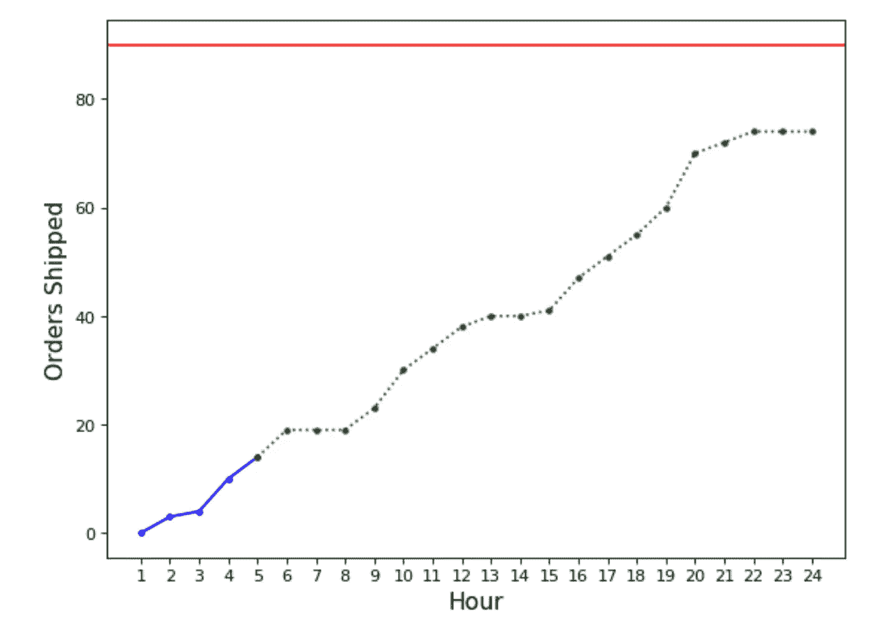

# 开始数据科学项目之前要问的基本问题

> 原文：<https://towardsdatascience.com/essential-questions-to-ask-before-starting-a-data-science-project-cd633dcd9d55>

# 开始数据科学项目之前要问的基本问题

## 如何确保你的项目有一个良好的开端

在 [Unsplash](https://unsplash.com?utm_source=medium&utm_medium=referral) 上由[Towfiqu barb huya](https://unsplash.com/@towfiqu999999?utm_source=medium&utm_medium=referral)拍摄的照片

在每个项目开始之前，问一些问题来帮助你了解接下来几周甚至几个月你将会做什么是很重要的。在项目开始时，询问诸如我们要完成什么、我们为什么要完成、最终用户将如何受益等问题是非常重要的，因为它们对于推动成功的结果和使您要解决的问题变得清晰非常重要。

在开始数据科学项目之前，您应该问以下问题:

1.  **谁是客户，客户在哪个业务领域？**

了解客户所在的业务领域、他们的运营方式、对他们来说什么是重要的、哪些关键变量用于定义该领域的成功，将使您能够构建一个直接影响对客户来说什么是重要的解决方案。

**2。我们试图解决什么业务问题？**

《面向预测数据分析的机器学习基础》一书*完美地描述了这一点:*

> 组织不存在进行预测性数据分析。组织的存在是为了做一些事情，比如赚更多的钱，获得新的客户，销售更多的产品，或者减少欺诈造成的损失。不幸的是，我们可以建立的预测分析模型不做这些事情。分析从业者构建的模型只是根据从历史数据集中提取的模式进行预测。这些预测并不能解决商业问题；相反，它们提供的见解可以帮助组织做出更好的决策来解决他们的业务问题。
> 
> 因此，在任何数据分析项目中，一个关键步骤是了解组织想要解决的**业务问题**，并基于此确定预测分析模型可以提供何种洞察力来帮助组织解决该问题。这定义了**分析解决方案**，分析从业者将着手使用机器学习[1]来构建该解决方案。

如果您公司的目标是降低客户流失率，一个可能的解决方案是建立一个预测模型，确定哪些客户在不久的将来最有可能流失。

**3。客户将如何消费它？**

了解您的客户将如何使用您的模型输出，将允许您创建针对他们的工作。例如，您是在构建服务于内部用户并影响公司战略的模型，还是在构建面向客户的模型。

**4。这个项目的经济影响是什么？**

给一个项目设定一个金额是最难做到的事情之一。但是，了解您的数据产品将如何为客户增加收入或降低成本，可以让您获得领导地位，并在整个项目中为您提供支持。

**5。我们的数据科学功能将推动什么类型的决策？**

什么样的模式能让他们做以前做不到的事情。

**6。我们将使用什么标准来衡量这个项目的成功，我们将如何衡量它？**

心中有一个具体的目标将确保你的项目有一个最终的结果，你不会无限期地工作。量化指标值的哪些改进对客户场景有用(例如，减少 20%的劳动力成本)。度量必须是*智能* ( **S** 特定， **M** 可测量， **A** 可实现， **R** 相关，以及 **T** 时间受限)。例如:在这个为期 3 个月的项目结束时，实现 20%的客户流失预测准确率，以便我们可以提供促销活动来减少流失[2]。

想象一下，数据科学家(DS)和产品经理(PM)就在应用程序中引入新的 ML 功能展开对话，该应用程序旨在提供更好的仓库运营可见性。假设产品经理非常了解仓库空间，并且头脑中已经有了一个特性。

我认为客户 ABC 正面临一些问题。你能帮助我理解问题是什么吗？

**PM:** 确定。ABC 一直在努力实现每日订单目标。

什么是每日订单目标？

仓库通常在一天开始时设定订单目标，试图在一天结束前发货。例如，在一天开始时，仓库中的操作员将设定一些订单目标，比如 45000 个订单，他们需要在一天结束前出门并发货。

**DS:** 明白了！为什么达到这个每日目标对他们很重要？

PM: 好问题。没有达到当天的订单目标意味着没有按时交付给客户，这可能会导致额外的支持成本、声誉受损以及客户流失。为了让客户的生活更轻松，我建议在应用程序中发布一个 ML 功能，帮助我们的客户更好地了解*他们今天是否有望根据他们当前的表现达到订单目标*。

**DS:** 明白了。还有你为什么觉得这个功能对他们有用？这将推动什么类型的决策？

**PM:** 好问题。最重要的一个用例是，它将允许仓库中的操作员在早期相应地分配劳动力。例如，如果我们当天的预计发货订单低于他们的每日目标，他们可以增加工人数量，以加快货物运输速度。因此，这有助于他们更有效地开展日常业务。

**DS:** 客户将如何消费它？

作者图片

**PM:** 让我分享一下我的屏幕，向你们展示一下。用户将能够在我们的应用程序中看到这个功能。我是这样设想的:蓝色实线显示了到目前为止他们已经发货的订单。绿色虚线是从我们的模型中生成的预测。红色实线是他们今天的目标。

DS: 啊，这是一个很好的视觉效果——让我把事情看得很清楚。所以这将是一个实时功能，我们每小时更新一次当天生成的预测？

下午:是的。没错。

**DS:** 另一个问题:他们目前使用什么，该指标的基线(当前)值是多少？

**PM:** 他们目前不使用任何东西，这就是为什么这个特性会给他们的运营带来很多清晰性。

这个项目的经济影响是什么？成功的标准是什么？

**PM:** 很棒的问题。好吧，如果我们的预测在这两个月结束时有小于 30%的平均绝对误差，我们可以称这个项目的第一次迭代完成了。至于经济影响，我的粗略估计是，该功能还将允许他们优化资源规划和分配决策，这将帮助他们减少对劳动力的依赖，并将成本降低 30%。我将不得不做更多的调查和处理一些数字，以得到确切的金额。

DS: 啊，看起来这个功能会为我们的客户提高很多部门的效率。让我检查数据，然后获取所有这些信息，并创建一个关于我将如何着手做这个项目的粗略计划，并与您和团队分享以获得反馈。

**下午:**太棒了！谢了。

Lak Ananth 在他的书*预见失败*中指出“每个企业都是从问题是什么、解决方案是什么以及为什么它是一个引人注目的企业这一部分开始的”。同样，一个数据科学项目必须从一个假设开始，即我们试图解决什么样的客户问题，我们为什么试图解决它，以及它的影响是什么。

**参考文献**

[1] Kelleher，J. D .，Namee，M. B .，& D'Arcy，A. *预测数据分析的机器学习基础:算法、工作实例和案例研究* (2015)。麻省理工学院出版社。

[2] Microsoft, [Azure-TDSP-ProjectTemplate](https://github.com/Azure/Azure-TDSP-ProjectTemplate/blob/master/Docs/Project/Charter.md) , (2021)