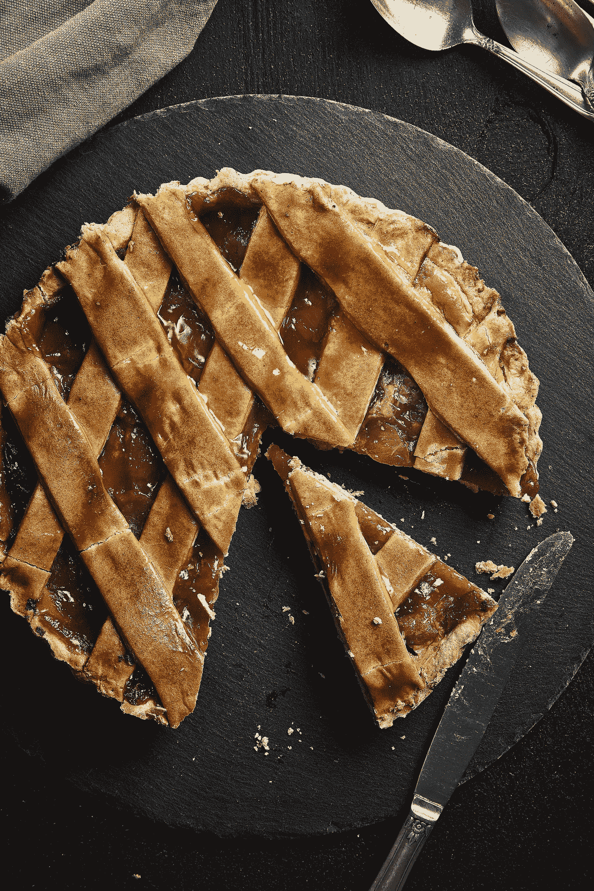
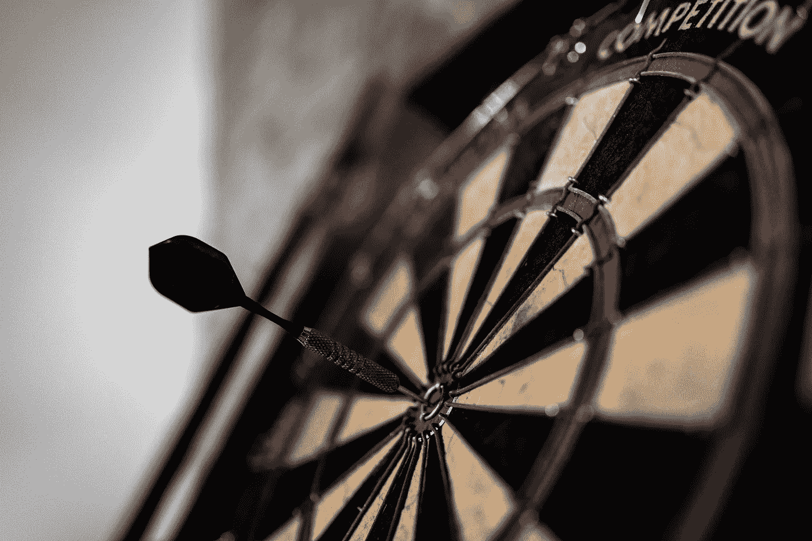
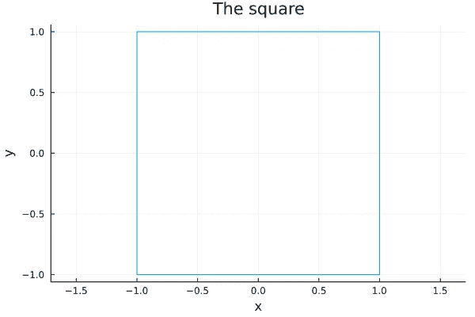
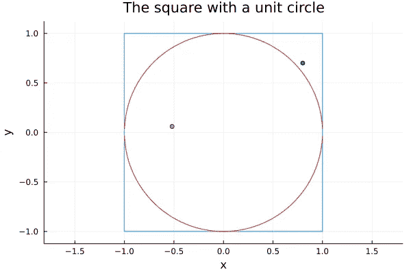
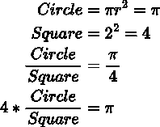
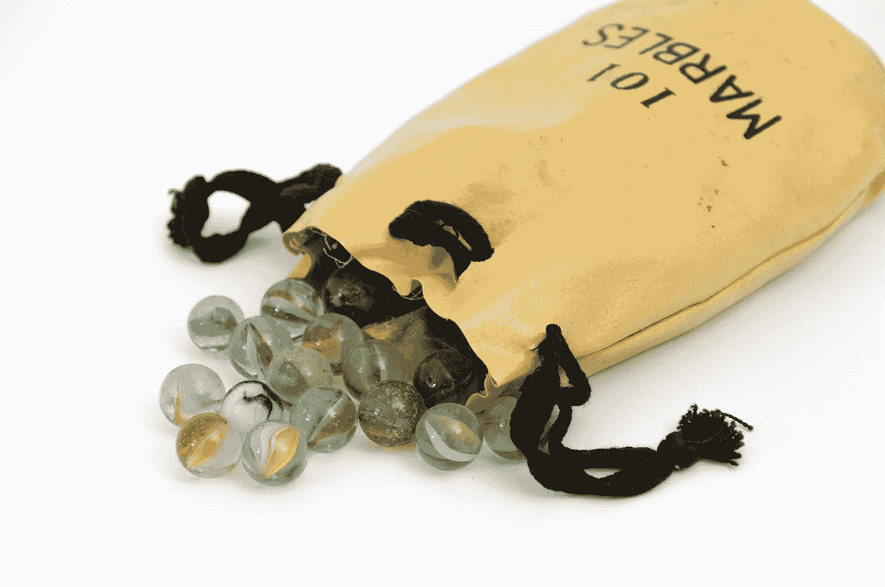
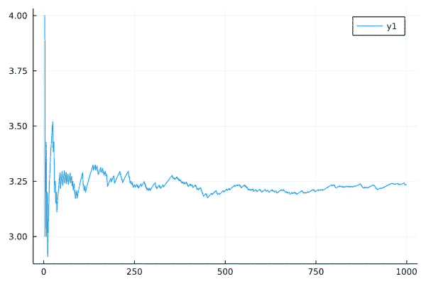
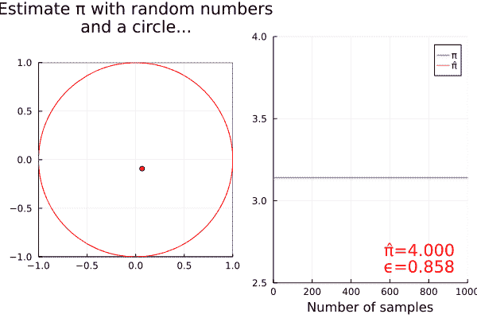

# 使用随机数估计圆周率

> 原文：<https://towardsdatascience.com/estimate-pi-using-random-numbers-8b13a7e8c791>

## 通过和 Julia 一起计算π来回答这个面试问题

好吧，所以我真的应该在圆周率日(3 月 14 日)发表这篇文章，但我认为这不会发生，所以无论如何在这里。让我们在 Julia 中使用随机数来估计圆周率——当然😉。



雨果·艾特肯在 [Unsplash](https://unsplash.com/s/photos/pie?utm_source=unsplash&utm_medium=referral&utm_content=creditCopyText) 上拍摄的照片

这篇文章的灵感来自霍马的视频。有兴趣的话去看看他的频道。他是个怪人，但他是个好人。😃

视频由[霍马理工](https://www.youtube.com/channel/UCV0qA-eDDICsRR9rPcnG7tw)

> 要获得所有媒体文章的完整信息——包括我的——可以考虑在这里订阅。

# 这个想法

这个任务有点奇怪，但是一旦你深入研究就会明白:**你会得到一个随机数发生器，你的任务是估计圆周率。**



照片由 [Unsplash](https://unsplash.com/s/photos/dart?utm_source=unsplash&utm_medium=referral&utm_content=creditCopyText) 上的 [Anastase Maragos](https://unsplash.com/@visualsbyroyalz?utm_source=unsplash&utm_medium=referral&utm_content=creditCopyText) 拍摄

想象一下向飞镖靶投掷飞镖。如果你知道你每次都会击中棋盘，但飞镖的位置是均匀分布的，那么飞镖落在棋盘上半部的可能性有多大？直觉上是 50%。为什么？因为上半部分的面积是下半部分的面积。

我们将利用这一事实，开始在(-1，-1)和(1，1)的正方形内一次绘制 2 个随机数(也称为 2D 点或向量)，如下所示:



作者使用 Plots.jl 制作的图

方便的是，这个正方形适合半径= 1 的单位圆。所以如果向量的长度大于 1，那么我们的点在圆外，如果小于 1，那么它一定在单位圆内。



单位圆正好适合，有 2 个例子点——作者做的

然后，我们多次随机抽取点，并计算我们从圆内和圆外抽取点的次数。该比率应该接近圆和正方形的面积比:



圆形和正方形代表形状的面积。

也就是说，我们将圆内的点数除以正方形内的点数，再乘以 4，得到圆周率。

让我们用 Julia 来编码吧！🤓

# 随机抽取一个点



克里斯·贾维斯在 [Unsplash](https://unsplash.com/s/photos/marbles?utm_source=unsplash&utm_medium=referral&utm_content=creditCopyText) 上拍摄的照片

在我们开始画点之前，让我们导入几个库来简化我们的生活。

这些库是:

*   [Plots.jl](https://github.com/JuliaPlots/Plots.jl) 用于稍后惊人且超级简单的绘图。
*   用于设置随机数种子的内置随机模块。
*   [Distributions.jl](https://github.com/JuliaStats/Distributions.jl) 便于获取均匀随机分布。
*   内置的 Printf，这样我们以后可以更容易地将浮点数格式化为字符串。

现在我们已经有了所有的工具，让我们创建一个函数:

如果你对朱莉娅不熟悉，我会尽最大努力打开所有这些东西。

*   `rand(distribution, 2)`从第 3 行定义的均匀分布中绘制一个长度为**2 的向量，即在-1 和 1 之间。**
*   `v .^ 2`使用**广播运算符**来计算 v 的所有元素的平方，所以你得到(x，y)。
*   `sum(v .^ 2) <= 1`根据矢量的**长度，逐个元素检查该点是否在单位圆**内**。x + y ≤ 1 则(x，y)在圆内。**
*   最后，我们只需计算圆内点与我们采集的样本数量的**比率，乘以 4，我们就有了我们的估计值。🎉**

让我们尝试一下——本着可再现性的精神，我将在调用该函数之前设置随机数种子，因此您应该会得到相同的确切结果。

```
julia> Random.seed!(42)
MersenneTwister(42)julia> estimate = pi_estimator(10_000_000)
3.1422016julia> abs(π - estimate)
0.0006089464102068121
```

这看起来很接近我。😃

> Julia 有一个内置的 pi 常量，您可以通过键入`\pi`并按 tab 键来访问它。这将自动完成 Unicode pi 字符:π。

# 搞点剧情！


这是我在绘图时的感受——照片由[森居提·昆杜](https://unsplash.com/@senjuti?utm_source=unsplash&utm_medium=referral&utm_content=creditCopyText)在 [Unsplash](https://unsplash.com/s/photos/paint?utm_source=unsplash&utm_medium=referral&utm_content=creditCopyText) 上拍摄

现在我们有了一个估计器，它给了我们一个相当不错的结果，如果我们能够**可视化我们如何得到这个估计值**，那将会非常酷。

让我们首先修改我们的函数，这样我们不仅返回最终估计，而且返回所有绘制的向量`v`和中间估计。我们可以将它们收集到两个数组中，分别命名为`samples`和`estimates`。

> 无论是在函数内部还是外部，都要使用合理的变量名称。你未来的自己会感谢你的！

调用此函数后，您可以**将最后返回的元组**解包到估计值和样本的两个数组中:

有点忘乎所以，根据我们的估计称之为`plot`:



当我们采样更多的点时，我们的估计。—由作者创建。

我已经整理好了，并制作了另一个函数来绘制绘制的点。不要忘记所有的代码都存在于 [GitHub](https://github.com/niczky12/medium/blob/master/julia/estimate_pi_rand.jl) 上。

如果你仔细看了上面的内容，你会注意到我给绘图函数添加了一个`i`参数。这是为了让我可以在`i`迭代后绘制图形。为什么？嗯，因为我喜欢 gifs

不，不是这种 Gif——来自 GIPHY.com 的 Gif

这些类型的 gif:



这整篇文章在 1 gif——作者制作的 Gif

是的，我将向您展示如何使用`Plots.jl`包中的一个简单宏来实现这一点。

这是结局，但我这里有更多的朱莉娅内容:

</vectorize-everything-with-julia-ad04a1696944>  </index-sort-and-aggregate-your-dataframes-in-julia-38646daf6214>  

# 摘要🎉

希望这篇文章**能和霍马的视频**一样有趣——可能不会😆。

至少，现在您知道如何:

*   用面积和随机数估计圆周率。
*   从朱莉娅的均匀分布中得出结论。
*   绘制一些图表。
*   将这些图链接成一个 gif。

拜托了。——GIPHY.com 上的 Gif