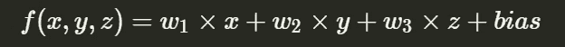
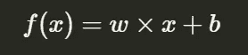
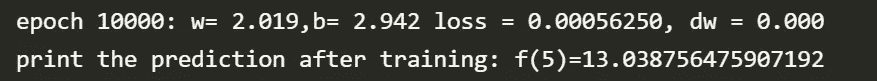
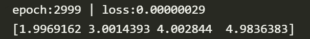
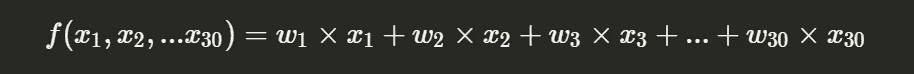
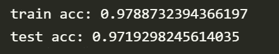

# 估计多因素模型的权重

> 原文：<https://towardsdatascience.com/estimate-weights-for-multifactor-model-e061174ca79>

## 利用神经网络的思想来估计具有多个因素的系统的权重


网从 [Unsplash](https://unsplash.com/photos/n6B49lTx7NM)

假设您有一个包含许多特征的客户数据集，并且您正试图构建一个加权系统来预测某些客户行为(比如购买或不购买)。如何确定那些个体的权重值？



当特征尺寸非常小时，我们可以用肉眼读取、分析和确定权重。对于任何超过 3 个权重的系统，我们将需要一个系统化的解决方案来确定权重值，**自动**。

在本文中，我将介绍一个解决方案(用 Python 代码)来实现它。一种思想借用了神经网络。

# 一个重量系统

为了尽可能简单地演示这个想法，让我从一个重量系统开始。



是的，这是一个简单的线性系统。如果`w = 2, b = 3`。该函数的工作方式如下:

```
f(1) = 2*1 + 3 = 5
f(2) = 2*2 + 3 = 7
f(3) = 2*3 + 3 = 9
f(4) = 2*4 + 4 = 12
...
```

现在，假设我们对 **w** 和 **b** 一无所知。但只知道 f(x)及其结果:

```
f(1) = 5
f(2) = 7
f(3) = 9
f(4) = 12
```

并利用上面的成对数字估算出 **w** 和 **b** 。

**步骤 1** ，初始化参数和测试数据。

```
import numpy as np
# model = y = 2*x + 3
X = np.array([1,2,3,4],dtype=np.float32)
Y = [(2*x + 3) for x in X]
# w and b to be predicted
**w,b = 0.0,0.0**
```

**第二步**，类似于神经网络模型，定义**正向**、**损失**和**梯度**函数。

```
*def* forward(*x*):
    return w**x*+b*def* loss(*y*,*y_pred*):
    return ((*y_pred*-*y*)**2).mean()*def* gradient(*x*,*y*,*y_pred*):
    return np.dot(*x*,(*y_pred*-*y*))print(*f*'print the prediction before training: f(5)={forward(5)}')
```

**步骤 3** ，用 4 对数据进行训练，并用 f(5)检验结果

```
learning_rate,n_inters = (0.01,10000)
for epoch in range(n_inters):
    y_pred  = forward(X)
    l       = loss(Y,y_pred)
    dw      = gradient(X,Y,y_pred)
    w       = w - learning_rate*dw
    b       = b + learning_rate*l
print(*f*'epoch {epoch+1}: w= {w*:.3f*},b= {b*:.3f*} loss = {l*:.8f*}, dw = {dw*:.3f*}')
print(*f*'print the prediction after training: f(5)={forward(5)}')
```

这里是完整的代码，我强烈建议您自己运行代码并查看结果:

经过一万轮的训练。我们“几乎”拥有正确的 **w** 和 **b** 。



w = 2.019b= 2.942

我们得到**w = 2.019**； **b= 2.942** 。非常接近`w = 2`和`b = 3`。看起来不错，嗯？毕竟只有 8 个数字用来预测权重和偏倚。

# 三重制

现在，让我们将模型扩展到估计三重系统中的重量。


假设， **w1 = 2** ， **w2 = 3** ， **w3 = 4** ， **bias = 5** 。填入上面的函数。我们将拥有:

```
f(1,2,3) = 25
f(2,3,4) = 24
f(3,4,5) = 43
...
```

闭上眼睛，忘记重量和偏见。假设我只知道输入和输出，用 Python 代码实现权重估计逻辑。

**第 1 步**，初始化数据。因为 bias 实际上是一个变量乘以 1。所以，我们可以认为 bias 为 **w4** ，但总会乘以 1。

```
import numpy as npX = np.array(
    [[1,2,3,1]
    ,[2,3,4,1]
    ,[3,4,5,1]
    ,[4,3,2,1]
    ,[12,13,14,1]
    ,[7,8,9,1]
    ,[5,2,10,1]]
    ,*dtype*=np.float32
)
# w1= 2, w2= 3, w3= 4, b= 5
W_r = np.array([2,3,4,5],*dtype*=np.float32)# r->real
W = np.array([0,0,0,0],*dtype*=np.float32)  # for estimationY = np.array([x@W_r for x in X],*dtype*=np.float32)
```

在代码中，X 是一个 4 列 2d 数组。最后一列是偏差。

**第二步，**定义模型。几乎与单权重系统模型相同，但不需要单独处理偏差。

```
*def* forward(*X*):
    return np.dot(*X*,W)*def* loss(*Y*,*Y_pred*):
    return ((*Y_pred*-*Y*)**2)*def* gradient(*X*,*Y*,*Y_pred*):
    return *X**(*Y_pred*-*Y*)
```

**第三步**，训练，看预估权重和偏差。

```
learning_rate,num_epoch = 0.001,3000for epoch in range(num_epoch):
    for i,x in enumerate(X):
        y_pred  = forward(x)
        l       = loss(y_pred,Y[i])
        dw      = gradient(x,Y[i],y_pred)
        W       = (W - dw*learning_rate)
    print(*f*'epoch:{epoch} | loss:{l*:.8f*}')
print(W)
```

以下是完整的代码:

经过 3000 轮训练后，模型返回如下结果:



非常接近[2，3，4，5]！

# 将模型应用于 30 个权重的数据集

是时候研究一些真实的数据了。这次让我根据输入和输出数据来预测 30 个权重。



我将要使用的数据集是来自 scikit-learn 的著名的[乳腺癌数据](https://scikit-learn.org/stable/modules/generated/sklearn.datasets.load_breast_cancer.html)。如果你决定试一试代码，不需要手动下载数据。如果您安装了 scikit-learn 软件包，数据将自动下载。

导入包和加载数据:

```
from sklearn import datasets
from sklearn.preprocessing import StandardScaler
from sklearn.model_selection import train_test_split
import numpy as np# prepare data
bc = datasets.load_breast_cancer()
X,y = bc.data,bc.target
X_train, X_test, y_train, y_test = train_test_split(X, y, *test_size*=0.5, *random_state*=1234)
```

将数据集转换为标准格式:

```
# transform to the standard dataset
sc      = StandardScaler()
X_train = sc.fit_transform(X_train)
X_test  = sc.transform(X_test)
y_train = np.where(y_train==0,-1,y_train) # replace 0 with -1
y_test  = np.where(y_test==0,-1,y_test)   # replace 0 with -1
```

`fit()` 得到平均值和标准差。`transform()`将原始数据转换为正态分布风格的数据。`mean = 0`，`stdev =1`。为什么？因为原始数据可能会有极大的偏差，有些介于-0.1 到 0.1 之间，而另一些特征则从 0 到 10。fit_transform()在一个函数调用中执行拟合和转换。如果你不熟悉 fit 和 transform 操作，我发现[这个](https://datascience.stackexchange.com/questions/12321/whats-the-difference-between-fit-and-fit-transform-in-scikit-learn-models/12346#12346) stackexchange 线程最好地解释了转换操作。

我还将 y 数组中的 0 转换为-1，以便于后面的数值处理。

接下来，定义模型，训练并验证结果，下面是完整的代码:

结果是:



该模型适用于训练数据集，在测试数据集上的准确率为 **97.7%** 和 **97.2%** 。结果即使不是最好的，也应该足够好了。(参见附录部分中 scikit-learn 的其他模型的结果。).

顺便说一下，10，000 轮训练大约需要 10-20 秒。

# 核心思想

很多年前，我的第一个 C 语言程序是一个价格猜谜游戏。我的程序会随机生成一个价格#。在终端，我输入我的价格猜测。如果我的输入高于真实价格，程序会提醒我输入过高，反之亦然。

经过多轮尝试，我可以大致估算出价格范围。最后，我输入正确的数字，程序会告诉我“成功”和试验次数。

在这种情况下，我是价格学习者:我根据程序的反馈上下移动我的猜测数字。

在上面的三个权重估计的例子中，我在价格猜测游戏中的想法是一样的。

在一个权重和一个偏置系统中，当输出高于真实结果时，模型将稍微增加/减少权重。因为权重`w`是倍数`x`，所以我根据输出微分和输入 x 按比例移动了#。

```
dw = np.dot(***x***,(*y_pred*-*y*))
w  = w - learning_rate*dw
```

不仅仅是另外两个模型，现在连神经网络深度学习模型都在用同样的思路，没有任何魔力。简单明了。

# 包裹

ML 是**而不是**学习一个框架并按照官方教程调用函数。那有点无聊。真正神奇的是下划线的思想和逻辑。

> 一套逻辑如何根据已知信息准确预测未知？

我们生活在一个可以接触到强大的 CPU 和 GPU 的时代，真是太幸运了。如果我们生活在 100 年前，没有人能做这种预测，因为人类几乎不可能在训练数据上迭代这么多次。但是我们可以让 CPU 或者 GPU 来做这个重复性的工作。而且真的管用。

ML 模型有时不是纯粹的数学，而是数学和蛮力的结合。

当我在思考神经网络模型时，我想到了这个权重系统预测。如果 NN 对图像如此有效，而神经网络深度学习模型的核心是找到一种微调(上下微调)权重和偏差的方法，那么无论定义了多少个隐藏层，核心思想都是一样的。

为什么不应用同样的想法来建立一个适用于其他数据集的模型呢？这很有效。

如果你有任何问题，请留下评论，我会尽力回答，如果你发现了错误，不要犹豫，把它们标记出来。感谢阅读。

# 参考链接

1.  [https://data science . stack exchange . com/questions/12321/what-the-difference-of-fit-and-fit-transform-in-scikit-learn-models/12346 # 12346](https://datascience.stackexchange.com/questions/12321/whats-the-difference-between-fit-and-fit-transform-in-scikit-learn-models/12346#12346)
2.  [https://sci kit-learn . org/stable/modules/generated/sk learn . datasets . load _ breast _ cancer . html](https://scikit-learn.org/stable/modules/generated/sklearn.datasets.load_breast_cancer.html)
3.  [https://github.com/xhinker/nn_sample_code](https://github.com/xhinker/nn_sample_code)

# 附录—与 Scikit-Learn 中的其他模型进行比较

在相同的训练和测试数据集上应用来自 scikit-learn 的其他模型，并测量准确度分数。

## 决策树:90.5%

代码:

```
from sklearn.tree import DecisionTreeClassifier as dtc
tree = dtc(*random_state*=1)
tree.fit(X_train,y_train)
print(*f*"decision tree Accuracy on test set:{tree.score(X_test,y_test)}")
```

结果:

```
decision tree Accuracy on test set:0.9052631578947369
```

## 最近邻法:94.7%

代码:

```
from sklearn.neighbors import KNeighborsClassifier as knt
k_model = knt(*n_neighbors*=3)
k_model.fit(X_train,y_train)
print(*f*"K-nearest Accuracy on test set:{k_model.score(X_test,y_test)}")
```

结果:

```
K-nearest Accuracy on test set:0.9473684210526315
```

## 逻辑回归分析:96.1%

代码:

```
from sklearn.linear_model import LogisticRegression as LR
lr_model = LR().fit(X_train,y_train)
print(*f*'Logistic Regression Accuracy on test set:{lr_model.score(X_test,y_test)}')
```

结果:

```
Logistic Regression Accuracy on test set:0.9614035087719298
```

## 贝叶斯估计:91.2%

代码:

```
from sklearn.naive_bayes import GaussianNB as bayes
b_model = bayes().fit(X_train,y_train)
print(*f*'Bayes Estimation on test set:{b_model.score(X_test,y_test)}')
```

结果:

```
Bayes Estimation on test set:0.9122807017543859
```

请随意运行它，如果有更好的结果，请告诉我。