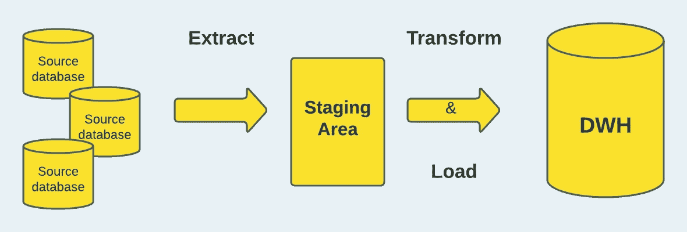
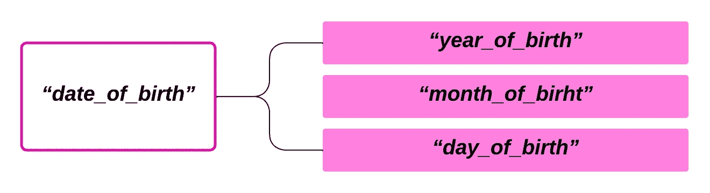
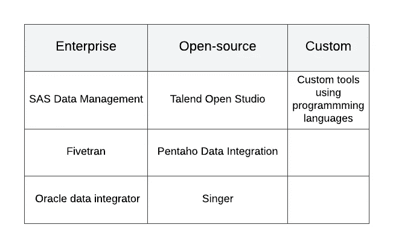

# 临床数据科学背景下的 ETL

> 原文：<https://towardsdatascience.com/etl-in-the-context-of-clinical-data-science-9236e399c88a>

## 医疗保健中的 ETL 概述，这是临床数据科学中数据生命周期的关键部分

这是我的临床数据科学系列的第二篇文章。在第一篇文章中，我提供了对临床数据科学广阔领域的全面概述，这为这一版的构建奠定了基础。如果您不熟悉临床数据科学领域，或者您只是想快速复习关键思想，您可能想先睹为快地阅读一下[介绍性文章。](/what-is-clinical-data-science-part-1-ebe135efb462)话虽如此，文章其余部分组织如下；

1.  ETL 概述
2.  临床数据科学/医疗保健领域的 ETL
3.  ETL 生命周期
4.  ETL 工具
5.  临床数据仓库
6.  医疗保健中 ETL 面临的挑战。

**ETL 概述**

提取、转换和加载(ETL)是一个三阶段的过程，涉及从一个或多个源获取原始数据，并将其移动到一个称为暂存区的中间临时存储区；转换提取的数据以实施数据有效性标准和与目标系统的一致性；并将数据加载到目标数据库，通常是数据仓库或储存库。

ETL 的*提取*阶段处理数据的导出和验证，*转换*阶段涉及清理和操作数据，以确保数据适合目标，最后一个阶段是*加载*阶段，涉及将提取和清理的数据集成到最终目的地。这一流程是构建数据分析工作流的基础。通过使用一组技术和业务标准，ETL 过程确保数据是干净的，并且被适当地组织以满足业务智能的需要。

典型的 ETL 过程(图片由作者提供)

典型的 ETL 过程采用循序渐进的方法，从理解源系统中包含的数据的结构和语义开始。我们试图获取的数据源可能是数据存储平台、遗留系统、移动设备、移动应用程序、网页、现有数据库等。在建立技术和业务需求之后，需要理解满足这些需求的正确的字段/属性以及它们存储的格式。其中许多格式，包括关系表单、XML、JSON、平面文件等。，可用于源系统中的数据。

为了准备将提取的数据集成到数据仓库中，应用了一系列规则来检查、清理和组织数据，以确保只加载“合适”的数据。在这个阶段，应用了许多转换类型。例如，不是源系统中的每个字段都可以在目标系统中使用；转换过程将考虑选择可以在源和目标之间同步的精确字段。一个很好的例子是，我们在源系统中有一个名为*“date _ of _ birth”*的字段，它是一个日期值，由个人的出生年月日组成。然而，在目标系统中，这些字段被分解为*、【出生年份】、【出生月份】、*、【出生日期】、*字段。在我们的转换管道中，我们需要创建一个规则，将源系统中的单个字段分解成目标系统中相应的三个字段，以确保它们是一致的。*

将源数据中的字段映射到目标系统中的字段(图片由作者提供)

在提取和转换之后，数据就可以加载到目标系统中，用于查询或进一步的分析处理。如前所述，目标系统最典型的例子是数据仓库，它只是作为从各种来源编译的数据的存储库。稍后将详细介绍。

**临床数据科学/医疗保健领域的 ETL**

要回答与健康相关的问题，需要对医疗保健行业中产生的数据的复杂性以及源系统中的数据在目标数据库中的组织方式有一个透彻的了解。在医疗保健行业中，ETL 对于从一个源(通常是 EHR)导出数据，并将其转换为与目标数据库结构兼容的形式是必需的，数据将存储在目标数据库中，供以后使用或以现成的格式提供。正如在第一个系列中提到的，EHR 提供关于人们健康状况的信息，是医疗保健行业的重要信息源。来自 EHRs 的数据给从业者和研究人员提供了改善患者结果和健康相关决策的机会。

医疗保健中的 ETL 可以简单到将来自临床环境中几个部门的数据进行合并以改善决策，也可以复杂到将来自大量 EHR 系统的数据整合到一个通用数据模型(CDM)中，例如观察医疗结果合作伙伴关系(OMOP)、集成生物学和床边的信息学(i2b2)、Mini-Sentinel (MS)和以患者为中心的结果研究网络(PCORNet)，这些模型通常被研究网络用于知识共享和研究。

为了填充目标数据库以进行提取，并提供源数据和目标数据元素之间的映射，医疗保健领域 ETL 的**提取**阶段需要由具有领域专业知识的个人定义源数据(如 EHR 或索赔数据)中的合适字段。

> 正如 [Toan](https://www.researchgate.net/publication/319699298_Dynamic-ETL_A_hybrid_approach_for_health_data_extraction_transformation_and_loading) 等人所描述的，在确定了要映射到目标数据库的正确数据元素之后，工程师/数据库程序员定义数据转换的规则/技术以及将数据加载到协调模式中的模式映射。为了符合目标模式格式和代码，以便可以将它们放入目标数据库，转换是一个复杂的数据“清理”(例如，重复数据删除、冲突解决)、标准化(例如，本地术语映射)的过程。这个阶段需要使用结构化查询语言(SQL)等语言进行手工数据库编程。这些过程经常重复，直到更改的数据被认为是全面和准确的。

在临床科学的环境中，集成来自不同来源的数据是一项艰巨的任务，需要在 ETL 过程中进行多次迭代。这些迭代过程通常有自己的困难，这可能是由不准确的映射、冗长的查询时间和数据质量问题引起的。不正确的映射通常源于源数据和目标系统之间的兼容性冲突，在这种情况下，源数据库通常具有不同的数据表示、词汇、数据元素术语和数据粒度级别。

**ETL 生命周期**

在粒度级别上，ETL 过程包括若干迭代，从 ETL 规范、数据提取、数据验证、ETL 规则创建、查询生成(使用 SQL)、测试和调试以及数据质量报告开始。

1.  ETL 规范是为开发 ETL 脚本收集必要信息的文档。
2.  简单地说，数据验证是确保作为 ETL 过程的一部分传输的数据在目标生产实时系统中是一致的、正确的和完整的，以满足业务需求的过程。
3.  规则创建和查询生成包括创建数据提取规则和使用(最常见的是使用 SQL)实现规则。
4.  测试和调试确保数据在整个数据管道中是准确、可靠和一致的，包括数据仓库和迁移阶段。通过测量整个 ETL 过程的有效性，我们可以发现任何瓶颈，并确保该过程准备好随着数据量的增加而扩展。
5.  数据质量报告给出了在 ETL 过程中发现的任何质量缺陷，这是确保数据完整性所必需的。为了更准确地反映其维度和影响，数据质量被认为是多维的。每个维度都有一组度量标准，可以对其进行评估和测量。

在临床数据科学中，数据质量问题可能发生在可访问性、有效性、新鲜度、相关性、完整性、一致性、可靠性和完整性方面。临床数据质量是一个关键问题，因为它影响研究的决策和可靠性。

**ETL 工具**

ETL 工具是为简化 ETL 过程而设计的技术解决方案。如果使用得当，ETL 技术可以提供一致的数据获取、共享和存储方法，从而简化数据管理技术并提高数据质量。商业企业生产并支持一些现成的 ETL 工具。它们提供了各种各样的功能，包括用于开发 ETL 管道的图形用户界面(GUI ),对关系和非关系数据库的支持，以及丰富的文档。它们在设计上相当稳健和成熟。例如，Hevo、SAS 数据管理、Fivetran、Oracle data integrator 等。

由于高昂的价格和使用企业构建的 ETL 工具所需的培训水平，其他替代方案包括使用开源软件，如 Talend Open Studio、Pentaho Data Integration、Singer 或 Hadoop。然而，开源工具可能无法满足组织的特定需求。此外，由于开源 ETL 技术经常得不到盈利企业的支持，它们的维护、文档、可用性和有用性会有所不同。

ETL 工具类别和示例(作者列表)

> 正如 Toan 等人在他们的[论文](https://www.researchgate.net/publication/319699298_Dynamic-ETL_A_hybrid_approach_for_health_data_extraction_transformation_and_loading)中指出的，一个带有 GUI 的数据集成解决方案，可以简化 ETL 过程，减少与 ETL 设计过程相关的手工工作量。但是，基于 GUI 的技术通常缺乏处理复杂转换操作所需的灵活性，例如用于执行重复数据删除或增量数据加载的独特协议。此外，用基于 GUI 的工具评估转换问题可能是一个挑战，因为它们经常缺乏执行转换的底层查询命令的透明性。

如果一个机构高度重视对灵活性的控制，如果他们有必要的开发资源，他们可能会设计一个内部解决方案。这种方法的主要优点是能够创建特定于组织的优先级和流程的解决方案。流行的编程语言如 SQL、Python 和 Java 都可以用于此。这种策略的主要缺点是测试、维护和更新定制 ETL 工具所需的内部资源。

**临床数据仓库(CDW)**

数据仓库是为报告和研究而安排的旧数据的集合。它通过汇集和链接来自不同来源的数据使数据访问变得更容易，从而使它们更容易访问。跨许多学科的利益相关者进行决策的最重要的工具之一是数据仓库(DW)。数据仓库中的数据以多维形式组合和表示，便于快速简单的显示和分析。

> 根据[维基百科](https://en.wikipedia.org/wiki/Clinical_data_repository)，一个**临床数据仓库** (CDW)或**临床数据仓库** (CDR)是一个实时数据库，它整合了来自各种临床来源的数据，以呈现单个患者的统一视图。它经过优化，允许临床医生检索单个患者的数据，而不是识别具有共同特征的患者群体，或者方便特定临床科室的管理。CDR 中常见的典型数据类型包括:临床实验室测试结果、患者人口统计、药房信息、放射学报告和图像、病理报告、住院、出院和转院日期、ICD-9 代码、出院总结和进度记录。

CDW 可以作为记录、实施、规划和促进临床研究的基础。此外，CDW 改进了临床决策，同时简化了数据分析和处理。在传统的 ETL 项目中，提取和转换的数据被加载到数据仓库(DW)中；然而，在临床数据科学中，数据被加载到临床数据仓库(CDW)中。导入 CDW 的数据与临床决策和研究的数据一样好，因此彻底执行 ETL 流程的所有部分至关重要。

**医疗保健领域 ETL 面临的挑战**

人们认识到，数据协调操作是一项耗费大量资源的艰巨任务。因此，过去已经做了很多工作来解决医疗保健中与 ETL 相关的挑战。

> Toan 等人认为，ETL 过程的典型技术挑战包括源数据和目标数据之间的兼容性、源数据质量以及 ETL 过程的可伸缩性。

虽然许多 EHR 系统在设计上很灵活，允许包括医生和护士在内的保健人员以非编码方式输入信息，但这导致必须从各种来源集成的数据缺乏统一性，这就是兼容性成为问题的原因。由于系统之间的字段、词汇和术语冲突，源系统中可能存在不一致。如果目标数据系统无法有效集成源数据，兼容性问题可能会导致信息丢失。

由于健康数据通常具有高容量，并且源系统中存在持续的更新和操作变化，因此设计和维护一个能够适应不断增长的数据大小和工作负载的工具，同时保持合理的响应时间变得非常具有挑战性，因此存在可伸缩性问题。

从源提取的数据可能来自一个系统，该系统中的数据组织与目标系统中使用的设计完全不同。因此，确保通过 ETL 过程获得的数据的准确性是一个挑战。为了向最终用户提供尽可能清晰、全面和正确的数据，必须消除数据质量问题，这些问题可能从文本特征中的简单拼写错误到值差异、违反数据库约束以及矛盾或缺失信息。

解决这些问题的第一步是承认它们的存在，并意识到在创建 ETL 解决方案时，您可能会遇到许多这样的问题。通过集中和提取满足 CDW 利益攸关方要求的数据，并以某种格式存储，可以确保数据质量。

> 正如 Fred Nunes 在他的[博客文章](https://blog.daredata.engineering/data-pipelines-in-healthcare-industry/)中所说，目前缺乏高质量的数据管道是医疗保健部门广泛采用可用尖端方法的最大障碍。这种障碍不是该行业固有的，也不是与其从业者或患者有关

**结论**

在本系列文章中，我们先回顾了 ETL 的基础知识，然后展示了它在医疗保健中的应用。然后，我们检查了 ETL 工具以及将提取的数据集成到存储库中作为流程的最终输出。我指出，临床数据科学和医疗保健中的 ETL 对数据完整性和质量非常敏感，因为低质量的数据可能会对组织的决策过程或使用数据的研究结果产生不利影响。临床数据结构的复杂性和医疗操作的多样性要求在将数据加载到 CDW 存储之前实施复杂的 ETL。

**参考文献**

[https://www . researchgate . net/publication/319699298 _ Dynamic-ETL _ A _ hybrid _ approach _ for _ health _ data _ extraction _ transformation _ and _ loading](https://www.researchgate.net/publication/319699298_Dynamic-ETL_A_hybrid_approach_for_health_data_extraction_transformation_and_loading)

[医疗行业的数据管道(daredata.engineering)](https://blog.daredata.engineering/data-pipelines-in-healthcare-industry/)

[提取-转换-加载技术综述。](https://www.researchgate.net/publication/220613761_A_Survey_of_Extract-Transform-Load_Technology)(researchgate.net)

[医疗保健商业智能中的 ETL 挑战—医疗 IT 的答案](https://www.healthitanswers.net/etl-challenges-within-healthcare-business-intelligence/)

【2022 年 13 款最佳 ETL 工具(hubspot.com)

[ETL 测试数据仓库测试教程(完全指南)(softwaretestinghelp.com)](https://www.softwaretestinghelp.com/etl-testing-data-warehouse-testing/)

[临床数据仓库:综述(researchgate.net)](https://www.researchgate.net/publication/330030304_CLINICAL_DATA_WAREHOUSE_A_REVIEW)

[临床数据仓库—维基百科](https://en.wikipedia.org/wiki/Clinical_data_repository)