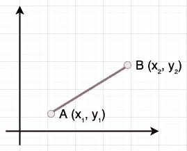

# 如何在 NumPy 中计算欧氏距离

> 原文：<https://towardsdatascience.com/euclidean-distance-numpy-1b2784e966fc>

## 展示如何在 NumPy 数组中计算欧几里得距离


马库斯·斯皮斯克在 [Unsplash](https://unsplash.com/s/photos/meter?utm_source=unsplash&utm_medium=referral&utm_content=creditCopyText) 上拍摄的照片

## 介绍

两点之间的欧几里得距离对应于两点之间线段的长度。假设我们有两点 A (x₁，y₁)和 B (x₂，y₂)，这两点之间的欧几里得距离如下图所示。



两点之间的欧几里德距离—来源:作者

下面给出了用于计算两点之间欧几里德距离的数学公式。

> d =√((x₂-x₁)+(y₂-y₁)

在今天的简短教程中，我们将探讨在使用 NumPy 数组时计算欧氏距离的几种不同方法。更具体地说，我们将展示如何使用

*   `linalg.nrom()`方法
*   `scipy`套餐
*   以及`sqrt()`和`einsum()`方法的组合

首先，让我们创建一个示例 NumPy 数组，我们将在下面的部分中引用它来演示计算欧几里德距离的几种不同方法。

```
import numpy as npa = np.array((1, 2, 3))
b = np.array((4, 5, 6))print(a)
***array([1, 2, 3])***print(b)
***array([4, 5, 6])***
```

## 使用 linalg.norm()计算欧几里德距离

在计算欧几里得距离时，我们的第一个选项是`[numpy.linalg.norm()](https://numpy.org/doc/stable/reference/generated/numpy.linalg.norm.html)`函数，它用于返回八个不同矩阵范数中的一个。

欧几里德距离实际上是 l2 范数，默认情况下，`numpy.linalg.norm()`函数计算第二个范数(参见参数`ord`)。

因此，为了计算欧几里得距离，我们可以简单地将两个 NumPy 数组的差传递给这个函数:

```
euclidean_distance = np.linalg.norm(a - b)print(euclidean_distance)
***5.196152422706632***
```

## 使用 SciPy 计算欧几里得距离

Scipy 包提供了一个模块，该模块具有许多计算各种类型的距离度量的函数，包括欧几里德距离。更具体地说，`scipy.spatial.distance.euclidean`函数可以计算两个一维数组之间的欧几里德距离。

```
from scipy.spatial.distance import euclideaneuclidean_distance = euclidean(a, b)print(euclidean_distance)
***5.196152422706632***
```

## 编写我们自己的函数

最后，另一个选择(我认为是一个非常明显的选择)是简单地编写我们自己的函数，它能够计算两个输入数组之间的欧几里德距离。

现在让我们重温一下我们在文章开头已经讨论过的欧几里德距离的数学定义。

> d =√((x₂-x₁)+(y₂-y₁)

下面共享的函数将完全做到这一点:

```
def compute_euclidean(x, y):
    return np.sqrt(np.sum((x-y)**2))
```

最后，让我们确保结果与前面提到的两种方法相同:

```
euclidean_distance = compute_euclidean_distance(a, b)print(euclidean_distance)
***5.196152422706632***
```

## 最后的想法

在今天的文章中，我们讨论了欧几里德距离以及在使用 NumPy 数组和 Python 时如何计算它。更具体地说，我们展示了如何使用三种不同的方法来计算它；`linalg.nrom()`方法，`sqrt()`和`einsum()`方法的组合，并使用`scipy`包。

[**成为会员**](https://gmyrianthous.medium.com/membership) **阅读媒介上的每一个故事。你的会员费直接支持我和你看的其他作家。你也可以在媒体上看到所有的故事。**

[](https://gmyrianthous.medium.com/membership) [## 通过我的推荐链接加入 Medium-Giorgos Myrianthous

### 作为一个媒体会员，你的会员费的一部分会给你阅读的作家，你可以完全接触到每一个故事…

gmyrianthous.medium.com](https://gmyrianthous.medium.com/membership) 

**相关文章你可能也喜欢**

[](/how-to-merge-pandas-dataframes-221e49c41bec) [## 如何合并熊猫数据帧

### 对熊猫数据帧执行左、右、内和反连接

towardsdatascience.com](/how-to-merge-pandas-dataframes-221e49c41bec) [](/random-seed-numpy-786cf7876a5f) [## random.seed 在 NumPy 中做什么

### 理解在 Python 中使用 NumPy 生成伪随机结构时如何创建可再现的结果

towardsdatascience.com](/random-seed-numpy-786cf7876a5f) [](/normalise-numpy-unit-vector-f9f086134507) [## 如何将 NumPy 数组规范化为单位向量

### 用 Python 将 numpy 数组归一化为单位向量

towardsdatascience.com](/normalise-numpy-unit-vector-f9f086134507)