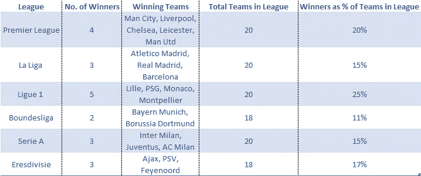
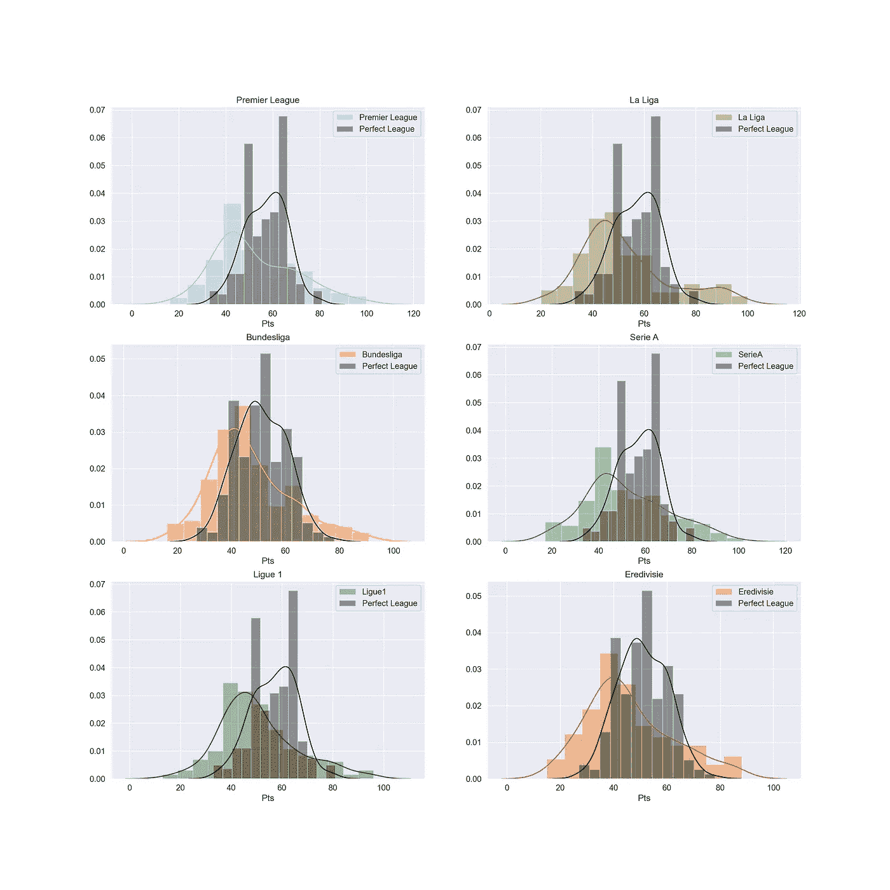
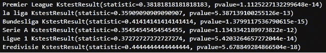
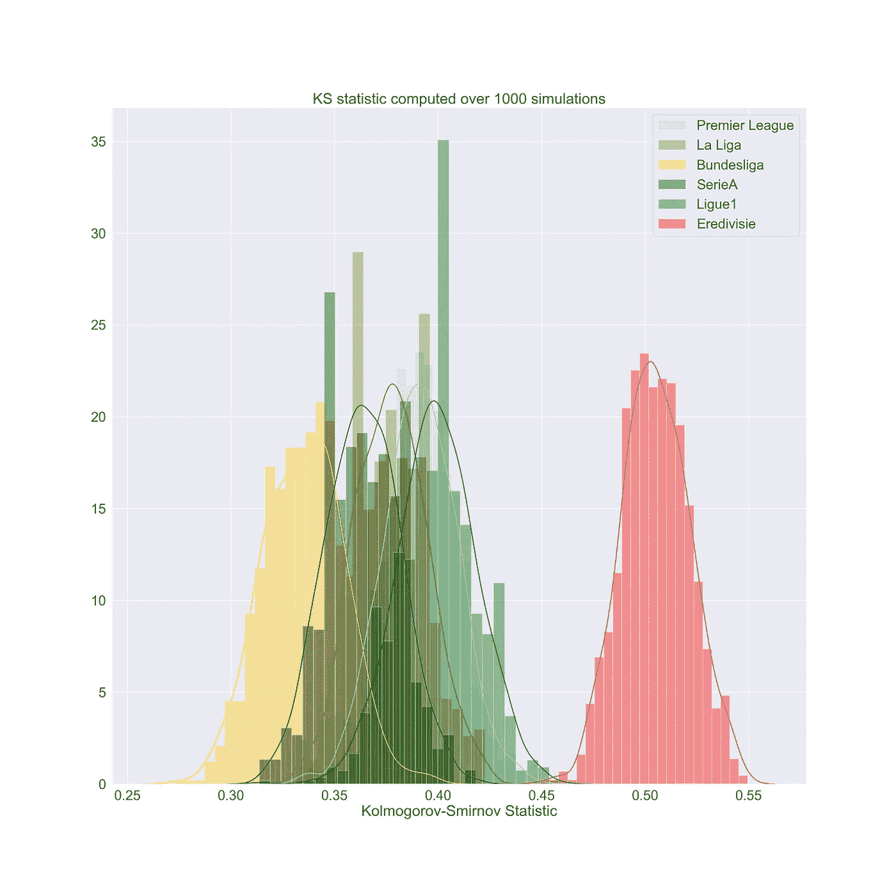

# 欧洲竞争最激烈的足球联赛——数据科学家的回答

> 原文：<https://towardsdatascience.com/europes-most-competitive-football-league-a-data-scientist-s-answer-a1281cb8e633>

## [实践教程](https://towardsdatascience.com/tagged/hands-on-tutorials)，只是为了好玩的数据科学项目

# 欧洲竞争最激烈的足球联赛——数据科学家的回答

## 用数据科学回答由来已久的足球争论

托马斯·塞勒在 [Unsplash](https://unsplash.com?utm_source=medium&utm_medium=referral) 上的照片

# 序文

足球是世界上最受欢迎的运动。2018 年国际足联世界杯是第二大最受关注的体育赛事(仅次于奥运会)，拥有约 30 亿观众。在欧洲，我们热爱足球，它经常是许多激烈辩论的中心。欧洲国内联赛之间存在巨大的竞争，每个人都认为他们的国内联赛更胜一筹。

足球迷们的老问题是，“竞争最激烈的联赛是什么？”

在英国，我们愿意相信我们的国内联赛是精英联赛，我们经常瞧不起其他欧洲联赛，称它们为“农民联赛”。

我想用数据科学一劳永逸地结束这场争论。那么欧洲竞争最激烈的联赛是什么呢？

# **数据科学家对古老争论的回应**

我有必要为这次调查设定一个合适的背景。我会看过去的 11 个足球赛季，从 2010/2011 到 2020/2021。我的分析将试图回答“在过去的 11 个赛季中，竞争最激烈的欧洲联赛是什么？”。

*我意识到我漏掉了一些联赛，我没有无限的时间来做这些项目，所以如果你愿意，请随意扩展我的方法。*

联赛:西甲(西班牙)、英超(英国)、法甲(法国)、德甲(德国)、荷甲(荷兰)和意甲(意大利)

# 欧洲足球联赛数据

我手动整理了六个欧洲联赛 11 个赛季的实际历史联赛成绩。我的 [GitHub repo](https://github.com/john-adeojo/FootballLeagues) 上有 CSV 格式的编译数据。

***注*** *:我使用了* [*维基百科*](https://en.wikipedia.org/wiki/2012%E2%80%9313_Bundesliga) *作为数据源来编制所有的联赛成绩。*

该数据将用于生成每个欧洲联赛的积分分布。我将在下一节解释我为什么这样做。

注意:积分分布是每个联赛所有赛季累积的所有积分的总和。

# 我们所说的竞争性是什么意思？

首先，我认为我们必须定义什么是竞争力。在我参与的大多数辩论中，球迷们通常会谈论各种各样以前赢得过联赛冠军的球队来衡量竞争力。我不认为这是最好的指标，它过于关注赢家，而忽略了其他球队。我一直认为，我们需要一种更全面的方法来衡量竞争力。

欧洲足球联赛冠军(数据来源维基百科，图片由作者生成)

## 什么是更好的竞争衡量标准？

我提出了另一种衡量竞争程度的方法，一种只有数据科学家才会想到的方法。

前提很简单。我希望你们跟着我做一个思维实验，从这个问题开始:

> 一个完全竞争的联盟实际上会是什么样子？

我假设一个联盟，其中每个队都有 50%的机会赢或输，代表完全竞争。换句话说，每场足球比赛都是真正的“五五开”。

我们可以用这个“对半”联盟作为基准来衡量其他联盟的竞争力。这里的逻辑很简单，一个联赛越接近这个“完全竞争的联赛”，就越有竞争力。

*注意:我们的“完全竞争联盟”没有任何平局。*

我们将通过测量他们的分数分布和我们的五五联盟的分数分布之间的“距离”来比较这些联盟。分数分布最接近“完全竞争”联盟的联盟获胜。

我相信我建议的方法比大多数球迷的方法更好，因为我们考虑的是联盟中的所有球队，而不仅仅是冠军。

# 足球联盟是如何运作的

我简单解释一下足球联赛是怎么运作的。联盟中的每支球队都要打两次，一次主场，一次客场。赢了给三分，平了给一分，输了给 0 分。联盟通常从 8 月到 5 月进行一个赛季，一旦赛季结束，积分就会被记录下来，获胜者是总积分最高的球队。

# **模拟一个完全竞争的联赛**

因此，我们已经收集了六个欧洲联赛 11 个赛季的数据，但是我们如何才能得到我们的完全竞争联赛的数据呢？没错，没有哪一个联赛的每场比赛都是对半分的，所以看起来我们好像被困住了，对吗？

好消息是，我们不需要对半联盟的实际数据，因为我们可以很容易地模拟一个。我用 Python 写了一个脚本来做这件事。模拟遵循以下简单步骤:

每个队互相打两次。

有 50%的胜算。

如果这个队赢了，给 3 分，否则给 0 分。

以上重复 11 季。

结果是每支球队在 11 个赛季的总积分，我们可以很容易地将它绘制成积分分布图。这将代表我们的“完全竞争联盟”。

注意:我运行了两个独立的模拟，一个是 20 支球队的联赛，另一个是 18 支球队的联赛。德甲和荷甲都有 18 支球队，所以比赛少，其他联赛都有 20 支。

*如果你对我如何用 python 构建模拟不感兴趣，直接跳到文章的下一部分。*

模拟五十比五十联赛(天真的方法假设跨赛季和比赛的结果独立)

# **我们如何测量点分布之间的距离？**

我们将使用 [Kolmogorov-Smirnov](https://en.wikipedia.org/wiki/Kolmogorov%E2%80%93Smirnov_test) (KS)统计量，以快速而肮脏的方式完成这项工作。

> Kolmogorov–Smirnov 统计量量化了样本的[经验分布函数](https://en.wikipedia.org/wiki/Empirical_distribution_function)和参考分布的[累积分布函数](https://en.wikipedia.org/wiki/Cumulative_distribution_function)之间的[距离](https://en.wikipedia.org/wiki/Metric_(mathematics))，或者两个样本的经验分布函数之间的[距离。](https://en.wikipedia.org/wiki/Metric_(mathematics)) [**来源于维基百科**](https://en.wikipedia.org/wiki/Kolmogorov%E2%80%93Smirnov_test)

首先，我们应该陈述两个样本的 KS 检验的假设:

***H0*** *:两个样本都来自同一分布的人群*

***H1*** *:样本来自不同人群*

用简单的英语来说，这是什么意思？好吧，让我们想想我们要达到的目标。我们想衡量我们每个联赛的积分分布与我们完全竞争的联赛之间的差异。由于我们只收集了 11 个赛季的联赛数据，所以我们只有一个结果的**样本**(注:所有联赛的运行时间都超过了 11 个赛季)。通过 KS 测试，我们可以揭穿一个联盟完全竞争的说法，但我们只是没有足够大的样本量来实现这一点。拒绝我们的零假设(H0)将表明一个联盟不是完全竞争的。

我们将假设统计显著性为 5%。如果我们看到一个统计上显著的结果，那么我们将提出 Kolmogorov-Smirnov 统计量越大，积分分布之间的差异就越大，因此联赛的竞争力就越低。

## **迷茫？**

好的，让我们先来看看这些分布，看看我们是否能发现任何差异。对于那些数学头脑不太好的人来说，这只是 11 个赛季积分的直观表示。黑色分布是我们完全竞争的联赛，彩色图是我们的欧洲联赛。竞争力可以被视为黑色和彩色分布之间的差异。差距越大，联赛的竞争力越弱。我们只是用 KS 统计来证实我们在这些图中看到的。

11 个赛季的足球联赛积分分布——黑色模拟五十比五十联赛(图片由作者提供)

# 好极了，告诉我竞争最激烈的联赛是什么

为了正确地做到这一点，我们需要快速重温我们的统计测试。我们的 p 值都低于 5%的显著性点，我很高兴地说，我们可以拒绝零假设。用外行的话来说，这仅仅意味着我们可以说我们的欧洲联赛不是完全竞争的。这应该是显而易见的，因为我们规定球队不能在我们的模拟联赛中抽签，但是我们知道他们可以，并且在现实生活中有数据。为了让你(在某种程度上)信服，下面是一次模拟运行的结果。

一次模拟运行的 Kolmogorov-Smirnov 统计和 pvalues(图片由作者提供)

现在让我们看看 KS 统计量的大小。我们知道它测量点分布之间的距离(粗略地说)。因此，我们可以用这个作为一个代理指标，哪个足球联赛是最具竞争力的。

**但是我们还没有完成……**

如果您能回想一下本文的开头，您会记得我们模拟了一个“完全竞争的联盟”,其中每个团队都有 50%的胜算。因为这是一个基于概率的模拟，每次我们运行它，联盟的积分构成都会略有不同，我们计算的 KS 统计量也会有所不同。我们通过运行 1000 次以上的迭代来解决这个问题怎么样？

下面是我用来做这件事的 python 脚本:

多次迭代运行模拟

这是结果图:

所有联赛的 KS 分布:越靠右，竞争力越弱(图片由作者提供)

解释很简单，KS 分布越靠右，联盟的竞争力越弱。

所以，这里有两个杰出的联盟。竞争最激烈的欧洲联赛(我们测试的)是:

🚀**德甲(德)**

…对于最没有竞争力的人来说:

🚜**荷兰文**

不幸的是，我们不能说任何关于英超、西甲、法甲的结论，KS 的统计数据有很多重叠。虽然意甲看起来是竞争最激烈的联赛的亚军。

# 结论:德甲最有竞争力

我在德国的读者会很高兴地知道，他们的国内足球联赛在竞争力方面名列前茅。我的发现明确地反映在这个国家足球的成功上。但了解足球迷的人，大多数不会同意。

使用 KS 统计实际上是一种测量分布差异的粗略方法，因为它只考虑了最大距离。作为这一研究的延伸，探索[推土机的距离(EMD)](https://en.wikipedia.org/wiki/Earth_mover%27s_distance) 将是有趣的。EMD 估计“总”差异。

以下是关于这一主题的其他分析结果:

《看台报道》的⭐️An 文章认为西甲是最有竞争力的

⭐️A 关于他们如何踢球的统计不太严谨的文章暗示这是意甲

⭐️A 多维分析表明这是英超联赛

如果你想自己玩玩这个笔记，我在这里提供了它:[足球分析](https://mybinder.org/v2/gh/john-adeojo/FootballLeagues/main?labpath=Football_Analysisv3.ipynb)

⭐️ *我喜欢通过分享我在野外的数据科学经验来帮助人们。如果你还不是会员，可以考虑订阅 Medium，从我这里获得更多有用的内容。*

 