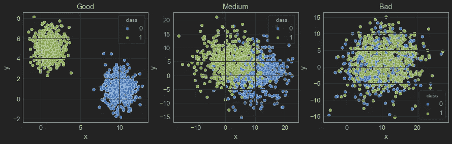
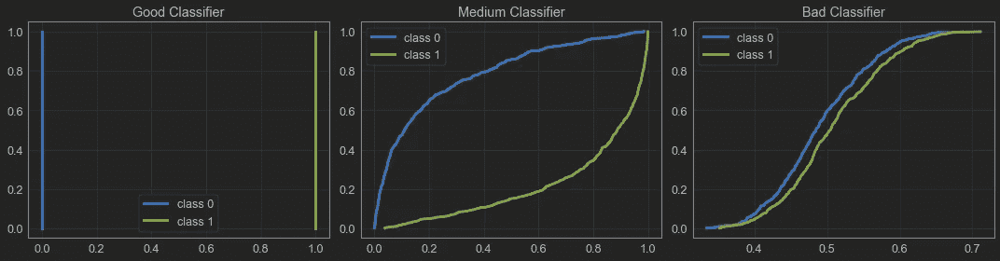
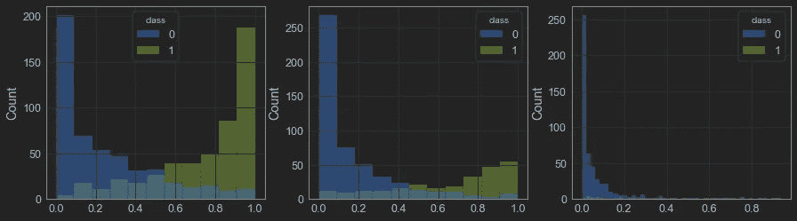

# 用 Kolmogorov-Smirnov (KS)检验评估分类模型

> 原文：<https://towardsdatascience.com/evaluating-classification-models-with-kolmogorov-smirnov-ks-test-e211025f5573>

## 使用 KS 检验评估类分布之间的分离


图片由[拥有的摄影](https://unsplash.com/@possessedphotography)在 Unsplash 上拍摄

在大多数二元分类问题中，我们使用 ROC 曲线和 ROC AUC 分数作为模型如何区分两个不同类别的预测的度量。我在另一篇文章中解释了这种机制[，但是直觉很简单:如果模型给否定类较低的概率分数，给肯定类较高的分数，我们可以说这是一个好模型。](/interpreting-roc-curve-and-roc-auc-for-classification-evaluation-28ec3983f077)

现在这里有一个问题:我们也可以使用 KS-2samp 测试来做这件事！

# 科尔莫戈罗夫-斯米尔诺夫试验

两个样本的 KS 统计量仅仅是它们的两个 CDF 之间的最高距离，因此如果我们测量正类分布和负类分布之间的距离，我们可以有另一个度量来评估分类器。

这种方法有一个好处:ROC AUC 得分从 0.5 到 1.0，而 KS 统计值从 0.0 到 1.0。对于业务团队来说，理解 0.5 是 ROC AUC 的烂分，而 0.75“仅仅”是中等分是不太直观的。还有一篇[预印论文](https://arxiv.org/ftp/arxiv/papers/1606/1606.00496.pdf)【1】声称 KS 计算起来更简单。

如果你想更好地理解 KS 测试是如何工作的，可以看看我关于这个主题的文章:

[](/comparing-sample-distributions-with-the-kolmogorov-smirnov-ks-test-a2292ad6fee5) [## 用 Kolmogorov-Smirnov (KS)检验比较样本分布

### 如何使用 python 比较样本并了解它们是否来自同一个发行版

towardsdatascience.com](/comparing-sample-distributions-with-the-kolmogorov-smirnov-ks-test-a2292ad6fee5) 

# 实验

我们开始工作吧。

我的 [github](https://github.com/vinyluis/Articles/tree/main/Kolmogorov-Smirnov) 上有所有的代码，所以我只讲述最重要的部分。

[](https://github.com/vinyluis/Articles/tree/main/Kolmogorov-Smirnov) [## 文章/Kolmogorov-Smirnov 在主要乙烯/文章

### 第 1 篇:用 Kolmogorov-Smirnov 检验比较样本分布(TBD)

github.com](https://github.com/vinyluis/Articles/tree/main/Kolmogorov-Smirnov) 

作为一个例子，我们可以构建三个数据集，它们在类之间具有不同的分离级别(参见代码以了解它们是如何构建的)。



三个样本的散点图。图片作者。

在“好的”数据集上，类没有重叠，它们之间有一个明显的间隙。在“中等”上，有足够的重叠来混淆分类器。“坏”数据集上的重叠如此强烈，以至于这些类几乎是不可分的。

我为每个数据集训练了一个默认的朴素贝叶斯分类器。通过绘制直方图，我们可以看到每一类的预测分布。在 x 轴上，我们有一个被分类为“阳性”的观察值的概率，在 y 轴上，我们有直方图的每个箱中的观察值的计数:


类别分离直方图。图片作者。

“好”的例子(左)有一个完美的分离，正如所料。“中等”的一个(中心)有一点重叠，但大多数例子可以正确分类。然而，分类器不能分离“坏的”例子(右)。

我们现在可以评估每种情况的 KS 和 ROC AUC:

输出是:

```
Good classifier:
KS: 1.0000 (p-value: 7.400e-300)
ROC AUC: 1.0000Medium classifier:
KS: 0.6780 (p-value: 1.173e-109)
ROC AUC: 0.9080Bad classifier:
KS: 0.1260 (p-value: 7.045e-04)
ROC AUC: 0.5770
```

好的(或者我应该说完美的)分类器在这两个指标上都获得了满分。

中等的 ROC AUC 为 0.908，听起来几乎完美，但 KS 分数为 0.678，这更好地反映了类不是“几乎完美”可分的事实。

最后，糟糕的分类器得到了 0.57 的 AUC 分数，这是糟糕的(对于我们这些知道 0.5 =最坏情况的数据爱好者来说)，但听起来没有 KS 分数 0.126 那么糟糕。

我们还可以检查每个案例的 CDF:



好、中和坏分类器的 CDF。图片作者。

正如所料，坏分类器在类 0 和类 1 的 CDF 之间有一个狭窄的距离，因为它们几乎是相同的。中等分类器在类 CDF 之间具有更大的间隙，因此 KS 统计量也更大。最后，“完美的”分类器在它们的 CDF 上没有重叠，所以距离是最大的，KS = 1。

# 数据不平衡的影响

以及数据失衡如何影响 KS 评分？

为了测试这一点，我们可以基于“中等”数据集生成三个数据集:

*   原，其中正类有 100%的原例(500)
*   一个数据集，其中正类有 50%的原始示例(250)
*   一个数据集，其中正类只有 10%的原始示例(50)

在所有这三种情况下，负类在所有 500 个例子中都不会改变。训练分类器后，我们可以看到它们的直方图，如前所述:



不平衡数据的类分离直方图。图片作者。

负类基本相同，正类只是规模变化。

我们可以使用相同的函数来计算 KS 和 ROC AUC 得分:

```
print("Balanced data:")
ks_100, auc_100 = evaluate_ks_and_roc_auc(y_100, y_proba_100)print("Positive class with 50% of the data:")
ks_50, auc_50 = evaluate_ks_and_roc_auc(y_50, y_proba_50)print("Positive class with 10% of the data:")
ks_10, auc_10 = evaluate_ks_and_roc_auc(y_10, y_proba_10)
```

输出是:

```
Balanced data:
KS: 0.6780 (p-value: 1.173e-109)
ROC AUC: 0.9080Positive class with 50% of the data:
KS: 0.6880 (p-value: 3.087e-79)
ROC AUC: 0.9104Positive class with 10% of the data:
KS: 0.6280 (p-value: 1.068e-17)
ROC AUC: 0.8837
```

即使在最坏的情况下，积极的类有 90%的例子，在这种情况下，KS 分数只比原来的少 7.37%。ROC 和 KS 对数据不平衡都具有鲁棒性。

# 多类分类评估

正如 ROC 曲线和 ROC AUC 的情况一样，我们无法在不将其转化为二元分类问题的情况下计算多类问题的 KS。我们可以通过使用“OvO”和“OvR”策略来做到这一点。

您可以在我的 [GitHub 存储库中找到本文](https://github.com/vinyluis/Articles/tree/main/Kolmogorov-Smirnov)的代码片段，但是您也可以使用我关于多类 ROC 曲线和 ROC AUC 的文章作为参考:

[](/multiclass-classification-evaluation-with-roc-curves-and-roc-auc-294fd4617e3a) [## 用 ROC 曲线和 ROC AUC 进行多类分类评价

### 将最常用的分类评估度量用于具有 OvR 和 OvO 的多类分类问题…

towardsdatascience.com](/multiclass-classification-evaluation-with-roc-curves-and-roc-auc-294fd4617e3a) 

# **结论**

KS 和 ROC AUC 技术将以不同的方式评估相同的指标。即使 ROC AUC 是分类分离的最广泛的度量，了解两者总是有用的。

当我开始在一个使用 KS 的地方工作时，我才明白为什么我需要使用它。这更多的是一个偏好的问题，真的，所以坚持做让你舒服的事情。

# 如果你喜欢这个帖子…

支持我一杯咖啡！

[](https://www.buymeacoffee.com/vinitrevisan)

给我买杯咖啡！

看看这个很棒的帖子

[](/comparing-robustness-of-mae-mse-and-rmse-6d69da870828) [## MAE、MSE 和 RMSE 的稳健性比较

### 存在异常值时主要回归指标的表现

towardsdatascience.com](/comparing-robustness-of-mae-mse-and-rmse-6d69da870828) 

# 参考

[1] Adeodato，P. J. L .，Melo，S. M. [关于 Kolmogorov-Smirnov 和 ROC 曲线度量在二元分类中的等价性。](https://arxiv.org/ftp/arxiv/papers/1606/1606.00496.pdf)

[2] Scipy Api 参考。 [scipy.stats.ks_2samp。](https://docs.scipy.org/doc/scipy/reference/generated/scipy.stats.ks_2samp.html)

[3] Scipy Api 参考。 [scipy.stats.ks_1samp。](https://docs.scipy.org/doc/scipy/reference/generated/scipy.stats.ks_1samp.html)

[4] Scipy Api 参考。 [scipy.stats.kstwo](https://docs.scipy.org/doc/scipy/reference/generated/scipy.stats.kstwo.html) 。

[5] Trevisan，V. [解读 ROC 曲线和 ROC AUC 进行分类评价。](/interpreting-roc-curve-and-roc-auc-for-classification-evaluation-28ec3983f077)