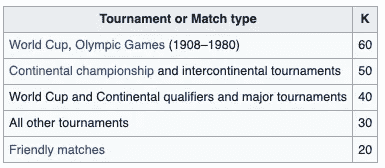
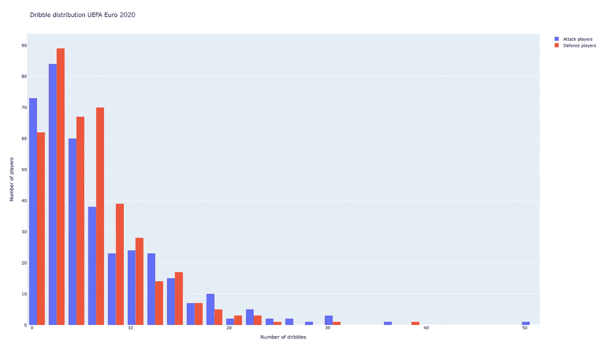
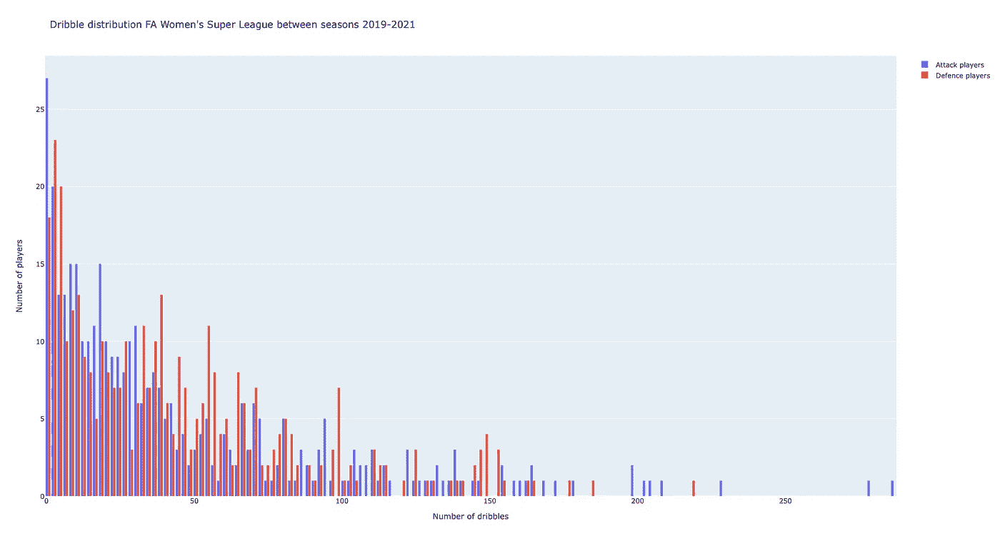
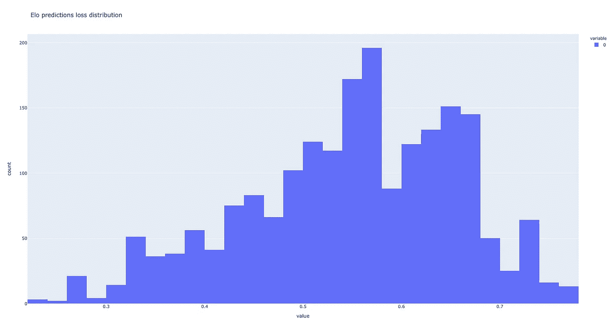

# 利用 Elo 算法评价足球运球技术

> 原文：<https://towardsdatascience.com/evaluating-football-dribbling-skill-by-utilizing-the-elo-algorithm-9c6aa384b991>

## 使用 StatsBomb 开放数据集，用 Python 中的 Elo 算法对球员的运球技巧进行评分。


托拜厄斯·弗莱克特在 [Unsplash](https://unsplash.com?utm_source=medium&utm_medium=referral) 拍摄的照片

# 运球

这可能是游戏中最激动人心和最引人注目的一步。当战术失败时，它可以是一个强大的游戏规则改变者，或者当所有的传球路线都被覆盖时，在对手的防守中制造一个重大的裂缝。成功可以唤起观众的敬畏之声，而失败可能导致危险的反击。

尽管有它的光环，我们，足球分析社区，还没有想出如何正确评估运球。通常归结为*成功*运球的次数或其成功率。既不考虑舞台，也不考虑对手——他可能只是一个疲惫的前锋，或者全能的维吉尔·范·迪克。哪种情况下运球者胜算更大？

在我的帖子[测量和可视化足球运动员的技能](https://medium.com/p/c1df36d61a4e/edit)中，我展示了一种测量球员持球技能的标准化稳健方法——T4 提升指数。使用这种方法，我们可以评估足球中的任何有球动作。所需要的只是足够大的行动样本、概率以及它们的实际结果。然而，所有的动作类型都适合这种方法吗？

例如，投篮和传球等动作会受到角度、距离和球员在球场上的位置等空间因素的高度影响。因此，这种动作的成功概率可以用足够数量的事件和/或跟踪数据来建模。

不过**运球就比较** **不一样**。的确，有些球场位置可能比其他位置更具挑战性，但这种一对一的决斗主要取决于球员本身——进攻者的运球技巧、防守者的一对一能力。

接受这个事实让我放弃了之前描述的基于机器学习的概率方法。相反，我寻找一种更加基于个人的方法。当我不知道我到底在找什么的时候，我会写下我知道的一切:运球(通常)是两个人的战斗，高度依赖双方的技术和配合。这也是一个运气、信心和动力的问题，也就是所谓的**流动** [ [1](https://link.springer.com/chapter/10.1007/978-94-017-9088-8_16) ]，表明它可能会随着时间的推移而演变。

有了这些线索，我寻找具有相同属性的运动，两个立即出现在我的脑海中:网球和象棋。事实证明，国际象棋比赛是用 [Elo 分数](https://en.wikipedia.org/wiki/Elo_rating_system#:~:text=The%20Elo%20rating%20system%20is,a%20Hungarian%2DAmerican%20physics%20professor.)(读作“*ay-luh”*)来汇总的——那么，为什么不把这种非常有用的算法也用于运球决斗呢？


国际象棋游戏由 Elo 分数聚合，假设每个游戏中每个玩家的国际象棋表现是正态分布的随机变量。JESHOOTS.COM 在 [Unsplash](https://unsplash.com?utm_source=medium&utm_medium=referral) 上[拍照。](https://unsplash.com/@jeshoots?utm_source=medium&utm_medium=referral)

考虑到 Elo 候选人，下一步是阅读更多关于它的内容。它适合这个问题吗？我可以用它来量化运球吗？

# 数据集

与之前的帖子一样，这项工作的数据基于 *Statsbomb* [开放数据集](https://github.com/statsbomb/open-data)。在[数据集的 Github 存储库](https://github.com/statsbomb/open-data)上可以找到更详细的文档。

# Elo 分数

Elo 系统最初是作为一种改进的国际象棋评级系统发明的，以其匈牙利创造者 Arpad Elo 的名字命名。美国国际象棋联合会(USCF)使用 Elo 分数对棋手进行分类。他们将分数≥ 2400 的玩家评为高级大师，将分数在 2200–2399 之间的玩家评为国家级大师，等等。

自其发明以来，Elo 评分已经涵盖了许多行业。它现在包括体育组织，如足球、美式足球、篮球、棒球、围棋、乒乓球；桌游如 [*拼字游戏*](https://en.wikipedia.org/wiki/Scrabble)[*外交*](https://en.wikipedia.org/wiki/Diplomacy_(game))；[电竞](https://en.wikipedia.org/wiki/Esports)游戏如 [*反恐精英:全球攻势*](https://en.wikipedia.org/wiki/Counter_Strike:_Global_Offensive) 、*英雄联盟、* FIFA (EA-Sports)、 [Pokemon Go](https://en.wikipedia.org/wiki/Pokemon_Go) 中的围棋对战联盟；有趣的是，即使是约会应用，如 [Tinder](https://en.wikipedia.org/wiki/Tinder_(app)) ，也使用 Elo 的变体来评估和匹配他们的用户。

那么，是什么原因导致 Elo 评分被如此大程度的采用呢？首先，Elo 分数假设**随机个人游戏**。对于国际象棋来说，意味着每场比赛中每个棋手的象棋**表现**是一个**正态分布的随机变量**。分布的平均值随时间缓慢变化。

此外，玩家的评级不依赖于一系列的行为，而只能从赢、平、输中推断出来。在 Elo 上下文中，一场*比赛*或一场*游戏*可以是**任何产生赢家和输家**的过程。

Elo 算法给我们的一个巨大好处是**用决斗训练数据训练它的能力，并使用分数作为未来决斗的预测器。这可以为新的比赛策略打开大门。**

# 评估运球的 Elo 分数

Elo 分数已经在足球比赛中使用。2009 年的一项研究发现，Elo 系统对足球比赛的预测能力最高，测试了八种不同的方法[ [2](http://lasek.rexamine.com/football_rankings.pdf) ]。然而，这些用例与足球*俱乐部*有关，与*球员*无关。

以运球为例，我们可以把一次**运球尝试**定义为一场 ***决斗*** ，进攻者和防守者相互较量。如果运球成功，或者进攻球员犯规，进攻方获胜。因此，他被认为在那场决斗中比他们的防守队员表现得更好。相反，如果进攻方输了，防守方被认为表现得更好。

为了减轻噪音和游戏的随机性质，我们将**集合它们**，而不是使用每个运球事件作为*决斗*。这种聚合可以应用于比赛、比赛阶段，甚至整个赛季。例如，如果利奥·梅西和维吉尔·范·迪克在一场比赛中有 5 次一对一的情况，我们可以将它们用作不同的*决斗*或者将它们聚合成一个平均结果。相应地，假设胜者全拿，梅西以 3 比 2 获胜将被转换为梅西的一场胜利。

然而，还需要另一个关键的调整。运球和一对一防守能力是完全不同的技能。不出所料，国际足联给梅西的运球得分打了 95 分，防守得分只有 34 分(站立铲球 35 分)。显然，我们必须将球员的进攻和防守表现以及得分分开。

为此，我们将使用最后一招:**每个玩家**将被代表**两次:一次**作为**进攻者，**和**再次**作为**防守者**。除了区分进攻和防守动作之外，这也能让我们找到在这两种技能上都很出色的球员。

# 调优 Elo 系统

我们可以调整一些超参数和细微之处，以更好地适应不同使用情形和不同数据规模的 Elo 得分。

## 调整更新机制

更新过程是任何 Elo 算法实现的核心。每个组织都采取了不同的路线来处理评级中固有的不确定性，特别是新评级，并处理评级膨胀/紧缩的问题。

**不同比赛不同权重**

足球运动员可以参加多种类型的比赛。比如里奥梅西，他在欧冠、英甲、美洲杯等赛场上踢球。由于每个锦标赛的难度不同，它对玩家评分的贡献应该相应地计入。

国际足联改编的 Elo 评分有 8 个权重，世界杯淘汰赛阶段的权重是一些友谊赛的 12 倍。表 1 显示了这些权重，它们涉及系统使用的 *k 因子*(参见下面的 Python 实现)。



表 1:来源:[维基百科](https://en.wikipedia.org/wiki/World_Football_Elo_Ratings)

**对不同的评分等级使用不同的权重**

美国国际象棋联合会(USCF)以前根据三个范围交错排列 *k 因子*(参见 Python 实现):

*   2100 以下玩家: *k 系数*32 用
*   介于 2100 和 2400 之间的玩家:使用了 24 个 k 因子中的
*   *2400 以上玩家: *k 因子*16 用。*

*这种渐进主义减少了那些 k 系数低的人评级膨胀或紧缩的可能性，因为他们快速改变排名的能力有限。*

## *处理评级通货膨胀和通货紧缩(长期)*

*评级膨胀意味着分数随时间递减；相反，“通货紧缩”表明平均水平在增长。就像最近几年同样质量的转会费飙升一样，当出现通货膨胀时，2500 的现代评级意味着低于 2500 的历史评级。在通缩期间，评级会随着时间推移而上升。这给比较不同时代的球员带来了挑战。*

*因此，人们可以采取一些行动来缩放评级，例如使用评级下限——所有玩家的最小值，保证玩家永远不会低于某个限制；或者对高评级用户使用较低的 *k 因子*，如表 1 所述。*

# *处理数据偏差*

*StatsBomb [开放数据集](https://github.com/statsbomb/open-data)本质上是二十年来数千个匹配的非常部分的样本的拼贴。这些比赛起源于许多比赛，各大洲，包括男女双方。更重要的是，它不是随机收集的(参见[文档](/,))。因此，数据非常稀疏，有偏见，并且往往集中在顶级球队和联赛，而不是足球运动员的真实分布。*

*为了减轻这种偏见，我使用了两场比赛，一次一场，在 StatsBomb 数据集中完全覆盖:2020 年欧洲杯和足总女超联赛(2018/2019–2020/2021 赛季)。图 1 显示了 2020 年欧洲杯上进攻者和防守者的决斗次数:*

**

*图 1:2020 欧洲杯期间球员参与运球赛事(决斗)的分布。每个球员代表两次:作为进攻者(蓝色)和防守者(红色)。这种分布是偏斜的，因为一些球员比其他人更倾向于运球/防守，这反映了一种模式而不是偏见。图片作者。*

# *案例研究#1:探索 2020 年欧洲杯的 Elo 信号*

*在这项研究中，我们将使用 StatsBomb 公开数据集对 Elo 分数进行初步评估，作为 2020 年欧锦赛的评级系统，我们将把*对决*定义为运球尝试。在运球成功或防守犯规的情况下，进攻方获胜。在其他任何情况下，防守者都是胜利者。*

*决斗将被聚集到一个比赛级别:对于每一对玩家，(玩家 1，玩家 2)，在比赛中获胜次数最多的玩家获胜。在平局的情况下，进攻者全拿走。*

*Elo *赛季*被定义为比赛中的一个阶段。实际上，它引发了一个到目前为止已经达到的分数的季节性缩放。通过这样做，我们可以在比赛的后期进行运球，在某种意义上补偿固定的 k 因子的使用。固定的 k 系数*在如此短暂的比赛中是有意义的，但在整个赛季的实施中用处不大。**

*2020 年欧锦赛最佳运球者将是那些被评估为进攻者时 Elo 得分最高的人。同样，最好的一对一防守者是那些在被评估为防守者时 Elo 得分最高的人。*

*至于 Elo 参数，我用了以下常量:Elo 均值= 1500，宽度= 400， *k 因子* = 32，*赛季*定义=欧洲杯 2020 比赛阶段，比例因子= 1.1。*

## *Python 实现*

1.  ***定义决斗***

*决斗是基于四种类型的事件来决定的:“运球”、“运球过去”、“犯规”和“犯规获胜”。为了丰富我们非常小的数据集，我们将认为防守犯规是成功的运球尝试。当更大的数据集可用时，我们可能希望我们的定义更加严格。*

```
*# CASE 1: A successful dribble, the 'Dribbled Past' event holds the loser (the defender) and the winner is the attacker.# CAS2 2: Unsuccessful dribble.  
# Identified with 'dribble_outcome_name' == 'Incomplete'. The loser is the attacker; the winner is the player to be on the ball in the next event.# CASE 3: Foul
# Foul is a win for the attacker (subsequent event can be foul won or shot/pass from free kick
# Foul should not be in defence (not 'foul_won_defensive')
# If free kick - next touch is not made necessarily by the dribbler*
```

***2。准备决斗***

*为了确保一致性，*决斗*被定义为玩家名字的排序元组。当左边的玩家获胜时，*决斗结果*为零，当右边的玩家获胜时，决斗结果设置为一。*决斗 _ 数据*将所有*决斗*存储在一个数据帧中。每个玩家代表两次:“DEF”和“ATK”**。**决斗的例子:*

```
*duel            (‘daniel wass:ATK’, ‘glen kamara:DEF’)
result          0
Winner          daniel wass:ATK
Loser           glen kamara:DEF
t_elo           Group Stage
aggregation     match_id
match_id        3788742
num_events      1*
```

***3。Elo 参数***

```
*mean_elo = 1500
elo_width = 400
k_factor = 32
end_of_season_scale_factor = 1.1*
```

***4。设置***

*设置和参数初始化。作者代码。*

***5。Elo 三大核心功能***

*第一个核心函数在每场比赛后更新 Elo 分数；第二种方法是在给定两个 Elo 分数的基础上计算预期结果；最后一个是在每个阶段/赛季结束后计算分数，在我们的情况下，这发生在比赛的每个阶段结束时:小组赛、16 强赛、四分之一决赛、半决赛和决赛。*

*Elo 的三个核心功能—更新分数、计算预期结果和季末缩放。作者代码，大量基于[维基百科 Elo 页面](https://en.wikipedia.org/wiki/Elo_rating_system)。*

***6。Elo 循环***

*这是代码的主要部分，是我们迭代季节和决斗的地方。*

*Elo 代码的主要部分——Elo 循环。作者根据 KASPER P. LAURITZEN 的《Kaggle 指南》编写的代码。*

# *结果*

*这个数据集是完整的，但就时间而言很短。因此，分数非常接近平均值(低方差)。然而，即使持续时间如此之短，该算法也能够找到相干信号。*

## *谁是最好的运球者？*

*如图 2 所示，丹尼尔·奥尔莫是 2020 年欧洲杯最佳运球者。他的“标准”数据是 37 次成功运球 26 次(成功率 70%)。亚军是拉希姆·斯特林(37/51 次成功运球——72.5%成功率)，阿尔瓦罗·莫拉塔最后一个登上领奖台(18/24 次，成功运球——75%成功率)。与直觉相反，根据 Elo 排名，在前三个职位上，成功率实际上是下降的。但是我们必须记住，**虽然 Elo 分数受获胜次数的影响，但它主要是关于你与谁的对决**。*

*丹尼尔·奥尔茂击败过各种伟大的后卫，比如卡米尔·格利克、维克托·林德洛夫、莱昂纳多·博努奇、吉奥吉奥·基耶利尼(第二好后卫)、曼努埃尔·阿坎吉；以及一些非常优秀的中场球员，如马尔切洛·布罗佐维奇、丹尼斯·扎卡里亚、马尔科·维拉蒂、若日尼奥、曼努埃尔·洛卡特利和尼科罗·巴雷拉。*

*另一方面，斯特林赢得了大部分对中场球员。自然，中场球员比最后防线的球员能承担更多的风险。相应地，他们的 Elo 得分通常较低(记住，我们认为防守犯规是输)。因此，尽管斯特林战胜了吉奥吉奥·基耶利尼(第二最佳防守球员)和莱昂纳多·博努奇，但他的大部分荣誉都是在对阵若日尼奥、马尔科·维拉蒂、布罗佐维奇、莱昂·格雷茨卡、托尼·克罗斯和托马斯·德莱尼等低级别但技术高超的球员时获得的。*

*图 2:2020 年欧洲杯期间 Elo 运球得分排名前 20 的运球运动员。图片作者。*

*这是对我们方法的一个很好的健全性检查。然而，它不能算作模型评估，因为我们不测量任何东西。例如，阿尔瓦罗·莫拉塔的高排名可能是我对成功运球的软定义的结果，包括被判犯规的情况。*

***与基线比较***

*出于某种角度，我使用了相同的*决斗*定义，并提取了两个排名选项作为基线:*运球胜率*和*总胜场数*。表 2 显示了每个指标排名前 20 的玩家。*

*表 2:2020 欧锦赛期间*运球胜率*和总胜率排名前 20 的球员。*

*虽然*胜率*嘈杂且表现不佳，但*胜率*基线与 Elo 选择重叠得很好，甚至还捕捉到了其他优秀的运球者，如 Kylian Mbappe 和保罗·博格巴。老实说，我不是一个能够真正判断哪个排名更好的领域专家。现在，我们可以简单地承认一个信号的存在，并将这个健全性检查标记为完成，至少对于这个硬币的攻击面来说，它是运球。*

## *最佳一对一防守队员*

*为了完成这个比喻，每个硬币都有两面；每个进攻者面前都有一个防守者，他的目标是对抗那些努力。从表面上看，基尔·沃克在 2020 年欧洲杯一对一的防守中表现最佳。排名第二的是传奇人物吉奥吉奥·基耶利尼。接下来是约尔迪·阿尔巴，乔丹·亨德森，以及 2021 年的官方[金童，来自巴萨的佩德里。图 3 显示了 2020 年欧洲杯一对一比赛中，Elo 排名前 20 位的防守球员。](https://www.fcbarcelona.com/en/news/2377547/pedri-wins-another-award-by-taking-kopa-trophy)*

*图 3:2020 欧洲杯期间 Elo 运球得分排名前 20 的一对一防守球员。*

## *擅长两项任务的玩家*

*基尔·沃克(第 10 位最佳运球者，最佳防守者)和佩德里(第 7 位最佳运球者，第 5 位最佳防守者)是一些球员可以在两边都表现出色的第一个迹象。两个分数的简单平均是产生整体一对一能力模拟分数的一种方法(表 3)。当然，人们可以使用其他类型的手段，如*调和平均值*，来惩罚技能之一中的低值。*

*表 3:2020 年欧洲杯期间 Elo 运球得分前 20 名。总得分最高的比赛被定义为一对一比赛中进攻和防守的平均成绩。*

## *案例研究 1#总结*

*显然，结果看起来是直观和合理的。最重要的是，与更传统的方法相比，Elo 可以捕捉不同的玩家。然而**不同**难道**不**就代表**更好**吗？是的，结果是有意义的，但是**为什么**它们比其他方法甚至基线更有意义？*

*评估结果是棘手的。理想情况下，我会测试 Elo 排名与预测运球结果的基线。不幸的是，这需要一个长期一致的数据集，以及更强的基线。*

*让我们看看案例研究#2 能为讨论增添什么。*

# *案例研究#2:评估 Elo 预测——足总女超联赛*

*在这里，我们使用了 2019-2021 赛季之间发生的 327 场足总女超比赛，来自 StatsBomb 公开数据集。这一次，我们不关注排名结果，我们将考察用 Elo 分数预测运球*对决*未来结果**的能力。***

## *实验规范*

*数据集包含(根据之前陈述的决斗定义)17，012 次决斗，或者在应用匹配级别聚合时包含 13，409 次决斗。按时间排序，我把前 85%的数据作为训练集，剩下的 15%作为测试集。图 4 展示了足总女超数据集上进攻者和防守者决斗的次数。*

**

*图 4:2019–2021 赛季足总女超联赛期间球员参与运球事件(决斗)的分布。每个球员代表两次:作为进攻者(蓝色)和防守者(红色)。图片作者。*

*由于*决斗的双方*同等重要，我选择了标准的*精度*度量作为我的目标函数。考虑到游戏的高度随机性，在这样一个简单的实验中达到 80%左右将是非常惊人的。显然，任何低于 0.5 的结果都比随机差，因此是无用的。由于 Elo 得分为每场*决斗*产生一个概率(参见上面 ***Elo 的三个核心功能*** )，所以也可以容纳损失(图 5)。*

*为了解决冷启动问题，我们将使用 Elo 平均值的缺省值来为看不见的玩家提供预测。*

*对于这个实验，我尝试了多种设置:动态/固定 k 因子，没有/有匹配级别聚合，以及多个*赛季*比例因子。Elo *赛季*被定义为一个完整的足球赛季。在用作验证集的 15%的训练集上执行参数调整。*

## *结果*

*使用动态 k 因子，将决斗聚集到一个比赛级别，并使用 1.02 的赛季比例因子，可以实现最佳性能。该配置在测试集上实现了 70.5%的**准确度。***

*   *基线数量获胜准确率= 63.6%*
*   *每场比赛的基准胜率(取代了艰难的“胜率”基准)准确度= 66.5%*

***前五名运球手***

```
***Name                      Elo score**
Lia Wälti                 1695.29
Kim Little                1673.56
Christie Murray           1673.46
Samantha June Mewis       1672.15
Jackie Groenen            1668.71*
```

***前五名一对一防守队员***

```
***Name                      Elo score**
Esther Morgan             1574.17
So-Yun Ji                 1568.19
Lois Joel                 1554.72
Lia Wälti                 1551.93
Jennifer Patricia Beattie 1545.78*
```

*完整的 Elo 分数结果可在[此处](https://www.magdaci.com/football2vec-pretrained/63d9cf49-eec1-49b9-86c2-7f6ddd17fd9b)获得。*

**

*图 5:测试集上 Elo 算法预测的日志损失分布。图片作者。*

*考虑到我们使用的数据集和比赛的性质，这些表现相当显著，**每 10 次运球中有 7 次被正确预测，比随机**好 20.5%！*

*不可否认，Elo*在预测能力上超过了*目前的基线，但当经过多个联赛和长时间的训练后，*将真正闪耀*。在所展示的案例研究中，所有玩家只参加一场比赛，也就是说，难度相同。在这种情况下，Elo 算法失去了一些魔力。然而，在跨国比赛中，如欧洲冠军联赛或国际足联世界杯，它**可以协同其所有球员得分**，更重要的是**比赛的困难**，变成**一个连贯的预测**。*

# *摘要*

*在这项工作中，我们使用了著名的 Elo 算法对足球运动员的运球技术进行评分和排名。这种方法的一个副产品是一对一防守能力的补充得分。在我们的第一个概念验证中，我们对 2020 年欧洲杯数据应用了该算法，对结果进行了手动评估。丹尼尔·奥尔茂被认为是锦标赛中最好的运球者。*

*有了明确的信号，我们开始对 Elo 算法预测未知*决斗*事件的预测能力进行定性(适当)评估。我们再次应用了 Elo，这一次是在更大的足总女超数据上。*

*在训练集上，Elo 的表现超过了三个基本基准——随机、 *num_wins、*和 *wins per match* ，预测决斗结果的准确率达到了 70.5%。*

# *对未来的思考*

*这些初步结果可能表明，有了更大、更一致的数据集，我们将能够做得更好。此外，我们将能够丰富我们的分析，分析一段时间内的趋势，或者寻找被低估的球员。*

*由于 Elo 的预测性，另一个可能的研究方向是将其作为一种工具来优化阵容，球员的位置，并创建更智能的比赛。也就是说，找到最佳定位和战术，为我们的球员创造最佳环境，在一对一的情况下击败对手。*

*在足球决策的更广泛背景下，人们可以将 Elo 概率与预期传球(xP)和预期进球(xG)相结合，以创建数据驱动的决策助手。最后，这种方法可以用来评估**前锋的射门和门将的一对一技术**。而且在足球的范围之外，Elo 分数也可以为篮球运球工作。*

# *参考*

*[1]中村，珍妮和米哈里·契克森米哈。“流量的概念。”*心流和积极心理学的基础*。施普林格，多德雷赫特，2014。239–263.*

*[2] Lasek、Jan、Zoltán Szlávik 和 Sandjai Bhulai。"足球协会排名系统的预测能力."*国际应用模式识别杂志*1.1(2013):27–46。*

*[3]铃木、古屋和大森和信。"国际足联/可口可乐世界排名在预测世界杯决赛结果中的有效性."*足球科学*5(2008):18–25。*