# 通过分析我的 Fitbit 数据档案评估我的健康状况

> 原文：<https://towardsdatascience.com/evaluating-my-fitness-by-analyzing-my-fitbit-data-archive-23a123baf349>

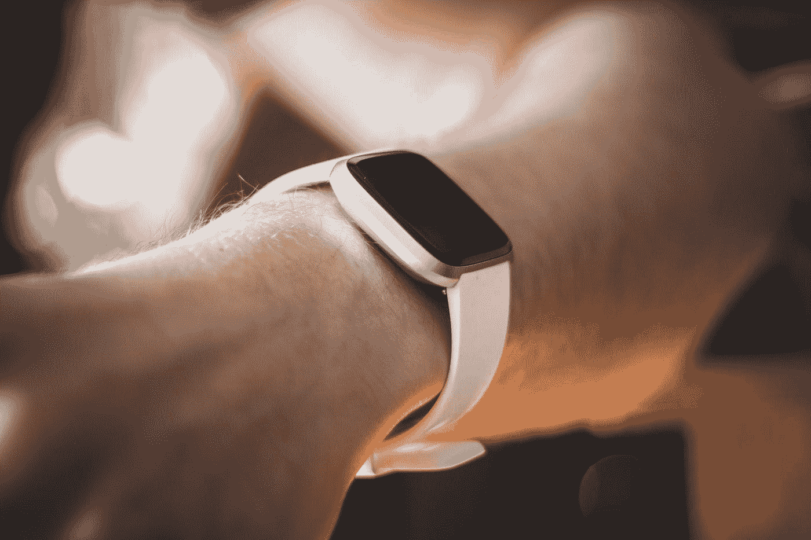

在 [Unsplash](https://unsplash.com?utm_source=medium&utm_medium=referral) 上由 [Kamil S](https://unsplash.com/@16bitspixelz?utm_source=medium&utm_medium=referral) 拍摄的照片

## 在日常生活中利用数据分析

数据分析是一个专业领域。作为一名数据分析师，我的日常活动是强调信息技术的需求和重要性，挖掘信息以揭示我所工作的实体的洞察力。我太习惯于为了工作和商业利益而深挖数据，却没有意识到它也可以用来改善我自己的生活。

在过去几年中，健身追踪器已经成为一种新兴趋势。我在去年开始使用它，它对跟踪我的日常健身很有帮助，当我超过每日步数目标或看到锻炼后燃烧的卡路里数量时，**会给我一些成就感。但也仅此而已。**

## 日复一日，Fitbit 收集了如此多的数据，而我并没有深入研究。好的，我们看到一个 70 的睡眠分数；或者燃烧了 138 卡路里，但这意味着什么呢？就其本身而言，这些数据可能没有多大意义，但一旦我们将它们结合起来，并将其可视化，一些模式可能会出现，并向我们展示我们的日常行为和个人健康状况。

这篇文章是一篇个人探索性数据分析日志，旨在揭示我的日常行为和健康水平，并(希望)想出一些改善它们的方法。

*数据处理和分析中用到的完整代码可以在* [*这个 Github 资源库*](https://github.com/oliviatan29/fitbit-data-analysis) *中找到。*

# 获取 Fitbit 数据存档

我使用 Fitbit 作为我的健身追踪器，幸运的是，导出 Fitbit 收集的数据进行进一步处理非常容易。[此支持页面](https://help.fitbit.com/articles/en_US/Help_article/1133.htm?Highlight=TCX%20file)编译了直接检索您最近的 Fitbit 数据或请求您的数据的完整存档的步骤；所有这些都来自你的 fitbit.com 仪表盘。

可以导出多种数据类型，从您的活动、社交和睡眠，甚至到女士的月经数据。

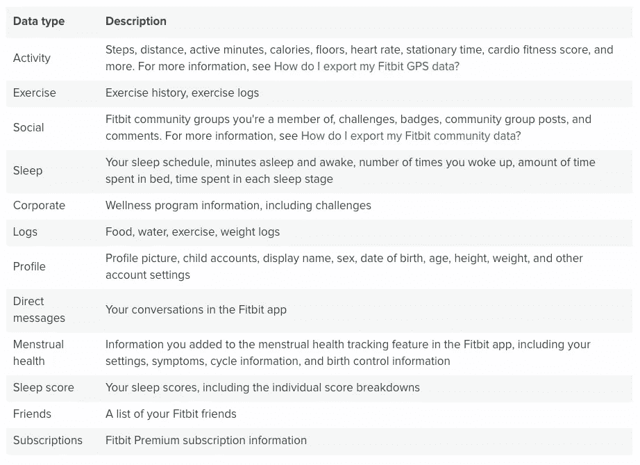

可以导出的 Fitbit 数据类型(从 [Fitbit 支持页面](https://help.fitbit.com/articles/en_US/Help_article/1133.htm?Highlight=TCX%20file)检索)

我检索了我的完整存档，根据上面的数据类型，它位于多个文件夹中。每个文件夹都包含记录数据的 JSON 文件。

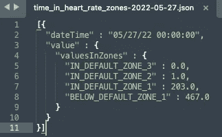

Fitbit 数据的样本 JSON 文件(图片由作者提供)

# 数据处理

由于数据大多以 JSON 格式出现，因此不同数据类别的结构略有不同。例如，有一个“心率”文件，显示每分钟捕获的心率；而“心率范围内的时间”显示每分钟的心率范围/类别。

另一方面，睡眠数据包含许多具有不同深度的字段。有一些字段直接归因于睡眠(即，开始时间、每个睡眠类别的持续时间等)以及作为比较的每个睡眠类别的三十天平均值。

这需要多次解析，具体取决于要研究的数据本身。在这种情况下，我关注的是身体活动数据、日常睡眠数据和锻炼活动数据。

我使用“glob”库进行递归数据导入。这是一个将多个 JSON 文件中的心率数据转换成 dataframe 的示例代码。

```
import globpath = r'Downloads/MyFitbitData/OliviaOlivia/Physical Activity/' # use your path
all_files = glob.glob(path + "/heart_rate-*.json")li = []for filename in all_files:
    with open(filename) as data_file:    
        data = json.load(data_file)
    df = pd.json_normalize(data)
    li.append(df)df_heart_rate_all = pd.DataFrame()
df_heart_rate_all = pd.concat(li, axis=0, ignore_index=True)
```

数据处理和分析中使用的完整代码可以在[这个 Github 库](https://github.com/oliviatan29/fitbit-data-analysis)中找到。

# 数据探索:通过分析我的 Fitbit 数据，我了解了关于我的健康的 4 件事

## 1.正常的下限心率，这很好

Fitbit 每隔几秒钟提取一次我们的心率(bpm)值及其置信度。我按日期、日期和时间对数据进行分组，以找出我在一天中某个时间的总体心率。

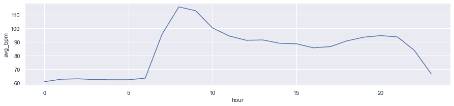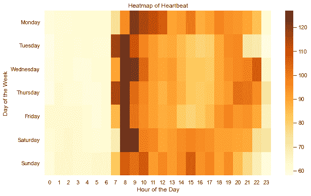

心率数据的可视化(图片由作者提供)

心率在每分钟 55-125 次之间变化。在晚上我睡觉的时候，它保持在 55-75 BPM 的较低水平。与哈佛医学院共享的 60–100 BPM 的[标准相比，这略低。这是一件好事，也有人说，处于该范围低端的静息心率可能会对心脏病发作提供一些保护。](https://www.health.harvard.edu/heart-health/what-your-heart-rate-is-telling-you)

这可能很大程度上是由我的锻炼习惯造成的。我经常在早上做一些家庭运动，这表现在我每天早上 7-9 点大约 100-125 次/分的高心率上。虽然进行一些有氧运动很好，但建议仍然将心率保持在目标和最大限度内。根据 [CDC](https://www.cdc.gov/physicalactivity/basics/measuring/heartrate.htm#:~:text=You%20can%20estimate%20your%20maximum,beats%20per%20minute%20(bpm).) 的数据，最大心率是 220 减去你的年龄，适度体力活动的目标心率是最大心率的 64–76%。**得知我的运动心率刚好在目标心率范围内**，我感到非常欣慰。

## 2.更多的跑步可以燃烧更多的卡路里

这项运动的衡量标准之一是燃烧的卡路里数。根据 [Healthhub SG](https://www.healthhub.sg/programmes/69/intro-to-calories) 的说法，卡路里是你进行日常活动所需的能量，但消耗过多而不燃烧它们可能会导致体重增加和健康问题。

作为一个生活在新加坡的典型的一日三餐的人，我每天消耗大约 1200-1600 千卡。而我是一个一天大部分时间坐着的上班族，我一天需要 1425 千卡[来源](https://tdeecalculator.net)。我需要燃烧通过体育活动获得的额外的 100-200 千卡热量。

在这里，我将每分钟运动消耗的卡路里按活动类型进行可视化。

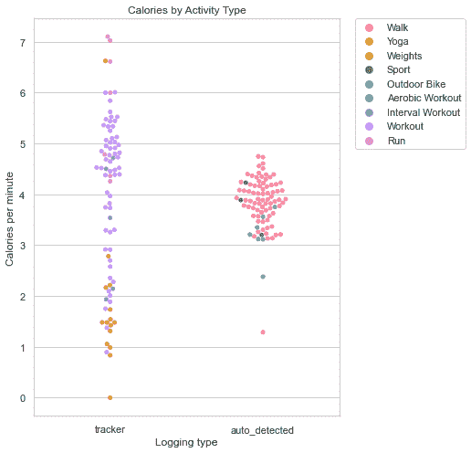

每分钟燃烧的卡路里的可视化(图片由作者提供)

看起来各有不同，但**最低的是~ 1 kcal/分钟的瑜伽，其次是~ 3.9 kcal/分钟的步行，~ 4.6 kcal/分钟的健身，最终是~ 6 kcal/分钟的跑步**。

也就是说，一个可以燃烧我过多卡路里消耗的组合是步行 20 分钟和锻炼 15 分钟。或者运行 25 分钟。现在我可以估计我的练习的最短持续时间:)

一些额外的可视化——总行走步数和行走活动消耗的卡路里之间的高度相关性。

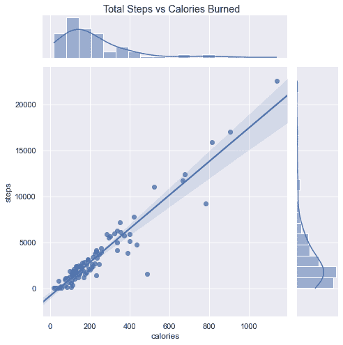

总步数与消耗的卡路里的可视化对比(图片由作者提供)

## 3.请多睡会儿

关于健康的另一个重要信息是关于你的睡眠。根据[睡眠基金会](https://www.sleepfoundation.org/how-sleep-works/why-do-we-need-sleep)的说法，充足的良好睡眠可以降低某些疾病的风险，如心脏病、二型糖尿病、中风等。它也有助于防止疲劳，让你感到精力充沛，做有成效的工作。

我通常每天睡 6-7 个小时。这比成人每天 7-9 小时的推荐睡眠时间略低。我的 Fitbit 睡眠总得分(T8)也不太令人满意，只有 70-75 分，该得分来自睡眠持续时间、质量(深度睡眠)和恢复/躁动。当然，这是需要改进的地方。

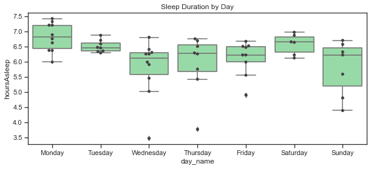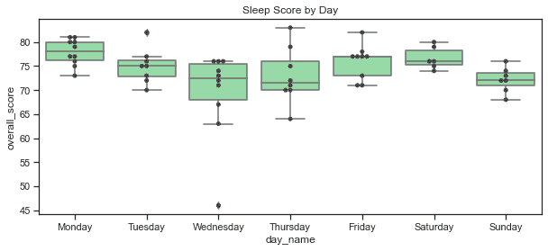

总体睡眠持续时间和得分(图片由作者提供)

深度睡眠是睡眠旅程的重要组成部分。根据[睡眠基金会](https://www.sleepfoundation.org/stages-of-sleep/deep-sleep#:~:text=Most%20adults%20should%20aim%20for,regulates%20amounts%20of%20deep%20sleep.)的说法，这是身体真正放松的时候，生长激素被释放出来，并致力于建立和修复肌肉、骨骼和组织，以及免疫系统的功能。对于成年人来说，建议将我们总睡眠的 13–23%用于深度睡眠。

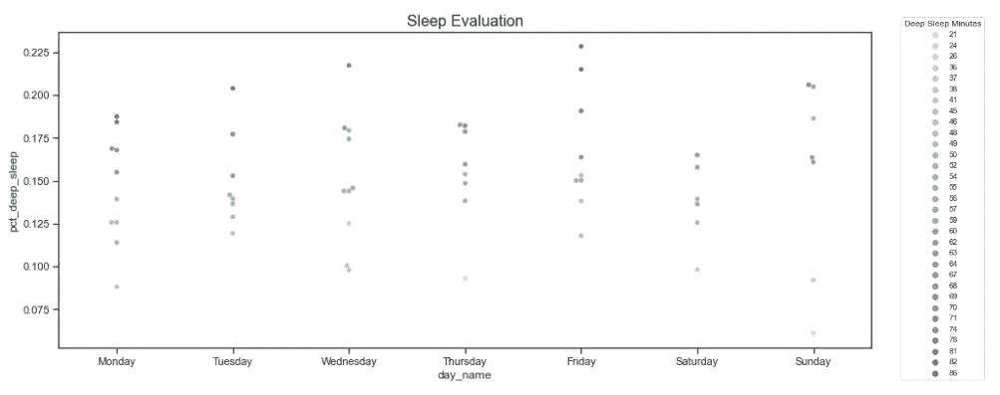

深度睡眠的百分比和持续时间(图片由作者提供)

对我来说一件好事是**我的深度睡眠百分比已经在推荐的阈值内。因此，我只需要努力获得更长的睡眠时间**。也许是想早点睡觉？

## 4.燃烧更多的卡路里并不能保证一夜好眠

虽然来自霍普金斯医学院的[研究](https://www.hopkinsmedicine.org/health/wellness-and-prevention/exercising-for-better-sleep)显示锻炼对睡眠质量有积极影响，但我的个人数据显示结果喜忧参半。我起草了每日步数和燃烧的卡路里与各种可用睡眠评分之间的相关性，结果发现它们之间没有显著的正相关性。

由于这是个人数据，我可能缺乏医学专业知识来评估它，可能有一些其他因素影响他们。也许是因为我的数据方差很小，因为我和我的日常习惯很一致？

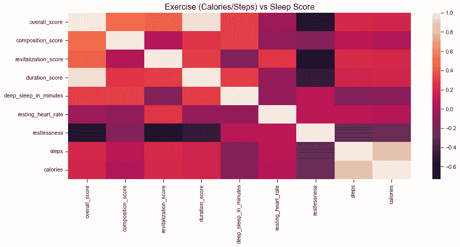

运动与睡眠评分的相关性(图片由作者提供)

# 我应该做些什么来改善我的健康状况？

与一般数据分析一样，它是为了揭示见解，并最终根据这些见解采取行动，以实现预期目标。从这个数据探索中，我发现**我的心跳率和消耗的卡路里已经达到了一个理想的推荐阈值**，这太棒了。然而，我的**睡眠评分仍然相当欠缺，可以改进**，尤其是从持续时间的角度来看。这也有望增加深度睡眠的持续时间。

一些保持健康甚至提高健康的方法:

*   **保持日常锻炼**燃烧过量 150–200 千卡/天。也许 20 分钟的步行和 15 分钟的锻炼？或者跑 25 分钟？
*   **增加睡眠时间**。我知道我是一个早起的人(我早上有很多约会)，所以唯一的办法就是早点开始睡觉。我想应该是晚上 11 点下班的时候了。

发现关于我自己的一些事实和见解是很有趣的，也有一些行动点来改善它。如果你有兴趣探索你的 Fitbit 数据，你可以参考我的 Python 笔记本，它包含了这个 Github 库中的全部数据分析。