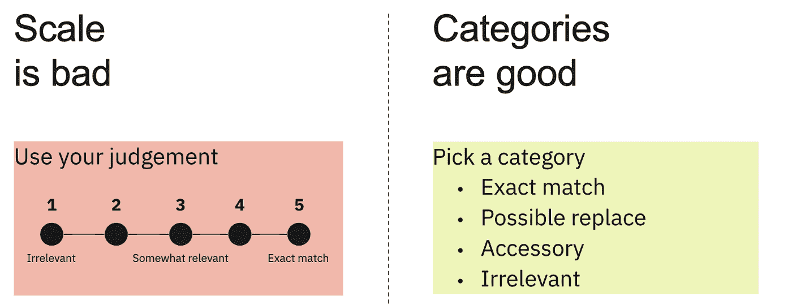
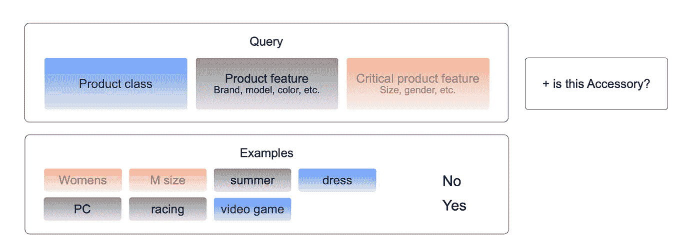
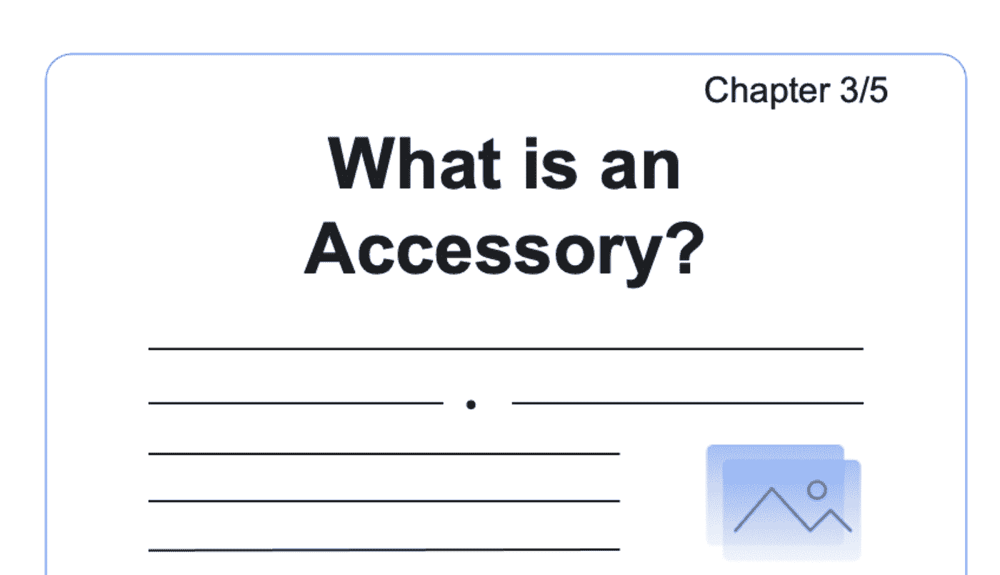
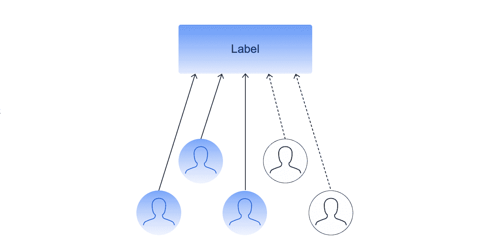

# 利用众包按需评估搜索相关性

> 原文：<https://towardsdatascience.com/evaluating-search-relevance-on-demand-with-crowdsourcing-4203b7058101>

## 众包搜索相关性评估的 5 个内幕提示

作者照片

**简介**

当今最重要的电子商务任务之一是搜索相关性评估。您的在线市场依赖于搜索算法来改善客户体验，但评估搜索数据具有挑战性。

在这篇文章中，你将学到一些关于如何为搜索相关性项目获得一致准确的人工来源标签的内部技巧。

**什么是搜索相关性评估？**

搜索相关性评估将特定的搜索结果与用户的搜索查询进行比较，以查看它们是否匹配。在电子商务中，它用于改善搜索页面结果，选择相关广告，建议客户购买的配件等。

作者照片

标记的相关性数据集用于验证预训练的 ML 算法的结果，并为训练新版本的模型提供数据。

此外，它们可以用于在大量受众中测试新功能或不同的搜索方法，而无需部署到产品中或以任何其他方式影响实际市场。

**为搜索相关性评估写扎实的说明**

通常，标记项目的第一步是为评估相关性的人编写说明。确保你的说明易于阅读，并且没有任何相关背景或经验的人也能容易理解。阐明他们应该如何处理所有可能的类别和边缘情况。理想情况下，为每种情况提供例子。

另一个好的经验法则是“指令越短越好”——这在大多数情况下都很有效。

我们的实验还表明，搜索相关性类别在没有分级排序的情况下效果更好。我们建议不要按比例划分类别，例如(1–5)，其中 1 表示不相关，5 表示完全匹配，而是使用独立的、无序的备选方案。良好类别的例子有*完全匹配、可能替换、附件、*和*不相关* t。

作者截图

**分解查询以提高准确性**

下一个问题是做标记的人应该如何判断搜索查询。在某种程度上，如果某物是'*可能的替代物'*或'*附件'，这可能是主观的。*

因此，最好将查询分解成更小的部分，如*‘产品类别’，【产品特性】，*或*‘关键产品特性’*。您可以在下面的图表中看到这个想法，其中有两个查询示例:*“女式 M 码夏装”*和“ *PC 赛车视频游戏*”。

作者截图

一旦您分解了您的查询，您就可以像这样定义规则:

如果类别不同且不是附件，则**不相关**

如果类别不同，但它是一个配件，那么它就是**配件**

如果次要特征不同，则**可能更换**

如果关键特征不同，则**不相关**

像这样清晰的陈述将有助于表演者根据你的指示决定他们应该为该项目选择哪个类别。

**提供一个练习项目**

一旦你清楚地定义了所有类的规则，你需要把这些信息传达给标签员。不幸的是，规则有时会变得有点复杂——尤其是搜索查询——我们确实说过指令应该简单明了。想象一下，在说明中你有这样一点:

如果类别不同，但它是一个附件，那么它就是**附件**

但是你说的从犯是什么意思清楚吗？你也许应该教育贴标机什么是你认为的附属品，但这将需要一个很长的解释。

有时，创建一个与主要说明分开的教育项目更好，在那里贴标签的人可以看到类别的详细解释。我们称之为“教育项目”,只有完成它的人才能接触到实际的任务。每当规则发生变化时，对表演者进行再教育也很重要。

作者截图

**优化重叠以获得可靠的结果**

当我们使用众包时，我们通常会将相同的任务交给几个人，以便更加确信我们得到的结果是正确的。

作者截图

那么有多少人应该完成同样的任务呢？完成任务的人越多，我们获得的信心就越多，但我们花的钱也就越多。解决问题的方法是使用**动态重叠。**如果任务复杂性差异很大，这一点尤其有效。

在动态重叠中，我们可以从让两个人解决同一个任务开始。如果他们的答案一致，我们可以假设答案是正确的。如果没有，我们应该增加重叠以收集更多的答案。

**使用控制任务检查质量**

控制任务，也称为蜜罐，帮助您确保贴标质量。这些是你知道答案的任务，并且以一种贴标签者无法区分的方式混合在普通任务中。您可以根据每位执行者对控制任务的回答来计算他们的得分。控制任务对于质量控制至关重要，因为它们可以帮助你过滤掉表现不佳的人。我们已经注意到控制任务的一些常见陷阱——尽量避免下表中列出的那些。

*   如果你的控制任务太复杂，可能会导致低绩效，因为没有多少人能够解决这些问题。
*   如果你的控制任务太少，你可能会很快用完。
*   如果控制任务没有正确的类别分布来反映您的数据集，您可能会计算出不正确的技能值。
*   如果您使用旧的控制任务，您可能会面临以下风险:所包含的链接已经过期，或者执行者已经看到控制任务，并且他们知道这些任务的答案。

**总结**

在本文中，我们研究了如何使用众包来评估搜索相关性查询。我希望你已经发现它很有用，并且能够在评估你自己的搜索相关性引擎时应用其中的一些技巧。

如果你对更多细节感兴趣，请观看由 [Dmitrii](https://www.linkedin.com/in/dmitrii-mironov-77877848/) 主持的这个[演示](https://www.youtube.com/watch?v=ERM_ZdLH4dY&t=3s)。另外，如果你想了解更多关于数据标注管道的信息，请加入这个数据驱动的[社区](https://tolokacommunity.slack.com/join/shared_invite/zt-sxr745fr-dvfZffzvQTwNXOE0gEqysg#/shared-invite/email)。

*PS:我正在 Medium 和*[***aboutdatablog.com***](https://www.aboutdatablog.com/)*上写文章，深入浅出地解释基本的数据科学概念。你可以订阅我的* [***邮件列表***](https://medium.com/subscribe/@konkiewicz.m) *在我每次写新文章的时候得到通知。如果你还不是中等会员，你可以在这里加入***。**

*下面还有一些你可能喜欢的帖子*

* [## 用户生成内容的审核渠道

### 欧洲科技巨头如何利用 Toloka 的人群来调节其内容

towardsdatascience.com](/moderation-pipeline-for-user-generated-content-59e7f3c320e0)  [## 分类客户支持请求

### 以及如何通过众包来实现

towardsdatascience.com](/categorizing-customer-support-requests-7c285a9cf974)  [## 机器翻译系统中的人在回路

### 使用众包评估机器翻译质量

towardsdatascience.com](/human-in-the-loop-in-machine-translation-systems-bdf3fe82bfa3)  [## 如何成功将大型数据集添加到 Google Drive

### 并在谷歌实验室中使用它们…

towardsdatascience.com](/how-to-successfully-add-large-data-sets-to-google-drive-130beb320f1a)*