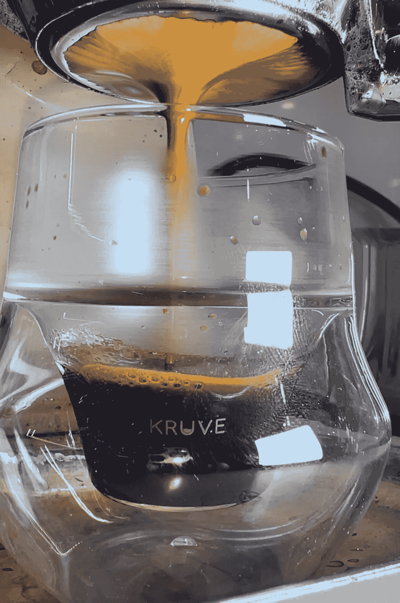
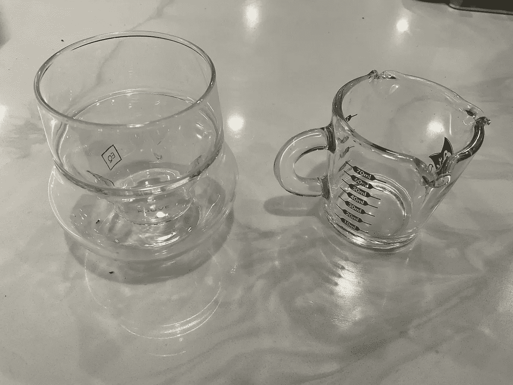
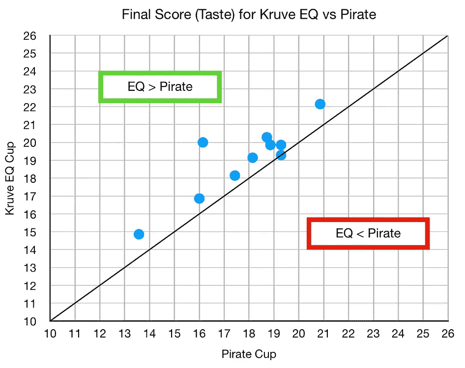
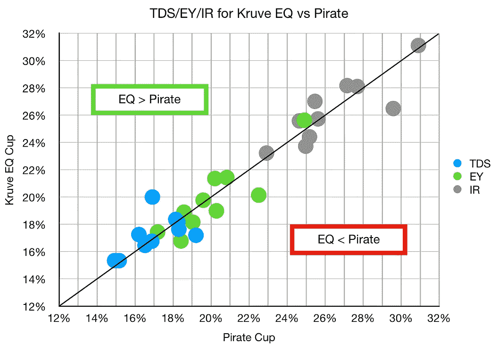
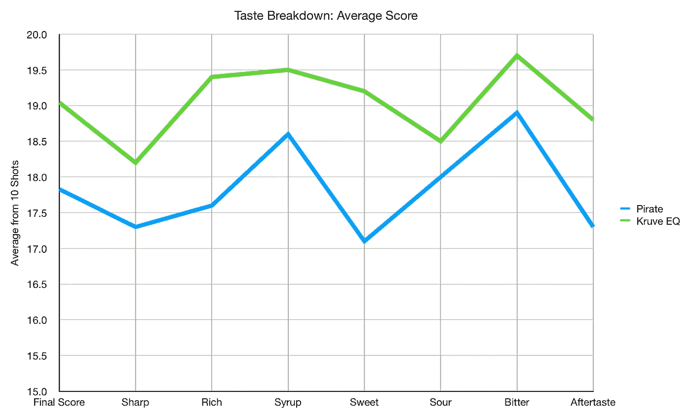
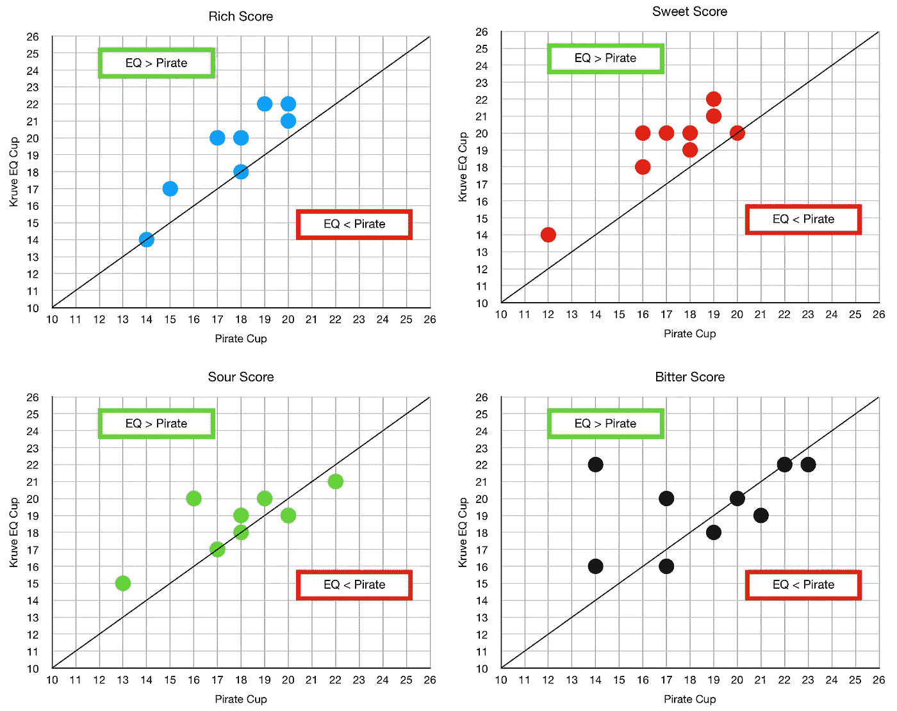
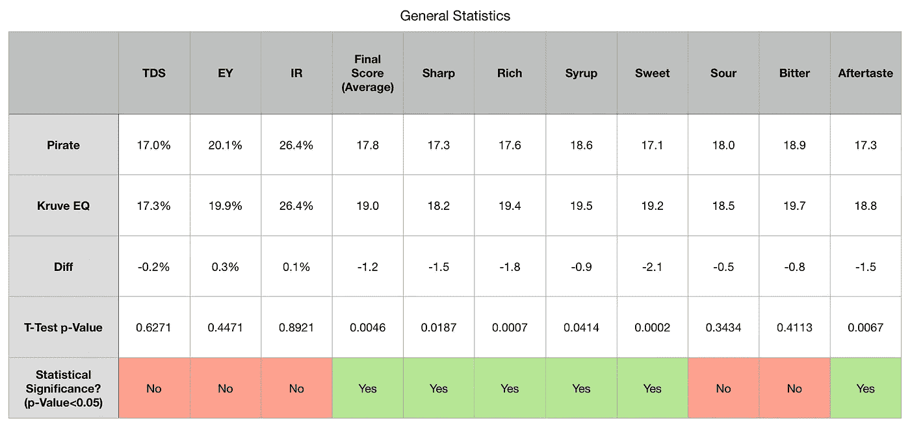

# 评估 Kruve EQ 意式浓缩咖啡杯

> 原文：<https://towardsdatascience.com/evaluating-the-kruve-eq-cup-for-espresso-c0c28b1549f1>

## 咖啡数据科学

## 一个数据驱动的，主观的口味评论

当 Kruve 第一次推出 EQ 咖啡杯时，我拒绝了。虽然杯子能改善口感的想法听起来很合理，但我认为这个成本不值得。后来我中了一套，我错了。

所有图片由作者提供

当我为我的[书](https://www.indiegogo.com/projects/engineering-better-espresso-data-driven-coffee)开始我的 [Kickstarter](https://www.kickstarter.com/projects/espressofun/engineering-better-espresso-data-driven-coffee) 时，我结束了和 Kruve 的很多交谈。我一直在用他们的筛滤机进行断奏咖啡的拍摄。我在这方面已经有偏见了，因为我很感激他们的筛选员为我做的一切。他们很友好，给我的 Kickerstarter 打了折扣，还送了我一套他们的 EQ 咖啡杯。他们问我是否可以试一试。这是一个简单的实验，将它与我以前的海盗咖啡杯进行比较。

克鲁夫情商杯和我的海盗杯

# 最初的想法

我拉了一些配对的镜头，下面是我没有数据的初步想法。

## 赞成的意见

*   更好的品尝体验，因为宽口。
*   由于有鳍，我不用[搅我的镜头](/to-stir-or-to-swirl-better-espresso-experience-8cf623ea27ef)。
*   拿杯子比用小把手更容易。
*   由于这种设计，我喝咖啡的时间也更长了。

## 骗局

*   杯子对于我现在的机器(Kim Express)来说几乎太大了。我无法在不丧失拍摄视频能力的情况下获得秤。
*   它不像我现在的杯子那样在侧面有标记，我用它来估计我的产量。
*   因为双层设计，它不允许浓缩咖啡冷却。我让我的镜头在大约 4 到 5 分钟内冷却到 47 摄氏度，但使用 Kruve，需要更长的时间。
*   这个杯子比我现在旅行用的杯子大了一点。

# 设备/技术

[浓缩咖啡机](/taxonomy-of-lever-espresso-machines-f32d111688f1):金快线

咖啡研磨机:[小生零](/rok-beats-niche-zero-part-1-7957ec49840d)

咖啡:[家庭烘焙咖啡](https://rmckeon.medium.com/coffee-roasting-splash-page-780b0c3242ea)，中杯(第一口+ 1 分钟)

投篮准备:[断奏](https://medium.com/overthinking-life/staccato-espresso-leveling-up-espresso-70b68144f94)和[内外断奏](/inside-out-staccato-espresso-f836fddc0bd1)

[预输注](/pre-infusion-for-espresso-visual-cues-for-better-espresso-c23b2542152e):长，约 25 秒

输液:[压力脉动](/pressure-pulsing-for-better-espresso-62f09362211d)

[过滤篮](https://rmckeon.medium.com/espresso-baskets-and-related-topics-splash-page-ff10f690a738) : 20g VST

其他设备: [Atago TDS 计](/affordable-coffee-solubility-tools-tds-for-espresso-brix-vs-atago-f8367efb5aa4)、 [Acaia Pyxis 秤](/data-review-acaia-scale-pyxis-for-espresso-457782bafa5d)、 [Kruve 筛](https://www.kruveinc.com/pages/kruve-sifter)

# 绩效指标

我使用两个[指标](/metrics-of-performance-espresso-1ef8af75ce9a)来评估技术之间的差异:最终得分和咖啡萃取。

[**最终得分**](https://towardsdatascience.com/@rmckeon/coffee-data-sheet-d95fd241e7f6) 是记分卡上 7 个指标(辛辣、浓郁、糖浆、甜味、酸味、苦味和回味)的平均值。当然，这些分数是主观的，但它们符合我的口味，帮助我提高了我的拍摄水平。分数有一些变化。我的目标是保持每个指标的一致性，但有时粒度很难确定。

**总溶解固体(TDS)是用折射仪测量的，这个数字结合弹丸的输出重量和咖啡的输入重量用来确定提取到杯中的咖啡的百分比，称为**提取率(EY)** 。**

****强度半径(IR)** 定义为 TDS vs EY 控制图上原点的半径，所以 IR = sqrt( TDS + EY)。这一指标有助于标准化产量或酿造比的击球性能。**

# **表演**

**在设计这个实验时，我本可以取出一个镜头，然后把它分在两个杯子里。然而，我的浓缩咖啡很浓，我担心这样做会扭曲体验。相反，我使用相同的拍摄准备和每对参数。**

**我拍了 10 双，趋势很快就明朗了。我总是先用 Kruve EQ 杯拍照，因为我无法将天平放在下面。然后我拉的下一个镜头，我用了海盗杯的秤，得到了类似的输出产量。**

**EQ 杯提升了我的味觉体验。TDS/EY/IR 没有变化，但我绘制它们是为了表明我拍摄的照片主要因为杯子而味道不同。或者说，因为杯中的内容物相同，所以味觉体验不同。**

********

**我分解了主要成分的平均口味分数。最大的变化是丰富和甜蜜的组成部分。0.5 的差异几乎不明显。**

****

**所以我把这些分数放到散点图上，富和甜肯定有明显的影响。然而，对于酸和苦，我没有注意到一个影响。**

****

**这种效果可能是因为它的作用类似于一个酒杯。我看了一对 t 检验，我一般喜欢样本多。然而，我非常喜欢这个奖杯，我想继续进行其他实验。该味道具有明显的味道差异。**

****

**我做了一些配对测试，发现 Kruve EQ 的味觉体验比我现在的杯子要好。不知道其他杯子会怎么样。然而，你可以在家里尝试这种体验，而不用买杯子，看看你感觉如何。如果你有一个大酒杯，试着把你的酒倒入杯中，旋转，然后从那里喝。你应该知道你是否也喜欢它，以及是否值得为改善浓缩咖啡的体验而花钱。**

**如果你愿意，可以在推特、 [YouTube](https://m.youtube.com/channel/UClgcmAtBMTmVVGANjtntXTw?source=post_page---------------------------) 和 [Instagram](https://www.instagram.com/espressofun/) 上关注我，我会在那里发布不同机器上的浓缩咖啡照片和浓缩咖啡相关的视频。你也可以在 [LinkedIn](https://www.linkedin.com/in/dr-robert-mckeon-aloe-01581595) 上找到我。也可以关注我在[中](https://towardsdatascience.com/@rmckeon/follow)和[订阅](https://rmckeon.medium.com/subscribe)。**

# **[我的进一步阅读](https://rmckeon.medium.com/story-collection-splash-page-e15025710347):**

**[我未来的书](https://www.kickstarter.com/projects/espressofun/engineering-better-espresso-data-driven-coffee)**

**[浓缩咖啡系列文章](https://rmckeon.medium.com/a-collection-of-espresso-articles-de8a3abf9917?postPublishedType=repub)**

**[工作和学校故事集](https://rmckeon.medium.com/a-collection-of-work-and-school-stories-6b7ca5a58318?source=your_stories_page-------------------------------------)**

**[个人故事和关注点](https://rmckeon.medium.com/personal-stories-and-concerns-51bd8b3e63e6?source=your_stories_page-------------------------------------)**

**[乐高故事启动页面](https://rmckeon.medium.com/lego-story-splash-page-b91ba4f56bc7?source=your_stories_page-------------------------------------)**

**[摄影启动页面](https://rmckeon.medium.com/photography-splash-page-fe93297abc06?source=your_stories_page-------------------------------------)**

**[改善浓缩咖啡](https://rmckeon.medium.com/improving-espresso-splash-page-576c70e64d0d?source=your_stories_page-------------------------------------)**

**[断奏生活方式概述](https://rmckeon.medium.com/a-summary-of-the-staccato-lifestyle-dd1dc6d4b861?source=your_stories_page-------------------------------------)**

**[测量咖啡磨粒分布](https://rmckeon.medium.com/measuring-coffee-grind-distribution-d37a39ffc215?source=your_stories_page-------------------------------------)**

**[浓缩咖啡中的粉末迁移](https://medium.com/nerd-for-tech/rebuking-fines-migration-in-espresso-6790e6c964de)**

**[咖啡萃取](https://rmckeon.medium.com/coffee-extraction-splash-page-3e568df003ac?source=your_stories_page-------------------------------------)**

**[咖啡烘焙](https://rmckeon.medium.com/coffee-roasting-splash-page-780b0c3242ea?source=your_stories_page-------------------------------------)**

**[咖啡豆](https://rmckeon.medium.com/coffee-beans-splash-page-e52e1993274f?source=your_stories_page-------------------------------------)**

**[浓缩咖啡滤纸](https://rmckeon.medium.com/paper-filters-for-espresso-splash-page-f55fc553e98?source=your_stories_page-------------------------------------)**

**[浓缩咖啡篮及相关主题](https://rmckeon.medium.com/espresso-baskets-and-related-topics-splash-page-ff10f690a738?source=your_stories_page-------------------------------------)**

**[意式咖啡观点](https://rmckeon.medium.com/espresso-opinions-splash-page-5a89856d74da?source=your_stories_page-------------------------------------)**

**[透明 Portafilter 实验](https://rmckeon.medium.com/transparent-portafilter-experiments-splash-page-8fd3ae3a286d?source=your_stories_page-------------------------------------)**

**[杠杆机维修](https://rmckeon.medium.com/lever-machine-maintenance-splash-page-72c1e3102ff?source=your_stories_page-------------------------------------)**

**[咖啡评论和想法](https://rmckeon.medium.com/coffee-reviews-and-thoughts-splash-page-ca6840eb04f7?source=your_stories_page-------------------------------------)**

**[咖啡实验](https://rmckeon.medium.com/coffee-experiments-splash-page-671a77ba4d42?source=your_stories_page-------------------------------------)**