# 仔细看看 T-test 的性能

> 原文：<https://towardsdatascience.com/evaluating-the-performance-of-the-t-test-1c2a4895020c>

# 仔细看看 T-test 的性能

## 一项模拟研究，调查不同情况下 t 检验的 I 型误差和功效。样本大小和方差如何影响双样本 t 检验的性能。

照片由 gerald 在 Pixabay 上拍摄

我们如何评估统计测试的表现？答案是蒙特卡洛模拟。模拟研究是一种计算机实验，涉及使用伪随机采样从概率分布中生成数据。模拟的关键优势在于我们可以评估统计方法的行为，因为我们可以控制测试的假设和“真相”。对于真实世界的数据，总体的参数是未知的。一旦我们指定了要在数据生成中使用的假设和参数，模拟就相当简单了。在本文中，我将引导您通过一个小的模拟研究，使用 R 来调查两个版本的 t-test 的性能。

本文使用的代码可以在这个 [Github repo](https://github.com/TalkingDataScience/evaluate_ttest_with_simulation) 中找到。

# 评估 T 检验的性能

双样本独立 t 检验是一种常见的统计检验，用于查看两组的均值是否不同。例如，它可以用来测试药物在治疗组和安慰剂组之间的效果是否不同。t 检验和其他统计方法一样，都有假设。如果假设被违反会发生什么？“常规”t 检验(也称为学生 t 检验)的假设之一是，被比较的两组的方差相等。有一种被称为韦尔奇 t-检验的适应性 t-检验，如果方差不能被假定为相等，它可能更可靠。

我们的模拟研究将调查两个独立样本的*方差*和*样本量*如何影响两个 t 检验的性能。我们的研究针对零假设，我们将查看*类型 1 误差*和*功效*来评估性能。这两个概念将在本文后面更详细地解释。

## 模拟要回答的问题

我们将着眼于小样本和大样本的属性，以及相等和不相等方差的影响。更准确地说，我们将研究以下场景:

1.  方差相等时，组样本大小如何影响*I 型误差*
2.  当方差不相等时，组样本大小如何影响*I 型误差*
3.  当方差分别相等和不相等时，均值差异如何影响*功率*

首先，让我们回顾一下 t 检验的假设和公式。

## t 检验的假设

1.  数据是连续的。
2.  数据服从正态分布。
3.  这两个样本是独立的。
4.  这两个样本是从各自总体中随机抽取的简单样本。
5.  两个样本的方差相等。学生的 t 检验假设方差相等，而韦尔奇 t 检验不假设方差相等。

除了关于方差的最后一个假设外，学生的 t 检验和韦尔奇检验的所有假设都是相同的。在我们的模拟中，我们将生成满足所有前四个假设的数据。

## “学生”t 检验

t 统计量的计算方法如下

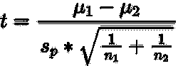

其中混合方差是

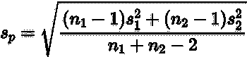

有自由度的

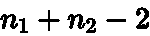

## 韦尔奇 t 检验

韦尔奇检验不使用混合方差，而是直接使用每个样本的方差。t 统计量的计算方法如下

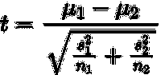

有自由度的

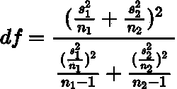

# I 型误差和功率

我们调查的目标是零假设，我们将着眼于评估测试的性能测量是*I 型误差*和*功效。*两种版本的 t 检验评估均值相同的零假设，而不是均值不同的替代假设。

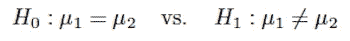

为了评估 t 检验在不同情况下的表现，我们将查看当空值为真和空值为假时，空值假设的拒绝率。也就是说，小于公称尺寸α的 p 值百分比= 0.05。这将分别给出 I 型误差和功率。下面的矩阵给出了假设零假设为真/假的情况下，统计测试的可能结果的概述。

I 型和 II 型误差矩阵(图片由作者提供)

*大小*或*I 型误差*是拒绝一个假备选项的真零假设的概率(假阳性)。换句话说，它是在实际均值没有差异的情况下错误地检测到均值差异的概率。我们可以通过生成具有相同平均值的两个独立样本的数据来估计测试的 I 型误差。通过计算拒绝率，我们估计测试的 I 型误差。如果大小等于或小于 alpha，则测试的显著性水平为 alpha。通常，显著性水平和大小是相同的，α的常见值被设置为 0.05。如果它们相同，这意味着该测试具有 95%的显著性水平。通常使用 0.05 的大小级别，这意味着我们预计，平均而言，由于随机性，大约有 5%的测试会出现假阳性。

*功效*是拒绝假零假设(真正)的概率。它给出了检测真实均值差异的概率。与 I 类误差一样，它可以通过产生两个独立样本来估计。在这种情况下，我们将使用*不同的*均值生成样本，运行 t 检验并计算拒绝率。理想情况下，我们希望测试的功效尽可能高，但至少高于 80%。如果功效是 80%,这意味着检测到平均值的真实差异的概率是 80%。

# 运行模拟的代码

我们希望创建一个函数来运行模拟，并允许我们通过指定其参数来指定我们想要研究的场景。

下面的函数采用形式参数 seed(用于再现性)，S 表示迭代次数，对于两个样本，我们可以指定样本大小、平均值和标准偏差。该函数使用给定的参数值从正态分布生成数据，并执行学生 t 检验和韦尔奇检验。存储每个数据集和每个测试的 p 值，计算并返回无效假设的拒绝比例。比例就是大小或力量(取决于手段是作为相等还是不同传递的)。

# 场景 1(第一类误差):等方差，小样本和大样本

一旦我们有了一个模拟不同场景的函数，我们就可以运行我们的第一个模拟，通过指定两组的平均值相等来评估类型 I 错误(假阳性)。这种模拟不违反任何一种 t 检验的假设。模拟中的值指定如下。

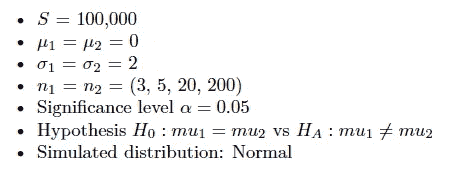

R 中运行模拟的代码:

该表显示了结果，我们可以看到，当方差相等时，学生的 t 检验在小样本和大样本的名义水平上表现良好。韦尔奇检验在大样本上表现良好，但在小样本上表现不佳。

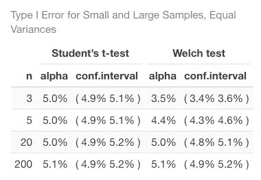

作者图片

# 场景 2(第一类错误):不等方差，小样本和大样本

在第二个模拟中，我们观察方差不相等时的第一类错误(假阳性)。这违反了学生 t 检验的假设，因此我们期望看到一些与 0.05 的目标水平不同的 alpha 值。韦尔奇检验并不假设方差相等，所以让我们看看这个检验是否比学生的 t 检验表现得更好。我们将模拟中的值设置如下。

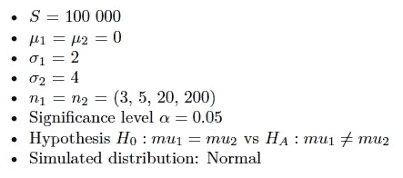

R 中运行模拟的代码:

正如我们所料，当方差不相等时，学生 t 检验的 alpha 值开始与名义水平不同。对于最大样本量 200，它在目标上只有一个 alpha 值。它不同于其他样本大小的目标，越小的样本差异越大。除了最小样本量 3 之外，所有样本量的 alpha 值在目标值为 5%时，Welch 检验表现良好。

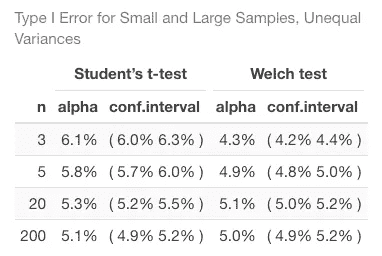

作者图片

**侧记**两组样本量不同时的情况。我还模拟了场景 1 和场景 2，但是将样本大小改为不相等。当方差相等时，样本量相等时和样本量不相等时，学生的 t 检验具有相同的结果。我们看到学生的 t 检验对不等方差很敏感，增加不等样本量会使检验表现更差。它甚至对大样本量> 200 表现不佳。Welch 检验对不等方差不敏感，在增加不等样本量时仍然稳健。然而，不管方差/样本量相等/不相等，威尔士检验在小样本量上表现不佳。

# 情景 3 和 4(幂):相等和不相等的差异

在第三和第四种情况下，我们比较第二个样本组中不同平均值的两个 t 检验的功效(真阳性)，保持所有其他参数相等。在这些模拟中，我们将看到检测实际均值差异的概率是多少。在第一次运行中，我们指定两组的方差相等，在第二次模拟中，我们指定方差不相等。模拟的值如下。

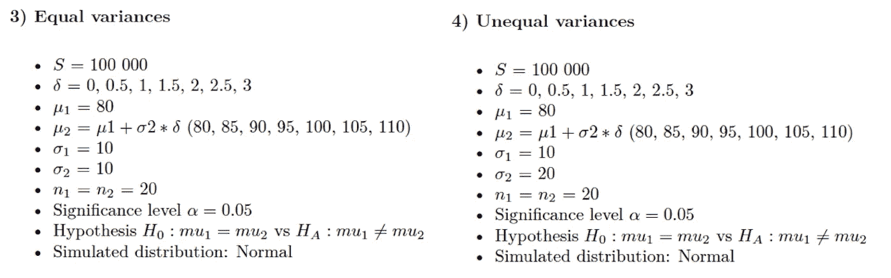

模拟评估功率的 R 代码:

下图显示了两个 t 检验的功效，亮红色和蓝色显示方差相等时 t 检验的功效，暗红色和蓝色显示方差不相等时的功效。我们可以看到，学生的 t 检验和韦尔奇检验具有几乎相同的功效，两者方差相等时，方差不相等时。虽然，当方差不相等时，两个测试的功效都较低。

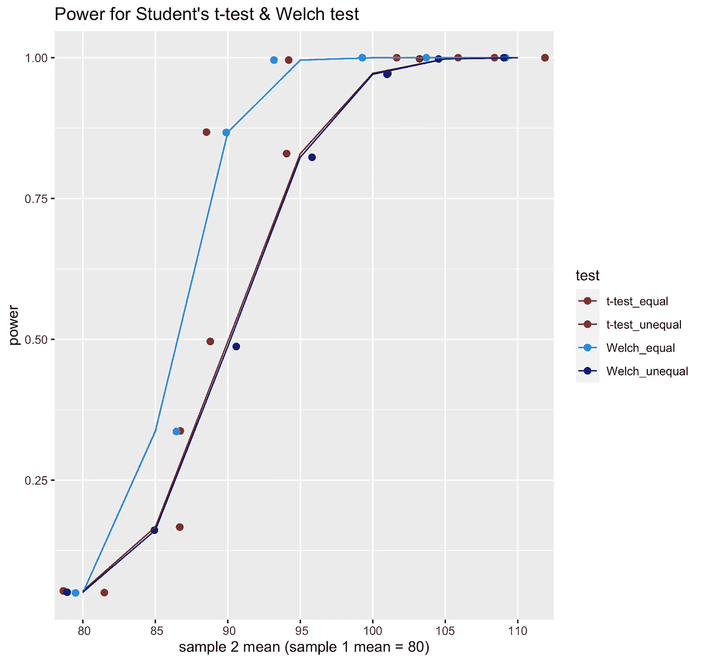

作者图片

这意味着，如果我们有两个方差不相等的样本，选择常规 t 检验或韦尔奇检验不会影响检验的功效。然而，由于我们已经看到，如果方差不相等，常规 t 检验的类型 1 误差高于韦尔奇检验，因此韦尔奇检验是优选的。但是应该记住，不相等的方差可能会导致较低的功率。(功效还取决于其他变量，如 alpha 级别、样本大小和效果大小。)

# 结论

模拟研究对于评估统计方法非常有效。在本文中，我们做了一个模拟来评估双样本 t 检验的 I 型误差和功效。模拟显示，假设两组的方差相等的学生 t 检验，在方差相等时，对于小样本量和大样本量都非常稳健。当不满足方差相等的假设时，t 检验表现不佳。

韦尔奇检验并不假设方差相等，我们可以从模拟中看出，当方差和样本大小不相等时，它比 t 检验更稳健。当方差和样本量相等时，它对小样本表现不佳。它对大样本量表现良好。

两个版本的测试给出了几乎相同的权力。从模拟中观察到的一个有趣现象是，均值差异越小，功效越低，特别是当样本大小仅为 20 时方差不相等。

如果你喜欢阅读这样的故事，并想支持我成为一名作家，可以考虑报名成为一名媒体成员。每月 5 美元，你可以无限制地阅读媒体上的故事。如果你注册使用我的链接，我会赚一小笔佣金。

 [## 通过我的推荐链接加入 Medium-Andrea gustaf sen

### 作为一个媒体会员，你的会员费的一部分会给你阅读的作家，你可以完全接触到每一个故事…

medium.com](https://medium.com/@andreagustafsen/membership)