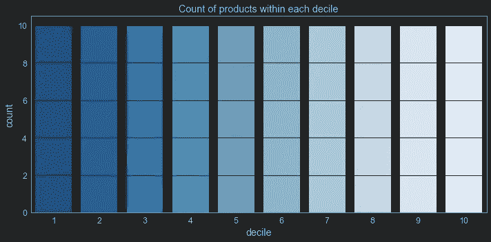
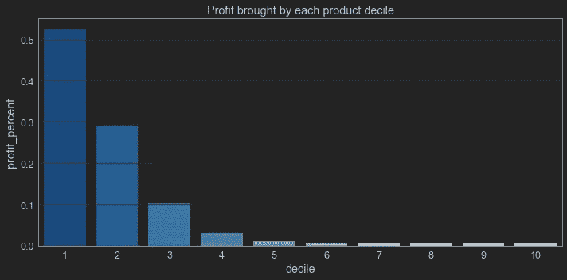
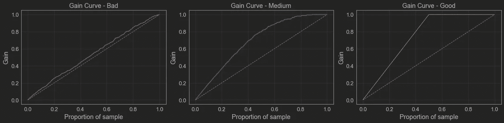
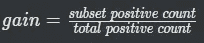
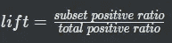
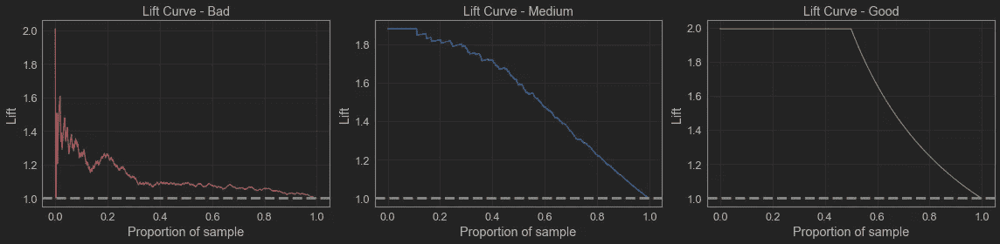

# 用提升、增益和十分位数分析评估模型的潜在回报

> 原文：<https://towardsdatascience.com/evaluating-the-potential-return-of-a-model-with-lift-gain-and-decile-analysis-319f00fde5b6>

## 使用这三个工具来理解你的机器学习模型的有用性


图片由 [Sung Jin Cho](https://unsplash.com/@mbuff) 在 Unsplash 上拍摄

在我们构建模型时，我们习惯于使用最多样化的指标来评估它们，如回归的 RMSE、R 和残差正态性，或二元分类的 BCE、F1 和 ROC AUC。

但另一个有用的技巧是测量模型的能力，以一种有用的方式对预测进行排序，为产生最大回报的情况提供更高的概率。

我们可以使用三种简单的技术进行这种评估:十分位数分析、累积收益和提升曲线。

本文中使用的所有示例都可以在我的 github 资源库中找到:

<https://github.com/vinyluis/Articles/tree/main/Decile%20Gain%20Lift>  

# 十分位数分析

十分位数分析是一个有用的工具，可以用来理解我们样本中的前十分位数与其他十分位数相比表现如何。

作为一个例子，我们可以使用十分位数分析来查看我们排名前 10%的产品产生了多少利润。为此，我们首先从利润最高到利润最低对产品进行排序，然后将它们分成 10 组，每组包含 10%的产品:

```
# Divides into deciles
product_profit = product_profit.sort_values("profit_percent", ascending = False)
product_profit["decile"] = pd.qcut(product_profit["profit_percent"], q = 10, labels = list(range(10, 0, -1)))# Plots the deciles
sns.countplot(x = "decile", data = product_profit, order = range(1, 11), palette = 'Blues_r')
```



每十分位数内的产品数。作者图片

要查看每个十分位数的利润贡献，我们可以使用一个`groupby`聚合来合计十分位数内每个产品的利润贡献:

```
# Sums the profit contribution of the products
grp_product_profit = product_profit[["profit_percent", "decile"]].groupby("decile").sum("profit_percent").reset_index()# Plots the decile x profit graph
sns.barplot(x = "decile", y = "profit_percent", data = grp_product_profit, order = range(1, 11), palette = 'Blues_r')
```



每个产品十分位数带来的利润。图片作者。

我们很容易看到，在这个场景中，20%的产品贡献了超过 80%的利润。

当然，这是一个杜撰的例子。根据你分析的主题和变量，你可能会发现不同的比例，但想法是一样的。

# 累积增益曲线

另一种观察部分公众对企业或模型结果的影响的方法是使用累积收益曲线。

在前面的例子中，我们看到前 10%的产品带来了超过 50%的利润，如果我们考虑前 20%的产品，总利润将超过 80%。等效增益曲线如下:

现在让我们把这个概念带到机器学习中。

假设您有一个二元分类模型，该模型试图预测客户是否会购买产品(1)或(0)。

我们预计，该模型会将潜在买家归类为概率值较高的买家，而其他人的概率较低。在下图中，我们比较了三种情况下的增益曲线:差的分类器、中等的分类器和好的分类器。



累积增益比较。图片作者。

用于训练模型的数据是平衡的，50%的示例具有真实类别 1，50%具有真实类别 0。

好的分类器做得非常好，它在 50%的客户群中恢复了 100%的收益。这意味着它可以很好地将买家分类为“1”，而将其他买家分类为“0”，按照概率排序，所有买家都被分配到前 5 个十分位。再看看这个情节，因为现实生活中你再也看不到了。

这是因为现实生活中的场景对于分类器学习来说不是那么明显，所以“中等”情况更类似于我们将得到的情况。在这种情况下，分类器仍然可以在 50%的公众中正确地找到 80%的买家，这对于现实生活中的应用程序来说是一个好结果。

> 累积收益曲线有助于衡量我们在接触人们方面所付出的努力，以及我们可能期望从这一行动中获得的回报，因此被称为“收益”。有了这个分类器，如果我们试图将产品卖给前 50%的公众，我们将能够找到大约 80%的真正买家。

然而，糟糕的分类器在寻找正确的人方面表现不佳。这几乎和随机选择它们一样好。顺便说一下，随机选取的“增益曲线”是灰色的虚对角线。

# 绘制增益曲线

为了计算给定比例样本的增益，我们需要计算该子集内的阳性数，并除以整个样本内的阳性总数。



因此，如果我们想找到前 25%案例的增益，我们需要计算前 25%案例中有多少个阳性案例，然后除以样本中阳性案例的总数。

给定样本的真实类别和预测概率，下面的函数绘制增益曲线。

# 升力曲线

我们也可以用另一种方法来分析:升力曲线。

为了计算给定比例的样本的提升，我们需要找到这个子集内的阳性比率，并将其除以整个样本内的阳性比率。



因此，如果我们想要找到前 25%案例的提升，我们需要找到前 25%案例中阳性案例的比率，然后除以样本中阳性案例的总比率。和以前一样，数据也需要排序。

下面的函数绘制了任何给定样品的升力:

通过使用增益示例的相同分类器，我们可以得到以下提升图:



电梯对比。图片作者。

由于数据是平衡的，全样本的总阳性率为 0.5。由于仅包含正值的任何子集的正比率都将为 1，因此该数据集可能的最高提升值为 1 / 0.5 = 2。

这就是我们在好的分类器上看到的:高达前 50%的样本将具有提升值 2，这是最大可能值。显然，随着我们添加更多超过 50%的负面案例，提升值将下降，直到子集与样本匹配，提升值将为 1。

> 另一种解释是，这个部分的阳性病例将是整个数据集的两倍，这表明分类器为阳性人群提供了更高的概率。

中度场景再次更类似于现实生活:具有更高概率的子集将具有更高的提升值，并且当我们将人添加到该子集时，提升值将对应于作为子集一部分的更多负面例子而下降。

“1”上的恒定线表示随机选择。这个想法很简单:如果我们随机选择样本的任何一个子集，这个子集的阳性率应该等于整个样本的阳性率。

这就是为什么坏场景是混乱的，几乎在任何地方都接近 1。它不能正确地对人进行排序，因此值会上下波动，当有很多数据点时，这种行为会稳定在 1 附近。

# 结论

作为数据科学家，我们需要的不仅仅是理解我们的模型。我们需要了解它们可能对业务产生的影响。

我今天展示的工具并不是解决问题的神奇工具，但它们仍然可以帮助我们做出更好的决策。

# 如果你喜欢这个帖子…

支持我一杯咖啡！

[](https://www.buymeacoffee.com/vinitrevisan)

给我买杯咖啡！

看看这个很棒的帖子

</comparing-sample-distributions-with-the-kolmogorov-smirnov-ks-test-a2292ad6fee5> 