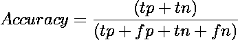
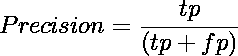
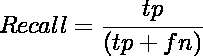
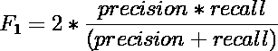
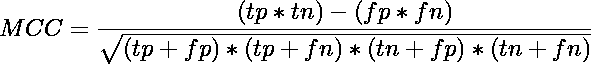
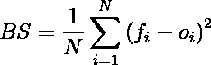

# 评估指标:离开你的舒适区，尝试 MCC 和 Brier 评分

> 原文：<https://towardsdatascience.com/evaluation-metrics-leave-your-comfort-zone-and-try-mcc-and-brier-score-86307fb1236a>

# 评估指标:离开你的舒适区，尝试 MCC 和 Brier 评分

## Matthews 相关系数和 Brier 评分简介

Eran Menashri 在 [Unsplash](https://unsplash.com?utm_source=medium&utm_medium=referral) 上拍摄的照片

[**数据科学**](https://en.wikipedia.org/wiki/Data_science) 是一个跨学科的领域，它使用科学的方法、流程、算法和系统从嘈杂、结构化和非结构化的数据中提取知识和见解，并将来自数据的知识和可操作的见解应用于广泛的应用领域。

[**机器学习**](https://en.wikipedia.org/wiki/Machine_learning) 取而代之的是对计算机算法的研究，这些算法可以通过经验和数据的使用来自动改进。它被视为人工智能的一部分。

世界各地的数据科学家应用机器学习来建立能够预测未来事件的模型，将人/物体聚类到相似的组中，并识别意外的异常。

> 每个热情的数据科学家都知道，机器学习最令人兴奋的部分是选择能够解决感兴趣的问题(有监督或无监督)的最酷的算法。然而，机器学习中的一个关键部分是模型评估，有时被危险地低估了。

尽管如此，我知道大多数数据科学家知道如何正确评估一个模型，他们总是倾向于使用相同的(众所周知的)评估指标。本文的目的是给大家介绍两个不常用的分类评价指标:*马修斯相关系数* (MCC)和*布赖尔评分* (BS)。此外，我还将尝试强调将它们纳入数据科学管道的原因。

## 模型评估

模型评估是评估机器学习模型执行特定任务(如预测某种疾病的存在与否)的能力的过程。每当你在建立一个机器学习模型的时候，在某些时候，你必须对它进行评估，以确保得到好的结果。

从技术上讲，模型评估包括将您的数据集分为训练集和测试集，使用训练集训练您的模型(*即*估计模型参数)，然后使用测试集应用一些评估指标。

当然，模型度量在无监督和有监督学习的情况下是不同的，对于有监督学习，在回归和分类问题的情况下也是不同的。然而，想法是一样的，非常简单:

> 不管你将使用什么类型的评估标准，当预测的结果尽可能接近真实的观察结果时，模型将表现良好。

由于本文的目标是向您介绍分类问题中使用的 ***MCC*** 和 ***Brier Score*** ，在下一节中，我将总结这一领域中一些最常用的评估指标。然后，我会向你解释为什么你真的应该尝试这两种方法来代替传统的方法。

## 通用评估指标

比方说，我们在训练集上训练了我们的 awesome 分类模型，我们希望评估它在给定新观察值(测试集)的情况下表现如何。在一个典型的二进制问题中，对于测试集的每个元素，你都有一个标签来说明该元素是正还是负(通常是 1 或 0)。你的机器学习模型为测试集中的每个元素提供了一个预测，表示它是*正*还是*负*。它会将每个元素分配到以下类别之一:**真阴性(TN)** ，**真阳性(TP)** ，**假阳性(FP)** ，**假阴性(FN)** 。理想情况下，模型应该最大化 TP 和 TN 的数量。在这种情况下，您的模型能够正确地将测试集中为阳性的元素分类为阳性，而不会产生假阴性，并且将测试集中实际为阴性的样本预测为阴性，而不会产生假阳性。

作为数据科学家，您知道要证明您的模型表现如何，您可以利用通用评估指标来综合您的模型在 TP、TN、FP、FN 方面的性能。当需要决定必须选择哪些指标时，大多数人会选择:

**准确率:**是正确预测(TP + TN)占被检验案例总数的比例。

精度范围在区间[0；+1]，有+1 个最佳值和 0 个最差值。

**精度:**是模型做出的正面预测总数(TP + FP)中正确正面预测(TP)的比例。

区间[0；+1]，有+1 个最佳值和 0 个最差值。

**召回:**是正确的正面预测(TP)占测试集(TP + FN)中正面样本总数的比例。

召回区间[0；+1]，有+1 个最佳值和 0 个最差值。

**F1 评分:**是精度和召回率的调和平均值。

F1 的范围在区间[0；+1]，有+1 个最佳值和 0 个最差值。

这四个指标通常一起使用，以获取模型正确预测实例的能力。 ***准确性*** 是最简单的选择，当数据集很平衡时(正面和负面的比例倾向于 50:50 或 60:40 的比例)，获得关于模型性能的第一印象很有用。 ***精度*** 当我们想要非常确定我们的预测时，是评估度量的有效选择。 ***回忆*** 当我们想要捕捉尽可能多的正面时，是一个有效的选择。 ***F1 评分*** 试图将精度和召回率合成为一个单一的度量，常用于不平衡问题。

当然，这些并不是唯一的衡量标准。其中最著名的还有:

*   **平衡精度:**一种可用于不平衡数据集的精度。
*   **加权 F1 评分:**经典 F1 评分的演变，克服了 F1 评分的主要问题:对准确率和召回率给予同等权重。
*   **对数损失:**通常用于衡量模型的置信度，因为它是基于预测的概率。

而且，数据科学家倾向于使用大量的 **ROC 曲线**及其相应的度量 **AUC。** [ROC](https://developers.google.com/machine-learning/crash-course/classification/roc-and-auc) 曲线是显示分类模型在所有分类阈值下的性能的图形。 [AUC](https://developers.google.com/machine-learning/crash-course/classification/roc-and-auc) 代表“ROC 曲线下的面积”,它测量整个 ROC 曲线下的整个二维面积(想想积分)。然而，给出 ROC 和 AUC 的完整介绍超出了本文的范围。

## 离开你的舒适区，尝试这些评估指标

做了这个初步的，但必要的介绍，让我们深入到本文的主要目标，*即*，介绍两个很少使用的评价指标: *Matthews 相关系数*和 *Brier 评分。*

**Matthews Correlation Coefficient:**它是 Pearson Correlation Coefficient 的一种特殊情况，测量真实类别与预测标签的相关性。

它的范围在区间[1，+1]内，其中–1 表示完全错误分类，+1 表示完全分类，而 MCC=0 基本上表示随机猜测。我真正邀请您在您的数据科学项目中考虑这一评估指标的主要原因是，只有当预测在所有混淆矩阵类别(TP、FP、TN、FN)中获得良好结果时，MCC 才会产生高分，与数据集中的正元素大小和负元素大小成比例。这个结果已经被 Davide Chicco 和 Giuseppe Jurman 在他们的论文中证明了。

此外，让我们考虑一个由 100 个元素组成的测试集，其中 90%的实例是阳性的(不平衡数据集)。现在，考虑这两种情况:

*场景 A* →你不知道不平衡类的概念，你建立了一个奇特的模型，它意外地预测所有元素为正。你得出了以下值:TP=90，FP=10，TN=0，FN=0。使用这些数字，准确度和精确度将等于 90%，F1 分数将为 94.74%，召回率甚至将等于 1，这些都是非常好的结果。假设 TN 和 FN 的数目等于 0，MCC 的分母也将是 0，因此其分数将是未定义的。这将是一个明确的信号，表明您的模型正朝着错误的方向发展，这个信号没有被其他指标捕捉到。

*场景 B* →你决定建立另一个模型，因为第一个模型总是预测积极的实例。现在，模型也预测负元素，你面临这样的情况:TP=80，FP=10，TN=2，FN=8。在这种情况下，准确率=82%，精度=88.88%，F1=89.89%，召回率=90.9%，MCC=0.08。即使在这种情况下，MCC 也是唯一能够捕获模型无法正确预测实例的指标。

> 要点 1:将 MCC 纳入您的评估流程！它将帮助您捕捉模型正确预测实例的真实能力。

**Brier Score:** 这是一个评估指标，用于确定预测概率得分的准确性。BS 是应用于预测概率的均方误差。

这里， *N* 是实例总数， *fᵢ* 是预测的概率， *oᵢ* 是事件在实例 *i.* 的实际结果

[Brier 得分](https://scikit-learn.org/stable/modules/generated/sklearn.metrics.brier_score_loss.html)总是取 0(最佳值)和 1(最差值)之间的值，因为这是预测概率(必须在 0 和 1 之间)和实际结果(只能取 0 和 1 的值)之间的最大可能差异。Brier Score 类似于 Log Loss，因为它使用概率来衡量模型的可信度。然而，我个人认为 Brier 评分比 Log Loss 更能提供信息，因为它的公式更容易解释，其值的范围在 0 到 1 之间，而 Log Loss 没有上限。

作为一名数据科学家，我在医疗保健和制药行业工作，部署*准确*、*可解释*并且*自信*的模型至关重要。Brier Score 是帮助我了解模型是否自信的指标。如果我们考虑两个模型，它们给出相同的精度值，甚至更好，相同的 MCC 值，我应该最依赖哪一个？一个可能的解决方案是使用 Brier Score 来查看两个模型的置信度。让我们假设在你的测试集中你只有 3 个实例(请不要这样做)，2 个正的和 1 个负的[1，1，0]。第一个模型预测关于正类的以下概率[0.6，0.55，0.4]，而第二个模型预测[0.8，0.7，0.1]。第一个模型的 BS 等于 0.34，而第二个模型的 BS 等于 0.14。即使这两个模型具有相同的准确性或 MCC 值，通过评估 Brier 评分，我们可以得出结论，第二个模型应该是首选的，因为它更有信心。简而言之，如果你知道自己在做什么，Brier Score 会奖励你(即给真实结果一个高概率)，惩罚你不知道自己在做什么(即给错误结果一个高概率)。

> 方法 2:在你的评估过程中包括 Brier 评分！它会帮助你了解模特有多自信。

最后但同样重要的是， [scikit-learn](https://scikit-learn.org/stable/modules/model_evaluation.html) 将 MCC 和 Brier 评分作为评估指标，而 [PyCaret](https://pycaret.org/compare-models/) 仅支持 MCC，尚不支持 Brier 评分。

**结论**

Matthews 相关系数和 Brier 分数是数据科学家并不总是考虑的两个重要指标。MCC 可用作众所周知的指标(准确度、F1 分数、精确度和召回率)的替代，因为(a)它在不平衡数据的情况下更可靠，以及(b)只有当预测在所有混淆矩阵类别(TP、FP、TN、FN)中获得良好结果时，它才给出高分。相反，如果您想衡量模型对您的预测有多有信心，BS 应该是一个选项。由于 BS 的取值范围和公式，它比更著名的测井曲线损失更容易解释。

我真的希望你喜欢这篇文章，这是我的第一篇。让我们乐观地说，这是一个长系列的第一个。欢迎发表任何评论，甚至在 [LinkedIn](https://www.linkedin.com/in/federicocomotto/) 上加我。另外，如果你想看我的下一篇文章，别忘了关注我。