# 用于发现风力涡轮机邻居的聚类方法的评估

> 原文：<https://towardsdatascience.com/evaluation-of-clustering-methods-for-discovering-wind-turbine-neighbors-27849dea14a2>

## 数据科学技术在可再生能源数据分析中的应用

艾比·阿纳迪在 [Unsplash](https://unsplash.com?utm_source=medium&utm_medium=referral) 上拍摄的照片

**简介**

在本文中，我们将采用流行的聚类算法来发现风力发电场的涡轮机“邻居”。这里的术语“邻居”表示一组基于地理位置、风速、功率输出或其他环境和机械变量具有相似特征的涡轮机。

在题为“运行中的风力涡轮机的基于聚类的数据预处理”的前一篇文章中，我们详细介绍了在风力涡轮机数据预处理期间输入缺失值的基于聚类的方法。我们在该分析中仅使用了 KMeans 算法，这里的重点是评估用于此目的的其他可用算法。

 [## 基于聚类的运行风力发电机数据预处理

### 创建资产组的有效数据科学方法

towardsdatascience.com](/clustering-based-data-preprocessing-for-operational-wind-turbines-268e231d90a) 

在选择对涡轮机进行分组的“最佳”模型时，我们特别寻找能够创建最佳数量的聚类的模型，这些聚类的统计数据能够对缺失的风速值做出最佳预测。

我们使用均方根误差(RMSE)和平均绝对误差(MAE)来评估缺失的风速预测。此外，我们将使用平均绝对百分比误差(MAPE)来评估非零缺失值。

应当注意的是，如果在期望的时间戳没有集群中的涡轮机的可用数据，或者如果一些集群由太少的涡轮机组成，则基于集群的方法可能不会填充所有缺失的值。因此，我们还将报告由算法填充的缺失值的百分比。

> 有效地将风电场中的涡轮机分组可以减少数据分析所需的人力和计算工作量。

**数据**

我们在 [Kaggle](https://www.kaggle.com/datasets/lxtann/kdd-cup-2022-baidu-wind-turbine-power) 上使用公开可用的龙源风力涡轮机数据，必要时使用[引文](#e5d7)。数据在此公开发布[。这是 134 台涡轮机 245 天的运行数据集，分辨率为 10 分钟。还提供了涡轮机位置数据。数据集的标题如下所示:](https://aistudio.baidu.com/aistudio/competition/detail/152/0/introduction)

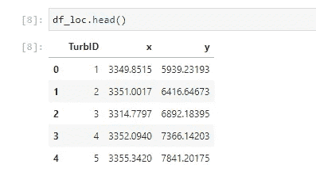

作者图片

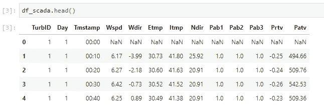

作者图片

**数据准备**

我们首先执行数据清理和过滤，以提取代表涡轮机正常运行条件的数据点。原始和过滤后的运行数据如下所示:

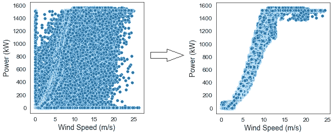

作者图片

此外，我们从清理后的数据中创建一个测试集来评估算法。测试数据包含 19940 行，占清理数据的 1.05%。

训练数据被进一步转换成类似数据透视表的结构，其中涡轮机 ID 作为行索引，时间戳作为列索引，风速作为值。

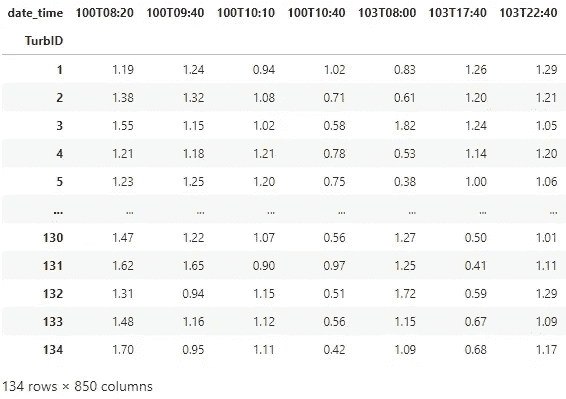

作者图片

为了结束数据准备步骤，在将数据传递到聚类算法之前，我们使用 Scikit-learn 中的[标准定标器模块对转换后的数据进行定标。](https://scikit-learn.org/stable/modules/generated/sklearn.preprocessing.StandardScaler.html)

**集群建模**

我们使用 KMeans、凝聚聚类(AGC)、高斯混合模型(GMM)和相似性传播(AP)算法基于风速创建涡轮机聚类，其中给定时间戳的聚类平均值用于预测(填充)该时间戳的缺失值。

此外，使用轮廓度量来选择重要的超参数，例如簇的数量和阻尼因子(在 AP 的情况下)。轮廓度量用于评估由聚类算法创建的聚类的质量，因此可以用于选择超参数。

[k 均值聚类 ](https://scikit-learn.org/stable/modules/clustering.html#k-means)

这是最流行的聚类方法。它通过最小化类内距离平方和同时最大化类间距离平方和来创建类。它需要选择簇的数量作为超参数。

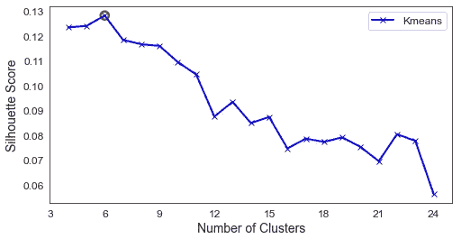

作者图片

从上图可以看出，该模型的最佳聚类数是 **6。**接下来，我们使用这个超参数来拟合模型。

[*凝聚聚类(AGC):*](https://scikit-learn.org/stable/modules/clustering.html#hierarchical-clustering)

这是一种层次聚类算法，使用链接距离递归合并一对样本数据聚类，使得同一聚类中的数据点更相似，而不同聚类中的数据点不相似。在 k 均值的情况下，需要选择最佳的聚类数。

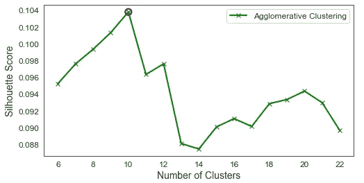

作者图片

对于这个模型，最佳的聚类数是 **10** ，我们使用这个超参数来拟合这个模型。

[*高斯混合模型(GMM):*](https://scikit-learn.org/stable/modules/mixture.html)

这是一个概率模型，它从训练数据中学习有限数量的高斯分布的混合，并采用[期望最大化](https://scikit-learn.org/stable/modules/mixture.html#expectation-maximization) (EM)算法来拟合高斯模型。在这种情况下，我们使用 KMeans 来初始化模型组件，并使用剪影度量来选择最佳的聚类数。

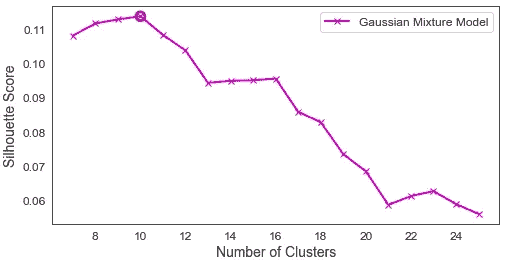

作者图片

GMM 算法的最佳聚类数是 **10。**

[*亲和传播(AP):*](https://scikit-learn.org/stable/modules/clustering.html#affinity-propagation)

该算法通过在数据点对之间交换消息来创建聚类，以确定每个点对另一个点的吸引力，并且该过程迭代执行，直到实现收敛。尽管阻尼因子和偏好是该算法的关键超参数，但我们仅调整阻尼因子。

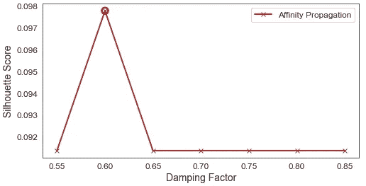

作者图片

最佳阻尼因子是 **0.6** ，这导致了 **13** 簇的产生。

**结果**

使用每个算法的最佳超参数，我们将被认为是风速邻居的涡轮机分组。结果如下所示:

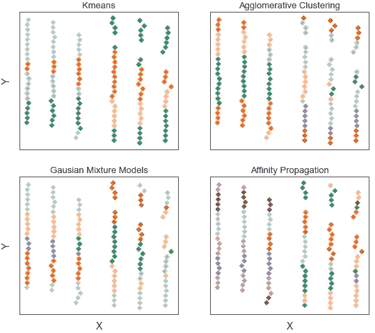

作者图片

在所研究的所有模型中，结果显示沿 X 轴两边的涡轮机比那些在地理上更接近但在其他涡轮机之间的涡轮机更可能是邻居。类似地，基于风速，靠近 X 轴中间的涡轮机更可能是邻居。

然而，这些模型在如何划分中间排涡轮机方面有所不同，这直接影响了所得集群的代表性，从而影响了集群准确预测成员涡轮机缺失值的能力。

与公园中间的涡轮机相比，边缘的涡轮机可能会遇到相似的最小风速障碍，因此获得的结果非常直观。

**模型评估**

基于测试数据，我们评估了每个聚类模型在根据聚类平均值预测给定时间戳的缺失风速值方面的性能。

此外，集群中的涡轮机数量越少，该集群填补因数据不足而导致的缺失值的能力就越低。因此，使用大量分类的分类模型可能会填充较少数量的缺失值。下表显示了结果汇总:

接下来，我们可视化模型的性能。

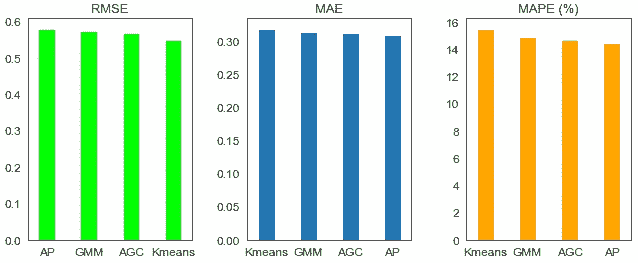

作者图片

相似性传播模型在 MAE 和 MAPE 方面给出了最好的性能，而 KMeans 模型在 RMSE 方面给出了最小的误差。一般来说，所有考虑的算法的性能是可比的，并且可以被组合以填充更多的缺失值。

> 由于误差的初始平方，与其他度量相比，RMSE 度量对异常值更敏感，并且对大偏差应用更高的惩罚。然而，MAE 和 MAPE 是模型性能的更直观的度量。

下面显示的预测缺失值示例显示了模型和地面真实情况之间非常好的一致性。

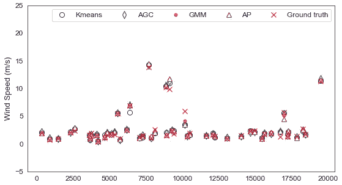

作者图片

现在，我们将插补误差可视化。

作者图片

所有算法的插补误差都表现良好，并且围绕零误差位置对称。

Jupyter 实验室笔记本包含了本文中使用的所有 Python 代码，可以在这里找到。

**结论**

我们探索了四种不同的聚类算法来创建涡轮机组。这些涡轮机组如果被优化创建，可以提供关于成员涡轮机的有用信息，这些信息可以用于在数据预处理期间填充缺失值。

Kmeans 模型非常直观，可以填充大部分缺失的值。然而，基于 MAE 和 MAPE，诸如相似性传播方法的其他方法给出了更好的性能。因此，可以将这些算法的结果结合起来，以获得更大的好处。

我希望你喜欢阅读这篇文章，直到下次。干杯！

什么更有趣？你可以通过下面我的推荐链接订阅 Medium 来获得更多我和其他作者的启发性文章，这也支持我的写作。

 [## 通过我的推荐链接加入媒体

### 阅读 Abiodun Olaoye(以及媒体上成千上万的其他作家)的每一个故事。您的会员费直接支持…

aolaoye.medium.com](https://aolaoye.medium.com/membership) 

*不要忘了查看在可再生能源领域应用最新数据科学原理的其他故事。*

**参考文献**

周军，陆，徐，肖，苏，吕军军，马，窦，(2022)。SD wpf:2022 年 KDD 杯空间动态风力预测挑战数据集。 *arXiv* 。[https://doi.org/10.48550/arXiv.2208.04360](https://doi.org/10.48550/arXiv.2208.04360)

[运行风力发电机组基于聚类的数据预处理](/clustering-based-data-preprocessing-for-operational-wind-turbines-268e231d90a)

[风能分析工具箱:迭代功率曲线滤波器](https://medium.com/towards-data-science/wind-energy-analytics-toolbox-iterative-power-curve-filter-fec258fdb997?source=user_profile---------3----------------------------)