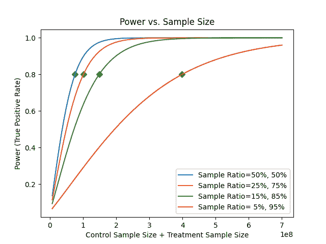
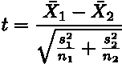
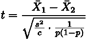

# 平均分割增加了 A/B 测试的能力

> 原文：<https://towardsdatascience.com/even-split-increases-power-of-a-b-tests-7cc2b8cb182a>

## 您的实验在平均分割的情况下更快达到统计显著性

班农·莫里西在 [Unsplash](https://unsplash.com?utm_source=medium&utm_medium=referral) 拍摄的照片

当我将更多流量分配给处理桶时，实验是否会更快完成？我应该通过分配更少的用户到治疗桶来最小化风险吗？这些是数据科学家问的常见问题。这篇博文分享了我们关于设置实验样本比率以更快达到统计显著性的研究。

# 你的实验有一个更高的平均分配能力

一般的建议是以平均分配的方式运行实验——50%的用户在对照组，50%的用户在治疗组。因为平均分割导致最佳的方差减少，并因此导致最高的统计功效。换句话说，当实验变量(例如，对照、处理)大小相等时，实验更快达到统计显著性。

**不同采样率之间的功率比较**

我们针对四种不同的样本比例绘制了关于总样本量(对照样本量+治疗样本量)的功效函数:5%对照用户和 95%治疗用户，15%对照用户和 85%治疗用户，25%对照用户和 75%治疗用户，甚至分裂(50%对照用户和 50%治疗用户)。对于每个分割设置，我们计算不同总样本量的 [t 检验](https://en.wikipedia.org/wiki/Welch%27s_t-test)的功效。我们用 t 检验来说明，因为它是 A/B 检验中最广泛使用的假设检验。

图中的每条曲线描绘了功率如何随着总样本量的增加而增加。我们通过改变采样比率生成了四条曲线。所有其他配置都是相同的——总样本量、两组平均值之间的差异、标准偏差和所需的假阳性率。

图 1 说明了在平均分配的情况下， [t-test](https://en.wikipedia.org/wiki/Welch%27s_t-test) 的功率最快达到所需的[统计功率](https://en.wikipedia.org/wiki/Power_of_a_test) (80%的功率由绿色钻石引爆)。换句话说，为了达到期望的功效，事件分裂与备选分裂相比需要最小的样本量。

图一。具有均匀分割的 t 检验以最小的样本量达到期望的功效

重现剧情的代码。

**由于最佳方差减少，平均分割具有最高功效**

以 t 检验为例，其中检验统计量的分子是桶 1(如处理)的样本均值和桶 2(如对照)的样本均值之差，这是对效应大小δ的估计——两个总体均值之差。在分母中，s 和 n 分别表示标准差和样本量。

给定相同的要素影响(δ)，较小的分母会产生较大的正 t 统计量或较小的负 t 统计量，从而产生较小的 p 值。t 统计量的分母对应于δ的标准误差的估计值。假设第一桶(s₁)的标准偏差与第二桶(s₂)的标准偏差相似，这在实践中通常是正确的，我们如何将总用户(n₁+n₂)分配到两个实验组(对照组和治疗组)会显著影响分母的值。

在假设方差相等的情况下，t 统计简化为

其中，在分母中，s 表示控制或处理桶的标准偏差，c 是用户总数，p 是分配给处理桶的用户总数的比例。用户分配仅通过 p 影响 t 统计量，当 p 等于 0.5 时，p(1-p)最大。

例如，当 1%和 99%的用户分别位于桶 1 和桶 2 中时，t 统计的分母比均匀分割时的分母大五倍以上。因此，相同的实验在平均流量分配的情况下会更快达到统计显著性。

# 不平等分配的神话被揭穿

**误区 1** :我需要保持低治疗桶(例如 5%)。因为我不确定该功能的影响，也不想让太多用户接触一个有风险的功能。

假设你担心新特性的负面影响。在这种情况下，更好的做法是设置一个较低的暴露率(符合实验条件的用户总数的百分比)，同时仍然平均分配流量(50%治疗，50%控制)。一旦你从早期实验读数中确认特征风险，增加暴露率。当分配给一小群用户一个糟糕的体验时，要花更多的时间来完成实验。这些用户更有可能因为长期暴露在负面体验中而流失。

**误区二**:我需要快速完成实验，所以我必须保持治疗桶在一个高百分比(比如 95%)。

为了测试治疗是否与对照组有统计学差异，我们需要测量对照组和治疗组的目标度量的方差。图 1 表明，如果我们分配给控制或处理桶的流量太少，将需要更长的时间才能达到统计显著性。

# 何时运行分配不均的 A/B 测试

根据业务需求，有不平等分配的 A/B 测试。一个典型的例子是，我们需要尽快推出一个特性，而不管这个特性对业务度量的影响。这些特性通常是战略赌注、政策变化，或者那些无疑会让我们的用户受益的特性，即使可能会影响财务指标。在这些情况下，A/B 测试更像是研究特性影响的维持实验，而不是决策工具。

# 结论

Wish 的实验团队做出了大量努力，将我们的实验平台提升到一个新的水平。虽然严谨的平台奠定了基础，但良好的实验设计对于实现 A/B 测试的力量至关重要。均匀分割是一种简单而有效的改进，可以提高实验的统计功效。

# 感谢

我们非常感谢 Pai Liu 的支持以及 Pavel Kochetkov、Lance Deng、和 Delia Mitchell 的反馈。