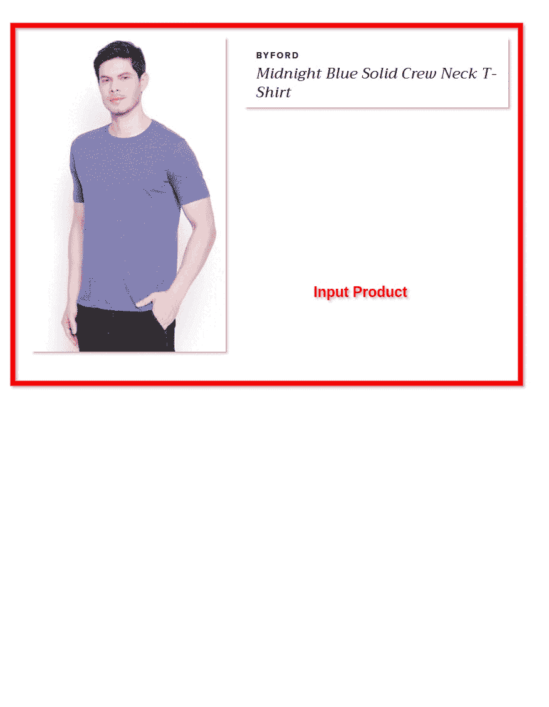
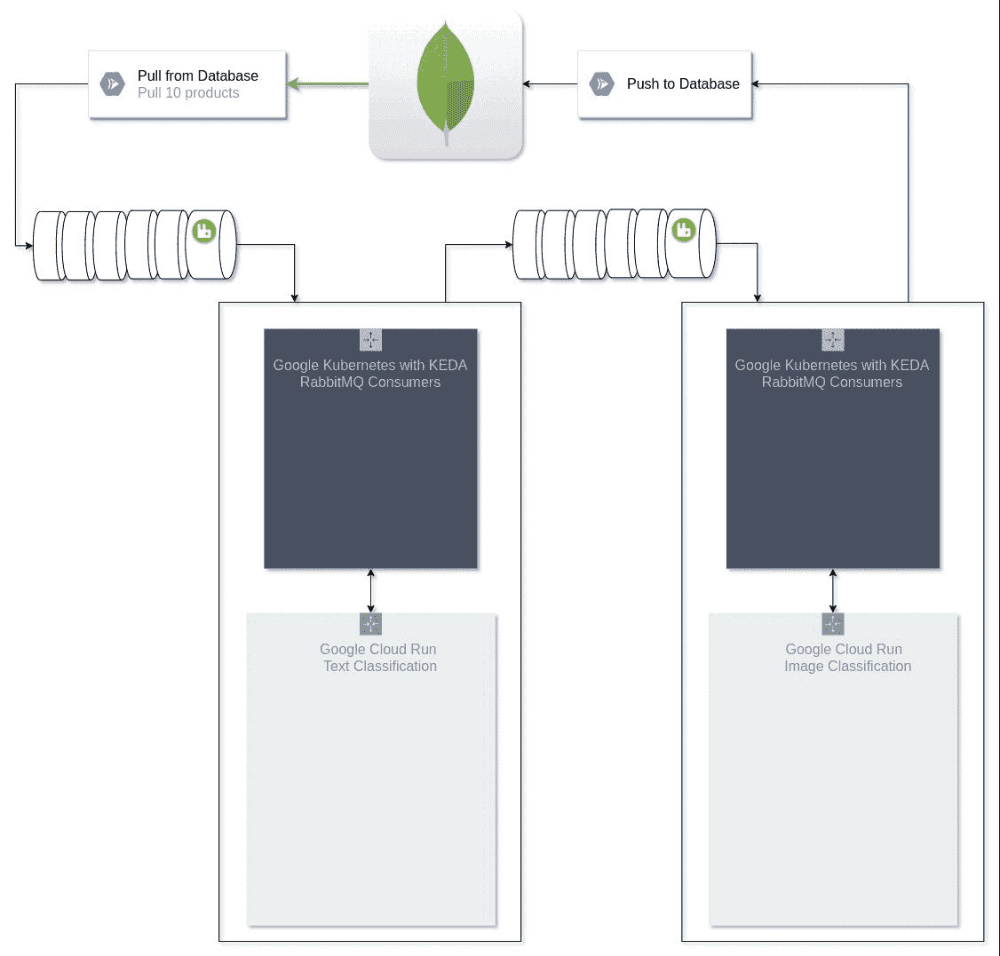
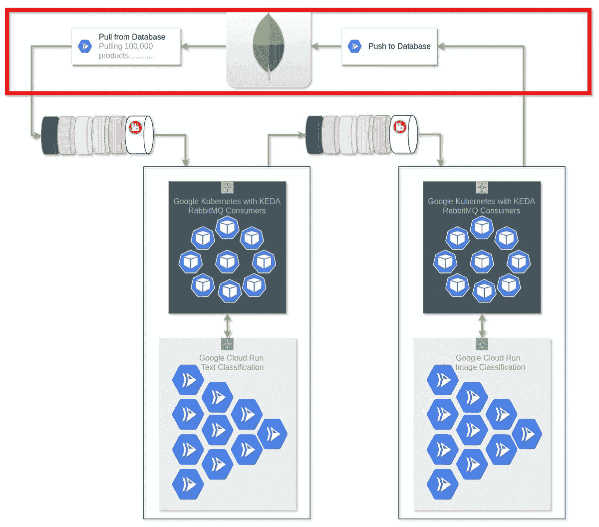
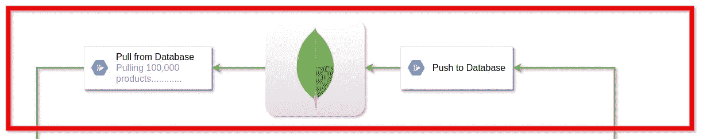
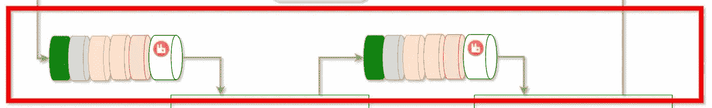
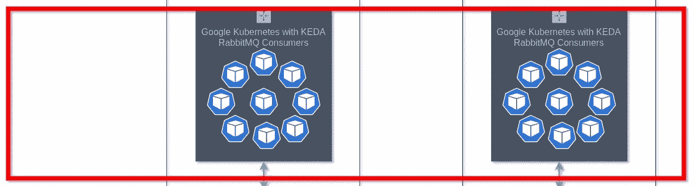
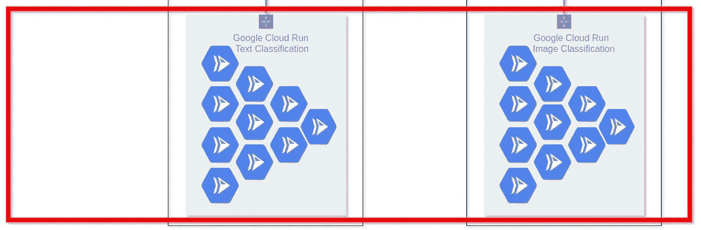

# 数据处理流水线中事件驱动的可伸缩性

> 原文：<https://towardsdatascience.com/event-driven-scalability-in-data-processing-pipeline-aa4417d7950a>

## 基于要处理的数据量，基础架构和成本方面的架构主干可自动扩展

爱德华·豪厄尔在 [Unsplash](https://unsplash.com/?utm_source=unsplash&utm_medium=referral&utm_content=creditCopyText) 上拍摄的照片

构建数据处理管道是最常见的问题陈述之一，为此，您可能已经编写了一些小脚本，或者基于数据的数量和频率构建了一个成熟的可伸缩系统。在本文中，我们将讨论事件驱动的可伸缩性的思想，它是成本优化的主干，只需要最少的开发和操作。

**为什么要建立一个事件驱动的、可伸缩的数据处理管道？**

当与初创公司合作或建立一个团队项目或个人项目时，需要一个数据处理管道，总会有成本的限制。有两种方法可以解决这个问题:

*   在项目开始时编写一个脚本或构建一个小规模的系统，当需求增加时重新构建一个大规模的系统。
*   构建一个事件驱动的可扩展系统，这意味着在不使用时，零成本，在使用时，成本将与使用量成比例，即使有很高的规模要求，也将很容易处理。

**问题陈述示例:**

*   用于训练深度学习模型的数据创建和预处理管道。
*   从输入的原始数据中提取元数据。
*   抓取数据并提取元数据。等等。

我们将使用一个简单的例子来构建电子商务产品的元数据提取系统。然后，元数据用于提供由 [**Streamoid**](https://www.streamoid.com/) 提供的电子商务解决方案。问题陈述是客户将提供他们的数据。为了让内部服务工作，需要提取元数据。为了便于理解，内部系统需要标准数据才能运行，而从客户端接收的数据是原始的，可能不符合标准。因此，这需要一个数据处理管道来将原始数据转换为内部系统能够很好理解的标准元数据。

该元数据将被组织中的各种系统使用，以构建若干产品，例如(类似和 outfitter 推荐)，提供市场等效数据(Amazon、Myntra、Tatacliq 等)。)，训练多个分类器，理解趋势和行为。

让我们看一个电子商务产品元数据提取的例子:

电子商务产品的元数据提取(图片由作者提供)

看起来简单？是的，任务很简单:

*   对产品的标题和描述进行文本分类。
*   对图像进行图像分类并输出文本分类。
*   还有更多的步骤，如改变背景，丰富，元数据转换到其他市场，如亚马逊等。但是为了方便起见，让我们假设只有 2 个步骤文本和图像分类。

当我们将这个数据处理管道与一个业务用例相结合时，挑战就来了:

*   **基于优先级的处理**。企业客户端优先级最高，然后是使用免费层的客户端，之后是用于内部评估、演示和培训目的的数据。
*   **成本优化**，有些日子要加工的产品数量会高达 500，000，而有些日子会少于 1，000。可扩展系统的成本应该与给定日期处理的产品数量成正比。
*   **有限的资源**使用量。深度学习分类器需要大量计算，并且不能无限扩展。因此，根据优先级优化和充分利用这些资源。

在我们继续之前，让我们看一下架构主干的 GIF，我们将在本文中讨论它。这是数据处理管道中的两个过程(文本和图像分类)。

下图显示了两次迭代，一次是在处理 10 个产品时，另一次是在处理 100，000 个产品时。

数据处理系统的事件驱动缩放(图片由作者提供)

在该架构中，我们使用了:

*   MongoDB 作为数据库(所有服务使用的生产数据库)
*   RabbitMQ 作为消息代理
*   谷歌 Kubernetes 与 KEDA 的 RabbitMQ 消费者规模
*   面向繁重计算分类器和自动缩放的 Google Cloud 运行

该图可分为 4 个主要部分。让我们详细讨论每个组件。

作者图片

**MongoDB**

MongoDB(作者图片)

使用非 SQL 共享数据库来处理大量读写操作的可伸缩性。正如您所看到的，这里的数据库就像一个插件，如果需要对单独或多个数据库进行读写操作，可以很容易地插入 Push 和 Pull 服务，这些服务也部署在 Cloud Run 上。

**RabbitMQ**

RabbitMQ(作者图片)

开源消息代理。还有其他消息代理，比如 Kafka，或者云绑定的消息代理，比如 pub-sub 等等。但是选择 rabbitmq 的原因是:

*   从设计上支持**优先级队列**，这是该流水线的重要需求之一。对于其他消息代理，优先级可以通过分桶来支持，这意味着为具有不同优先级的同一流程维护 3 个队列，优先级需求将由使用者来处理。
*   这是一个基于**推送的**系统，这意味着与消费者没有竞争条件。它以循环方式根据优先级将消息分配给所有连接的使用者，并在将消息弹出队列之前等待，直到收到成功处理消息的确认。
*   广播或通知在这里不是一个要求，卡夫卡或 pub-sub 会是更好的选择。

也可以使用其他消息代理。消息代理的选择取决于用例。

**用 KEDA 搜索 Kubernetes】**

GKE(自动驾驶仪)和 KEDA(图片由作者提供)

这里用的是 Google Kubernetes 集群。这里，我们使用了一个自动驾驶集群，这意味着不需要为集群分配节点来进行自动伸缩。资源扩展由集群本身管理，它将创建和删除新的 pod。

我们使用了 KEDA (Kubernetes 事件驱动伸缩)。这么做的原因是 rabbitmq。如果需要在内存/CPU 使用率或 HTTP 点击量上进行伸缩，那么伸缩是很容易的。但是这里需要根据队列中的消息数量进行伸缩。此外，rabbitmq 不会发送调用，它会向已经连接的消费者发送消息。为了应对这一挑战，我们使用了 KEDA，它将跟踪队列中的消息数量，并相应地在谷歌自动驾驶集群中产生新的 pod(rabbit MQ 消费者)。

**谷歌云运行**

谷歌云运行(图片由作者提供)

这里使用云运行来处理所有繁重的计算，如分类器。这可以缩小到 0，并根据 HTTP 调用进行缩放。在任何管道中，主要成本来自于租用服务器进行繁重的计算处理，以及在没有使用服务器的情况下保持服务器运行。有了 Cloud Run，您可以将繁重的计算服务部署为容器化的解决方案，但只需在使用时付费。部署后，不需要进行任何操作。在这里，我们可以使用 Amazon 弹性容器服务(ECS ),它可以与云运行相媲美，或者如果有 GPU 需求，我们可以在 GPU 节点上构建我们的服务。基本上，这取决于服务计算要求。我们根据需求使用所有三个 GCR、ECS 和 GPU 节点。

我还想提一下，Cloud Run 可能是所有云扩展解决方案中最好的云解决方案。主要原因是它具有所有的功能，并且对开发人员友好，只需部署两行代码。

此外，这种设计的局限性在于扩展繁重的计算资源。

**为什么要建立这种架构？**

*   它是一个**事件驱动的系统**，因此当有一个事件发生时，就会产生伸缩和成本，该事件是要处理的新数据的可用性、数据的更新或请求重新处理数据。
*   所有组件就像一个**插件**。我们可以改变数据库，或者使用多个数据库。如果需求要求，我们可以更改消息代理。我们可以改变谷歌云运行或使用多种缩放服务。该设计消耗的只是一个用于繁重计算服务的 HTTP URL。
*   在管道中添加一个**新流程**非常容易。添加新流程时，无需在系统的任何其他部分花费时间。所需的工作是添加消费者，因为消费者可能是特定于流程的。
*   相同的管道/系统可以被其他服务用于一组完全不同的任务。这意味着，如果我们设置一次这个管道，它可以被广泛用于不同的数据处理需求。
*   一旦部署，实际上需要**零操作**和**最小开发**。

这个架构代表了事件驱动伸缩的主干和思想。实际的系统要比这复杂得多。

要理解上面提到的技术:

*   [**MongoDB**](https://www.mongodb.com/)
*   [**rabbit MQ**](https://www.rabbitmq.com/):[Google 云平台上的集群部署](https://cloudplatform.googleblog.com/2014/06/rabbitmq-on-google-compute-engine.html)
*   [**拉比泰姆** vs **卡夫卡**](https://www.simplilearn.com/kafka-vs-rabbitmq-article)
*   谷歌 [**云运行**](https://cloud.google.com/run)
*   亚马逊 [**弹性容器服务**](https://aws.amazon.com/ecs/) 与 Fargate
*   [**云运行** v/s **弹性容器服务**](https://lonare.medium.com/comparison-google-cloud-run-gcr-vs-azure-container-instances-aci-vs-aws-ecs-with-fargate-d419bc56cf90)
*   谷歌 [**自动驾驶集群**](https://cloud.google.com/kubernetes-engine/docs/concepts/autopilot-overview)
*   [**KEDA**](https://keda.sh/):Kubernetes 事件驱动自动缩放
*   [**自动缩放**](https://medium.com/geekculture/understanding-kubernetes-hpa-with-keda-and-rabbitmq-4bf87216606b#:~:text=KEDA%20RabbitMQ%20Auto%2DScaler&text=To%20achieve%20this%2C%20KEDA%20has,%E2%80%9CHPAQueue%E2%80%9D%20for%20any%20messages.) 与 **KEDA** 用于 **RabbitMQ** 上**谷歌自动驾驶集群**

选择技术取决于解决方案。技术上稍加改变的相同架构可以满足不同类型的需求。所以最好是分析所有的技术，然后选择一个。

决策点示例:

*   使用哪个云提供商，或者我们应该在本地部署？
*   使用哪个数据库？
*   使用哪个队列/消息代理？等等。

对于技术方面的决策点，我总是参考 [**CNCF** 风景](https://landscape.cncf.io/)来查看所有可用的选项，并根据我的要求进行分析。

<https://landscape.cncf.io/>  

让我知道你对此的想法。