# 因果推理的事件研究:该做什么和不该做什么

> 原文：<https://towardsdatascience.com/event-studies-for-causal-inference-the-dos-and-donts-863f29ca7b65>

## 避免事件研究常见陷阱的指南


里卡多·戈麦斯·安吉尔在 [Unsplash](https://unsplash.com/photos/GsZLXA4JPcM?utm_source=unsplash&utm_medium=referral&utm_content=creditCopyText) 上的照片

事件研究是因果推理的有用工具。它们被用于**准实验场景**。在这些情况下，治疗不是随机分配的。因此，与随机实验(即 A/B 测试)相比，人们不能依靠简单的组间均值比较来做出**因果推断。在这种情况下，事件研究非常有用。**

事件研究也经常被用于观察治疗组和非治疗组之间是否存在任何治疗前差异，作为预测试平行趋势的一种方法，这是一种被称为差异中的差异(DiD)的流行因果推断方法的关键假设。

**然而，最近的文献显示了事件研究中的各种缺陷。如果被忽略，当使用事件研究进行因果推断或作为平行趋势的预测试时，这些陷阱会产生重大后果。**

在本文中，我将讨论这些陷阱以及如何避免它们的建议。我将把重点放在面板数据的应用上，在面板数据中，我观察单位随时间的变化。我将用一个玩具例子来说明陷阱和建议。[你可以在这里找到用于模拟和分析数据的完整代码](https://gist.github.com/nazlialagoz/a6fe4131b69edb9c8f0593984b88a17b)。在本文中，我将代码的使用限制在最关键的部分，以避免混乱。

## 一个例证

事件研究通常用于调查某个事件(如某个国家的新法规)的影响。此类事件的最近一个例子是由于疫情而实施的封锁。在停工事件中，许多企业受到影响，因为人们开始花更多的时间在家里。例如，音乐流媒体平台可能想知道人们的音乐消费模式是否因锁定而发生了变化，以便他们能够应对这些变化，更好地服务于他们的客户。

为该平台工作的研究人员可以调查锁定后音乐消费的数量是否发生了变化。研究人员可以使用从未实施封锁或后来实施封锁的国家作为控制组。在这种情况下，事件研究是合适的。对于本文，假设实施封锁的国家/地区会一直持续到我们的观察期结束，并且封锁的实施是二元的(即，忽略封锁的严格程度会有所不同)。

## 事件研究规范

我将重点介绍以下形式的事件研究:


事件研究规范，图片由作者提供(公式修改自:[brant ly Callaway 和 Pedro H.C. Sant'Anna 使用 did 包](https://bcallaway11.github.io/did/articles/pre-testing.html)在 DiD 设置中进行预测试)。

*Y* ᵢₜ是利益的产物。αᵢ是单位固定效应，它控制时间常数单位特性。γₜ是时间固定效应，它控制时间趋势或季节性。 *l* 是相对于治疗的时间，它表示在给定时间 *t* 从治疗开始已经过了多少周期。例如， *l* = -1 表示治疗前一个周期， *l* = 2 表示治疗后两个周期。D *ˡᵢₜ* 是相对时间段 *l* 在时间 *t* 对于单元 *i.* 基本上，我们包括治疗的超前和滞后。ϵᵢₜ是随机误差。

感兴趣系数β *ₗ* 表示给定相对时间段内的平均治疗效果 *l* 。在观察期内，有 T 个周期，因此，周期范围从 0 到 T-1。这些单位在不同时期接受治疗。同时接受治疗的每组单位组成一个治疗群组。这种类型的事件研究是一种差异中的差异(DiD)设计，其中单位在不同的时间点接受治疗(Borusyak 等人，2021 年)

***例证续:***

根据我们的说明性示例，我模拟了一个面板数据集。在此数据集中，有 10，000 个客户(或单位)和 5 个期间(从期间 0 到 4)。我分别对这些单位和时期的单位固定效应和时间固定效应进行随机抽样。总的来说，我们有 50，000 次(10，000 个单位 x 5 个周期)客户周期级别的观察。感兴趣的结果是以小时计量的音乐消费。

我随机将客户分配到 3 个不同的国家。其中一个国家在第二阶段实施了封锁，另一个国家在第三阶段实施了封锁，还有一个国家从未实施封锁。因此，来自这些不同国家的顾客在不同的时间受到不同的对待。为了便于理解，**我将根据客户接受治疗的时间，按照他们的治疗群组**来指代客户:*群组第 2 期*和*群组第 3 期*分别针对在第 2 期和第 3 期接受治疗的客户*。*其中一个群组从未接受治疗，因此，为了便于编码，我将其称为*群组周期 99* 。

在模拟中，在这些客户被随机分配到这些群组之一后，我创建了治疗虚拟变量`treat`，如果`cohort_period >= period`等于 1，否则等于 0。`treat`表示一个单位在给定的时间段内是否被处理。接下来，我创建一个在每个治疗期间增长的**动态治疗效果**(例如，治疗发生期间的 1 小时和之后期间的 2 小时)。治疗前的治疗效果为零。

**我将感兴趣的结果** `hrs_listened`计算为我随机选择的常数(80)、单位和时间固定效应、治疗效应以及每个单位和周期的误差(随机噪声)的总和。**通过构建，处理(锁定)对音乐消费有着越来越大的积极影响**。

为了避免混乱，我跳过了一些代码的设置和模拟部分，但是你可以在这里找到完整的代码。

在下图中，我展示了数据的快照。`unit`指的是客户，`cohort_period`指的是某个单位被处理的时候。`hrs_listened`是因变量，它以小时为单位衡量给定客户在给定时间段内的音乐消费。

```
rm(list = ls())
library(data.table)
library(fastDummies)
library(tidyverse)
library(ggthemes)
library(fixest)
library(kableExtra)

data <- make_data(...)

kable(head(data[, ..select_cols]), 'simple')
```

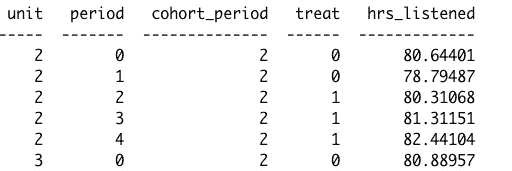

模拟数据快照，图片由作者提供。

在下图中，我展示了按群组和时间段划分的平均音乐收听趋势。我还记录了这些国家首次实施封锁的时间。你可以看到，与未治疗组的客户相比，早期和晚期治疗国家的锁定似乎有积极的影响。

```
 # Graph average music listening by cohort and period
  avg_dv_period <- data[, .(mean_hrs_listened = mean(hrs_listened)), by = c('cohort_period','period')]
  ggplot(avg_dv_period, aes(fill=factor(cohort_period), y=mean_hrs_listened, x=period)) + 
    geom_bar(position="dodge", stat="identity") +  coord_cartesian(ylim=c(79,85))+
    labs(x = "Period", y = "Hours", title = 'Average music listening (hours)', 
         caption = 'Cohort 2 is the early treated, cohort 3 is the late treated and cohort 99 is the never treated group.') + 
    theme(legend.position = 'bottom',
          axis.title = element_text(size = 14),
          axis.text = element_text(size = 12)) + scale_fill_manual(values=cbPalette) +
    geom_vline(xintercept = 1.5, color = '#999999', lty = 5)+
    geom_vline(xintercept = 2.5, color = '#E69F00', lty = 5) + 
    geom_text(label = 'Cohort period 2 is treated',aes(1.4,83), color = '#999999', angle = 90)+
    geom_text(label = 'Cohort period 3 is treated',aes(2.4,83), color = '#E69F00', angle = 90) +
    guides(fill=guide_legend(title="Treatment cohort period"))
```

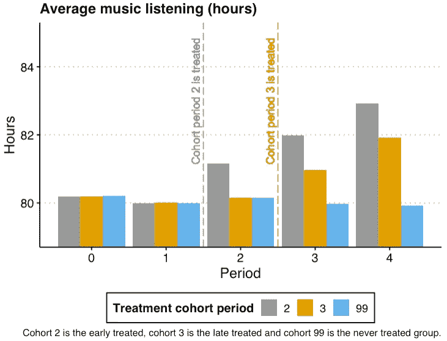

按群组和时间段划分的平均音乐收听率，按作者划分的图像。

由于这个数据集是模拟的，我知道每个队列和每个时期锁定的真实治疗效果。在下图中，我展示了封锁的真实治疗效果。

在治疗后的第一阶段(相对阶段 1)，两个组的听力都增加了 1 小时。在相对于治疗的第二阶段，两个组的治疗效果都是 2 小时。对于相对周期 3，我们看到处理效果是 3 小时。

这里需要注意的一点是，在相对时间段内，治疗效果在各群组中是同质的(例如，在相对时间段 1 中为 1 小时；相对周期 2)中的 2 小时。稍后，我们将看到如果不是这样会发生什么。

```
# Graph the true treatment effects
avg_treat_period <- data[treat == 1, .(mean_treat_effect = mean(tau_cum)), by = c('cohort_period','period')]
ggplot(avg_treat_period, aes(fill=factor(cohort_period), y=mean_treat_effect, x=period)) + 
    geom_bar(position="dodge", stat="identity") +  
    labs(x = "Period", y = "Hours", title = 'True treatment effect (hrs)',
         caption = 'Cohort 2 is the early treated, cohort 3 is the late treated and cohort 99 is the never treated group.') + 
    theme(legend.position = 'bottom',
          axis.title = element_text(size = 14),
          axis.text = element_text(size = 12)) + scale_fill_manual(values=cbPalette) + 
    guides(fill=guide_legend(title="Treatment cohort period"))
```


真实治疗效果大小，图片由作者提供。

现在，我们通过回归相关时期假人的`hrs_listened`进行事件研究。相对周期是`period`和`cohort_period`之差。负相对周期表示治疗前的周期，正相对周期表示治疗后的周期。对于所有的事件研究回归，我们使用单位固定效应(αᵢ)和期间固定效应(γₜ)。

在下表中，我报告了这次事件研究的结果。不出所料，在治疗前没有检测到任何影响。治疗后效应被精确和正确地估计为 1、2 和 3 小时。所以到目前为止一切正常！让我们看看事情不太顺利的情况…

```
# Create relative time dummies to use in the regression
  data <- data %>% 
    # make relative year indicator
    mutate(rel_period = ifelse(cohort_period == 99,99,period - cohort_period))
  summary(data$rel_period)

  data <- data %>% 
    dummy_cols(select_columns = "rel_period")

  rel_per_dummies <- colnames(data)[grepl('rel_period_', colnames(data))]
  # Change name w/ minuses to handle them more easily
  rel_per_dummies_new<-gsub('-','min', rel_per_dummies)
  setnames(data, rel_per_dummies, rel_per_dummies_new)

  # Event study
  covs <- setdiff(rel_per_dummies_new, c('rel_period_99','rel_period_min1'))
  covs_collapse <- paste0(covs, collapse='+')
  formula <- as.formula(paste0('hrs_listened ~ ',covs_collapse))
  model <- feols(formula,
               data = data, panel.id = "unit",
               fixef = c("unit", "period"))
  summary(model)
```

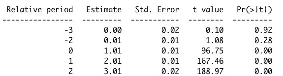

模拟数据的事件研究结果，图片由作者提供。

到目前为止，一切都很好，但在使用事件研究方法时，为了避免潜在的陷阱，需要注意以下四件事:

## **1。无预期假设**

文献中许多事件研究的应用强加了一个无预期假设。无预期假设意味着**处理单元在处理**之前不会改变它们对处理的预期行为。当无预期假设成立时，可以使用事件发生前的时期作为参考时期，并将其他时期与该时期进行比较。

然而，在某些情况下，无预期假设可能不成立，例如，当在实施处理之前向小组宣布处理时，单元可以通过调整它们的行为来响应该宣布。在这种情况下，**需要仔细选择参考周期，以避免偏差**。如果您知道受试者何时开始预期治疗并改变他们的行为，您可以将该时期作为治疗的实际开始，并将之前的时期作为参考时期(Borusyak 等人，2021)。

例如，如果您怀疑受试者在 *l* = -1(治疗前一个周期)中改变他们的行为是因为他们预期治疗，您可以使用 *l* = -2(治疗前两个周期)作为您的参考周期。你可以通过从等式中去掉 D *ˡᵢₜ* 其中 *l* = -2 来实现，而不是去掉 *l* = -2 的哑元。这样，您可以将 *l* = -2 周期用作参考周期。要检查您对在 *l* = -1 中改变其行为的单位的预感是否属实，您可以检查 *l* = -1 中估计的处理效果是否具有统计显著性。

***例证续:***

回到我们的说明性示例，通常在实施封锁之前宣布封锁，这可能会影响单元的预处理行为。例如，一旦宣布了封锁，但还没有强制实施，人们可能已经开始在家工作了。

因此，人们甚至可以在实际实施封锁之前改变他们的音乐收听行为。如果在实际实施前 1 个周期宣布锁定，则可以通过从规范中删除相对周期-1 的虚拟周期，使用相对周期= -2 作为参考周期。

根据这个例子，我复制并修改了原始数据，以引入一些预期效果。我介绍了在相对周期-1 中所有单元收听时间增加 0.5 小时。我称这个新的数据集为预期数据集`data_anticip`。

下一张图显示了相对时间段内的平均音乐收听时间。很容易注意到，与相对周期-2 和-3 相比，收听时间在相对周期-1 中已经开始加快。忽略收听时间的这一显著变化会产生误导性的结果。

```
# Summarize the hours listened over relative period (excluding the untreated cohort)
  avg_dep_anticip <- data_anticip[rel_period != 99, .(mean_hrs_listened = mean(hrs_listened)), (rel_period)]
  setorder(avg_dep_anticip, 'rel_period')

  rel_periods <- sort(unique(avg_dep_anticip$rel_period))
  ggplot(avg_dep_anticip, aes(y=mean_hrs_listened, x=rel_period)) + 
    geom_bar(position="dodge", stat="identity", fill = 'deepskyblue') +  coord_cartesian(ylim=c(79,85))+
    labs(x = "Relative period", y = "Hours", title = 'Average music listening over relative time period',
         caption = 'Only for the treated units') + 
    theme(legend.position = 'bottom',
          legend.title = element_blank(), 
          axis.title = element_text(size = 14),
          axis.text = element_text(size = 12)) + scale_x_continuous(breaks = min(rel_periods):max(rel_periods))
```

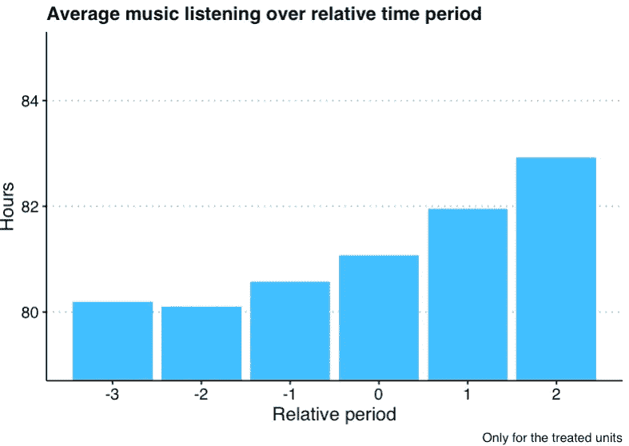

相对时间段内的平均音乐收听量，图片由作者提供。

现在，让我们做一个事件研究，就像我们之前做的那样，通过回归相对时间段假人的收听时间。请记住，我唯一改变的是相对周期-1 中的效应，其余数据与之前完全相同。

您可以在下表中看到，即使在这些时期没有真正的治疗效果，治疗前的效果也是负面的和显著的。原因是我们使用相对周期-1 作为参考周期，这打乱了所有的效果估计。我们需要做的是用一个没有预期的时期作为参考时期。

```
formula <- as.formula(paste0('hrs_listened ~ ',covs_collapse))
  model <- feols(formula,
                 data = data_anticip, panel.id = "unit",
                 fixef = c("unit", "period"))
  summary(model)
```

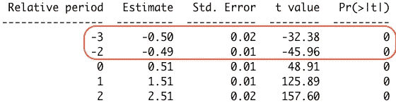

忽略预期时的事件研究结果，图片由作者提供。

在下表中，我报告了新回归的事件研究结果，其中我使用相对期间-2 作为参考期间。现在，我们有了正确的估计！在相对周期-3 中没有检测到影响，尽管在相对周期-1 中正确地检测到了影响。此外，现在可以正确估计治疗后期间的效应大小。

```
# Use release period -2 as the reference period instead
  covs_anticip <- setdiff(c(covs,'rel_period_min1'),'rel_period_min2')
  covs_anticip_collapse <- paste0(covs_anticip,collapse = '+')

  formula <- as.formula(paste0('hrs_listened ~ ',covs_anticip_collapse))
  model <- feols(formula,
               data = data_anticip, panel.id = "unit",
               fixef = c("unit", "period"))
  summary(model)
```

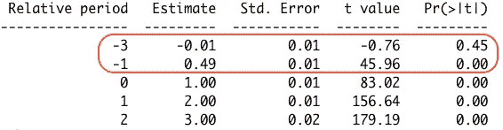

当预期不被忽略时的事件研究结果。

## **2。跨群组同质治疗效果的假设**

在前面所示的等式中，治疗效果只能随相对时间段而变化。**这里隐含的假设是，这些治疗效果在各治疗组中是同质的**。然而，如果这种隐含的假设是错误的，那么估计的治疗效果可能会与实际的治疗效果显著不同，从而导致偏差(Borusyak 等人，2021 年)。一个示例情况可能是，与后治疗组相比，前治疗组从治疗中获益更多。这意味着不同队列的治疗效果不同。

解决这个问题的最简单的解决方案是**允许异构性**。考虑到队列间治疗效果的异质性，可以估计相对时间和队列特异性治疗效果，如下文所述。在以下说明中， *c* 代表治疗群组。此处，除了将使用β *ₗ,c* 的估计器对每个相对时间&治疗队列组合的治疗效果进行估计之外，一切都与之前的规范相同。d*ᵢ*ᶜ*t14】代表给定单元 *i* 的治疗群组假人。*

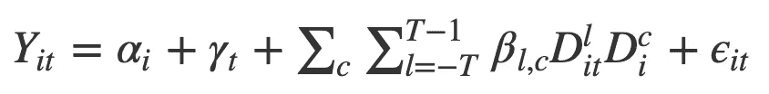

允许群组水平异质性的事件研究规范，作者图像。

***例证续:***

在锁定的例子中，由于不同的原因(例如，可能在其中一个国家，人们更有可能遵守新的法规)，锁定的效果在不同的被处理国家是不同的。因此，应该估计国家和相对特定时间的治疗效果，而不是仅仅估计相对特定时间的治疗效果。

在最初的模拟数据集中，我在不同时期的治疗效果中引入了队列异质性，并将这个新数据集称为`data_hetero`。如下图所示，在所有治疗周期中，群组周期 2 的治疗效果是群组周期 3 的 1.5 倍。

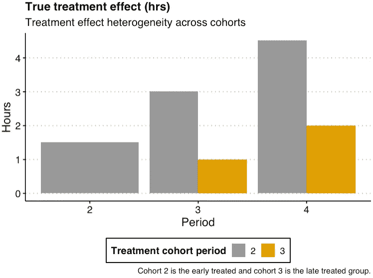

队列异质性的真实治疗效果，图片由作者提供。

现在，正如我们之前所做的，让我们为`data_hetero`运行一个事件研究。下表报告了本次事件研究的结果。尽管在治疗前阶段没有治疗或预期效果，但事件研究检测到了具有统计显著性的效果！这是因为我们没有考虑跨队列的异质性。

```
# Event study 
formula <- as.formula(paste0('hrs_listened ~ ',covs_collapse))
  model <- feols(formula,
               data = data_hetero, panel.id = "unit",
               fixef = c("unit", "period"))
  summary(model)
```

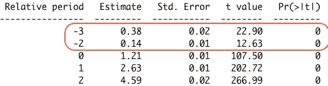

忽略队列异质性时的事件研究结果，图片由作者提供。

让我们通过对队列特定的相对时期的假人进行几个小时的监听来说明队列间治疗效果的异质性。在下表中，我报告了这次事件研究的结果。在该表中，报告了每个队列和相对时期的治疗效果估计值。通过允许每个队列的治疗效果不同，我们解释了异质性，因此，我们有正确的估计！没有检测到预处理应有的效果。

```
# Create dummies for the cohort-period 
  data <- data_hetero %>% 
    dummy_cols(select_columns = "cohort_period")
  cohort_dummies <- c('cohort_period_2','cohort_period_3')
  # Create interactions between relative period and cohort dummies
  interact <- as.data.table(expand_grid(cohort_dummies, covs))
  interact[, interaction := paste0(cohort_dummies,':',covs)]
  interact_covs <- interact$interaction
  interact_covs_collapse <- paste0(interact_covs,collapse = '+')

# Run the event study
formula <- as.formula(paste0('hrs_listened ~ ',interact_covs_collapse))
  model <- feols(formula,
               data = data_hetero, panel.id = "unit",
               fixef = c("unit", "period"))
  summary(model)
```

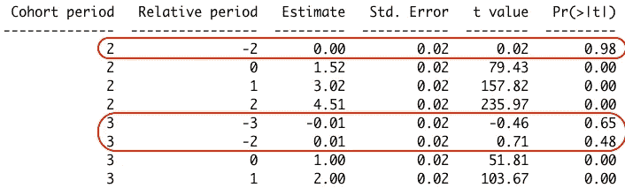

事件研究结果说明了队列异质性，图片由作者提供。

## **3。在完全动态规范中，在没有从未治疗组的情况下识别不足**

**在完全动态事件研究规范**中，其中包括治疗的所有超前和滞后(通常只有相对时间-1 被删除以避免完全多重共线性)，在没有非治疗组的情况下**治疗效果系数未被识别**。其原因是动态因果效应无法从单位效应和时间效应的组合中区分出来(Borusyak 等人，2021 年)。**实际解决方案是放下另一个预处理假人**(即另一个铅处理假人)以避免识别不足的问题。

***例证续:***

想象一下，我们没有任何未经治疗的国家的数据。因此，我们的样本中只有经过治疗的国家。我们仍然可以利用治疗时间的变化进行事件研究。然而，在这种情况下，我们不得不使用不止一个而是至少两个参考周期来避免识别不足。可以通过从规格中删除治疗前的周期和最负相对周期模型来做到这一点。

在模拟数据集中，我删除了来自未处理队列的观察结果，并将这个新数据集称为`data_under_id`。现在，我们只处理了样本中的队列。其余部分与原始模拟数据集相同。因此，我们必须使用至少两个参考期，通过丢弃任何治疗前相对期模型的模型。我选择排除相对周期-1 和-3 的虚拟值。我在下面报告这次事件研究的结果。正如你现在看到的，我在模型中只估计了一个相对周期。估计没错，太好了！

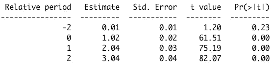

没有未处理组时的估计结果，图片由作者提供。

## **4。使用事件研究作为平行趋势假设的预测试**

**使用事件研究作为平行趋势假设(PTA)的预测试是一种常见策略，平行趋势假设是差异中的差异(DiD)方法的重要假设**。PTA 指出，在没有处理的情况下，处理和未处理的单位在感兴趣的结果方面将遵循平行的趋势。事件研究用于观察在治疗发生之前，治疗组的行为是否与未治疗组不同。据认为，如果在治疗组和未治疗组之间没有检测到统计学上的显著差异，PTA 可能保持不变。

然而，Roth (2022)表明**这种方法可能有问题**。一个问题是**这些类型的预测试具有较低的统计功效。这使得发现不同的趋势变得更加困难。另一个问题是，如果你有很高的统计能力，你可能会发现不同的治疗前效应(前趋势)，即使它们不是那么关键。**

Roth (2022)推荐了几个解决这个问题的方法:

*   **不要仅仅依赖于预测试系数的统计显著性**，要考虑预测试的统计功效。如果功率较低，事件研究将不会提供关于预投标存在的大量信息。如果你有很高的统计能力，预测试的结果可能仍然是误导性的，因为你可能会发现一个不那么重要的有统计学意义的预测趋势。
*   **考虑完全避免预测试的方法**，例如，在给定背景下使用经济知识选择正确的 PTA，如有条件的 PTA。另一种方法是，如果您认为治疗组和未治疗组遵循不同的趋势，并且不具有可比性，则使用后期治疗组作为对照组。请看卡拉威&圣安娜的 2021 年论文，了解放松家长教师协会的潜在方法。

***例证续:***

回到最初的例子，我们有三个国家，假设我们想进行 DiD 分析，我们想找到支持 PTA 在这种情况下成立的证据。这意味着，如果接受治疗的国家不接受治疗，音乐消费将与未接受治疗的国家的音乐消费平行移动。

我们考虑使用一个均匀的研究作为预测试 PTA 的方法，因为没有直接测试 PTA 的方法。首先，我们需要考虑测试的统计能力。Roth (2021)为此提供了一些工具。虽然这超出了本文的范围，但我可以说，在这个模拟数据集中，我们有相对较高的统计能力。因为随机噪声很低，我们有一个相对较大的样本量，没有太多的系数要估计。尽管如此，运行场景分析来查看人们可以正确检测到多大程度的预处理效果还是有好处的。

其次，不管治疗前估计值的统计显著性状态如何，都要考虑特定的背景。我是否期望接受治疗的国家和未接受治疗的国家遵循同样的趋势？在我的模拟数据中，我很确定这一点，因为我确定了数据的样子。然而，在现实世界中，这不太可能无条件成立。因此，我会考虑使用有条件的优惠贸易协定，根据各种协变量对优惠贸易协定进行调整，使各国之间更具可比性。

## 结论

事件研究是强有力的工具。然而，人们应该意识到他们潜在的陷阱。在本文中，我探索了最常遇到的陷阱，并提供了关于如何使用模拟数据集解决这些问题的建议。我讨论了与无预期假设、队列间治疗效果的异质性、缺乏未治疗队列时的识别不足以及使用事件研究作为 PTA 的预测试相关的问题。

## 参考

[1] Borusyak，k .，Jaravel，x .，& Spiess，J. [重温事件研究设计:稳健有效的评估](https://arxiv.org/abs/2108.12419)。(2021). *arXiv 预印本 arXiv:2108.12419* 。

[2]j .罗斯[谨慎地进行预测试:平行趋势测试后的事件研究估计](https://www.aeaweb.org/articles?id=10.1257/aeri.20210236)。(2022).*美国经济评论:洞见*， *4* (3)，305–22。

[3] Callaway，b .，& Sant'Anna，P. H. [多个时间段的差异中的差异](https://www.sciencedirect.com/science/article/abs/pii/S0304407620303948)。(2021).*计量经济学杂志*， *225* (2)，200–230。

## 其他相关论文

Sun，l .，& Abraham，S. [在具有异质治疗效应的事件研究中估计动态治疗效应](https://doi.org/10.1016/j.jeconom.2020.09.006)。(2021).*计量经济学杂志*， *225* (2)，175–199。

Wooldridge，J. M. [双向固定效应、双向蒙德拉克回归和差异中的差异估计](https://papers.ssrn.com/sol3/papers.cfm?abstract_id=3906345)。(2021).*可在 SSRN 3906345* 获得。

## 感谢您的阅读！

*如果你喜欢这篇文章并想看更多我的文章，可以考虑* [*关注我*](https://medium.com/@nalagoz13) *。*

***免责声明*** *:我写作是为了学习，所以你可能会发现文章或代码中的错误。如果你这样做，请让我知道。*