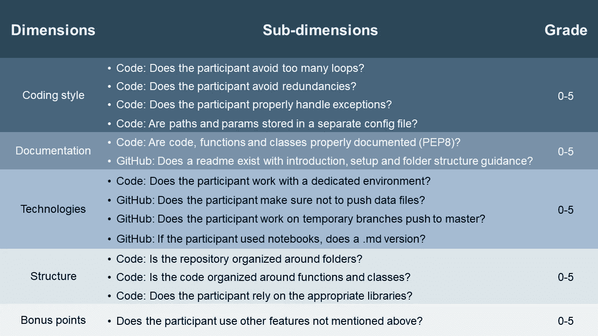

# 想知道你提交的黑客马拉松是如何被审核的吗？在这里学习吧！

> 原文：<https://towardsdatascience.com/ever-wondered-how-your-hackathon-submission-is-reviewed-learn-it-here-7f75a9d6947d>

## 来自一家一级咨询公司黑客马拉松的关键评分维度


杰佛森·桑多斯在 [Unsplash](https://unsplash.com/s/photos/coding?utm_source=unsplash&utm_medium=referral&utm_content=creditCopyText) 上拍摄的照片

几年前，我在一家一级咨询公司给黑客马拉松提交的内容打分。这是一次很好的学习经历。我经常想知道这是怎么做到的。分数仅仅是由模型表现驱动的吗？还是编码标准和创造力的作用最大？

> 我很高兴强调准确性不是唯一的评分因素。

黑客马拉松通常针对学生或入门级的潜在新员工。这是挑战自我和拓展人脉的好方法。**黑客马拉松是展示你的技能和发展数据科学家的最佳机会之一。**

这篇文章的目的是通过一个例子来提高这个话题的透明度。这是一家一级咨询公司在之前的黑客马拉松中使用的评估矩阵。



作者图片

该矩阵显示了编码最佳实践的一般准则。无论需要什么样的环境和规模，都可以使用这些指南。通过应用以下标准来确保最终项目的生产质量:

*   编程风格
*   证明文件
*   技术
*   结构

代码评估是黑客马拉松的众多评估领域之一。模型的准确性和表达技巧也被考虑在内。为了确保全面评估，与会者介绍了他们的结果。这些领域的评分将不会在这篇文章中强调。

现在，让我们深入矩阵中的五个维度。对于每个维度，参与者的得分范围为 0-5。5 分反映了该维度的*完全完成*。

# **编码风格**


克里斯·里德在 [Unsplash](https://unsplash.com/s/photos/coding?utm_source=unsplash&utm_medium=referral&utm_content=creditCopyText) 上拍摄的照片

首先要做的事。编码风格和简洁非常重要。这是一个项目最大的组成部分，应该永远是重中之重。如果使用 python，编码标准应遵循 [PEP8](https://www.python.org/dev/peps/pep-0008/) 。现在，让我们看看主要的评估领域:

*   **尽可能避免循环**，以确保代码的透明性。执行一般任务时，请始终使用相关的库
*   **避免冗余**以确保清晰易懂的编码风格。冗余是指不再需要的代码，如临时变量和检查。这些也可以是没有存储在函数中的代码的副本。提交前总是删除或优化
*   **如果异常存在，通过施加`try`语句来正确处理**异常。捕获`try`子句中的主要操作和`except`子句中的异常。
*   **使用配置文件**存储参数和路径。这确保了干净的代码，并确保了代码的简单移交。优化工作流程的绝佳方式

# **文档**

如果有良好的文档记录，代码是最好的共享和重用方式。如果没有文档，不一致或不正确使用代码的可能性会迅速增加。代码文档标准至少应包括:

*   **表单的所有公共模块、函数、类和方法的文档字符串**(示例来自 [PEP8 Style guide](https://www.python.org/dev/peps/pep-0008/#comments) ):

```
"""Return a foobang

Optional plotz says to frobnicate the bizbaz first.
"""
```

*   **屏蔽评论**如果用笔记本引导读者。用 *#* 初始化块注释

此外，如果使用 GitHub 进行版本控制和协作，请包括以下内容:

*   **自述文件**向读者介绍该项目。包括解释存储库中的设置、工作流和文件夹结构的部分

# **技术**


照片由 [Richy Great](https://unsplash.com/@richygreat?utm_source=unsplash&utm_medium=referral&utm_content=creditCopyText) 在 [Unsplash](https://unsplash.com/s/photos/github?utm_source=unsplash&utm_medium=referral&utm_content=creditCopyText) 上拍摄

在这次黑客马拉松中，参与者被要求将他们的提交内容上传到 GitHub。鉴于此，这一类别的分级与平台的使用密切相关。GitHub 是数据科学家首选的版本控制和协作平台。

参与者根据以下 GitHub 最佳实践参数进行评分:

*   **没有数据文件推送到 GitHub** 。数据可能包含不应向公众公开的敏感信息。如果您需要存储您的数据，请使用云服务，如[亚马逊 S3](https://aws.amazon.com/s3/)
*   开发新代码时使用临时分支。当对新代码满意时，通过拉请求推送到主分支。这确保了主代码在任何时候都充分发挥作用
*   **推。如果使用笔记本，将 md (markdown)文件保存到 GitHub** 。这确保了分级员和其他观众易于阅读的设置。Jupytext 是一个很好的保护这一点的库

# **结构**

保持严格的透明工作流程结构。尤其是在大型团队中从事大型项目时。让我们看看评估的子维度:

*   **使用相关库**进行分析。大多数简单的计算和通用分析指标都存在于定义明确的库中。总是努力应用可用的库来保持简单的工作流。
*   **在一个干净的文件夹结构中组织代码**以确保存储库中的透明性。最佳实践包括:
    1。将代码存储在专用的 *src/* 文件夹中。
    2。将库需求存储在 requirements.txt 文件
    3 中。自述文件中的[目录树](https://marketplace.visualstudio.com/items?itemName=Shinotatwu-DS.file-tree-generator)中的概要文件夹结构
*   **使用函数和类**来组织代码。这确保了具有有限循环和冗余的干净编码结构。

# 奖励积分

数据科学家需要的一项关键技能是创造力。这就是为什么在黑客马拉松中奖励积分应该优先考虑的原因。
在这里，是你大放异彩、展示非凡技能和创造力的时候了。我强调了展示这一点的两种方式，但还有更多方式。

## **引入外部数据**

开源或公共数据是免费的，任何人都可以在线获得。如果经过优化选择，包含外部数据可以导致模型的重大改进。在网上搜索，看看是否有公共数据可以帮助你提高模型的准确性。

在下面找到一些关于公共数据源的好资源:

*   [世界银行公开数据](https://data.worldbank.org/)
*   [世卫组织(世界卫生组织)——公共数据储存库](https://www.who.int/data/gho/)
*   [谷歌公共数据浏览器](https://www.google.com/publicdata/directory)

## **介绍最先进的技术**

数据科学领域在不断发展。展示任何最先进的技术，给评估者留下深刻印象。有很多方法可以做到这一点，最相关的方法取决于你要解决的问题。找到下面的几个例子:

*   集装箱化使用[码头](https://www.docker.com/)
*   云服务，如[亚马逊网络服务(AWS)](https://aws.amazon.com/?nc2=h_lg)

# 评分和反馈


照片由[吉列尔莫·拉托雷](https://unsplash.com/@superwillyfoc?utm_source=unsplash&utm_medium=referral&utm_content=creditCopyText)在 [Unsplash](https://unsplash.com/s/photos/applause?utm_source=unsplash&utm_medium=referral&utm_content=creditCopyText) 拍摄

在这里突出显示的黑客马拉松中，每个维度都按照 0-5 的等级进行评分。通过将每个维度的得分相加，得出最终得分，最高得分为 25 分。

为了认可黑客马拉松的表现，每位参与者都收到了反馈。参与者收到的反馈强调了优秀的绩效和发展领域。

# 总结想法

这篇文章的目标是推动如何审查黑客马拉松提交的透明度。了解所有的评估标准可以在未来的比赛中提高表现。

评估指标围绕五个子维度展开:

*   编程风格
*   证明文件
*   技术
*   结构
*   奖励积分

让我们在职业生活的各个方面都努力做到透明！公开期望和评估标准将使其更容易执行。

*你有什么想法？明年你会被鼓励加入吗？欢迎在评论区留下你的想法。*

感谢阅读！