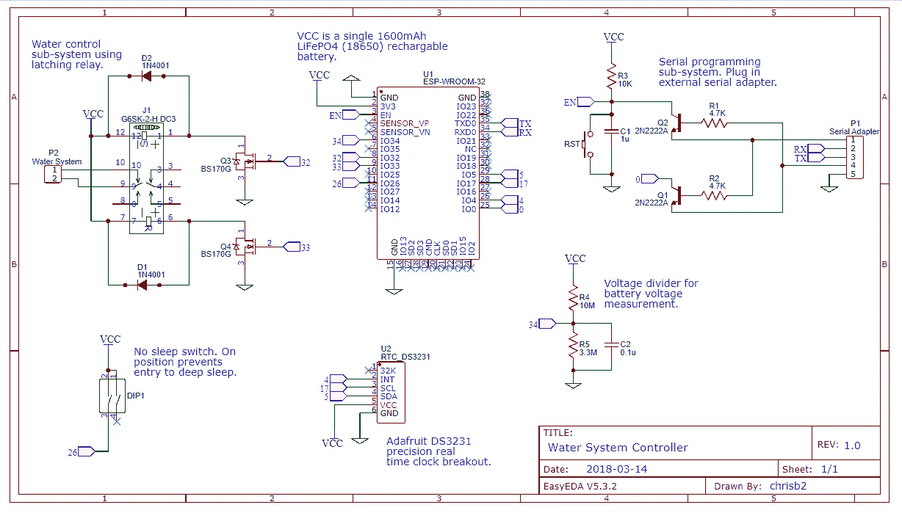
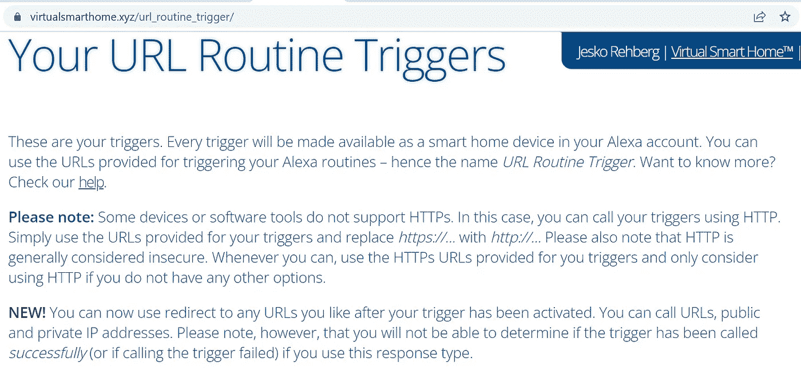
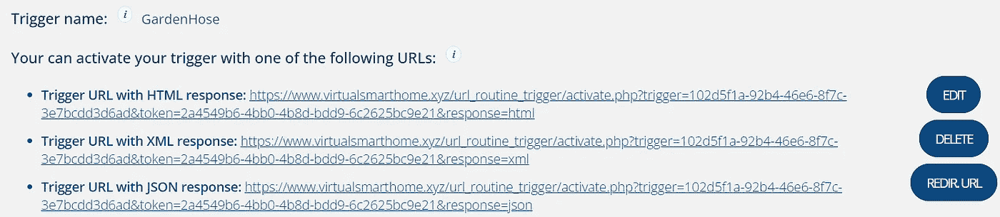
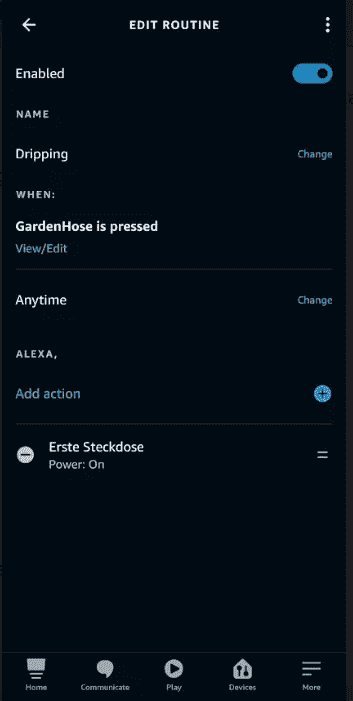
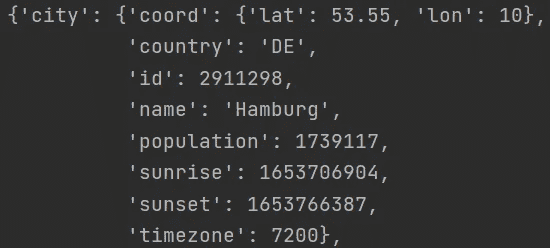
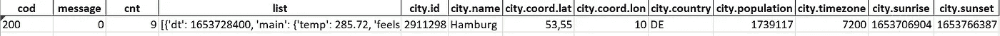
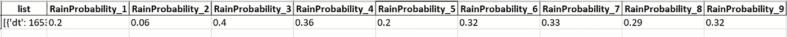
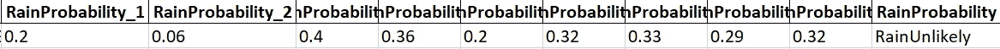
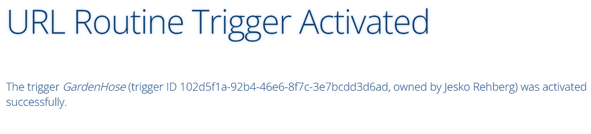
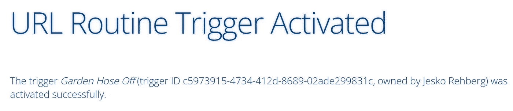

# 每一滴都很重要

> 原文：<https://towardsdatascience.com/every-drop-counts-e37201071f67>

## 在缺水的世界使用智能灌溉


美丽胜于丑陋(Python 之禅，照片由 [Linus Mimietz](https://unsplash.com/es/@linusmimietz?utm_source=unsplash&utm_medium=referral&utm_content=creditCopyText) 拍摄)

如今，节约使用水这一重要资源变得越来越重要。受到塞思·西格尔的书《要有水》和德国干旱期延长的启发，我开始为我的花园灌溉寻找一个更可持续的解决方案。由于我是 Python 编程的朋友，我的解决方案不能由简单的雨量计组成，而是必须包括智能套接字、OpenWeather API 和几行 Python 代码。开玩笑，与简单的雨量计相比，OpenWeather 提供了许多其他有用的天气功能，可以与智能插座结合使用。为了简单起见，本文中我只使用下雨的概率。但是你也可以，例如，增加对太阳辐射的评估，并相应地调整遮阳系统。由于 OpenWeather，可能性是多方面的。

**背景:**

当我在度暑假时，我的花园由一个计时器浇水。设置如下:计时器每天晚上为水泵供电 15 分钟。该泵从水箱中抽水并通过软管浇花。不管下雨与否，水泵每天都在运转。这一程序现在将被一种更聪明的方法所取代。未来 24 小时内是否会下雨有待核实。并且只有在预测不下雨的情况下，泵才被供电 15 分钟，以便向花园供水。

> 如果你正在寻找更深入的技术解决方案，我可以强烈推荐 [Chris 的 Github](https://github.com/chrisb2/water-system) 资源库。虽然 Chris 住在挪威，这个国家不一定以缺水闻名，但他开发了一个令人印象深刻的 Python 应用程序，该程序结合了天气预报来控制花园灌溉以节约用水。



https://github.com/chrisb2/water-system(图片来自克里斯的 Github 库)

**解决方案:**

与克里斯的工程方法相比，我将采用一种更普通的方法:我将灌溉系统(水泵)连接到一个智能插头上。在这种情况下，智能意味着插头连接到互联网。只有在预测第二天不会下雨的时候，那个插头才会被打开。

我的观点不是宣传一个“美国的一切卖家”，而是为你提供一个平衡的解决方案，不需要工程技术就能可靠地工作。这就是为什么我决定将 Alexa 的智能插头与一个名为“虚拟智能家居”的应用程序一起使用。该应用程序可以非常轻松地为 Alexa 的智能插件例程设置 URL 触发器:

<https://www.virtualsmarthome.xyz/url_routine_trigger/>  

首先，在网站“virtualsmarthome.xyz”上，我们需要创建一个新的触发器。我已经输入了“GardenHose”作为名称:


您可以输入您喜欢的任何名称(图片由作者提供)

现在只需点击“保存”按钮，就大功告成了:



我们将在后面的代码示例中使用 URL 地址(图片由作者提供)

现在，在你的 Alexa 应用程序中，选择你的智能插头，并创建一个每当 URL 被激活时就会打开电源的例程:


在我的例子中，智能插头被称为“erste Steckdose”

点击“创建一个例程”，并告知每次“按下 GardenHose”(这意味着有一个对该 URL 的调用):



选择“开机”这样的动作作为对 URL 调用的响应(图片由作者提供)

…插头的电源必须打开:


(图片由作者提供)

现在重复上述步骤进行第二次触发。这将用于关闭智能插头:


花园软管关闭是第二个会关闭电源的触发器(图片由作者提供)

唯一不同的是，对于这个触发器“花园软管关闭”,智能插头将被关闭:


(图片由作者提供)

…当该 URL 被点击时:


(图片由作者提供)

现在编程部分开始了。由于我们将调用 OpenWeather 的 API，我们首先需要创建一个免费帐户(如果还没有完成的话)。转到 OpenWeather，创建一个帐户并确认您的邮件。

<https://home.openweathermap.org/api_keys>  

之后，激活您的 api 密钥可能需要几分钟，所以请耐心等待。要检查您的 API 是否正常工作，请尝试代码的开头:

```
from pprint import pprint
import requests, json
r = requests.get('https://api.openweathermap.org/data/2.5/forecast?q=Hamburg,de&cnt=9&APPID=YourApiKey')
pprint(r.json())
```

如果您的 API 键工作正常，那么您的输出应该类似于以下内容:



(图片由作者提供)

恭喜，我们现在已经收到汉堡未来 24 小时(cnt=9)的天气预报(q =汉堡)。因为上面的 Json 格式有点难以阅读，所以我们使用 json_normalize 将其转换为 pandas 数据帧:

```
df = pd.json_normalize(r.json())
```



Df 输出比 Json 干净，但是列“list”仍然需要一些准备(图片由作者提供)

相关的天气预报存储在“列表”栏中。


“pop”代表降水概率(图片由作者提供)

正是“pop”场告诉我们降水的概率。参数值在 0 和 1 之间变化，其中 0 等于 0%，1 等于 100%。每次“pop”之间的时间间隔是三个小时，这就是为什么我们最终在接下来的 24 小时内总共有 9 次“pop”(第一次 pop 是调用 API 的当前时间)。

因为我们主要对未来 24 小时的降雨概率感兴趣，所以我们将其提取到 9 列中。

```
df['list'] = df['list'].astype(str)
df = df[['list']].join(df['list'].str.extractall(r"(?<='pop': )([^'pop']+)(?=,)").unstack().droplevel(0, axis=1).rename(lambda x: 'RainProbability_' + str(x+1), axis=1))
```



列“RainProbability_1”表示有 20%的可能性下雨，而三个小时后下雨的可能性只有 6%等(图片由作者提供)

对于我们的例子，让我们估计，如果下雨的概率超过 80%，就会下雨。否则我们预计不太可能下雨:

```
import numpy as np
conditions = [(df['RainProbability_1'] > '0.8') |
              (df['RainProbability_2'] > '0.8') |
              (df['RainProbability_3'] > '0.8') |
              (df['RainProbability_4'] > '0.8') |
              (df['RainProbability_5'] > '0.8') |
              (df['RainProbability_6'] > '0.8') |
              (df['RainProbability_7'] > '0.8') |
              (df['RainProbability_8'] > '0.8') |
              (df['RainProbability_9'] > '0.8')]
choices = ['RainLikely']
df['RainProbability'] = np.select(conditions, choices, default='RainUnlikely')
```



未来 24 小时内的“降雨量”都不超过 80%，因此不太可能下雨(图片由作者提供)

我们将把这个输出与我们的智能插头结合起来。只有在未来 24 小时内不太可能下雨的情况下，智能插头才会打开(从而启动水泵给花园浇水)。浇水 15 分钟后，水泵应该关闭。另一方面，当天气预报预测有雨时，插头应该保持关闭。

```
import webbrowser
import time
b = df['RainProbability'].iloc[0]
new = 2 # open in a new tab, if possible
if b =='RainUnlikely':
    url = "https://www.virtualsmarthome.xyz/url_routine_trigger/activate.php?trigger=YourTriggerToTurnSmartPlugOn&response=html"
    webbrowser.open(url, new=new)
    time.sleep(900)
    url="https://www.virtualsmarthome.xyz/url_routine_trigger/activate.php?trigger=YourTriggerToTurnSmartPlugOff&response=html"
    webbrowser.open(url, new=new)
else:
    print ('No need to water since there will be rain within the next 24h')
```



当预计不会下雨时，花园软管的触发器将被激活(图片由作者提供)



15 分钟后插头将再次关闭(图片由作者提供)

下面是完整的代码:

**概要:**

恭喜你，你已经建立了一个智能灌溉系统。这是迈向更可持续的世界的又一简单步骤。当然，我们的智能插头只使用可持续的电力来源(原子能不算，对吗，法国？:-)).

非常感谢您的阅读！希望这篇文章对你有帮助。请随时在 [LinkedIn](https://de.linkedin.com/in/jesko-rehberg-40653883) 、 [Twitter](https://twitter.com/DAR_Analytics) 或[工作室](https://jesko-rehberg.medium.com/virtual-reality-vr-for-education-a532aa5b6272)与我联系。

<https://jesko-rehberg.medium.com/membership>  

还要特别感谢 [Katherine Prairie](https://medium.com/@kathy_87105) 的宝贵反馈！