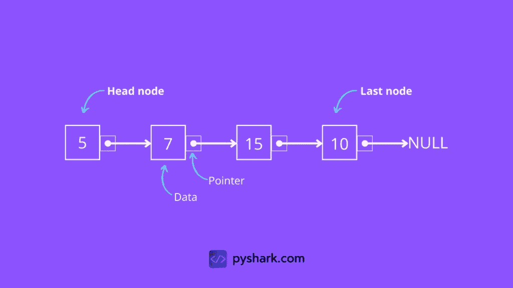
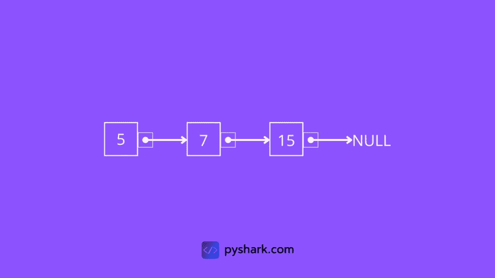
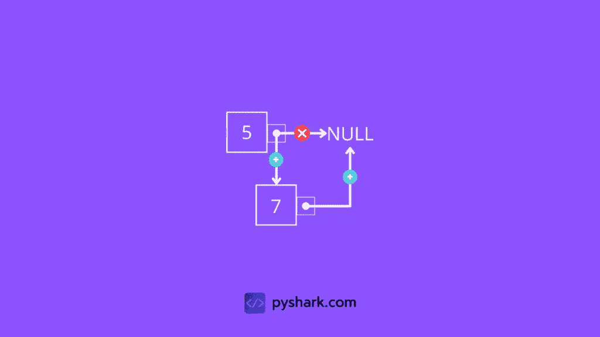
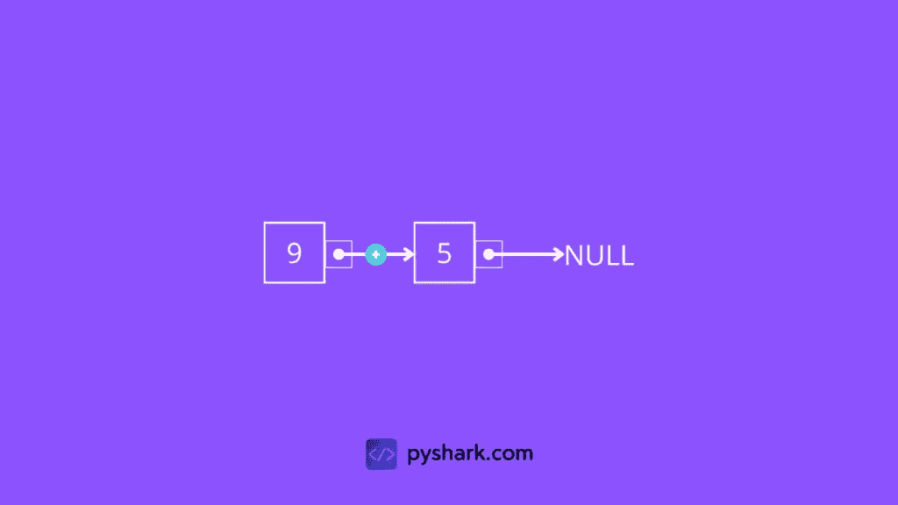
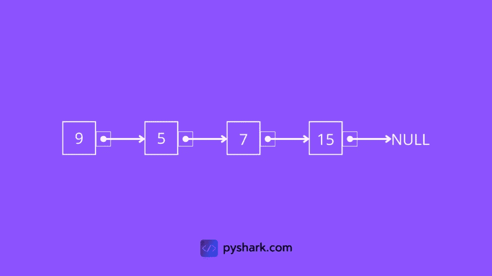
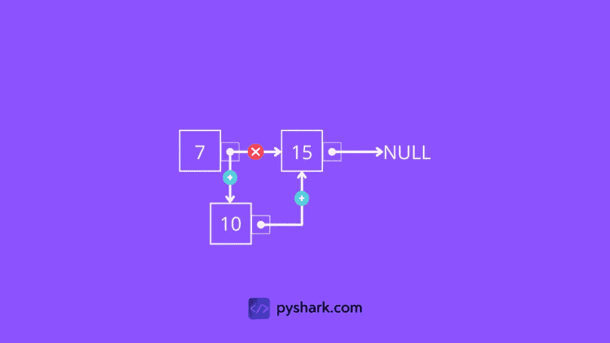
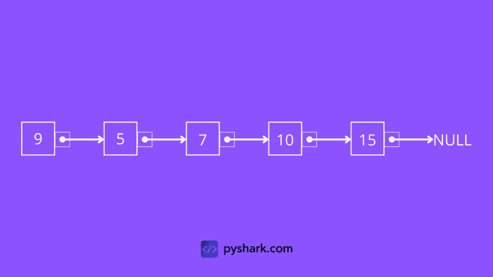
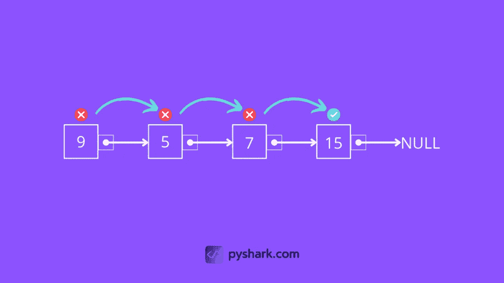
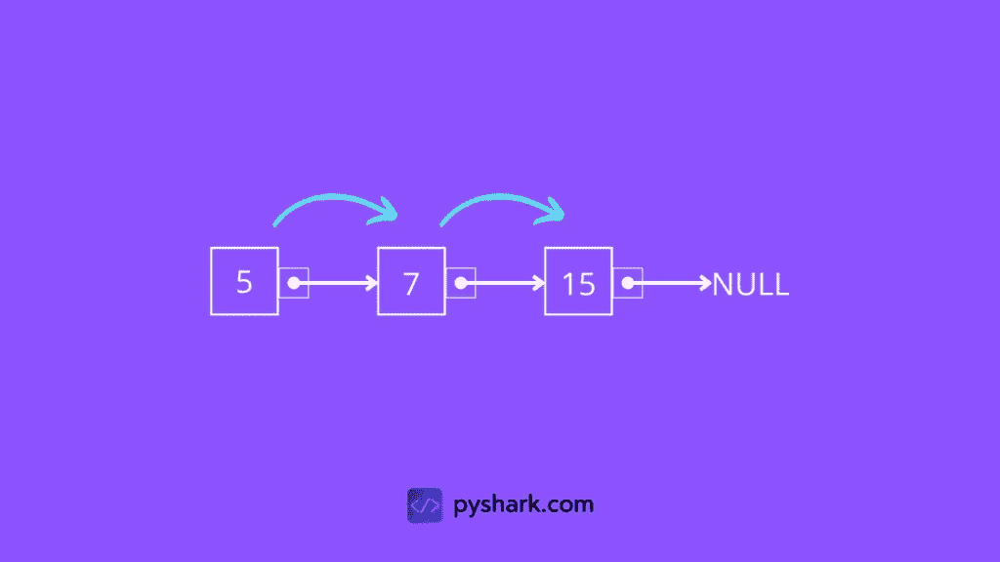
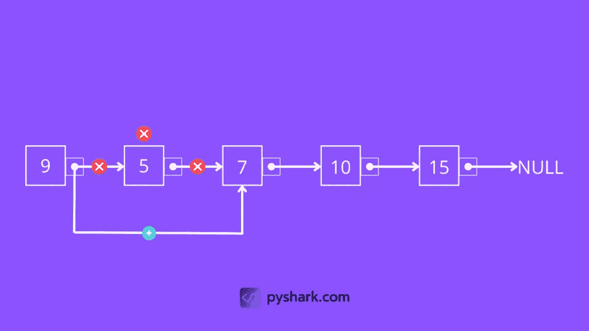

# Python 中链表数据结构的一切:中级指南

> 原文：<https://towardsdatascience.com/everything-about-linked-list-data-structure-in-python-intermediate-guide-31d04ee6b679>

## 在本文中，我们将重点介绍 Python 链表数据结构的完整过程。


照片由[郭佳欣·阿维蒂西安](https://unsplash.com/@kar111?utm_source=unsplash&utm_medium=referral&utm_content=creditCopyText)在 [Unsplash](https://unsplash.com/s/photos/link?utm_source=unsplash&utm_medium=referral&utm_content=creditCopyText) 上拍摄

**目录**

*   什么是链表
*   如何创建一个链表
*   如何遍历一个链表
*   如何在链表的末尾插入一个节点
*   如何在链表的开头插入一个节点
*   如何在链表的给定节点后插入一个节点
*   如何在链表中搜索节点
*   如何从链表中删除一个节点
*   结论

# 什么是链表

链表是由节点组成的数据结构，其中每个节点包含两个字段:

1.  价值
2.  指向下一个节点的指针(引用链接)

它是使用指针构成序列的节点的集合，其中链表的第一个节点称为**头节点**，而**最后一个节点**有一个指向 NULL 的引用链接。



作者图片

# 如何在 Python 中创建链表

我们已经知道链表是由节点组成的序列。

创建链表的第一步是创建一个节点结构(作为它自己的类)。

初始化时，一个节点应该接受一些数据作为值，并且将指向下一个节点的默认指针设置为 None，当我们添加更多的节点形成一个序列时，这个值将会改变。

为了测试代码，让我们创建一个值等于 5 的节点，并打印出该值和指向下一个节点的指针:

您应该得到:

```
5
None
```

正如我们所料，存储的值是 *5* ，到下一个节点的引用链接是 *None* 。

让我们继续创建几个单独的节点:

在这一点上，我们有三个没有相互连接的节点:**第一个节点**、**第二个节点**、**第三个节点**。

下一步是为一个链表创建一个结构(作为它自己的类)。

初始化时，为了启动一个空链表，链表应该只将头节点设置为 NULL:

要开始向链表添加节点，我们希望我们创建的 **first_node** 成为链表的**头节点**:

这将创建一个有一个节点的链表(这将是**头节点**)。

回想一下，每个节点都有一个设置为 NULL 的引用链接。为了创建节点序列，我们将设置每个引用链接指向下一个节点:

现在我们已经成功地创建了一个包含三个节点的链表，看起来应该是这样的:



作者图片

在这一节中，我们一直在向链表添加节点，而不是手动添加，而不是以编程方式添加。在接下来的部分中，我们将探索如何在链表的末尾、开头和特定位置插入节点。

# 如何在 Python 中遍历链表

在上一节中，我们创建了链表 **llist** ，现在我们要遍历链表并打印出每个节点的值。

回想一下，链表的初始构造由下式给出:

单向链表只能向前遍历。

逻辑相当简单:我们将从**头节点**开始，打印它的当前值，然后移动到下一个节点(假设引用链接不为空)。

只要节点中有数据，我们就会继续移动到下一个节点。


作者图片

在本节中，我们将实现一个方法 **print_llist()** ，用于遍历一个链表，并为 **LinkedList()** 类打印每个节点的值。

它将被添加为 **LinkedList()** 类的方法:

让我们测试创建与上一节相同的列表，并打印出每个节点的值:

您应该得到:

```
5
7
15
```

# 如何在 Python 中的链表末尾插入一个节点

在前面的一节中，我们展示了一个如何用 Python 创建链表的例子。

我们使用的方法是手动的，而不是编程的，因为我们必须手动将节点链接在一起，并添加到下一个节点的引用链接。

在本节中，我们将实现一个方法 **insert_at_end()** ，用于为 **LinkedList()** 类在链表的末尾插入节点(基本上是追加新节点)。

让我们重用我们在上一节中构建的链表:

为了在 Python 中的链表末尾添加节点，我们应该遵循类似于在 Python 中遍历链表的逻辑。

我们从**头节点**开始:

*   如果**头节点**存在，那么我们移动到下一个节点
*   如果**头节点**为空，那么我们要添加的节点就成为**头节点**

假设**头节点**存在，我们移动到下一个节点(假设引用链接不为空)。

只要引用链接指向另一个有值的节点，并且它不是最后一个节点(引用链接为空)，我们将继续移动到下一个节点。

一旦我们到达**最后一个节点**，我们将在它后面插入新的节点，并将它的引用链接设为空。



作者图片

在本节中，我们将实现一个方法 **insert_at_end()** ，用于在 **LinkedList()** 类的链表末尾插入节点。

它将被添加为 **LinkedList()** 类的方法:

现在让我们试着创建与本教程的[第二部分](https://pyshark.com/linked-list-data-structure-in-python/#how-to-create-a-linked-list-in-python)相同的列表，看看我们是否得到相同的结果:

您应该得到:

```
5
7
15
```

这和我们[手工](https://pyshark.com/linked-list-data-structure-in-python/#how-to-create-a-linked-list-in-python)创建链表的时候一模一样。


作者图片

使用 **insert_at_end()** 方法，我们可以在 Python 中的链表末尾添加更多的节点。

# 如何在 Python 中的链表开头插入一个节点

在上一节中，我们实现了一个在链表末尾插入节点的方法。

但是如果我们需要在链表的开头添加一个节点呢？这就是我们将在本节中讨论的内容！

从逻辑和代码的角度来看，在链表的开头插入一个节点要简单得多。

链表的第一个节点是一个**头节点**，如果我们需要在它之前插入一个节点，我们应该简单地拥有一个节点，该节点有一个到**头节点**的引用链接(当然，如果链表中没有节点，那么新节点就成为**头节点**)。



作者图片

在本节中，我们将实现一个方法**insert _ at _ begin()**，用于在 **LinkedList()** 类的链表的开头插入节点。

它将被添加为 **LinkedList()** 类的方法:

现在让我们创建与本教程前面章节相同的列表，并在链表的开头添加一个值为“9”的节点:

您应该得到:

```
9
5
7
15
```



作者图片

使用 **insert_at_beginning()** 方法，我们可以在 Python 中的链表的开头添加更多的节点。

# 如何在 Python 中在链表的给定节点后插入节点

到目前为止，在本教程中，我们讨论了如何在 Python 中的链表的开头和结尾添加元素。

在这一节中，我们将探索如何在 Python 中的链表的给定节点后添加元素。

在给定节点后插入节点时，第一步是在链表中找到前一个节点。

为了找到**前一个节点**，我们将从它的**头节点**开始遍历链表，一直到找到**前一个节点**。

一旦我们找到了**的前一个节点**，我们将把一个**新节点**的引用链接从 NULL 改为**前一个节点**的引用链接，然后我们将把**前一个节点**的引用链接改为**新节点**。



作者图片

在本节中，我们将实现一个方法 **insert_after_node()** ，用于在 **LinkedList()** 类的链表的给定节点之后插入节点。

它将被添加为 **LinkedList()** 类的方法:

现在，让我们创建与本教程的[上一节](https://pyshark.com/linked-list-data-structure-in-python/#how-to-insert-a-node-at-the-beginning-of-a-linked-list-in-python)中相同的列表，并在链表中值为“7”的节点后添加值为“10”的节点:

您应该得到:

```
9
5
7
10
15
```



作者图片

使用 **insert_after_node()** 方法，我们可以在 Python 中的链表的给定节点后添加一个节点。

# 如何在 Python 中搜索链表中的节点

我们已经知道如何创建一个链表，假设我们用 Python 创建了一个链表。

现在我们想在这个链表中搜索一个节点，检查它是否存在。

逻辑相当简单:我们将从**头节点**开始，并开始移动到下一个节点(一个节点接一个节点，并且假设引用链接不为空)。

我们会将每个节点的值与我们正在搜索的值进行比较，一旦找到节点就打印“找到节点”，或者如果我们[遍历了链表](https://pyshark.com/linked-list-data-structure-in-python/#how-to-traverse-a-linked-list-in-python)没有找到我们正在搜索的值，就打印“没有找到节点”。


作者图片

在本节中，我们将实现一个方法 **search_node()** ，用于在链表中为 **LinkedList()** 类搜索一个节点。

它将被添加为 **LinkedList()** 类的方法:

现在，让我们创建与本教程的[前一节](https://pyshark.com/linked-list-data-structure-in-python/#how-to-insert-a-node-after-a-given-node-of-a-linked-list-in-python)中相同的列表，并搜索值为“15”的节点:

您应该得到:

```
Node found
```



作者图片

使用 **search_node()** 方法，我们可以在 Python 中搜索链表中的一个节点。

# 如何在 Python 中删除链表中的节点

我们已经知道如何在 Python 中搜索链表中的节点。

现在我们想从 Python 的链表中删除一个节点。

可以想象，这个过程将类似于遍历一个链表并在链表中搜索一个给定的节点。



作者图片

逻辑相当简单:我们将从**头节点**开始，检查它是否是我们想要删除的节点:

*   如果是，那么我们将把**头节点**重新指向下一个节点。
*   如果没有，那么我们将使用它作为当前节点，并检查我们是否想要删除下一个节点(该过程一个节点接一个节点地继续，直到我们从链表中找到要删除的节点)。

在本节中，我们将实现一个方法 **delete_node()** ，用于从 **LinkedList()** 类的链表中删除一个节点(该方法假设您试图删除一个存在于链表中的节点)。

它将被添加为 **LinkedList()** 类的方法:

现在让我们创建与本教程的[前一节](https://pyshark.com/linked-list-data-structure-in-python/#how-to-delete-a-node-from-a-linked-list-in-python)中相同的列表，并删除值为“5”的节点:

您应该得到:

```
9
7
10
15
```



作者图片

使用 **delete_node()** 方法，我们可以从 Python 中的链表中删除一个节点。

# 结论

这篇文章是对 Python[中的链表数据结构及其功能的介绍性演练，学习这些功能很重要，因为它们在](https://www.python.org/)[编程](https://pyshark.com/category/python-programming/)和[机器学习](https://pyshark.com/category/machine-learning/)的许多领域中使用。

如果你有任何问题或者对编辑有任何建议，请随时在下面留下评论，并查看我的更多[数据结构](https://pyshark.com/category/data-structures/)文章。

*原载于 2022 年 4 月 11 日*[*https://pyshark.com*](https://pyshark.com/linked-list-data-structure-in-python/)*。*