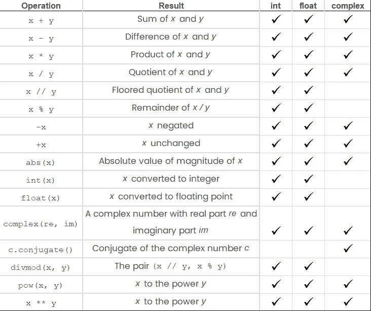

# 关于 Python 数值数据类型的一切:初学者指南

> 原文：<https://towardsdatascience.com/everything-about-python-numeric-data-types-beginners-guide-e377c2f76c0>

## 在本文中，我们将探索 Python 数字数据类型。


[Kai Gradert](https://unsplash.com/es/@kai?utm_source=unsplash&utm_medium=referral&utm_content=creditCopyText) 在 [Unsplash](https://unsplash.com/s/photos/numbers?utm_source=unsplash&utm_medium=referral&utm_content=creditCopyText) 上拍摄的照片

**目录**

*   介绍
*   整数
*   浮点数
*   复数
*   数值运算
*   例子
*   结论

# 介绍

在 Python 中，有三种截然不同的数字类型:*整数*、*浮点数*和*复数*。数字是由数字文字创建的，或者是内置函数和运算符的结果。

学习每种编程语言中的数据类型对于理解代码和程序是必不可少的。

数值数据类型广泛用于 Python 中构建的许多数学、统计、数据科学和机器学习解决方案中。

# Python int(整数)数值类型

python**int**(integer)numeric 类型表示一个整数，可以是正数，也可以是负数，长度不限。

在 Python 中， **int()** 构造函数可以用来创建一个整数。

考虑下面的例子:

```
a = 1
b = -2
c = int(5)
d = int('6')

print(type(a))
print(type(b))
print(type(c))
print(type(d))

print(a, b, c, d)
```

输出:

```
class 'int'
class 'int'
class 'int'
class 'int'

1 -2 5 6
```

# Python float(浮点数)数值类型

Python **float** (浮点数)numeric 类型表示包含一个或多个小数的数字，它可以是正数，也可以是负数(包括无穷大)。

在 Python 中， **float()** 构造函数可以用来创建浮点数。

考虑下面的例子:

```
a = 1.0
b = -1.10
c = float('5.5')
d = float('-inf')

print(type(a))
print(type(b))
print(type(c))
print(type(d))

print(a, b, c, d)
```

输出:

```
class 'float'
class 'float'
class 'float'
class 'float'

1.0 -1.10 5.5 -inf
```

# Python complex(复数)数值类型

Python **复数**(复数)数值类型表示一个包含一个实部和一个虚部的复数，由两个实数构造而成。

在 Python 中， **complex()** 构造函数可以用来创建一个复数。

考虑下面的例子:

```
a = 1+3j
b = -2+5j
c = complex(3,-7)
d = complex('1')

print(type(a))
print(type(b))
print(type(c))
print(type(d))

print(a, b, c, d)
```

输出:

```
class 'complex'
class 'complex'
class 'complex'
class 'complex'

(1+3j) (-2+5j) (3-7j) (1+0j)
```

# Python 中的数值运算

所有数值类型都支持以下操作:



作者图片

# 例子

了解数字数据类型及其属性对于运算来说至关重要

## 加法运算

执行整数加法将导致整数类型输出:

```
a = 1
b = 2

c = a+b

print(c)

#Output: 3
```

执行整数和浮点的加法将导致浮点类型的输出:

```
a = 1
b = 2.0

c = a+b

print(c)

#Output: 3.0
```

## 减法运算

与加法运算类似，从整数中减去整数将产生整数类型的输出:

```
a = 5
b = 3

c = a-b

print(c)

#Output: 2
```

从整数中减去浮点数将产生浮点数类型的输出:

```
a = 5
b = 3.0

c = a-b

print(c)

#Output: 2.0
```

您也可以减去负数，这将导致加法运算:

```
a = 3
b = -6

#Operation: 3 - (-6)
c = a-b

print(c)

#Output: 9
```

## 乘法运算

执行整数乘法将产生整数类型的输出:

```
a = 5
b = 2

c = a*b

print(c)

#Output: 10
```

执行整数乘以浮点运算将产生浮点型输出:

```
a = 5
b = 2.0

c = a*b

print(c)

#Output: 10.0
```

## 除法运算

执行整数除法将导致浮点型输出:

```
a = 9
b = 3

c = a/b

print(c)

#Output: 3.0
```

执行整数除以浮点运算将产生浮点型输出:

```
a = 9
b = 3.0

c = a/b

print(c)

#Output: 3.0
```

# 结论

在本文中，我们探索了 Python 数字数据类型，包括整数、浮点数和复数。

作为学习 Python 的下一步，请考虑阅读以下文章中关于 Python 数据结构的内容:

</everything-about-python-list-data-structure-beginners-guide-pyshark-b956fb5f7a56>  </everything-about-python-dictionary-data-structure-beginners-guide-fca53357ac81>  </everything-about-python-set-data-structure-beginners-guide-python-programming-45ea91e0ca72>  

*原载于 2022 年 12 月 12 日*[*【https://pyshark.com】*](https://pyshark.com/python-numeric-data-types/)*。*