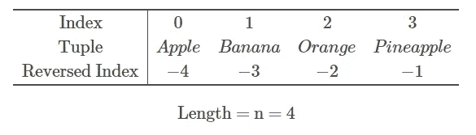

# 关于 Python 元组数据结构的一切:初学者指南

> 原文：<https://towardsdatascience.com/everything-about-python-tuple-data-structure-beginners-guide-7e2ffe47a5b7>

## 在本文中，我们将重点介绍 Python 元组数据结构的完整过程


托尔比约恩·赫尔格森在 [Unsplash](https://unsplash.com/s/photos/list?utm_source=unsplash&utm_medium=referral&utm_content=creditCopyText) 上拍摄的照片

**目录**

*   什么是 Python 元组
*   如何创建 Python 元组
*   如何从 Python 元组中访问元素
*   如何对 Python 元组切片
*   结论

# 什么是 Python 元组

Python tuple 是一种序列数据类型，它允许我们在一个逗号分隔的数据实例中组合几个项目。

元组可以包含相同或不同数据类型的元素，并且它是不可变的，这意味着我们不能在 Python 中改变元组对象在创建后的大小和内容(除非将其转换为不同的数据结构并创建新的元组)。

# 如何创建 Python 元组

用 Python 创建一个元组非常简单。你需要把所有用逗号分隔的条目放入括号中。

请记住，您可以将不同的数据类型放在一起，例如整数、浮点、布尔甚至其他元组。

这里有几个例子:

## 具有字符串元素的元组

```
Output:('Apple', 'Banana', 'Orange', 'Pineapple')
```

## 具有整数元素的元组

```
Output:(1, 2, 3, 4)
```

## 具有混合类型元素的元组

```
Output:('Apple', 1, True, 2.4)
```

## 具有嵌套元素的元组

在上面的例子中，元组中的每一项只包含一个值。

如果我们希望每个项目存储两个值呢？Python 元组也允许我们这样做！

例如，您想创建一个产品及其价格的元组。您的数据如下:一个苹果的价格是 1 美元，一个香蕉的价格是 0.70 美元。

为了给元组中的每个项目添加两个或更多的值，我们需要将它们放在括号中，并用逗号分隔。

看起来像是在一个元组中有一个元组(嵌套的):

```
Output:(('Apple', 1), ('Banana', 0.7))
```

# 如何从 Python 元组中访问元素

Python 元组的一个重要且非常有用的属性是它是一个索引序列，这意味着对于一个有 **n** 个元素的元组，第一个元素的索引= 0，第二个元素的索引= 1，一直到 *n* -1。

## 使用索引访问元组中的元素

索引也可以反过来，这意味着第一个元素的索引= — *n* ，第二个元素的索引= — *n* +1，一直到-1。

为了便于展示，请看下面的视觉效果:



作者图片

我们可以看到元组中的' Apple '元素有两个索引:0 和-4。

让我们用 Python 重新创建这个元组:

现在，我们想打印出元组中的第一个元素。

从前面我们知道，它有两个索引:0 和-4，所以我们可以两个都尝试，看看输出是否相同。

```
Output:Apple
Apple
```

## 在元组中查找元素

假设我们有以下包含字符串元素的元组:

```
Output:('Apple', 'Banana', 'Orange', 'Pineapple')
```

并且您想要查找“香蕉”元素的索引。

这可以通过使用**简单地找到。index()** 方法将某个值作为参数，并在 Python 元组中找到它的索引:

```
Output:1
```

我们很快发现“Banana”元素位于元组的索引 1 处。

# 如何对 Python 元组切片

在前一节中，我们展示了如何使用精确索引从 Python tuple 中访问元素。

在这一节中，我们将展示当您想要访问某个范围的元素时，例如，前两个或后两个元素，该怎么做。

回想一下，为了使用索引从元组中检索元素，我们将它放在方括号 **[]** 中。

切片使用相同的方法，但是我们不是传递单个索引值，而是传递一个范围。

Python 中的一个范围使用以下语法传递 **[** *从* **:** *到***。**

## **不指定 from 和 to 的切片**

**如果从到*到*你不放任何索引到*，默认情况下 Python 会取整个元组。***

**下面两行代码产生了相同的输出:**

```
Output:('Apple', 'Banana', 'Orange', 'Pineapple')
('Apple', 'Banana', 'Orange', 'Pineapple')
```

## **通过指定 from 进行切片**

**您可以通过从中指定*来分割一个元组，它将从您指定的索引中获取元素，直到元组结束。***

**例如，您希望打印元组中的最后两个元素。请记住，您可以同时使用索引和反向索引。**

```
Output:('Orange', 'Pineapple')
('Orange', 'Pineapple')
```

## **指定为的切片**

**您可以通过将*指定为*来分割一个元组，它将从元组的开头开始获取元素，直到您指定的索引处的元素-1。**

**例如，您希望打印元组的前两个元素。请记住，您可以同时使用索引和反向索引。**

**以下代码将产生所需的输出:**

```
Output:('Apple', 'Banana')
```

**注意这里，我们将*指定为* index = 2，重要的是要记住 index = 3 实际上是第三个元素的位置。Python 中元组切片的工作方式是遍历元素，直到指定的*到*索引(在我们的例子中是 2 ),并包括该索引之前的所有元素，但不包括*到*索引下的元素。**

# **结论**

**本文是对 [Python](https://www.python.org/) 元组数据结构及其功能的介绍性演练，学习这些数据结构及其功能非常重要，因为它们在[编程](https://pyshark.com/category/python-programming/)和[机器学习](https://pyshark.com/category/machine-learning/)的许多领域中都有使用。**

**如果你有任何问题或对一些编辑有建议，请随时在下面留下评论，并查看更多我的[数据结构](https://pyshark.com/category/data-structures/)文章。**

***原载于 2022 年 3 月 19 日*[*【https://pyshark.com】*](https://pyshark.com/python-tuple-data-structure/)*。***