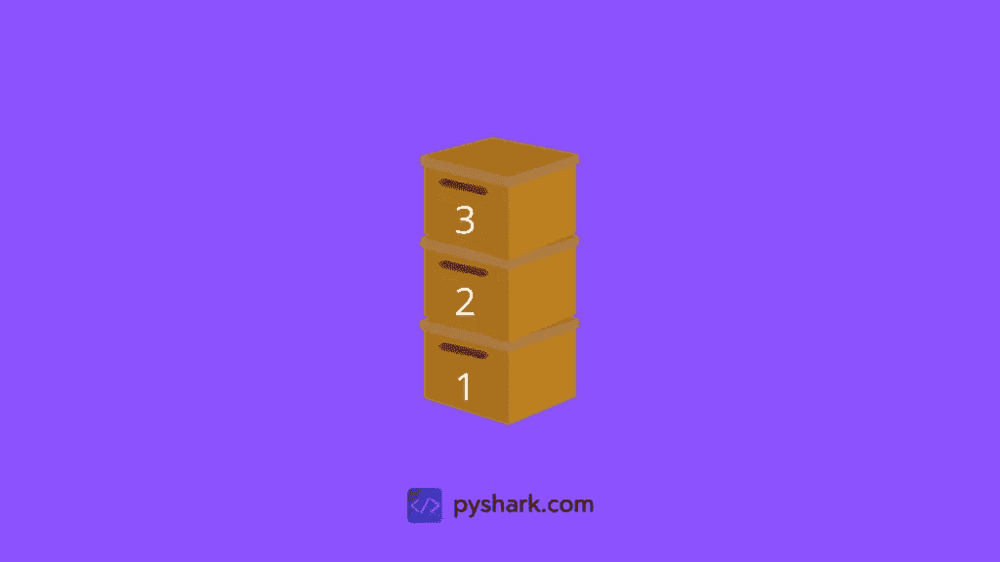
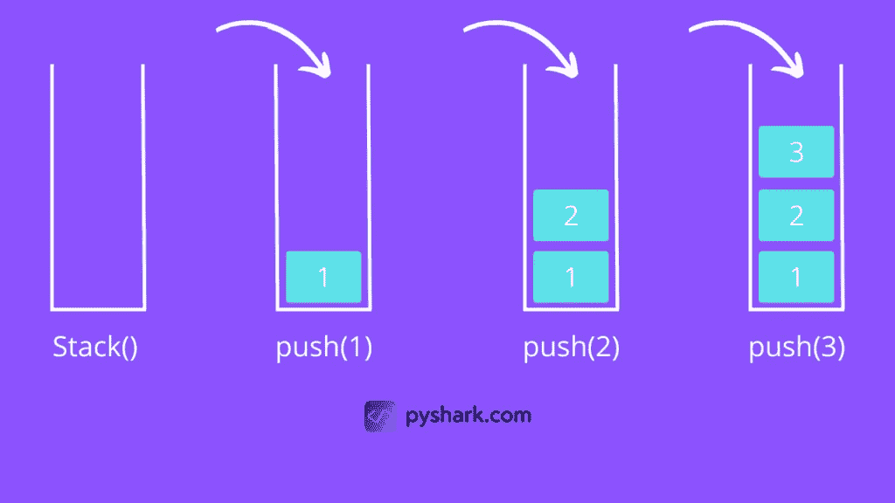
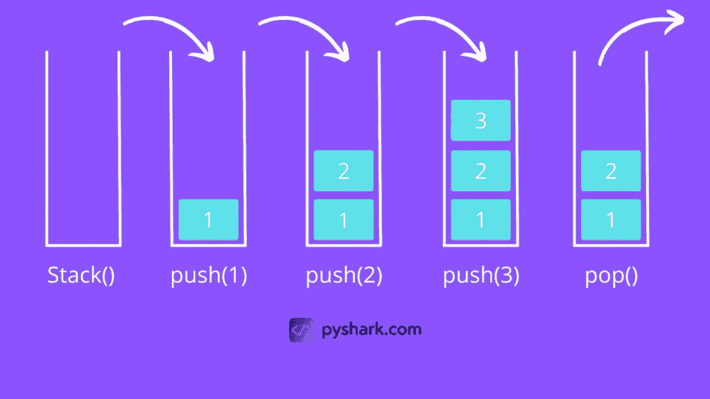

# Python 中关于栈数据结构的一切

> 原文：<https://towardsdatascience.com/everything-about-stack-data-structure-in-python-e0e6e6ec2ff3>

## 在本文中，我们将重点介绍 Python 堆栈数据结构的完整过程。


伊瓦·拉乔维奇在 [Unsplash](https://unsplash.com/s/photos/stack?utm_source=unsplash&utm_medium=referral&utm_content=creditCopyText) 上的照片

**目录**

*   什么是堆栈
*   如何在 Python 中创建堆栈
*   如何在 Python 中检查堆栈是否为空
*   如何在 Python 中向堆栈添加元素
*   如何在 Python 中从堆栈中移除元素
*   结论

# 什么是堆栈

堆栈是一种类似数组的数据结构，它使用后进先出(LIFO)方法存储项目。

你可以想象一下储物盒，每个盒子放在另一个盒子上面，就像这样:



作者图片

正如你所看到的，盒子是按照以下顺序添加的:1 -> 2 -> 3，其中盒子 3 是最后添加的。

现在，如果我们想要得到盒子 1，我们将需要首先除去盒子 3，然后盒子 2，然后得到盒子 1，使它成为一个相反的顺序:3 -> 2 -> 1。

上面的例子显示了后进先出原则背后的方法论:最后添加的项目将首先被删除。

# 如何在 Python 中创建堆栈

在 Python 中创建堆栈有多种方式:

*   使用[列表](https://pyshark.com/python-list-data-structure/)
*   使用[链表](https://pyshark.com/linked-list-data-structure-in-python/)
*   使用 collections.deque
*   使用队列。LifoQueue

在本教程中，我们将使用最简单的方法，并使用列表数据结构在 Python 中创建堆栈。

创建一个空栈与使用方括号 **[]** 在 Python 中创建一个列表是一样的。

让我们从创建一个新类并将其初始化为一个空堆栈开始:

然后，我们将创建一个空堆栈并打印输入输出:

您应该得到:

```
[]
```

# 如何在 Python 中检查堆栈是否为空

在处理堆栈时，我们经常需要知道它们是否为空，这是一些操作的要求。

例如，当[从栈](https://pyshark.com/stack-data-structure-in-python/#how-to-remove-elements-from-a-stack-in-python)中移除元素时，我们需要确保有元素要移除(因为我们不能从空栈中移除元素)。

因为我们的栈数据结构的实现是基于 [Python 列表](https://pyshark.com/python-list-data-structure/)的，所以我们可以简单地检查栈的长度来确定它是否为空。

在本节中，我们将实现一个方法 **check_empty()** ，用于检查 **Stack()** 类的堆栈中是否有元素。

它将被添加为 **Stack()** 类的方法:

我们可以用一个空栈来测试它:

您应该得到:

```
True
```

# 如何在 Python 中向堆栈添加元素

一旦我们有了一个栈，我们就可以开始向它添加元素。

这个堆栈操作被称为**将**推入堆栈。

因为我们的栈是作为一个列表创建的，所以我们可以使用**。添加元素的[Python 列表的 append()](https://pyshark.com/python-list-data-structure/#appending-items-to-a-list)** 方法。

在这一节中，我们将实现一个方法 **push()** ，用于向 **Stack()** 类的堆栈中添加元素。

它将被添加为 **Stack()** 类的方法:

让我们创建与示例部分相同的堆栈，并打印出堆栈的元素:

您应该得到:

```
[1, 2, 3]
```



作者图片

# 如何在 Python 中从堆栈中移除元素

一旦我们有了一个包含元素的堆栈，我们可能想要从堆栈中移除一些元素。

回想一下，堆栈使用 LIFO(后进先出)方法，这意味着我们只能在每次迭代中删除堆栈顶部的元素。

这个堆栈操作被称为从堆栈中弹出。

因为我们的栈是作为一个列表创建的，所以我们可以使用**。用于[移除元素](https://pyshark.com/python-list-data-structure/#removing-items-from-a-list-using-index)的 Python 列表的 pop()** 方法。

在本节中，我们将实现一个方法 **pop()** ，用于从 **Stack()** 类的堆栈中移除元素。

它将被添加为 **Stack()** 类的方法:

让我们测试创建与前面章节中的[相同的堆栈，然后弹出一个元素并打印出堆栈的元素:](https://pyshark.com/stack-data-structure-in-python/#how-to-add-elements-to-a-stack-in-python)

您应该得到:

```
[1, 2]
```



作者图片

# 结论

这篇文章是一篇介绍性的演练，介绍了 [Python](https://www.python.org/) 中的堆栈数据结构及其功能，学习这些功能很重要，因为它们在[编程](https://pyshark.com/category/python-programming/)和[机器学习](https://pyshark.com/category/machine-learning/)的许多领域中使用。

如果你有任何问题或者对编辑有任何建议，请在下面留下你的评论，并查看更多我的[数据结构](https://pyshark.com/category/data-structures/)文章。

*原载于 2022 年 4 月 15 日 https://pyshark.com**的* [*。*](https://pyshark.com/stack-data-structure-in-python/)