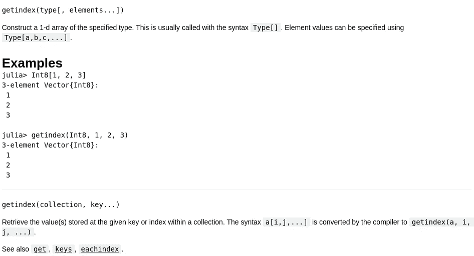

# 关于 Julia 中的索引，您需要知道的一切

> 原文：<https://towardsdatascience.com/everything-you-need-to-know-about-indexing-in-julia-b0a695de45b7>

## 关于 Julia 中索引的所有细节的概述


(图片由 Pixabay 上的 DavidZydd 提供)

# 介绍

在编程领域，尤其是数据科学领域，使用由更小元素组成的数据结构是很常见的。正如人们所料，这些集合需要以某种方式从集合外部进行交互——为此，程序员使用索引。索引是一个至关重要的编程主题，它在特定语言中的深度总是很大的学问。很多时候，当谈到对编程语言的熟悉和了解时，归结为使用一段时间后对调用的了解。

幸运的是，在本文中，我将介绍一些非常抽象的方法。也就是说，包含类型的类型定义对于什么类型可以通过该函数传递是非常模糊的。在朱莉娅，最大的错误是

> 方法错误

我们也可以用索引来解决这些问题。有一种使用索引的核心方法是 Julia 独有的，而且以我个人的经验来看非常简单。与其他生态系统相比，这种方法似乎非常适合。此外，如果您想查看包含本文代码的笔记本，您可以从 Github 仓库获得它:

<https://github.com/emmettgb/Emmetts-DS-NoteBooks/blob/master/Julia/Julia%20Indexing.ipynb>  

# 索引

Julia 内部的每种类型都可以被索引，信不信由你。即使对于不是集合的类型也是如此，我们将演示这一点。然而，让我们先来看看更简单的东西，比如基本的数组索引。我们可以使用一个整数作为数组中的一维参考点进行索引。如果数组是有序的，这尤其有用。

```
array = [1, 2, 3, 4, 5]
array[1]1
```

现在要澄清的是，我们没有得到一个值，因为在这个例子中，我们通过索引传递了一个值，我们得到一个值，因为这是数组中的第一个值。例如，如果我们把 1 改成 5:

```
array = [5, 2, 3, 4, 5]
array[1]5
```

我们还可以通过范围进行索引:

```
array[1:5]5-element Vector{Int64}:
 1
 2
 3
 4
 5
```

如果这个集合是一个字典，我们也可以通过键(不管是什么类型)进行索引。)如果你想更多地了解 Julia 的各种数据结构，你可以在这里阅读或观看:

</in-depth-look-at-data-structures-in-julia-d22171a8f5ed>  

对于要提供的类型的完整列表，我们实际上可以对一个方法打上问号。索引调用的方法是来自 base 的 getindex()方法。让我们在上面调用文档浏览器:

```
?(getindex)
```



我们也可以设置索引。这将调用 setindex！()方法，它有一个解释点，因为它会改变我们发送给它的类型。让我们继续导入 getindex()和 setindex！()直接从基础开始，以便我们可以扩展它们:

```
import Base: getindex, setindex!
```

现在，只需使用典型的 Julia 分派方法，我们就可以设置任何结构来拥有我们想要的任何类型的索引。

```
mutable struct NotACollection
    x::Int64
end
```

我们构造的类型根本不是这样一个集合，相反，它只是在里面有一个整数。它实际上是一个非常无用的构造函数。不管怎样，我们现在要把它分派到索引任何东西都会返回 x 的地方，只有一个索引，我不知道你想让我说什么。

```
getindex(notcol::NotACollection, y::Int64) = notcol.xnotacol = NotACollection(5)
```

现在，如果我们调用我们的类型的索引，它肯定不是一个集合，我们得到的数字，并没有大惊小怪:

```
notacol[1]
5
```

如果您在没有首先扩展 getindex()的情况下这样做，这段代码将返回一个 MethodError。现在，为了好玩，我们将对 setindex 做同样的事情！():

```
setindex!(notcol::NotACollection, y::Int64, val::Int64) = notcol.x = ynotacol[1] = 10println(notacol[x])
```

# 索引方法

现在让我们看看一些有用的方法，它们可以用来处理基本的数据结构和改变它们的索引。我认为这些是 Julia 的基本知识，所以我真的很高兴与你分享这些令人敬畏的基本方法。这些是我所知道的随时会派上用场的一些工具。

## 大小()

第一种方法是 size()。这个方法相当于 Python 中的 shape()。这将给出给定数组或矩阵的维数。虽然我们还没有深入多维数组，但是 size()对于处理多维数组来说将会非常方便。也就是说，保持这种方法及其使用方便，当然可以适用于一维或多维应用程序。

```
nums = [54, 33, 22, 13]
size(nums)(4,)
```

返回类型是一个二元元组，我们可以对其进行索引:

```
println(typeof(size(nums)))Tuple{Int64}println(size(nums)[1])4
```

## 用力！()

用力！()方法是 Julia 语言中最有用的方法之一。这个方法的伟大之处在于它被定义在类型层次结构的顶端。这意味着可以将哪些类型传递给 push！()通常非常抽象。这种抽象意味着可以提供许多不同的类型。然而，这确实带来了一些可能需要注意的细微差别。朱莉娅的伟大之处还在于我们可以改变语言。

用力！()方法用于将新元素移动到结构中。它可以处理字典、数组和各种其他数据类型——几乎是你能想到的任何数据类型。推动的伟大之处在于！()除非你尝试，否则你永远不知道它是否会起作用，如果它不起作用，你可以随时写你自己的推！()来照顾它。让我们在我们的阵列上尝试一下:

```
push!(nums, 5)5-element Vector{Int64}:
 54
 33
 22
 13
  5
```

实际上，我写了一整篇文章来深入讨论这个问题！()方法，所以如果您碰巧对阅读这种方法及其各种细微差别感兴趣，您可以在这里阅读:

## 追加！()

追加！()方法很类似于推送！()方法。喜欢推！()方法，追加！()方法将元素添加到给定的数组中。然而，一个关键的区别是附加！()会尽可能避免变异命令，推！()不会。追加！()方法对于它应该使用的类型来说也更加明确和具体。通常，它用于简单数据类型的数组。让我们看一下我们阵列的一个示例:

```
append!(nums, 5)
6-element Vector{Int64}:
 54
 33
 22
 13
  5
  5
```

注意，因为我们的数组是 Vector{Int64}类型的，所以我们只能通过这个函数推送整数。我们也可以推送可以转换成整数的数字，但是在大多数情况下，我们需要在提供它们之前进行类型转换。

```
append!(nums, 5.5)InexactError: Int64(5.5)
```

铸造那种类型产生它确实工作:

```
append!(nums, 5.5)
```

但是，如果该结构将包含多种类型，更好的方法可能是将整个结构强制转换为包含{Any}:

```
nums = Array{Any}(nums)
append!(nums, 5.5)
```

## 滤镜！()

Julia 中的 filter 方法是另一个非常常用的方法。这一点在使用统计数据时尤其有用。想想熊猫数据框面具，它实际上成了我最喜欢的熊猫特写的一部分:

</20-great-pandas-tricks-for-data-science-3a6daed71da0>  

> 但是，过滤！()在 Julia 中是等价的。也哇，一年多前。

我和过滤器有些小问题！()，这并不是说我不喜欢这种方法——我只是觉得使用起来比其他界面更烦人。Julia 倾向于在它所做的许多事情上出类拔萃，并使事情对程序员来说变得超级容易——但这是一个例子，我认为学会这一点比学会另一种语言更难，那就是 Python。幸运的是，我希望进行的修改的语法非常容易完成，布尔索引现在可以在我目前正在开发的包 OddFrames.jl 中找到，您也可以在这里查看 Github 页面:

<https://github.com/ChifiSource/OddFrames.jl>  

```
filter((x) -> x == 5, nums)
```

对于这个方法，我们使用一个叫做匿名函数的东西作为它的第一个参数，为了更全面地了解这个概念，您可以在这里阅读一篇深入研究它们的文章:

</what-on-earth-is-an-anonymous-function-f8043eb845f3>  

在本文的稍后部分，我们还将更多地涉及它们，但是现在我们将简单地观察我们的过滤值:

```
filter((x) -> x == 5, nums)2-element Vector{Any}:
 5
 5
```

## 收集()

像 collect 这样的方法通常很难解释，但是 collect 可以用来快速地从某种生成器或进程中获取值。本质上任何能够返回 iterable 的东西。如果我们有范围

```
r = 5:10
```

我们想得到一个从 5 到 10 的数组，我们可以简单地调用 collect 来得到结果

```
collect(r)6-element Vector{Int64}:
  5
  6
  7
  8
  9
 10
```

## findall()

芬多。()方法是一种我可以非常肯定地说非常有用的方法。有很多这样的呼吁，所以用 ole 问号’是一个很好的例子:

```
?(findall)
```

实际上，我在 OddFrames.jl 中多次使用这种方法。对于我将要演示的示例代码，我们将查看 OddFrames.jl 的 [index_iter.jl 文件，您可以通过单击该文本来查看。](https://github.com/ChifiSource/OddFrames.jl/blob/main/src/interface/index_iter.jl)

```
function getindex(od::AbstractOddFrame, col::Symbol)
        pos = findall(x->x==col, od.labels)[1]
        return(od.columns[pos])
end
getindex(od::AbstractOddFrame, col::String) = od[Symbol(col)]
getindex(od::AbstractOddFrame, axis::Int64) = od.columns[axis]
function getindex(od::AbstractOddFrame, mask::BitArray)
        pos = findall(x->x==0, mask)
        od.drop(pos)
end
getindex(z::UnitRange) = [od.labels[i] for i in z]
```

这段代码是几个 getindex()调度绑定。您可能还记得前面的 getindex()。OddFrames.jl 处理数组中的一维数组，这些数组可以相互堆叠，但不能。findall()方法在这里使用了两次。第一种情况是用符号调用索引时:

```
od[:column]
```

在这个例子中，findall()方法向我们返回等同于这样一个东西的任何实例的索引。出于某种原因，我见过的许多 Julia 代码在操作符周围没有使用空格，因此我采用了它——尽管我认为这不合适，所以让我把它写得更容易阅读一些:

```
pos = findall(x -> x == col, od.labels)[1]
```

我们所做的就是试图找到一个与该值相等的标签，我们首先使用:

```
x -> x
```

这告诉 Julia 我们想要创建一个匿名函数。现在这个 x 是一个变量，我们已经定义了一个函数，它将返回一个 BitArray。BitArray 只是一种保存布尔真/假值的数组，通常为 1 和 0。1 和 0 都只占用一位，因此这被称为双数组。也许我可以简单的解释一下，说它是一个二进制数组。无论如何，我们的数组是直接从这里返回的:

```
x == col
```

然后，我们遍历 od.labels，看看是否有匹配的值。由于 OddFrame 中的标签不能相同，我们总是知道如果在 OddFrame 中没有找到它，那么它要么是一个值，要么没有值。给定这些信息，我在最后调用第一个索引，这将把我们的值的类型从数组{Int64，1}变成 Int64。然后我们简单地在返回中调用该列的索引:

```
function getindex(od::AbstractOddFrame, col::Symbol)
        pos = findall(x->x==col, od.labels)[1] 
       return(od.columns[pos])
end
```

向前跳一点，我们看到条件掩码也使用了同样的方法:

```
function getindex(od::AbstractOddFrame, mask::BitArray)
        pos = findall(x->x==0, mask)
        od.drop(pos)
end
```

唯一的区别是，这次 findall()用于收集需要删除的位置，然后在 od.drop()方法中使用这个列表中的下一个方法来删除那个值。

对于我们的笔记本示例，我们将获得等于 5 的每个值:

```
z = findall(x -> x == 5, nums)
array = [nums[x] for x in z]
```

## 删除 at！()

我想看的最后一个方法是 deleteat！()方法。如前所述，我们将在 OddFrames.jl 中查看这个示例。我们还将在笔记本中做另一个示例。OddFrames 示例位于 OddFrames 存储库中的 [member_func.jl 文件中，再次单击此文本。](https://github.com/ChifiSource/OddFrames.jl/blob/main/src/type/member_func.jl)删除 at！()方法就是用来做这件事的，在特定的索引处删除。

> 我知道有人在某处不断读到，当你吃东西的时候，要知道你并不孤单。也许我们只是饿了。

该方法简单易用，只需提供一个集合和一个索引:

```
function _drop(row::Int64, columns::Array)
        [deleteat!(col, row) for col in columns]
end
```

在这种情况下，这是通过迭代循环完成的，并对提供的向量进行变异。虽然这样做有回报，但并不意味着要使用它——也许我应该在此之后返回，以确保这一点得到理解。对于我们的笔记本电脑示例，我们将删除整个阵列:

```
while length(nums) > 1
    deleteat!(nums, 1)
endprintln(nums)Any[5.5]
```

> 安息吧。

## 这么多方法

当然，处理这类类型的方法有很多，所以我不可能一一描述，但是除了像 length()和 sum()等常规方法之外，我还发现了一些非常有价值的方法。除了 size()，这些都是特定于 Julia 的，所以我认为新的 Julia 用户可能会发现这些有参考价值。甚至还有横向和纵向的串联，各种矩阵运算等等。

# 结论

Julia 语言有一种非常好的处理迭代的方式。每种语言都有我欣赏的方法，但与使用 Python 类的默认方法或在 r 中完成相同的任务相比，我真的很喜欢这种方法。每当我使用其他语言时，我发现自己经常错过这些功能，这告诉我它们可能是很棒的功能。

感谢您的阅读，我很高兴能与您分享这些知识。这些是 Julia 用户第一次开始时可能不知道的一些事情，所以把这些方法带到你面前并提供更多关于在 Julia 中使用 iterable items 的信息真是太棒了。