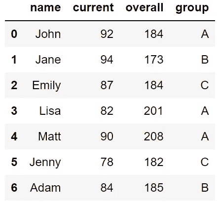
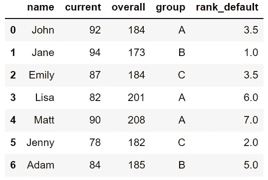
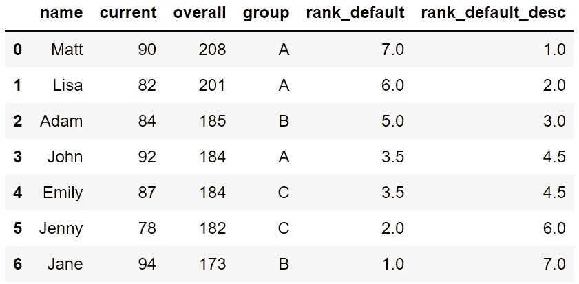
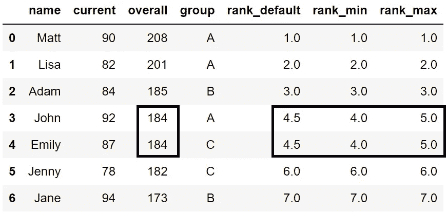
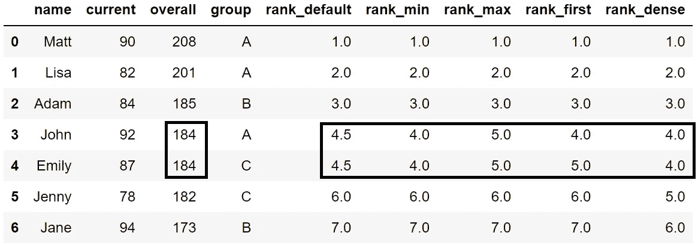
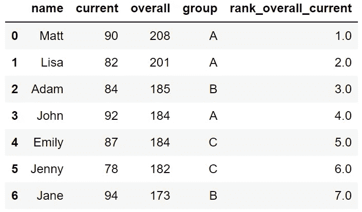
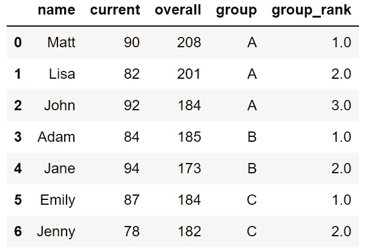

# 关于熊猫排名你需要知道的一切

> 原文：<https://towardsdatascience.com/everything-you-need-to-know-about-ranking-with-pandas-aa2ab5921c01>

## 实用指南。


约书亚·戈尔德在 [Unsplash](https://unsplash.com/s/photos/ranking?utm_source=unsplash&utm_medium=referral&utm_content=creditCopyText) 上拍摄的照片

*   前 10 个最高分
*   基于点击数的前 10 项观察
*   每个类别中最便宜的 3 件商品
*   每月的前 3 次测量
*   销售量最高和最低的日子

以上所有内容都可以通过给数据点(即行)分配一个等级来找到。幸运的是，Pandas 为我们提供了一个执行这些任务的单一函数:rank 函数。

虽然分配等级似乎是一个简单的任务，但在某些情况下，你需要稍微超出默认设置来得到你真正需要的。

在本文中，我们将通过几个例子来演示您需要了解的关于 rank 函数的所有内容以及如何正确使用它。

让我们从导入 Pandas 和创建一个示例数据框架开始。

```
import pandas as pddf = pd.DataFrame({
    "name": ["John","Jane","Emily","Lisa","Matt","Jenny","Adam"],
    "current": [92,94,87,82,90,78,84],
    "overall": [184,173,184,201,208,182,185],
    "group":["A","B","C","A","A","C","B"]
})df
```



df(作者图片)

我们创建了一个 7 行 4 列的数据帧。让我们从默认设置开始，根据整个列为行分配一个等级。

```
df["rank_default"] = df["overall"].rank()df
```



df(作者图片)

等级默认列包含等级值。关于默认设置，有两点很重要:

*   顺序是升序的，因此最低的值被指定为第一个等级。在我们的例子中，Jane 的总分最低，因此排名第一。
*   在相等的情况下，通过取平均值来确定排名。例如，John 和 Emily 的总分都是倒数第三。因为两个人得分相同，所以他们被分配的等级为 3.5，这是 3 和 4 的平均值。下一个最低分是 185，排名第 5。

这些是默认设置。让我们改变顺序，按降序排列，这样分数最高的人排在第一位。

```
df["rank_default_desc"] = df["overall"].rank(ascending=False)
df = df.sort_values(by="rank_default_desc", ignore_index=True)df
```



df(作者图片)

我们还使用 sort_values 函数根据“rank_default_desc”列对行进行了排序。这样更容易跟踪和比较这些值。

Matt 的总得分最高，因此按降序排列时，他排名第一。John 和 Emily 现在是第 4 和第 5 个人，所以他们被指定为 4.5 级，因为我们仍然在平等的情况下使用平均方法。

# 不同的排名方法

在相等的情况下，rank 函数有 5 个不同的选项。这个选项是用 method 参数选择的，默认值是“average ”,正如我们在前面的例子中看到的。

其他选项包括“最小”、“最大”、“第一”和“密集”。让我们首先将最小值和最大值与平均值进行比较。

```
# create DataFrame
df = pd.DataFrame({
    "name": ["John","Jane","Emily","Lisa","Matt","Jenny","Adam"],
    "current": [92,94,87,82,90,78,84],
    "overall": [184,173,184,201,208,182,185],
    "group":["A","B","C","A","A","C","B"]
})# create rank columns
df["rank_default"] = df["overall"].rank(ascending=False)
df["rank_min"] = df["overall"].rank(method="min", ascending=False)
df["rank_max"] = df["overall"].rank(method="max", ascending=False)# sort rows
df = df.sort_values(by="rank_default", ignore_index=True)df
```



df(作者图片)

当两行或更多行具有相同的值时，可以观察到差异。约翰和艾米丽是第四和第五个人。

*   method = "average "给出的平均值为 4.5
*   method = "min "给出的最低值是 4。
*   method = "max "给出的最高值为 5。

您可能已经注意到，在创建“rank_default”列时，我们没有编写方法参数。因为它是默认值，所以我们不需要指定它，但是如果您按如下方式编写它，它也是有效的:

```
df["rank_default"] = df["overall"].rank(method="average", ascending=False)
```

方法参数的另外两个选项是“第一”和“密集”。让我们将它们添加到当前的数据框架中，然后解释它们的作用。

```
df["rank_first"] = df["overall"].rank(method="first", ascending=False)df["rank_dense"] = df["overall"].rank(method="dense", ascending=False)df
```



df(作者图片)

*   “第一”方法根据等级出现的顺序来分配等级。在相等的情况下，数据帧中的第一个观察值取下一个值，第二个观察值取下一个值，依此类推。在我们的例子中，John 和 Emily 是第 4 和第 5 个人，所以 John 的等级是 4，Emily 的等级是 5。
*   “dense”方法类似于“min ”,但它不会在具有相同值的行和下一行之间留下任何间隙。John 和 Emily 的等级为 4，因为他们使用“min ”,但是下一个人的等级不同。Jenny 在“最小”方法中排名第 6，但在“密集”方法中排名第 5。

# 基于多列的排名

在某些情况下，我们基于多个列创建一个等级。例如，在我们的 DataFrame 中，我们可能希望同时使用 total 和 current 列中的值来分配等级。

我们可以通过从这两列创建一个元组并使用它进行排序来做到这一点。

我们可以通过对每行应用元组函数来创建元组，如下所示:

```
df[["overall","current"]].apply(tuple, axis=1)**# Output**
0    (208, 90)
1    (201, 82)
2    (185, 84)
3    (184, 92)
4    (184, 87)
5    (182, 78)
6    (173, 94)
dtype: object
```

我们用它来排名吧。

```
# create DataFrame
df = pd.DataFrame({
    "name": ["John","Jane","Emily","Lisa","Matt","Jenny","Adam"],
    "current": [92,94,87,82,90,78,84],
    "overall": [184,173,184,201,208,182,185],
    "group":["A","B","C","A","A","C","B"]
})# create rank column
df["rank_overall_current"] = df[["overall","current"]].apply(
    tuple, axis=1
).rank(ascending=False)# sort values
df = df.sort_values(by="rank_overall_current", ignore_index=True)df
```



df(作者图片)

等级是基于总体和等级的组合创建的。因为总列中的值最先出现，所以首先检查它们。如果总值相等，则考虑当前值。

例如，John 和 Emily 具有相同的总价值，但 John 的当前价值更高，因此他的排名在 Emily 之前。

# 组内排名

我们可能还需要为不同的组分配不同的等级。我创建了 group 列来演示这个案例。

我们只是需要“groupby”函数的一些帮助，该函数用于根据给定列中的不同值对行进行分组。

如果我们按组列对数据帧中的行进行分组，我们最终会将列中的不同值分为不同的组，即 A、B 和 c。然后，我们选择用于排名的列，然后应用 rank 函数。

```
# create DataFrame
df = pd.DataFrame({
    "name": ["John","Jane","Emily","Lisa","Matt","Jenny","Adam"],
    "current": [92,94,87,82,90,78,84],
    "overall": [184,173,184,201,208,182,185],
    "group":["A","B","C","A","A","C","B"]
})# create rank column
df["group_rank"] = df.groupby("group")["overall"].rank(
ascending=False)# sort values
df = df.sort_values(by=["group","group_rank"], ignore_index=True)df
```



df(作者图片)

我们现在在每个组中都有一个单独的等级。我们可以改变秩函数的方法。它将像我们迄今为止所做的例子一样工作。唯一不同的是，每一组都将单独完成。

我们已经做了几个例子来演示 rank 函数是如何使用的以及它的参数是什么意思。

*你可以成为* [*媒介会员*](https://sonery.medium.com/membership) *解锁我的全部写作权限，外加其余媒介。如果你已经是了，别忘了订阅*[](https://sonery.medium.com/subscribe)**如果你想在我发表新文章时收到电子邮件。**

*[](https://sonery.medium.com/membership)  

感谢您的阅读。如果您有任何反馈，请告诉我。*