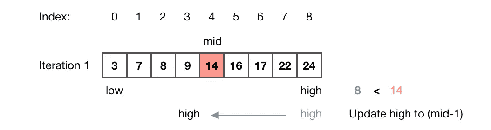
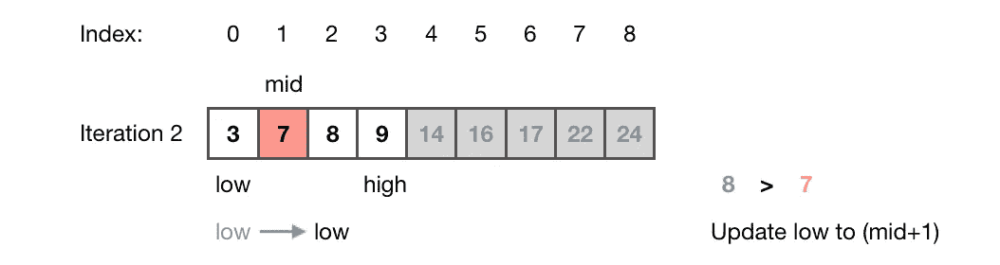
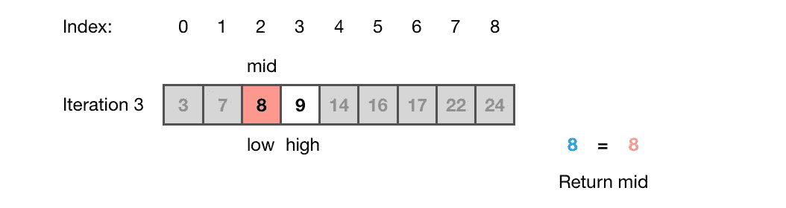
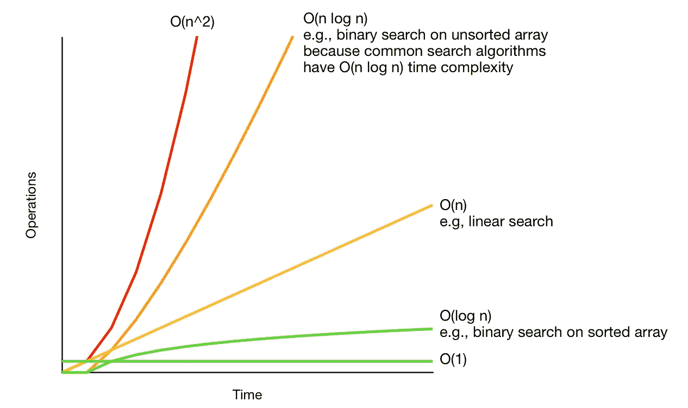
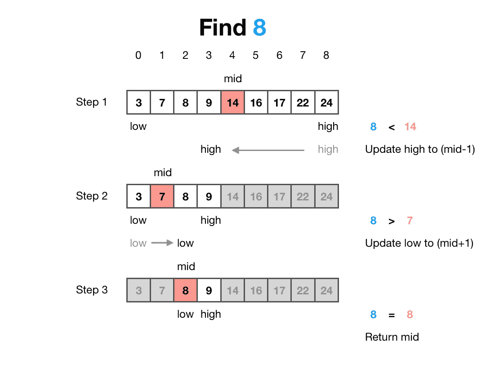

# 关于二分搜索法算法你需要知道的一切

> 原文：<https://towardsdatascience.com/everything-you-need-to-know-about-the-binary-search-algorithm-6bc4f9a3127d>

## 在 8 分钟内掌握二分搜索法算法


图片由作者提供。

你如何在英语词典中查找一个单词？我知道你不会这样做:从第一页开始，仔细阅读每个单词，直到找到你要找的那个——当然，除非你的单词是“土豚”。但是，如果你要找的词是“动物园”，这种方法将需要很长时间。

> 你如何在英语词典中查找一个单词？

更快的方法是在中间打开它，然后决定是在词典的前半部分还是后半部分继续搜索。

这种方法是二分搜索法算法的松散描述，该算法**在元素的排序列表中查找元素的位置。**它被称为二分搜索法(来自拉丁语*bīnī:*“two-by-two，pair”)，因为它在每次迭代时将数组分成两半，以缩小搜索空间。

让我们定义一下前一句话中的行话。“算法”是一种解决问题的方法，就像我们在例子中用来查找单词的方法一样。“元素”是我们正在查找的单词，“元素排序列表”是字典。它被“排序”是因为字典中的单词是按字母顺序排列的。

本文讨论了二分搜索法算法是如何在直观的层面上工作的。然后我们将看看它在 Python 和 C++中的实现以及它们的内置函数。最后，我们将讨论它与线性搜索算法相比的性能。

# 算法

这一节将让你对二分搜索法算法有一个更好的直觉。首先，我们将查看问题陈述，然后了解算法本身，最后，通过一个示例来浏览算法。

## 问题陈述

在 Leetcode 这个练习编码面试问题的平台上，二分搜索法问题表述如下[3]:

> 给定一个由 n 个元素组成的有序(升序)整数数组`nums`和一个`target`值，编写一个函数来搜索`nums`中的`target`。如果目标存在，返回其索引；否则，返回-1。

*   输入:排序数组(`nums`)和一个目标值(`target`)
*   输出:`target`值的索引

## 二分搜索法算法

二分搜索法算法的工作原理如下:

1.  将搜索空间设置为等于排序后的数组
2.  取搜索空间的中间元素，并将其与目标值进行比较。
    -如果**目标等于中间元素**，则您已经找到目标值。返回中间元素的索引并终止函数。
    -如果**目标小于中间元素**，则通过丢弃中间元素右侧的所有元素将搜索空间减半，并继续在其左侧搜索，因为数组按升序排序。重复此步骤，直到找到目标。
    -如果**目标大于中间元素**，则通过丢弃中间元素左侧的所有元素将搜索空间减半，并继续在其右侧搜索，因为数组是按升序排序的。重复此步骤，直到找到目标。
3.  如果数组中没有匹配，返回-1

## 示例演示

让我们通过一个例子来完成二分搜索法算法。在下图中，你可以看到一个排序后的数组`nums` = [3，7，8，9，14，16，17，22，24]，有 n = 9 个元素。我们要找到`target` = 8 的位置。


二分搜索法算法问题陈述(图片由作者受[迈克·巴斯](https://mikebuss.com/2016/04/21/binary-search/)【7】启发而来)

**迭代 1:**



二分搜索法算法迭代 1(图片由作者从[迈克·巴斯](https://mikebuss.com/2016/04/21/binary-search/)【7】获得灵感)

我们通过称为`low`和`high`的开始和结束索引来定义搜索空间。我们通过将`low`分配给数组中第一个元素的索引(0)并将`high`分配给数组中最后一个元素的索引(8)来设置搜索空间。

我们用公式(`low`+【T8)//2 得到数组`mid`中间元素的索引。该操作执行一个 floor 函数来实现所需的中间元素:`mid = (low + high) // 2 = (0 + 8) / 2 = 4`

中间元素的值是`nums[mid] = nums[4] = 14`，因此大于`target = 8`。因此，中间元素右侧的所有元素都可以被丢弃。我们通过将`high`更新为`(mid — 1) = 4 — 1 = 3`将搜索空间减半。

**迭代 2:**



二分搜索法算法迭代 2(图片由作者从[迈克·巴斯](https://mikebuss.com/2016/04/21/binary-search/)【7】获得灵感)

现在，我们重复步骤 2。

数组中间元素的索引现在是`mid = (low + high) // 2 = (0 + 3) / 2 = 1`。中间元素的值是`nums[mid] = nums[1] = 7`，因此小于`target` = 8。因此，中间元素左侧的所有元素都可以被丢弃。我们通过将`low`更新为`(mid + 1) = 1 + 1 = 2`，将搜索空间减半。

**迭代 3:**



二分搜索法算法迭代 3(图片由作者从[迈克·巴斯](https://mikebuss.com/2016/04/21/binary-search/)【7】获得灵感)

同样，我们重复步骤 2。

数组中间元素的索引现在是`mid = (low + high) // 2 = (1 + 3) / 2 = 2`。

中间元素的值是`nums[mid] = nums[2] = 8`，因此等于`target` = 8。我们返回`mid = 2`作为目标的位置并终止函数。

# 履行

在这一节中，您将看到二分搜索法算法在 Python 和 C++中最基本的实现。我们还将**看看 Python 和 C++** 中内置的二分搜索法函数。

二分搜索法算法有不同的实现方式[4]。但是，本文将只讨论**初等迭代实现**，这也是最常见的实现。

## 计算机编程语言

Python 实现如下所示:

用 Python 实现的二分搜索法算法

您可以使用 Python [5]中的`bisect`模块中的`bisect_left()`函数，而不是编写自己的二分搜索法函数。

```
from bisect import bisect_lefti = bisect_left(target, nums) 
```

## C++

C++实现如下所示:

二分搜索法算法的 C++实现

在 C++中，标准模板库(STL)提供了函数`lower_bound()`，可以按照下面的例子[2]使用。还有函数`binary_search()`，它返回一个布尔值，不管`target`是否存在于排序后的数组中，但不返回它的位置[1]。

```
#include <algorithm>i = std::lower_bound(nums.begin(), nums.end(), target);
```

# 讨论

二分搜索法算法的时间和空间复杂度是:

*   **时间复杂度与 O(log n)** 成对数关系【6】。如果 n 是输入数组的长度，二分搜索法算法最坏情况下的时间复杂度是 O(log n ),因为它是通过在每次迭代中将搜索空间减半来执行的。例如，如果我们想要在长度为 8 的数组中找到一个元素，在最坏的情况下将需要 log₂(8 = 3 次迭代。
*   **空间复杂度与 O(1)** 不变。因为该算法需要用于三个索引、`mid`、`low`和`high`的空间，但是每次迭代不需要额外的空间。

与线性搜索算法相比，二分搜索法算法的主要优势在于其速度。因为线性搜索算法的概念是遍历数组直到找到目标元素——就像从英文字典的第一页开始查找特定的单词一样——**线性搜索算法的时间复杂度与 O(n)** 成线性关系。

例如，如果我们想要从前面长度为 8 的示例中找到数组中的元素，在最坏的情况下将需要 n = 8 次迭代。二分搜索法算法只需要三次迭代。

然而，二分搜索法算法的主要**缺点**是它需要一个有序数组在每次迭代中丢弃一半的搜索空间。尽管可以在运行二分搜索法算法之前对数组进行排序，但排序算法会增加总的时间复杂度。一般来说，排序的时间复杂度为 O(n log n)，比线性搜索算法的线性时间复杂度更差。

下面，您可以看到二分搜索法算法、线性搜索算法和二分搜索法算法的时间复杂性，以及作为预处理步骤的附加排序:



大 O 总结(图片由作者启发[8])

# 结论

开发算法的最佳方法是将问题分解成你已经知道如何解决的算法，比如搜索和排序。这就是为什么理解二分搜索法算法可以帮助你编写更好的算法——无论你是软件工程师、数据科学家还是其他任何开发算法的人。

> **理解二分搜索法算法可以帮助你写出更好的算法——无论你是软件工程师、数据科学家还是其他人**

这篇文章解释了二分搜索法算法是如何工作的。该算法在排序列表中查找元素。因为搜索空间是排序的，所以该算法在每次迭代后丢弃一半的搜索空间。因此，我们将搜索空间减半，直到找到目标元素。您可以在下面看到算法的直观总结。



如何在数组中二分搜索法为数字 8(图片由作者受迈克·巴斯的启发而创作)

在排序列表上，二分搜索法算法比线性搜索算法更有效。它具有对数时间复杂度和常数空间复杂度。

# 喜欢这个故事吗？

*如果你想把我的新故事直接发到你的收件箱，* [*订阅*](https://medium.com/subscribe/@iamleonie) *！*

*成为媒介会员，阅读更多其他作家和我的故事。报名时可以用我的* [*推荐链接*](https://medium.com/@iamleonie/membership) *支持我。我将收取佣金，不需要你额外付费。*

[](https://medium.com/@iamleonie/membership)  

*在* [*上找我*](https://twitter.com/helloiamleonie)*[*LinkedIn*](https://www.linkedin.com/in/804250ab/)*[*ka ggle*](https://www.kaggle.com/iamleonie)*！***

# **参考**

**[1]“c++参考”，“std::binary_search。”cppreference.com。[https://en.cppreference.com/w/cpp/algorithm/binary_search](https://en.cppreference.com/w/cpp/algorithm/binary_search)(2022 年 7 月 2 日访问)**

**[2]《c++参考》，《std::lower_bound》cppreference.com。[https://en.cppreference.com/w/cpp/algorithm/lower_bound](https://en.cppreference.com/w/cpp/algorithm/lower_bound)(2022 年 7 月 2 日访问)**

**[3]李特码，“704。二分搜索法。”leetcode.com。https://leetcode.com/problems/binary-search/[(2022 年 7 月 2 日访问)](https://leetcode.com/problems/binary-search/)**

**[4]李特码，“了解二分搜索法”。leetcode.com。[https://leetcode.com/explore/learn/card/binary-search/](https://leetcode.com/explore/learn/card/binary-search/)(2022 年 7 月 2 日访问)**

**[5]“Python”，“二等分—数组二等分算法。”python.org。[https://docs.python.org/3/library/string.html#formatspec](https://docs.python.org/3/library/bisect.html)(2022 年 7 月 2 日访问)**

**[6] S. Selkow，G. T. Heineman，G. Pollice,《算法概述》( 2008 年), O'Reilly Media。**

**[7] M .巴斯，“在斯威夫特与二分搜索法分而治之”，mikebuss.com。[https://mikebuss.com/2016/04/21/binary-search/](https://mikebuss.com/2016/04/21/binary-search/)(2022 年 7 月 2 日访问)**

**[8]“大 O 小抄”，“了解你的复杂性！”，bigocheatsheet.com。https://www.bigocheatsheet.com/[(2022 年 7 月 2 日访问)](https://www.bigocheatsheet.com/)**