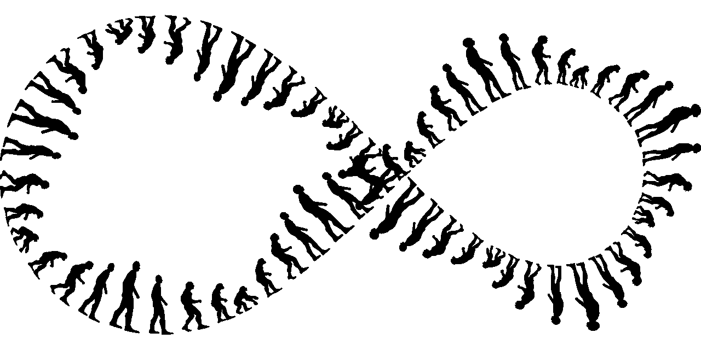

# 关于 Python 中的类型继承，你需要知道的一切

> 原文：<https://towardsdatascience.com/everything-you-need-to-know-about-type-inheritance-in-python-2e173277ff22>

## Python 中类型继承及其用法概述



(图片由 [Pixabay](http://pixabay.com) 上的 [GDj](https://pixabay.com/images/id-4911164/) 提供)

# 介绍

在 Python 中，类型化是我们经常考虑的事情。虽然 Python 的强类型可能不会反映科学计算的其他语言，但它们仍然有用户对这种语言的需求和期望。也就是说，Python 是目前最受欢迎的科学计算语言，具有最迷人的生态系统，所以 Python 可能确实有一个完美的类型系统来处理这种事情。

不管怎样，关于 Python 的类型，我们可以肯定的一点是，它们非常具有声明性和动态性。也就是说，由于类型化是在执行时完成的，而不是在编译时完成的，所以用 Python 进行类型化肯定会有一些细微差别。今天，我将演示 Python 中的类型，并解释如何将所有这些结合在一起形成一个普通的脚本语言会话——以及我们可以对我们的类型进行什么类型的转换、断言和观察。

# 对象介绍

在 Python 中，类型通常不被称为类型，它们被称为对象。令人担忧的是，当听到单词 types 时，有多少只有 Python 程序员会感到担心，但这只是一个术语，它在功能上与更广泛的计算领域中的类等效物相同。也就是说，我将在本文中不断地提到“类型”和“类型系统”，所以要知道 Python 的翻译就是“对象”

Python 中的对象就像其他编程语言中的常规数据结构。我们为其创建一个构造函数。Python 中唯一显著的区别是在定义构造函数本身的时候。我们有一些典型的、面向对象的“类”语法。然而，有些事情是不同的；首先，有一些神奇的东西叫做 decorators，它们既可以促进元编程，也可以对 Python 类型的能力做一些很酷的事情。我们可以通过使用 type()函数获得任何 Python 对象类型的名称。一个重要的注意事项是 type()不区分子类型，因此如果您的类继承了另一个类的属性，它仍将被视为其父类型。这种子类型、面向对象的方法中使用了一个主要思想，称为 Liskov 替换原则。这个原则规定子类型应该能够代替它们的父类型。当您考虑到父类只是属性的抽象，为了一致性，这些属性应该理想地应用于它下面的类型时，这是很有意义的。

下面是一个基本子类和常规类的例子。

```
class Person():
    def show(self):
        print("This is class")

class Em(Person):
    def anotherfunction(self):
        print("This is subclass of Person")
```

Person 类是 Em 的父类。我们用括号表示，然后提供父类。然后，Em 类继承了 Person 的所有代码，这意味着我们不需要重写所有代码来创建更多这样的子类。如果我们要从构造函数 Em 初始化一个新的对象，那么它将有 show()函数可用。

# 在 Python 中 type 实际上是什么意思？

类型之类的东西在每种语言中都有特定的含义。在 Python 中，程序员与其他语言中的类型更加分离。尽管如此，Python 也是动态和强类型的。动态类型化仅仅意味着定义可以在运行时改变它们的类型，这可能是数据科学等领域所希望的。然而，强类型可能是你需要多加注意的事情。强类型仅仅意味着如果我们不直接要求，我们定义的名字的类型不会改变。

除了确定给定类的方法和属性之外，在 Python 中输入实际上没什么用。与其他语言相比，Python 中的类型和函数是非常分离的。这既是一件好事，也是一件坏事，因为这可能意味着类型更容易被错误地作为参数提供。从这个意义上来说，好的文档是必不可少的，所以这是使用 Python 时需要注意的一件重要事情。除了类型及其内容的实际构造之外，类型在与代码的其余部分进行交互时应用最少。当然，某些方法意味着不同的事情，但问题是 Python 不会告诉你什么时候你提供了错误的类型参数。为此，您确实需要依赖文档，这当然不是我的偏好。如果你想了解更多这方面的内容，我有一整篇文章专门讨论为什么你应该用 Python 输入你的参数，以及这实际上能做什么。

</why-type-your-arguments-in-python-5bf24d7201eb>  

# 结论

这就是类型的核心思想以及它们在 Python 中的工作方式。它在很多方面与 C++非常相似，作为一个 C++的超级粉丝，我当然可以支持它。继承是一件非常有价值的事情，不仅对于方法，对于属性也是如此。我不认为 Python 有最好的类型系统，但是每种类型系统使用起来都有很多优点和缺点。使用 Python 的子类型、基于 Simula 的类型和继承系统的优点是，您可以非常容易地继承类属性。然而，缺点是您不能控制哪些属性被继承。然而，回到利斯科夫原理，这很有意义。非常感谢您的阅读，我希望这是对 Python 中类型的全面概述。