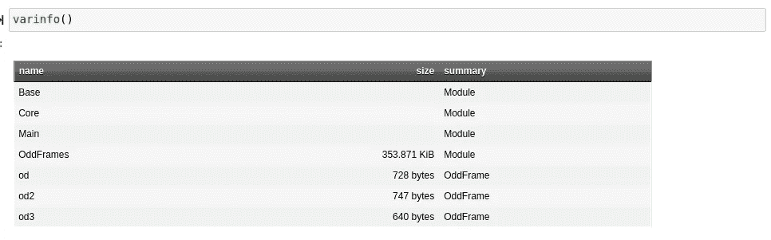

# 关于 Julia 中的类型，你需要知道的一切

> 原文：<https://towardsdatascience.com/everything-you-need-to-know-about-types-in-julia-84f64c0f86f3>

## 对 Julia 中类型系统的全面概述，以及一些你需要了解的关键内容。


(图片由[像素窗口](http://pixabay.com)上的[剪贴画向量](https://pixabay.com/images/id-144980/)生成)

# 介绍

在我看来，作为一种动态类型语言，在 Julia 中仍然需要考虑很多类型。这实际上是我比其他语言更喜欢的东西，其他语言有时会试图隐藏类型并隐式地为你改变类型。JavaScript 中的这类东西把我逼到了疯狂的边缘，所以像 Julia 的(令人惊奇的)类型系统是非常令人耳目一新的。来自许多其他语言，我觉得 Julia 的类型系统非常健壮，可能是我用过的最好的一个。

然而，对于任何动态类型化的类型系统，类型如何被持有以及如何被改变和操作的特定设计必然会有一些奇怪和细微的差别。这是在 Julia 被 JIT 编译的基础上，而且…哦，是的…

> 使用多重分派作为编程范例。

今天，我将与你们分享我所知道的关于类型的一切，从数据结构、构造函数和方法与类型的接口，到学习更多关于类型的知识，甚至构建复杂的构造函数。

# №1:一切都是一种类型。

关于 Julia，我们应该了解的第一件事是，一切都是一种类型。这是 Julia 语法方法论的中心，一切都需要是一个类型。也就是说，既然一切都是类型，我们可以通过其他调用来分派类型，等等。就像那样，我们的类型可以通过它们的方法组连接起来。这是茱莉亚背后的核心思想，而且很奇妙。例如，函数的类型如下:

```
Function
```

一切事物都有一部分是这样被持有的，因为语言大部分是自己写的。此外，这些类型的大部分功能都可以通过导入基方法然后将它们绑定到值来扩展。这使得你在 Julia 中写的任何东西都更加可扩展。

# №2:类型 of()

如果我们不知道某个东西的类型，我们可以使用 type of()方法来解决这个问题。对于您可能希望偶尔运行的条件来说，这也很方便。这个函数也方便地提供了许多探索特性，因为用 typeof 调用第一个索引非常容易。然而如今，我觉得我更喜欢 od.dtype()的 OddFrames.jl 方法。

# №3: varinfo()

varinfo()方法是一个非常酷和简单的方法，每当你启动它时，Julia 就会导出它。换句话说，你可以在任何地方使用它！它显示了我们的全球环境中的值及其各自的内存使用情况的减价表:

```
varinfo()
```



# 第四名:派遣

如果你对 Julia 感兴趣，但是没有听说过 multiple dispatch，或者它在 Julia 中是什么样的——准备在下一集享受这个奇妙的范例吧。我们基本上可以将方法名定义为它们的别名和参数类型！这是一个自 ML 语言以来就存在的概念，但至少对于大型编程语言设计来说，有点不为人知。我有一整篇文章详细介绍了为什么多重调度在 Julia 中如此之好，实际上有趣的是，它使用了与今天相同的项目中的一些旧代码！

</how-julia-perfected-multiple-dispatch-16675db772c2>  

Julia 以一种巨大的方式出现在 dispatch 中，由于多重调度，这个列表中的许多元素都是可能的。这是一个关键特性，有太多的理由认为它很棒。但是，首先让我向您展示一个使用多重分派来扩展 length()函数的基本用法，例如，它相当于 Python 中的 len()。

```
function _drop!(column::Symbol, labels::Array{Symbol}, columns::Array,
        types::Array)
        pos = findall(x->x==column, labels)[1]
        deleteat!(labels, pos)
        deleteat!(types, pos)
        deleteat!(columns, pos)
end
function  _drop!(mask::BitArray, labels::Vector{Symbol},
         columns::AbstractArray, types::AbstractArray)
        pos = findall(x->x==0, mask)
        _drop(pos, column, labels, types)
end
function _drop!(row::Int64, columns::Array, labels::Vector{Symbol},
        types::Array{Type})
        [deleteat!(col, row) for col in columns]
end
```

这个例子函数，_drop！()来自我最近开发的一个叫做 OddFrames.jl 的包。顺便说一下，它已经非常成熟了，并且即将有一个稳定的版本，所以如果你想看看，这里有链接！：

<https://github.com/ChifiSource/OddFrames.jl/tree/main>  

反正你也看到了，我有 _ 滴！()使用值绑定掩码

# №5:子打字

关于在 Julia 中输入，你应该知道的下一件事是子类型。什么是子类型，它们与调度有什么关系？通过使用抽象层，子类型被用来在广泛的功能范围内扩展类型的方法。我们本质上是在定义一个新的方法范围，这些方法是私有的，用于将我们的类型传递给其他类型。在这个抽象层中，我们有很多孩子，用“:子类型”操作符表示。看看这个:

```
abstract type AbstractOddFrame end
abstract type AbstractMutableOddFrame <: AbstractOddFrame end
```

我们定义了这两个抽象层，Julia 将始终使用它拥有的最低层。如果调度是直接针对那个类型的，它将跳到下一个可用的抽象类型，直到它用完抽象；然后你得到一个 MethodError。这意味着有了这两个子类型:

```
OddFrame <: AbstractMutableOddFrame
```

和

```
AbstractOddFrame <: ImmutableOddFrame
```

从技术上讲，我可以在复制函数中调用::AbstractOddFrame 来调度 ImmutableOddFrame:

```
function copy(od::OddFrame)
    values = copy(Array{Pair}(od))
    return(OddFrame(values))
endfunction copy(od::ImmutableOddFrame)
        values = copy(Array{Pair}(od))
        return(ImmutableOddFrame(values))
end
```

重要的是，我们要知道一个不可变的或可变的 OddFrame 是否存在。我们可以让这里的急件更抽象一些

```
copy(od::ImmutableOddFrame)
copy(od::OddFrame)
```

到…里面

```
copy(od::AbstractOddFrame)
copy(od::AbstractMutableOddFrame)
```

这是因为 AbstractMutableOddFrame 是抽象 OddFrames 的子类型。但是请记住，方法是在最接近的抽象类型中被读取的。这是需要记住的关键。

# №6:匿名打字

您可以做的另一件有趣的事情是对一组随机数据类型有效地调用 new()。这些数据类型可以是任何东西，函数、整数、数组、矩阵、构造类型，我指的是任何东西。同样，我们可以把它构造成一个回报，就像这样:

```
x(w) = 5 + wy = 5
z = () -> (x;y)z.x(5)10z.y5
```

# №7:动态构造函数类型

有时，我们可能希望将一个类型提供给构造函数，以便在某种别名下进行分派。在我们不知道将得到什么类型的回报的用例中，我们可能希望这样。我们可以使用以下语法将提供给内部构造函数的类型更改为在外部构造函数中提供。

```
mutable struct example{unknownT}
```

这种语法基本上意味着“这里的类型”，因为同样的原因，我们可以有一个数组{Pair},同时仍然为数组使用相同的内部构造函数返回，例如。这完全进入了我的下一个类型特性，所以让我们通过关注函数和结构中的 uknownT()调用来更详细地了解动态构造函数类型。

# №8:内部构造函数

```
# Outer Constructor
mutable struct example{unknownT}
    data::Dict
    idontknow::unknownT# Inner Constructor
    function example(data::Dict)
        idontknow = 5
        unknownT = typeof(idontknow)
        new{unknownT}(data, idontknow)endend
```

使用内部构造函数也是 dispatch 的一个特性。内部构造函数很棒，因为在某种程度上它们充当了类型的初始化函数，但它们也可以像数据类对象一样使用，或者可以是一个成熟的类，我们将在下一个例子中看到。

# №9:面向对象编程

只需将构造函数属性设置为 Function 类型，我们就可以轻松地改变 Julia 的范式，开始面向对象编程。您甚至可以使用成员变量，根本不需要使用 self。看看我的 OddFrames.jl 项目中的这三个 OddFrame 构造函数，看看你是否能注意到它们是如何组合在一起的。

```
mutable struct OddFrame <: AbstractMutableOddFrame
        labels::Array{Symbol}
        columns::Array{Any}
        types::Array
        head::Function
        dtype::Function
        not::Function
        only::Function
        drop!::Function
        dropna!::Function
        dtype!::Function
        merge!::Function
        only!::Function
        #==
        Constructors
        ==#
        function OddFrame(labels::Vector{Symbol}, columns::Any,
                types::Vector{DataType})
                head, dtype, not, only = member_immutables(labels, columns,
                                                                types)
                drop!, dropna!, dtype!, merge!, only! = member_mutables(labels,
                columns, types)
                return(new(labels, columns, types, head, dtype, not, only, drop!,
                dropna!, dtype!, merge!, only!))
        end
        function OddFrame(p::Pair ...)
                labels, columns = ikeys(p), ivalues(p)
                length_check(columns)
                name_check(labels)
                types = [typeof(x[1]) for x in columns]
                return(OddFrame(labels, columns, types))
        end
```

这里实际上有几个调度电话在一起工作。因为唯一真正根据输入改变的是，我为所有的调用创建了一个分派存根，以创建我的方法并返回类型，这样代码就不会重复。同样，这也是 OddFrame 的另一个构造函数。实际的 OddFrame 类型包含几个函数，其行为很像一个类。

# №10:获取字段()

另一个很酷的东西是 getfield()模块，您可以利用它来更强制性地处理 Julia 中的类型。我们可以使用它通过符号(提供给外部构造函数的字段)获得数据值。这是一个非常有趣的电话，是一个很好的记住，以防事情变得有点疯狂。在朱莉娅的作品中，你可以看到一些非常疯狂的东西。记住这是一个好主意，把这样的事情记在心里，这样你就可以通过探索回报来实验和学习。

# №11:将方法扩展到类型

我想谈的最后一件事是展示多重调度作为一种范例是多么有效..是的，因为这可能暗示；这一个也确实因为多重派遣才存在。在下面的示例中，我们从 base 扩展了 getindex()方法，以便在 OddFrame 上设置索引:

```
import Base: getindex
function getindex(od::AbstractOddFrame, col::Symbol)
        pos = findall(x->x==col, od.labels)[1]
        return(od.columns[pos])
end
```

# 结论

Julia 的范式方法可能有点奇怪

> “如果多重派遣能做到，我们就让你去做”

背后的方法论。也就是说，对我来说，这当然不是一件坏事。多重分派是如此不可思议的方便，以至于可以出于许多不同的原因来制作伟大的软件。我们对 Julia 的能力没有任何限制，因为它有如此多的通用应用程序——作为一个范例，多重调度是非常通用的。它使事情更容易扩展，允许我们构建复杂的构造函数，并允许我们基于层次结构对不同类型使用相同的方法调用——这非常棒！非常感谢你阅读我的文章，它对我来说意味着整个世界。我希望这澄清了一些关于用 Julia 语言打字的误解或秘密。一如既往，祝你度过愉快的一天！