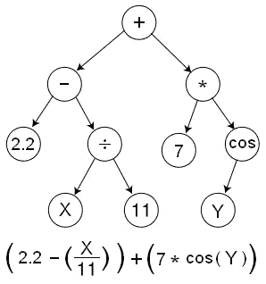

# 进化的长生不老药密码:用长生不老药 AST 进行遗传编程

> 原文：<https://towardsdatascience.com/evolving-elixir-code-genetic-programming-with-the-elixir-ast-fffffe19a170>

## 用 Elixir 的宏系统&抽象语法树进行遗传编程


[Braňo](https://unsplash.com/@3dparadise?utm_source=medium&utm_medium=referral) 在 [Unsplash](https://unsplash.com?utm_source=medium&utm_medium=referral) 上拍照

遗传编程是一种强大的技术，它使用*进化和自然选择*作为搜索技术来创建能够解决问题的算法。

在这篇文章中，我描述了 Elixir 的内置宏系统和抽象语法树(AST)表示如何使实现可以解决现实世界问题的基本遗传编程系统变得简单。

如果你已经了解了基因编程，并且只是想自己尝试一下代码，那么[前往 GitHub 查看 QuoteGP](https://github.com/jonklein/quotegp) 。

# 进化解决方案——什么是遗传编程？

*遗传编程*是一种人工智能技术，在这种技术中，我们试图*进化出*一种解决特定问题的算法。我们从几个*随机*解决方案开始，然后使用进化技术来引导我们在许多代中找到越来越好的解决方案。如果一切按预期进行，我们会找到一个完全适合我们问题的解决方案。

## 适者生存

遗传编程的工作方式是从几个(也许是几千个)随机的代码片段开始。我们根据问题集评估每个程序，以评估一个*适应值*——一个告诉我们程序在解决问题方面有多好的数字。当我们开始使用随机算法时，它们几乎总是非常糟糕(即，具有非常低的适应值)。但有些，只是偶然，比其他人略胜一筹。因此，我们使用**选择过程*来选择最好的，并对它们进行轻微的进化，以产生新一代的解决方案。*

*新一代的解决方案可能仍然不好，但是比我们开始使用的解决方案稍微好一点。如果我们一遍又一遍地重复这个过程，我们最终会得到非常好的解决方案——如果我们坚持足够长的时间，我们可能最终会得到一个完美的解决方案。*

## *遗传算子*

*那么，我们如何从现有的解决方案中产生新的解决方案呢？我们使用各种各样的遗传算子来实现。在我们的 QuoteGP 系统中，我们使用了几个不同的遗传算子来产生新一代的解决方案:*

*   *遗传交叉:从上一代中取出两个解决方案，并将它们混合(结合两者的一部分)以产生一个新的候选解决方案*
*   *变异:从上一代中取出一个解决方案，随机改变它以产生一个新的解决方案*
*   *复制:取一个解决方案，然后“按原样”复制*
*   *随机:生成一个完全随机的新解*

*除了“随机”操作符之外，所有这些操作符在选择对哪个程序进行操作时，都使用基于适合度的*选择*过程。这意味着在执行交叉或变异时，我们更喜欢操作“更好”的解决方案。*

*在更广泛的遗传编程领域中，在选择过程和遗传算子的选择上有无限的变化，但是我们在 QuoteGP 中保持它的简单并使用上面描述的方案。*

# *如何表示可进化的程序*

*为了建立和测试这个系统，我们将考虑一类被称为*符号回归、*的问题，在这些问题中，我们试图找到一个数学公式来最好地表示一些训练数据。*

*构建 GP 系统最重要的考虑之一是*程序表示*:可执行基因组看起来像什么？*

*我们可能会尝试一种常用的真实世界编程语言，如 C、Python 或 Ruby。尽管人类程序员最熟悉这些语言，但他们并不特别擅长进化:在所有可表示的文本字符串的搜索空间中，几乎没有一个字符串是语法上有效的程序！*

*在设计一个 GP 系统(或者实际上，任何一种进化算法)时，表示是关键:我们想要一种表示，其中所有可表示的状态都是有效的程序，并且对于诸如变异和交叉之类的遗传操作符是健壮的。这在很大程度上排除了我们习惯使用的文本编程语言。*

**

*GP 系统中使用的基于树的程序表示。图片来自[geneticprogramming.com](https://geneticprogramming.com/about-gp/tree-based-gp/)。*

*考虑到这一点，一种常见的 GP 方法是基于*树的遗传编程*，其中我们将程序表示为*表达式树。*给定一组允许的节点和终端值，我们可以确保任何树都是有效的程序，并且诸如变异和交叉的遗传算子也将生成有效的程序。*

*还有一些其他的表示类型，如线性 GP，其特点是类似于机器字节码或基于堆栈的 GP 的线性指令系列，其中类型化堆栈用于存储中间值，但对于这个项目，我们将专注于基于树的表示。*

*通常，用 C、Java 或 Python 这样的语言构建一个基于树的 GP，需要构建某种新颖的表示和解释器。但是有些语言，比如 Elixir，有一个语法树和解释器作为一级概念内置。在这种情况下，我们可以使用语言本身进行基因编程。*

# *同形语言与遗传编程*

*一些编程语言是*同形，*意味着**代码是数据，数据是代码**。在这些语言中，例如 Lisp，遗传编程系统可以非常简单地实现，因为程序表示*是数据表示*:进化的程序可以在语言中本地执行。*

*尽管 Elixir 语言并不完全是同形异义的，但它确实提供了对内置抽象语法树(AST)的本地访问和操作，而抽象语法树*具有这些同形异义的特性。虽然 Elixir 代码通常不是以普通数据的形式编写的，**但它很容易转换成普通数据表示形式**。**

```
*# Turn an Elixir expression into an AST:
iex(1)> quote(do: 1 * 3)
{:*, [context: Elixir, import: Kernel], [1, 3]}# Turn an AST into an Elixir expression:
iex(2)> Macro.to_string({:*, [context: Elixir, import: Kernel], [1, 3]})
"1 * 3"*
```

*这意味着我们可以使用 Elixir ASTs 作为本地遗传编程表示来进化 Elixir 代码。我们可以生成随机的灵丹妙药(受我们指定的保持它们有效的约束)，评估它们的适合度，然后对它们执行一般操作以产生新的。如果我们找到一个解决方案或其他我们感兴趣的程序，我们可以把它*转换回仙丹*来读取或执行它。*

# *样本问题—符号回归*

*一个*符号回归*问题是一个曲线拟合问题，在这个问题中，我们试图确定一个数学表达式，它将为一系列给定的输入产生一系列输出值。为了测试我们的系统&演示它是如何工作的，我们将挑选一些*玩具*符号回归问题，这些问题系统应该能够轻松解决，但是仍然需要一些搜索&进化。*

*假设给了我们一组数据，代表对某个过程的观察，我们试图找出一个公式来生成这样的数据。例如，这里有一个输入和输出值的列表:*

```
*[
  [10, 138],
  [11, 162],
  [12, 188],
  [13, 216],
  [14, 246],
  [15, 278],
  ...
]*
```

*我们希望我们的系统接受这些数据，并进化出产生这些数据的程序表达式。在这种情况下，我们要找的表达式是`x*x + 3x + 8`。我们知道这一点，因为我们自己编造了数据，但我们想看看我们的基因编程系统是否能自己解决这个问题。*

**注:尽管我们之前讨论过* ***适应值*** *值越高越好，但在许多实现中(包括本例)，我们使用* ***误差值*** *来表示我们离实际解有多远。这些代表相同的东西，只是我们试图进化更小的误差值，而不是更高的适应值。这只是实现细节，对系统如何工作没有影响。**

*让我们看看 QuoteGP 系统的典型输出是什么样的:*

```
*=== Generation 0 best fitness: 252.0 - program: (10 - 1 + 7 * -1 + input) * (input + (3 - -8 / -4))
=== Generation 1 best fitness: 252.0 - program: (10 - 1 + 7 * -1 + input) * (input + (3 - -8 / -4))
=== Generation 2 best fitness: 1008 - program: (input + 4) * (input + -1)
=== Generation 3 best fitness: 203 - program: (7 + -3 - input * -1) * input
=== Generation 4 best fitness: 22.75 - program: input * (input + (3 - -8 / -4 / -4))
=== Generation 5 best fitness: 22.75 - program: input * (input + (3 - -8 / -4 / -4))
=== Generation 6 best fitness: 8.75 - program: -5 - -6 + input * input + (input - input * (-3 - 8 - 9)) / (1 - 1 - -6)
=== Generation 7 best fitness: 2.5968626643538126 - program: -7 + (input + 4) * (input + -1) + (-5 - input * (-3 - 8 - 9)) / input
=== Generation 8 best fitness: 4.861111111111127 - program: input + input * input + (6 * (10 + 7) + 4 - input - input * (-8 - 8 - 9)) / (7 - 1 - -6)
=== Generation 9 best fitness: 1.6155871338926322e-27 - program: input * (input + (3 - -8 / input))
=== Generation 10 best fitness: 1.6155871338926322e-27 - program: input * (input + (3 - -8 / input))
=== Generation 11 best fitness: 0 - program: input + (4 - -4) + input * input + (input + input)*
```

*在这个输出中，我们看到了遗传编程系统经过许多代的结果。在每一步，我们看到最佳的适应度(或误差值)和最佳的解决方案。我们从误差值 252 开始，告诉我们最佳起始解离“正确”解有多远。*

*我们还看到了产生最佳输出的程序。请注意，尽管这些表达式看起来简单而普通，但它们是完全有效的灵丹妙药，只要我们设置了预期的绑定(在本例中为`value`)。*

*在 12 代的过程中(当然，从 0 开始)，这些误差值稳步下降，直到误差值为 0——完全匹配！我们看到了输出，一个有效的长生不老药程序:*

```
*input + (4 - -4) + input * input + (input + input)# which simplifies to...
input + 8 + input*input + input + input
input*input + 3*input + 8*
```

# *你自己试试*

*在这一点上，你可能想自己尝试一下这个系统。你可以通过[在 GitHub](https://github.com/jonklein/quotegp) 上试用 QuoteGP，并查看`samples`目录中的例子。*

*当你玩它的时候，你可能会注意到一些事情——这些都是使用遗传编程(以及更普遍的人工智能搜索技术)的真实世界挑战。*

## *适应性有时会上升而不是下降*

*因为通用运算符是随机应用的，所以有时“最佳”候选项不会延续到下一代。围绕选拔过程有大量的研究，但没有正确的答案。虽然总是倾向于将*最好的*程序一代一代地复制下来似乎很直观，但这是一个悬而未决的问题——一些研究表明，随着时间的推移，这种方法实际上会产生更差的结果。(注意:当我现在研究这个声明时，我看到了更多支持这种方法的最新证据——也许我应该把它添加到 QuoteGP 中！)*

## *有时问题没有得到完全解决*

*是的，这是常有的事。*

*基因编程实际上只是一种特殊的搜索技术，并不能保证一定会找到解决方案。事实上，大多数个体真实世界的基因编程运行*不会*找到一个问题的完美解决方案，因为你是在大海捞针。需要多次尝试才能找到正确的解决方案，这种情况并不少见。*

*此外，在这些示例问题中，我们使用 0 的停止标准，换句话说，一个完全完美的解决方案。这在现实世界中并不典型——对于许多问题来说，通常*并不是*完全完美的解决方案。相反，找到具有微小误差值的东西是一个有效且有用的现实世界解决方案。*

## *节目越来越长了！*

*“膨胀”是基因编程中的另一个常见问题，也有一个研究机构致力于解决这个问题。简而言之，膨胀是程序长度随着时间的推移而增加，但由于“死”或残留代码而没有增加适应性。在这个简单的系统中，我们没有采用任何膨胀控制技术，所以这并不奇怪。*

# *结论和未来工作*

*那么，考虑到可进化代码与 Elixir 的完美契合，它是遗传编程的最佳系统和语言吗？老实说:不。大多数 GP 系统不使用正常的人类编程语言，因为没有必要。他们倾向于使用一些其他的内部表示，只有在需要的时候才被翻译成人类可读的表达式。它们甚至可能包含语言特征，这将使它们对人类编程来说*可怕*，但对进化却非常有用。*

*此外，大多数 GP 系统远比这个简单的例子复杂。更多阅读请见[系统列表](https://geneticprogramming.com/software/)。我个人很喜欢(并且已经开发过)PushGP 系统，但是还有很多其他的系统。*

*然而，使用 Elixir 进行遗传编程的好处在于，它非常容易实现、检查和理解，这使它成为修补遗传编程、理解其工作原理和尝试新想法的优秀教学工具。*

*如果你想自己尝试代码，请前往 GitHub 。*

*[*Jonathan*](https://blog.devgenius.io/@jonnystartup)*在大型创业公司&小型企业中拥有超过 20 年的工程领导经验。如果你喜欢这篇文章，请考虑加入 Medium 来支持* [*乔纳森和其他成千上万的作者*](https://medium.com/@jonnystartup/membership) *。**