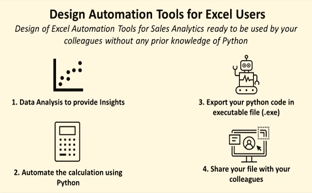
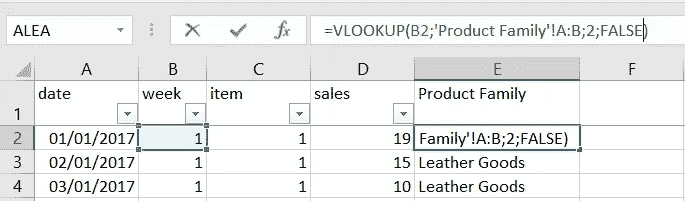
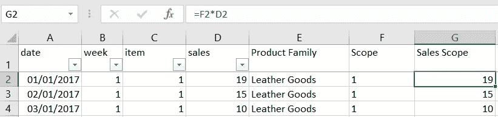
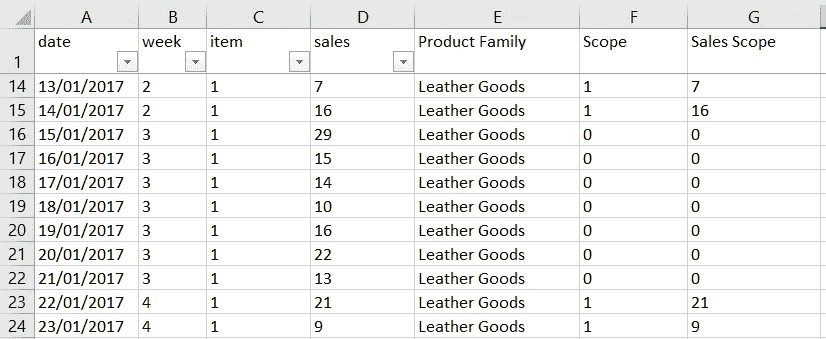

# 使用 XlsxWriter 生成用户友好报表的 Excel 自动化工具

> 原文：<https://towardsdatascience.com/excel-automation-tools-for-user-friendly-reports-with-xlsxwriter-557c2332905c>

## 通过编写任何 excel 用户都可以阅读的显式 excel 公式，使用 python 自动创建 Excel 报表


由 [Unsplash](https://unsplash.com?utm_source=medium&utm_medium=referral) 上的[窗口](https://unsplash.com/@windows?utm_source=medium&utm_medium=referral)拍摄

**问题陈述** 使用 python 和 pandas 编写的 **excel 自动化脚本**可能面临的主要问题是没有**编程技能的用户的体验**。

事实上，您的工具可以被看作是一个黑盒，它从 excel 文件中获取数据，在后端进行处理，然后导出到另一个 excel 文件中。

一些用户**不能信任报告**，如果他们不能**访问和修改用于填充结果的公式**。

因此，用 python 替换 excel 会影响用户对解决方案的接受度。

**目标** 在本文中，我提出了一种替代方案，用 python 库 xlswriter 来克服这个问题。

💌新文章直接免费放入你的收件箱:[时事通讯](https://www.samirsaci.com/#/portal/signup)

# 如何用 Python 构建 Excel 自动化工具？

## **情况**

你是一家时尚零售公司的数据分析师，负责销售报告。

报告由管理商店销售点的系统生成。

在这些报告中，您有

*   单件销售数量
*   共有 50 个项目的项目代码
*   覆盖全年的日期和星期

## 工作

出于报告目的，您需要处理这些报告，并将数据集与将用于分析销售趋势的附加功能进行映射。

这些附加特性与物料代码相关联

*   项目系列:皮具、配饰、成衣或其他
*   范围:布尔值，通知项目是否在分析范围内

## 目标

由于您每个月需要执行这项任务超过 100 次，因此您正在寻找一个自动化流程的解决方案。

[](http://samirsaci.com)  

# 解决方法

## 使用 Python 熊猫的初步解决方案

最初，您使用 Python 构建了一个解决方案，该解决方案使用 pandas 实现了自动化处理。

使用 pandas_read excel，**从几个 excel 文件导入数据，由您的脚本**处理并导出到另一个 excel 文件。



初始解决方案—(图片由作者提供)

此脚本已转换为可执行文件(。这样您的同事就可以在没有您支持的情况下使用它了

1.  设计并测试您的 python 脚本
2.  使用 pyinstaller 将 python 脚本导出到可执行文件中
3.  分享你的。exe 文件*(有详细说明)*与你的同事

有关如何构建该解决方案的更多信息，

[](https://www.samirsaci.com/build-excel-automation-tools-with-python/)  

## 用户接受度的问题

一些用户抱怨说**他们无法访问用于处理数据的公式**。

> 你好 Samir，为什么我们看不到最终报告中的公式？你确定你选对了列吗？

这个问题引起了您的同事的一些担忧，他们质疑该工具的准确性，因为他们无法检查它。

## 使用 xlsxwriter 的新解决方案

想法是使用 python 库 xlsxwriter 来执行 Excel 文件中的计算。

您可以在 excel 单元格中编写公式，输出文件的用户可以阅读(和修改)这些公式。



xlsxwriter 生成的公式示例—(图片由作者提供)

因此，您保留了 python 的自动化功能，同时为只熟悉 Excel 的用户提供了更多的可见性。

## 履行

如果你看一下 [xlsxwriter](https://xlsxwriter.readthedocs.io/) 的文档，你会发现几种在 excel 单元格上创建公式的方法。

您可以使用 Pip 安装这个库

```
pip install xlsxwriter
```

您可以编写应用于单个单元格的公式，

并将你的公式应用于一个数组，



最终结果—(图片由作者提供)

然后，您可以为我们的简单处理任务构建一个解决方案



最终结果—(图片由作者提供)

另外三列是使用 Excel 公式生成的，每个单元格都可以读取这些公式。

# 结论

*关注我的 medium，了解更多与供应链数据科学相关的见解。*

我们满足了最终用户对可见性的需求，同时保持了 python 的自动化功能。

## 低处理速度

但是，由于库的结构和在 excel 文件中创建公式所需的计算能力，您将会损失处理速度。

## 有限的功能

除了 excel 公式的限制，您还需要处理 xlsxwriter 的有限功能。

例如，您不能用它来构建数据透视表。

对于高级计算和处理，您需要教育您的用户，并使用另一种方式带来透明度，以获得他们的信任。

# 关于我

让我们连接上 [Linkedin](https://www.linkedin.com/in/samir-saci/) 和 [Twitter](https://twitter.com/Samir_Saci_) ，我是一名供应链工程师，正在使用数据分析来改善物流运营和降低成本。

如果你对数据分析和供应链感兴趣，可以看看我的网站

[](https://samirsaci.com) 