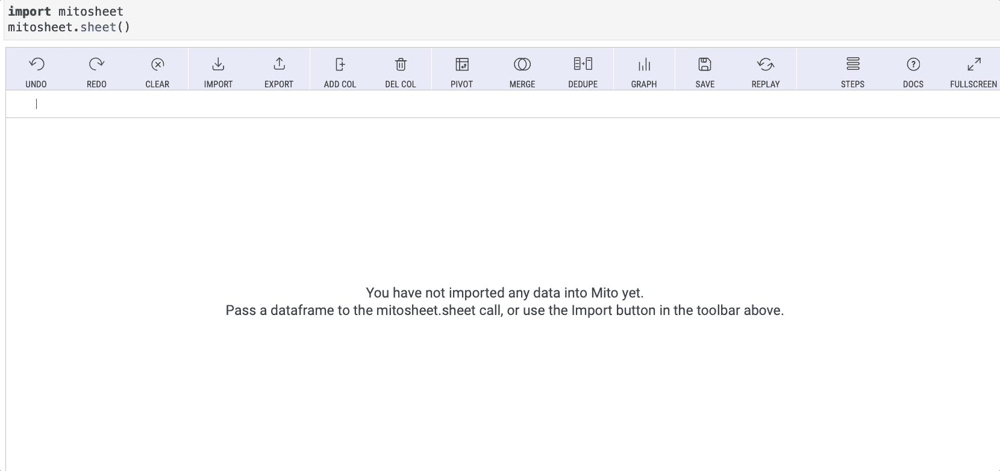

# Excel 用户，以下是如何让您的数据分析和报告更上一层楼

> 原文：<https://towardsdatascience.com/excel-users-heres-how-to-take-your-data-analysis-and-reports-to-the-next-level-5249b193b117>

## 这里有 3 个比 Excel、VBA 和 Power Query 更好的工具


图片来自 Shutterstock，授权给 Frank Andrade

如果你是一个高级 Excel 用户，你可能已经使用 VBA 创建宏和自动化重复的任务，或使用电源查询清理和转换数据。

它们是很好的工具，但是当涉及到创建自定义自动化和快速处理大量数据时，Microsoft Excel 是不够的。

这就是你需要像 Python 这样的编程语言的时候。

Python 有数百个库，使得数据操作、分析和报告自动化成为可能。Python 不仅能帮助你完成 Excel 任务，还能帮助你完成更复杂的任务。

在本文中，我将向 Excel 用户展示从头开始使用 Python 的最佳方式，并向您介绍 3 个 Python 库，它们可以帮助您将数据分析和 Excel 报表提升到一个新的水平。

# 1.学习 Python 和 Pandas，以便更好地进行数据分析

Python 是一种流行的语言，有很多应用。其中一个应用是数据分析。我们可以用 Python 做数据分析，使用一个叫做 Pandas 的库。

Pandas 库被称为“类固醇上的 Excel ”,因为你可以在 Microsoft Excel 中完成大多数任务，但要借助 Python 的强大功能。这意味着我们可以清理和争论大型数据集，并生成数据透视表和图表，而不会出现性能问题。不同之处在于，在 Pandas 中，我们使用数据框架，而在 Excel 中，我们使用工作表。

以下是 Python/Pandas 相对于 Excel 的一些优势:

*   Excel 可以处理一百万行。Python 可以处理数百万行数据
*   Python 可以处理复杂的计算，但这可能会导致 Excel 中的工作簿崩溃
*   Excel 中的自动化仅限于 VBA 和 Power Query，而 Python 中的可能性是无限的，这要归功于它的数百个免费库

如果你是一个从未写过一行代码的 Excel 用户，过渡到 Python 的想法可能听起来很可怕，但是有免费的教程可以教你从零开始学习 Python，同时考虑到你在 Excel 中的知识。

这是 freeCodeCamp 频道为 Excel 用户提供的免费 Python 课程。

在本课程中，您将在模块 1 中学习基本的 Python 知识，如数据类型、变量和字典，然后在模块 2 中学习如何使用 Pandas 库处理数据。一旦您了解 Pandas，您将在模块 3 中学习如何创建数据透视表和数据可视化。

本课程使用 Jupyter Notebooks 教授，这是一种广泛用于 Python 数据分析的文本编辑器。

# 2.米托:如果你能编辑 Excel 文件，你现在就能编写 Python 代码了

如果你想拥有 Python 的强大功能和 Microsoft Excel 的简单性，你应该试试米托图书馆。

米托是 Python 中的一个电子表格。这个库帮助你使用 Pandas 数据框架，就像它是一个 Excel 工作簿一样。这意味着我们不再需要编写 Python 代码来操作数据帧，而是可以使用 Python 通过几次点击来进行数据分析。

为了让事情变得更好，米托会在你对米托的电子表格进行每一次修改后为你生成 Python 代码。

假设您想读取一个 CSV 文件，然后制作一个箱线图。对于 Pandas，您需要使用`.read_csv`方法读取一个 CSV 文件，然后使用`.iplot(kind='box')`方法创建一个箱线图。

然而，有了米托，你不用写代码就可以完成所有这些，但是，首先，你需要安装它，让 pip 运行下面的命令(在 Jupyter Notebook 和 JupyterLab 上，你需要在一个单元中运行命令)。

```
python -m pip install mitoinstaller
python -m mitoinstaller install
```

现在我们可以用下面的代码创建一个 mitosheet。这就是你需要写的所有代码！

```
**import** mitosheet
mitosheet.sheet()
```

如果您看到如下所示的表单，那么一切都设置成功了。现在，我们只需点击几下鼠标就可以完成很多任务。对于这个例子，我将使用 [Google Drive](https://drive.google.com/drive/folders/1d3N4hs0dDEdEsUqI9J_MHaF5CdYIlSLM?usp=sharing) 上的“StudentsPerformance_id.csv”文件。

我们可以用米托导入这个 CSV 文件。你只需要点击“导入”按钮，选择你之前下载的 CSV 文件。



作者图片

现在，我们可以通过点击“图形”按钮并在“图表类型”选项中选择“方框”来创建一个方框图(和其他图形)，如下图 gif 所示。


作者图片

太好了！要获取用于图形的代码，请单击“复制图形代码”按钮。关于这个库的更多信息，请查看米托的 [Github](https://github.com/mito-ds/monorepo) 和[文档](https://docs.trymito.io/getting-started/installing-mito)。

# 3.使用 Python 和 Openpyxl 实现 Excel 自动化

除了数据分析，Python 还经常用于自动化任务。有了 Python，你可以自动化网络，发送电子邮件、文件、文件夹，应有尽有！

说到用 Python 自动化 Excel，前途无量！

您可以使用 Python、Pandas 库和 OS 模块来完成简单的自动化操作，如连接多个 Excel 文件、更改多个文件的名称/扩展名，甚至修改文件内部的数据(比如您想要添加/删除一些字符)。

在下面的指南中，我分享了用 Python 做这件事的代码。

[](/5-common-excel-tasks-simplified-with-python-feff966e73a4) [## 使用 Python 简化的 5 个常见 Excel 任务

### 使用 Pandas、OS 和 datetime 模块简化 Python 中的 Excel 任务。

towardsdatascience.com](/5-common-excel-tasks-simplified-with-python-feff966e73a4) 

但这还不是全部！您可以使用一个名为 openpyxl 的库来实现更复杂的自动化，比如生成 Excel 报表。这个库允许我们加载工作簿并操作它们，就像我们使用 Microsoft Excel 一样(但是使用了 Python 的强大功能)。

使用 Python，我们可以像双击文件一样简单地创建 Excel 报表。

不相信我？假设您需要创建一个数据透视表，然后向工作表添加公式、图表和标题/副标题。你可以使用 Python 来完成所有这些。

首先，您可以用 Pandas 库创建数据透视表，然后用 openpyxl 添加公式、图表和文本。如果您想更进一步，您可以使用一个名为 pyinstaller 的库，它可以将 Python 脚本转换成可执行文件，这样每当您双击可执行文件时，报告就会自动生成。

如果这听起来好得令人难以置信，请查看我的[分步指南](/a-simple-guide-to-automate-your-excel-reporting-with-python-9d35f143ef7)来学习如何用 Python、openpyxl 和 pandas 自动化 Excel 报表。

自动化你的生活！ [**加入我的 10k+人电子邮件列表，获取我的免费自动化小抄。**](https://frankandrade.ck.page/44559e1ae7)

如果你喜欢阅读这样的故事，并想支持我成为一名作家，可以考虑报名成为一名媒体成员。每月 5 美元，让您可以无限制地访问数以千计的 Python 指南和数据科学文章。如果你使用[我的链接](https://frank-andrade.medium.com/membership)注册，我会赚一小笔佣金，不需要你额外付费。

[](https://frank-andrade.medium.com/membership) [## 通过我的推荐链接加入媒体——弗兰克·安德拉德

### 作为一个媒体会员，你的会员费的一部分会给你阅读的作家，你可以完全接触到每一个故事…

frank-andrade.medium.com](https://frank-andrade.medium.com/membership)