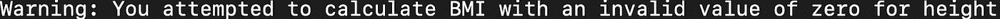
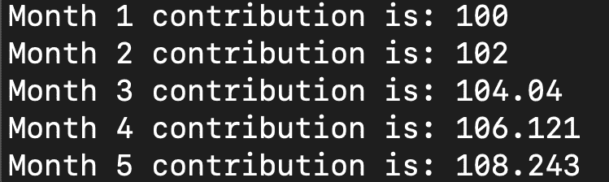
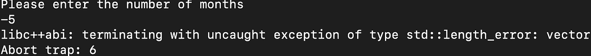
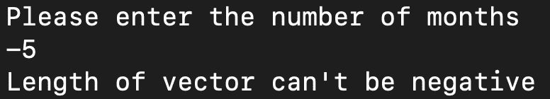

# C++中的异常处理

> 原文：<https://towardsdatascience.com/exception-handling-in-c-eb2a2f55a2d9>

## C++中的错误处理介绍


图片由[在](https://www.pexels.com/@shvets-production/)[像素](https://www.pexels.com/photo/fresh-lemons-with-juicy-flesh-on-blue-background-7195055/)上拍摄制作

在[计算机编程](https://builtin.com/software-engineering-perspectives)中，异常处理是处理程序中错误的过程，这样它就能在异常情况下运行。此外，它清楚地向用户解释了程序失败的原因。在许多情况下，软件程序会得到坏数据或其他影响代码成功运行的异常情况。

因此，异常处理是软件开发的关键，因为可靠地处理错误可以防止软件程序表现出非预期的行为。理想情况下，很好地实现错误处理可以保证代码在任何条件下都能成功运行。

意外行为的例子包括程序运行缓慢或在接收到错误输入时失败。在错误输入的情况下，考虑一个函数，该函数将一个实数值(float)作为用户输入，执行计算，并返回结果值。如果该函数期望浮点值，但却收到字符串，则该函数将引发错误并失败。错误异常处理可以用来处理这样的情况。如果用户输入一个错误的值，比如字符串，程序会返回一个有意义的消息，而不是失败或提供一个不清楚的系统错误信息。

在 C++ 中，异常处理使用了表达式 Try、Throw 和 Catch。Try 表达式标识可能有错误异常的代码块。它可能包含逻辑，例如将两个数字相除或在数字列表上迭代。Throw 表达式处理异常。例如，当您的代码试图将两个数相除，但分母为零时，您可以抛出一条错误消息，如“不能被零除”最后，Catch 表达式处理错误。这些表达式可以处理 C++中的各种异常，包括数组和向量的长度错误。

在这里，我们将通过一些简单的例子来说明如何在 C++中实现异常处理。首先，我们将考虑一个运行时错误的例子。我们将定义一个以身高和体重为输入并计算体重指数的函数。身体质量指数的公式是体重除以身高的平方。如果零值作为参数传递给函数，代码将尝试除以零。我们将使用 try、catch 和 throw 来处理运行时错误。最后，我们将通过一个额外的长度错误异常处理的例子。这两个例子应该为刚刚开始使用 C++进行异常处理的开发人员提供了一个很好的起点。

**运行时异常处理**

为了演示运行时错误的异常处理，我们将构建一个简单的身体质量指数计算器应用程序。该应用程序将用户的姓名，体重和身高作为输入，并显示计算出的身体质量指数。首先，让我们看一下如何在没有任何异常处理的情况下构建应用程序。

首先，让我们写一个脚本，我们称之为 bmi.cpp。我们将包括<iostream>和<string>标题。<iostream>标题允许我们写入标准输入/输出流。<string>标题允许我们定义字符串标识符。</string></iostream></string></iostream>

```
#include <iostream>
#include <string>using namespace std;
```

编译和执行时，程序会询问用户的名字。为此，我们需要为 name 定义一个字符串变量，为 weight 和 height 分别定义两个浮点变量:

```
// Main() function: where the execution of program beginsint main(){string name;
float weight;
float height;}
```

接下来，让我们添加询问用户名的逻辑:

```
// Main() function: where the execution of program beginsint main(){string name;
float weight;
float height;cout << "Please Enter your Name \n";
cin >> name;}
```

为了编译我们的代码，我们在终端中运行以下命令:

```
g++ bmi.cpp
```

我们使用以下命令执行:

```
./a.out
```

我们得到以下输出:


作者图片

现在，让我们编写一个逻辑，在用户输入姓名时问候用户并询问他们的体重:

```
// Main() function: where the execution of program beginsint main(){string name;
float weight;
float height;cout << "Please Enter your Name \n";
cin >> name;
cout << "Hello "<< name << ", please enter your weight in Kg \n";}
```

如果我们编译并执行，我们会得到以下结果:


作者图片

然后，我们可以添加权重逻辑作为用户输入:

```
int main(){string name;
float weight;
float height;cout << "Please Enter your Name \n";
cin >> name;
cout << "Hello "<< name << ", please enter your weight in Kg \n";
cin >> weight;}
```

将提示用户输入重量值。现在，让我们包含逻辑，以便在提供以 kg 为单位的体重时，我们要求用户提供以米为单位的身高:

```
int main(){string name;
float weight;
float height;cout << "Please Enter your Name \n";
cin >> name;
cout << "Hello "<< name << ", please enter your weight in Kg \n";
cin >> weight;
cout << "Thank you "<< name << ", now please enter your height in meters \n";
cin >> height;}
```


作者图片

现在我们可以用这些数据来计算身体质量指数。身体质量指数的公式是体重/身高 2。我输入我的名字 Sadrach，我的体重 90 公斤，我的身高 1.92 米:

```
int main(){string name;
float weight;
float height;cout << "Please Enter your Name \n";
cin >> name;
cout << "Hello "<< name << ", please enter your weight in Kg \n";
cin >> weight;
cout << "Thank you "<< name << ", now please enter your height in meters \n";
cin >> height;
bmi = weight/(height*height);
cout << "Your BMI is: "<< bmi <<"\n";}
```

身高 1.92 米，体重 90 公斤，我们可以计算出身体质量指数为 24.4:


作者图片

现在，让我们尝试为高度传递一个零值:


作者图片

我们看到，在输入零的高度，我们有一个“inf”的身体质量指数计算，“INF”意味着无限。这对于用户来说显然不是一个有用的值，可能只会引起混乱。我们应该尝试捕捉这个错误并向用户显示一条消息，告诉用户他们提供了一个无效的高度值，而不是显示 infinity。我们可以通过捕获运行时错误来实现这一点:

首先，在脚本的顶部，我们需要导入' stdexcept '来使用 runtime_error:

```
#include<stdexcept>
```

接下来，我们可以在函数中重写身体质量指数计算的逻辑:

```
float BMI_calculator(float weight, float height){if (height == 0){throw runtime_error("You attempted to calculate BMI with an invalid value of zero for height \n");}return weight/(height*height);}
```

然后我们可以修改我们的主函数来尝试计算身体质量指数:

```
try{bmi = BMI_calculator(weight, height);
cout << "Your BMI is: "<< bmi <<"\n";}
```

并在运行时错误发生时捕获它。如果出现这种情况，我们将显示文本“警告:您试图用无效的零值来计算身体质量指数的高度”

```
catch (runtime_error&e){cout<< "Warning: "<< e.what();}
```

然后，我们编译并执行代码，将零作为高度的输入。我们得到以下显示消息:



作者图片

我们看到这条消息比原来的显示消息“您的身体质量指数是:inf”更具描述性和有用

**长度错误异常处理**

另一个常见的异常是向量的长度错误异常。为了演示这种错误的发生，我们将定义一个函数来计算退休金账户的每月缴款总额。首先，让我们定义一个名为 retirement_contributions.cpp 的 C++脚本。

让我们添加我们的主函数以及必要的<iostream>标题，一个<vector>标题，它将允许我们定义向量:</vector></iostream>

```
#include <iostream>
#include <stdexcept> // std::out_of_range
#include <vector>using namespace std;int main(){}
```

让我们添加逻辑，以便用户可以指定他们想要计算总退休金的月数:

```
#include <iostream>
#include <stdexcept> // std::out_of_range
#include <vector>using namespace std;int main(){int months;
cout << "Please enter the number of months \n";
cin >> months;}
```

接下来，让我们定义一个向量，它是月数的大小。向量将包含美元金额贡献，因此它将是一个浮动向量:

```
int main(){int months;cout << "Please enter the number of months \n";
cin >> months;
std::vector<float> contributions(months);}
```

让我们初始化一个名为 current month 的变量，它将是我们用来迭代数组的索引:

```
int current_month = 1;
```

然后，让我们将数组的第一个元素定义为我们的初始贡献:

```
contributions[1] = initial_contrbution;
```

在 while 循环中，当当前月份少于总月份数时，我们将后续贡献增加 2 %:

```
while (current_month <= months){contributions[current_month + 1] =1.02*contributions[current_month];}
```

我们还可以显示每个月的贡献，同时将我们的指数递增 1:

```
while (current_month <= months){contributions[current_month + 1] =1.02*contributions[current_month];cout << "Month "<< current_month << "contribution is: "<< contributions[current_month]<< endl;current_month++;}
```

所以，完整的脚本如下:

```
int main(){int months;int current_month = 1;cout << "Please enter the number of months \n";
cin >> months;std::vector<float> contributions(months);
float initial_contrbution = 100;
contributions[1] = initial_contrbution;while (current_month <= months){contributions[current_month + 1] =1.02*contributions[current_month];cout << "Month "<< current_month << "contribution is: "<< contributions[current_month]<< endl;current_month++;}}
```

如果我们使用五个月的输入值编译并执行这个脚本，我们将得到以下输出:



作者图片

从这里，我们可以计算出贡献的总和。让我们初始化一个浮点变量，我们将使用它来存储总和，并在 while 循环中计算总和:

```
int main(){int months;
int current_month = 1;cout << "Please enter the number of months \n";
cin >> months;std::vector<float> contributions(months);
float initial_contrbution = 100;
float sum_contributions = 0;
contributions[1] = initial_contrbution;while (current_month <= months){contributions[current_month + 1] =1.02*contributions[current_month];cout << "Month "<< current_month << "contribution is: "<< contributions[current_month]<< endl;sum_contributions += contributions[current_month];current_month++;}cout<<"Sum of contributions for "<< months << "months is: "<<sum_contributions << endl;}
```


作者图片

现在让我们考虑一个特例。假设用户不小心输入了一个负值，比如负五，持续了几个月。我们得到以下 std::length_error:



作者图片

我们看到我们的代码失败了，并显示了一条与我们的向量 std::length_error 的长度相关的神秘消息。这是因为我们可以定义一个长度为负五的向量。我们可以使用异常处理来解决这样的情况:

```
try{std::vector<float> contributions(months); //float contributions[months];float initial_contrbution = 100;
float sum_contributions = 0;
contributions[1] = initial_contrbution;while (current_month <= months){contributions[current_month + 1] =1.02*contributions[current_month];cout << "Month "<< current_month << "contribution is: "<< contributions[current_month]<< endl;sum_contributions += contributions[current_month];current_month++;}cout<<"Sum of contributions for "<< months << "months is: "<<sum_contributions << endl;catch (const std::length_error& le) {std::cerr << "Length of "<< le.what() << "can’t be negative \n";}
```

所以，完整的脚本如下:

```
int main(){int months;
int current_month = 1;cout << "Please enter the number of months \n";
cin >> months;try{std::vector<float> contributions(months); //float contributions[months];float initial_contrbution = 100;
float sum_contributions = 0;
contributions[1] = initial_contrbution;while (current_month <= months){contributions[current_month + 1] =1.02*contributions[current_month];
cout << "Month "<< current_month << "contribution is: "<< contributions[current_month]<< endl;
sum_contributions += contributions[current_month];
current_month++;}cout<<"Sum of contributions for "<< months << "months is: "<<sum_contributions << endl;catch (const std::length_error& le) {std::cerr << "Length of "<< le.what() << "can’t be negative \n";}}}
```

现在，如果我们连续几个月编译、执行并传递一个负值，我们会适当地处理错误:



作者图片

我们看到，通过适当地处理长度错误，我们能够向用户显示一条描述性的消息。

这篇博客中使用的脚本可以在 [GitHub](https://github.com/spierre91/builtiin/tree/main/cpp_tutorials) 上获得。

**结论**

异常处理是软件编程中非常重要的一部分。它允许开发人员处理代码的意外行为、异常输入、意外运行时等等。

这通常是防止代码无法成功运行的有效措施。此外，异常情况通常会导致难以理解的系统生成的错误。不透明的、系统生成的错误消息会让用户、开发人员和工程师感到沮丧。如果用户无意中提供了一个错误的输入值，最好采取措施来处理这些类型的值，并向用户提供一条有意义的消息，说明错误发生的原因。理解异常处理对于软件开发人员、软件工程师甚至机器学习工程师和数据科学家来说都很重要。

如果你有兴趣学习 python 编程的基础知识、Pandas 的数据操作以及 python 中的机器学习，请查看[*Python for Data Science and Machine Learning:Python 编程、Pandas 和 sci kit-初学者学习教程*](https://www.amazon.com/dp/B08N38XW2Q/ref=sr_1_1?dchild=1&keywords=sadrach+python&qid=1604966500&s=books&sr=1-1) *。我希望你觉得这篇文章有用/有趣。*

***本帖原载于*** [***内置博客***](https://builtin.com/software-engineering-perspectives) ***。原片可以在这里找到***[](https://builtin.com/software-engineering-perspectives/how-to-write-clean-exception-handling-code-c%2B%2B)****。****