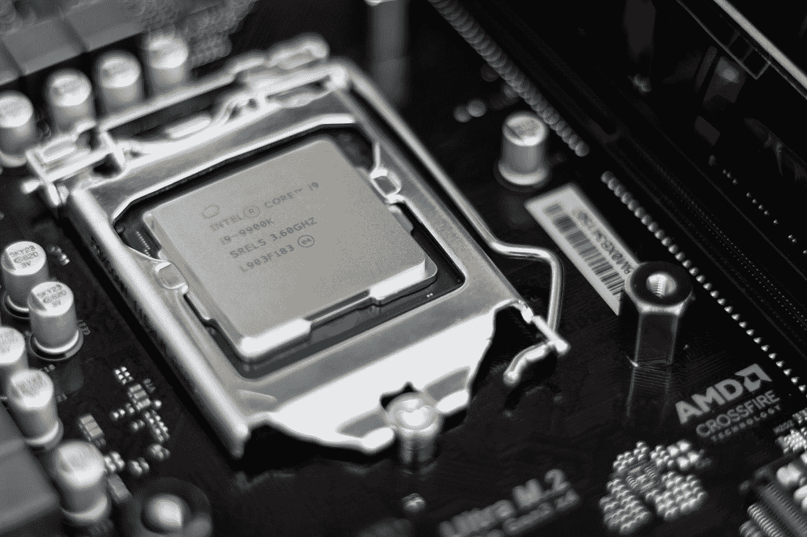

# 令人兴奋的与 Python 硬件交互的方式

> 原文：<https://towardsdatascience.com/exciting-ways-to-interact-with-hardware-from-python-2afb9278fe07>

## 命令式 Python！与您的硬件交互



克里斯蒂安·威迪格在 [Unsplash](https://unsplash.com?utm_source=medium&utm_medium=referral) 上拍摄的照片

## 介绍

D 独立编程语言是当今软件不可或缺的一部分。声明式编程是与命令式编程相对的两种基本编程范式之一。声明式编程的目标是掩盖计算机的硬件，而仅仅关注代码本身的逻辑。另一方面，命令式编程通常涉及程序员和计算机硬件之间的密切关系。这些当然都是范式的简化，但通常这是两者之间的自由裁量权。重要的是要记住这是一个范围，一种语言可以混合命令式和声明式特性，就像一种语言可以混合函数式和面向对象的特性一样。声明式语言的目标是考虑可读性和简单性，而不是速度，这正是大多数声明式语言所提供的。声明式编程语言不仅容易学习，而且对于编程概念的原型开发和教学也非常有用。上一代程序员最典型的声明式编程语言可能是 BASIC 或类似的语言，但今天这个名称落在了 Python 上。

Python 当然提供了我们可能从任何其他声明式编程语言中期待的所有特性。Python 有令人难以置信的可读语法，常常感觉像是要消化的英语。这种语言也不需要很长时间就能学会，尤其是与 c 语言等其他语言相比。如今，许多计算机科学课程都是从 Python 课程开始，然后才转向另一种编程语言。最后，Python 也在许多原型开发环境中使用。由于它们的可读性和缺乏硬件控制，声明性语言使得像原型制作或学习这样的任务变得非常容易。一个程序员甚至不需要首先知道计算机有什么硬件就可以很好地编写 Python。

然而，除了声明性之外，Python 语言当然还有很多巨大的优势。这种语言当然是恰当的，并且已经被它今天在从系统管理到数据科学的一切事物中的普遍使用所证明是值得尊敬的。特别是，由于 Python 与命令式语言的紧密集成，这种语言在机器学习中得到了很好的应用。此外，PYthon 的生态系统**绝对庞大**，在 Python 包索引中拥有超过 200，000 个独特的注册包。

虽然使用声明式编程语言有很多优点，特别是对于像机器学习这样的复杂任务，但是使用这种语言也有很多明显的缺点。第一个也是最明显的是速度。声明式编程语言的固有特性不一定是速度慢，但是大多数时候，有人决定开发一种声明式语言，这种语言最终会被解释。此外，更简单的语法也与声明性语言相关联，结果是语言在大多数情况下运行得有点慢。即使语言本身并不慢，命令式语言中的低级硬件交互也很重要，因为它允许您在大多数情况下尽可能高效。然而，对于声明性语言来说，情况并非如此，因为通常会有一些解释器或编译器试图找出表述您的工作的最佳方式。由于这是声明式语言的一个缺点，它也成为 Python 的一个缺点。

毫无疑问，Python 是一种声明式编程语言，正如我提到的，早期的语言通常是几种其他编程范式的混合，因此 Python 是一种通常可能是声明式的语言，但仍然具有一些命令式的特性。尽管功能相对有限，但您可能最终会惊讶于所有 Python 所能做的事情！

## 压型

许多声明式编程语言的第一个也是最明显的命令式特性是剖析，Python 也不例外。在标准库中，有各种不同的工具可以用来分析您的机器。从最基本和最不可能的命令开始，我们可以使用`timeit`或`time`模块来计时解释。对于我的例子，我将使用`time`:

```
>>> import time
>>> start = time.time()
>>> print("% s seconds" % (time.time() - start))
0.4931051731109619 seconds
```

所以计时功能当然有用，但并不是必须的。我们可能会查看处理器运行这段 Python 代码所花费的时间，但这仍然不能给我们提供太多关于硬件的信息。在这方面一个类似的技术是使用标准库中的`cProfile`，它提供了比`time`更多的信息。为此，我们使用`cProfile.run`函数，以字符串形式提供我们的 Python:

```
>>> cProfile.run("5 * 1")
         3 function calls in 0.000 secondsOrdered by: standard namencalls  tottime  percall  cumtime  percall filename:lineno(function)
        1    0.000    0.000    0.000    0.000 <string>:1(<module>)
        1    0.000    0.000    0.000    0.000 {built-in method builtins.exec}
        1    0.000    0.000    0.000    0.000 {method 'disable' of '_lsprof.Profiler' objects}
```

我非常喜欢使用的另一个选项是`line_profiler`。这个选项有助于获得更多关于这些时间的信息，这些信息没有包含在`cProfile`中。然而，在硬件方面，性能评测器可能是`pylikwid`，它提供有关处理器的信息:

```
--------------------------------------------------------------------------------CPU name:   Intel(R) Core(TM) i7-6700HQ CPU @ 2.60 GHz x 8CPU type:   Intel Core Haswell processorCPU clock:  2.60 GHz--------------------------------------------------------------------------------================================================================================Group 1 L3: Region MY_REGION================================================================================+-------------------+----------+|    Region Info    |  Core 0  |+-------------------+----------+| RDTSC Runtime [s] | 0.091028 ||     call count    |     1    |+-------------------+----------++-----------------------+---------+--------------+|         Event         | Counter |    Core 0    |+-----------------------+---------+--------------+|   INSTR_RETIRED_ANY   |  FIXC0  | 9.262083e+08 || CPU_CLK_UNHALTED_CORE |  FIXC1  | 3.255393e+08 ||  CPU_CLK_UNHALTED_REF |  FIXC2  | 2.846262e+08 ||    L2_LINES_IN_ALL    |   PMC0  | 1.219118e+06 ||     L2_TRANS_L2_WB    |   PMC1  | 9.183680e+05 |+-----------------------+---------+--------------++-------------------------------+--------------+|             Metric            |    Core 0    |+-------------------------------+--------------+|      Runtime (RDTSC) [s]      |  0.09102752  ||      Runtime unhalted [s]     | 9.596737e-02 ||          Clock [MHz]          | 3.879792e+03 ||              CPI              | 3.514753e-01 ||  L3 load bandwidth [MBytes/s] | 8.571425e+02 ||  L3 load data volume [GBytes] |  0.078023552 || L3 evict bandwidth [MBytes/s] | 6.456899e+02 || L3 evict data volume [GBytes] |  0.058775552 ||    L3 bandwidth [MBytes/s]    | 1.502832e+03 ||    L3 data volume [GBytes]    |  0.136799104 |+-------------------------------+--------------+
```

最后，当然还有`memory_profile`，可以用来检查你的记忆状态。这可能是这里最重要的配置文件，这就是为什么我把最好的留到了最后！要分析给定函数的内存使用情况，只需将 profile decorator 添加到您想要分析的内容中，然后使用`memory_profiler`运行该文件:

```
python -m memory_profiler myfile.py
```

## 记忆

好吧，剖析很酷，但这并不是绝对必要的特性。我们可能在查看我们的硬件，但我们没有与我们的硬件互动。对于我们的第一个命令性特性，我们将看看关键词`del`。这是 Python 为我们提供的管理内存的少数工具之一。这个关键字将从 Python 的内存堆中删除一个给定的变量。用法非常简单，只需将关键字放在变量名之前:

```
>>> x = 5
>>> **del** x
>>> print(x)
Traceback (most recent call last):
  File "<stdin>", line 1, in <module>
NameError: name 'x' is not defined
```

这似乎是一个非常基本的特性，但是许多现代声明式语言并不包含这样的东西。甚至我最喜欢的语言 Julia 也没有这样的功能。取而代之的是，把事情置之不理，让 Julia 用垃圾收集来随便处理剩下的事情，这是司空见惯的。不用说，这是一个很棒的特性。肯定有一些时候，我们可能希望通过删除不同的对象来节省内存，幸运的是 Python 包含了一种开箱即用的方法`del`！

还应该注意的是，有了所有这些例子，C 语言还可以做更多的事情。如果你用 C 语言编写 Python 库，管理硬件要容易得多，这就是为什么 Pandas 和 NumPy 有如此出色的性能！

## 处理器

对于处理器来说，我们在硬件方面做不了多少语言本身做不了的事情，但是，我确实想借此机会提出 C 语言方面的另一点。每当您运行一个没有依赖关系的典型 Python 脚本时，该过程将总是在一个线程上运行。然而，当用 C 编写 Python 模块时，可以访问多个线程并从模块中获得更大的性能。再一次，这种语言和解释它的语言之间的简单对话，以及 C Python 模块到轮子中的进一步打包，使得我们日常使用的许多 Python 包足够快，可以用于那些应用程序。

## 国家政治保卫局。参见 OGPU

虽然 Python 最初在设计时从未考虑过数值计算或并行计算，但由于该语言在机器学习中的突出使用，我们现在有了大量不同的 GPU 包。我个人最喜欢的是 Numba。Numba 非常棒，因为它不仅提供了 GPU 加速，还提供了 JIT 编译——它本质上是最快的 Python 解释器，无需将 Python 转换成 c。更好的是，它使用一个简单的装饰器来完成这一点。我正好有一篇关于 Numba 的文章(写于 2020 年的黑暗时期)，所以如果你想读更多关于 Numba 的文章，这里有一个链接:

[](/numba-jit-compilation-but-for-python-373fc2f848d6)  

另一个很好的选择是 Dask 模块。Dask 在很多方面与 JIT 相似，但是侧重点有所不同。Dask 不仅有助于解决并行计算的速度问题，还有助于在机器集群之间分配工作负载。此外，它有自己的数组对象和接口，最后甚至有这些数组的惰性/代数形式。

> 惰性/代数意味着数组不保存在内存中，而是由一个函数来表示。数据的变化会立即保存和计算，但索引可以按需完成，因为函数只是针对该范围内的数字运行。

## 结论

当谈到命令性特性时，Python 是一种肯定不会获奖的语言。然而，与许多其他类似的声明性语言相比，Python 确实在这方面用相当少的资源完成了很多工作。使用像 Python 这样的语言肯定有缺点，不与硬件有密切的关系肯定会是其中之一。也就是说，这肯定不会阻止任何人在需要这种硬件集成时用 Python 做原型并将操作转移到 C。幸运的是，即使您不想重新使用 ole GCC 并编写一个 Python 模块，仍然有很多方法可以减轻 Python 的声明性并提高您的性能！