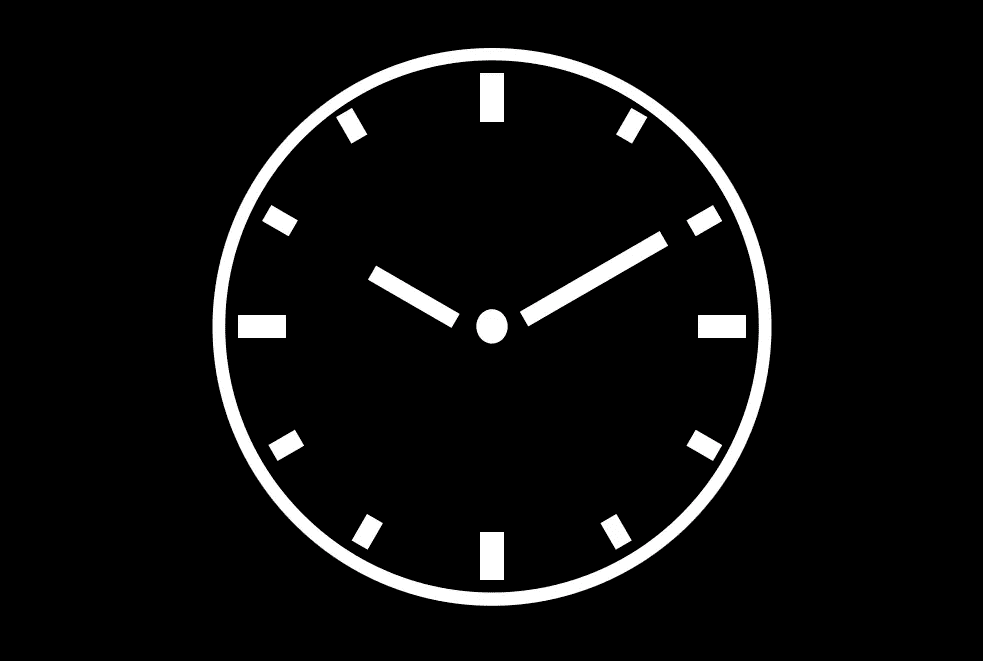

# Python 中的执行时间

> 原文：<https://towardsdatascience.com/execution-times-in-python-ed45ecc1bb4d>

## 用正确的方法测量 Python 代码的执行时间

图片作者。

测量代码执行时间是一项至关重要的工作，无论是数据科学项目中的算法选择还是软件开发中的速度优化。不管是哪种情况，在 Python 中测量时间有其微妙之处，我们最好把它做好。

在这个故事中，我们将通过许多方法来测量 Python 中的时间。我们的目标是，计算代码块的执行时间。

您可能会和我一样感到困惑，因为没有多少 pythonic 式的方法来测量执行时间。希望在读完这个故事后，你能实现更有效的方法来计时你的代码。

我们将在整个故事中使用这两个函数来测试我们的计时器。第一个函数“do_complex_stuff”休眠 1 秒钟(实际上是休眠 Python 线程)，以模拟一些长时间的计算。第二个函数，“do_simple_stuff”不休眠。

## 为什么你应该避免时间。时间

测量时间时，首先要避免使用 *time.time* 。典型的例子是这样的:

> 做复杂的事情…
> 
> 1.0006861686706543

您应该避免它的两个主要原因是:

*   即使系统时间分辨率为 1 秒，时间也会以浮点形式返回，表示自 epoch 以来的秒数。在某些系统中，这种行为会导致舍入误差。
*   它不像时间模块中的其他时钟一样精确。一些系统会产生奇怪的行为，特别是对于小时间的测量。

## 使用纳秒来避免舍入误差

你可以使用 *time.time_ns* 来避免舍入误差， *time_ns* 给出从纪元开始的整数纳秒。我们可以这样做:

> 做复杂的事情…
> 
> 1002516000

它不是最精确的钟，但比时间好。

关于纳秒的一个简单说明。从 Python 3.7 开始，时间模块中很多带后缀“_ns”的函数都返回整数纳秒。它们的原始浮点(秒)版本可以使用不带“_ns”后缀的同名函数来调用。例*时间*。*时间*和 *time.time_ns* 。

## 使用 perf_counter 获得精度

如果精度是你想要的，使用 *time.perf_counter* 代替，或者更确切地说是它的纳秒版本 *time.perf_counter_ns。这是目前最精确的时钟。时钟的绝对值是没有意义的；只有时间的减法才有意义。*

> 做复杂的事情…
> 
> 1005195401

这是计时执行的首选方式。

## 使用 process_time 表示 CPU 时间

在 Python 中执行代码时，CPU 不会将其所有时间让给执行进程。在操作系统级别，还有其他进程也在争夺这些时间。在 Python 中，我们可以通过使用 *time.sleep* 显式地告诉 CPU 让进程线程休眠。因此，允许操作系统级别的其他进程运行。

有时候我们想测量进程的 CPU 时间，不考虑线程睡眠(其他进程做其他事情)。在这种情况下，我们应该使用 *time.process_time_ns* 。与 *perf_counter* 一样，只有两次相减才有意义。

这方面的一个例子是:

> 做复杂的事情…
> 
> 3872000

现在让我们也为“do_simple_stuff”函数计时。与“do_complex_stuff”函数的唯一区别是它休眠 1 秒钟:

> 做简单的事情…
> 
> 3128000

我们在这里看到的是睡眠时间没有考虑在内。这正是我们想要的行为。

有时候，这种方式对时间编码是有帮助的，特别是当有很多 I/O 绑定的任务并且线程休眠不受我们控制的时候。

## 对长流程使用单调时钟

当对较长的流程进行计时时，有一个不容忽视的时间问题。如果系统时间在进程的生命周期中改变了会发生什么？系统时间的改变比你想象的更常见；它们可能是由于 NTP 同步服务或夏令时而发生的。

在这种情况下，我们需要一个即使系统时间改变也不会改变的时钟。输入 *time.monotonic_ns* 该时钟适用于计时较长的流程:

> 做复杂的事情…
> 
> 1004428370

## 禁用垃圾收集器以获得准确的计时

Python 的一个特性是自动垃圾收集。不涉及太多细节，这是一个通过自动化内存管理(即，为未使用的对象释放内存)使您的生活变得更加轻松的过程。

垃圾收集会影响执行时间，因为它可能发生在代码块计时期间。这需要的时间是不可忽略的:

> 68679577

因此，最好在测量时间时暂时禁用它:

> 做简单的事情…
> 
> 486133

## timeit 模块

我对 timeit 模块持观望态度，但我喜欢 Jupyter 笔记本 magic command 的界面:

> 做复杂的事情…
> 
> 做复杂的事情…
> 
> 做复杂的事情…
> 
> 做复杂的事情…
> 
> 做复杂的事情…
> 
> 做复杂的事情…
> 
> 做复杂的事情…
> 
> 做复杂的事情…
> 
> 每次循环 1 秒 1.85 毫秒(平均标准时间戴夫。7 次运行，每次 1 个循环)

我不喜欢 Python 界面。但是，时间编码很方便。

代码的单次执行:

> 做复杂的事情…
> 
> 做复杂的事情…
> 
> 做复杂的事情…
> 
> 做复杂的事情…
> 
> 做复杂的事情…
> 
> 5.012320117995841

或者重复测量。

> 做复杂的事情…
> 
> 做复杂的事情…
> 
> 做复杂的事情…
> 
> 做复杂的事情…
> 
> 做复杂的事情…
> 
> 做复杂的事情…
> 
> [2.0122088000002805, 2.0041232610001316, 2.0006091740001466]

需要注意的是，timeit 官方文档建议使用多次测量中的最小时间，因为这可能比平均值更有代表性。

在 timeit 接口中，我们可以使用函数计时，也可以使用字符串计时。使用一根弦对我来说并不像是 pythonic。不管有多方便，我都不能不皱眉头。

> 做事…
> 
> 做事…
> 
> 做事…
> 
> 做事…
> 
> 做事…
> 
> 做事…
> 
> 做事…
> 
> 做事…
> 
> 做事…
> 
> 做事…
> 
> 0.000834739999845624

## 构建自定义计时器类

让我们通过使用我们现在所知道的关于垃圾收集器、我们可以使用的不同时钟以及对更 Pythonic 化的定时器的需求来创建一个定制的定时器类。

我们想从这个计时器得到的是:

*   关闭垃圾收集的可能性
*   选择我们想要的时钟类型
*   除非特别转换为秒，否则使用纳秒时间

这个类完成这项工作:

使用它非常简单，启动、停止并获得纳秒或秒的时间；就是这样。

要实例化该类，我们需要指定 timer_type，即我们将使用性能时钟、进程时钟还是长期运行时钟(单调)；我们还可以确定是否禁用垃圾收集。

> 做复杂的事情…
> 
> 1001954642, 1.001954642

这是一个进步，但对我来说还不是很 pythonic 化。我们可以做得比显式启动和停止计时器更好。

## 计时上下文管理器

进入上下文管理器，这是 Python 的顶级语法糖特性之一。当我们阅读带有关键字“with”的代码时，有一种优雅的感觉。对于那些不熟悉上下文管理器的人来说，简单的上下文管理器并不难创建，尤其是在使用标准模块 *contextlib* 时。

所以我们可以创建一个上下文管理器，它使用我们的*定时器*类，并负责启动和停止它，就像这样:

然后我们可以用它来计时一段代码:

> 做复杂的事情…
> 
> 1.005408027

这里的*计时器*变量是上一节中的*计时器*类的一个实例，因此它具有相同的属性。

## 最后的话

到目前为止，您已经了解了如何为代码计时的基本知识。希望从现在开始，你会避免大多数常见的错误。您还了解了如何定制定时器，并将其封装在一个干净的 pythonic 上下文管理器中。

关于 timeit 模块，我不怎么用它，除了它的 Jupyter 魔法命令界面。然而，它是一个方便的模块，尤其是*重复*和*自动量程*功能。

我希望这个故事对你有用。如果你想知道更多类似的故事，请订阅。

  

喜欢这个故事吗？通过我下面的推荐链接成为一个媒体成员来支持我的写作。无限制地访问我的故事和许多其他内容。

 