# 使用这些模型扩展您的时间序列库

> 原文：<https://towardsdatascience.com/expand-your-time-series-arsenal-with-these-models-10c807d37558>

## 整理、装袋、堆叠等等

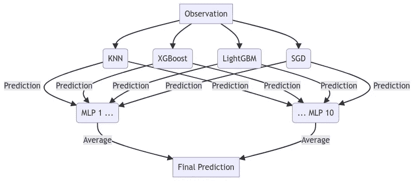

作者图片

时间序列数据通常有三个组成部分:

*   季节性
*   趋势
*   残留的；剩余的

预测这些组成部分，你就可以预测几乎任何时间序列。听起来很简单，对吧？

不完全是。围绕指定模型以使其能够正确考虑这些元素的最佳方法存在许多模糊之处，并且在过去几年中已经发布了许多研究来寻找这样做的最佳方法，其中最先进的模型(如递归和其他神经网络模型)占据了中心位置。此外，许多系列还有其他应该考虑的影响，如假期和结构性中断。

总而言之，预测任何给定的序列通常不像使用线性回归那么容易。非线性估计和集成方法可以与线性方法相结合，找到任何序列的最佳方法。在本文中，我概述了 Scitkit-learn 库中这些模型的一个示例，以及如何利用它们来最大化准确性。这些方法应用于每日访客数据集中，这些数据在 [Kaggle](https://www.kaggle.com/datasets/bobnau/daily-website-visitors) 或 [RegressIt](https://regressit.com/data.html) 上有超过 2000 次的观察。特别感谢[教授 Bob Nau](https://www.fuqua.duke.edu/faculty/robert-nau) 提供！

这篇博文的结构相当重复，每个应用的模型都有相同的图表和评估指标。如果您已经熟悉 Scikit-learn 模型和 API，如 MLR、XGBoost 等，您可以跳到打包和堆叠部分来概述一些可能略有不同的内容。你可以在 [GitHub](https://github.com/mikekeith52/scalecast-examples/blob/main/sklearn/sklearn.ipynb) 上找到完整的笔记本。

# 准备模型

所有模型都使用 scalecast 包运行，该包包含结果，并将 Scikit-learn 和其他模型包装在时序数据周围。默认情况下，它的所有预测都使用动态多步预测，与一步预测的平均值相比，它在整个预测范围内返回更合理的准确性/误差指标。

```
pip install scalecast
```

如果你觉得这个包有趣，就在 GitHub 上给它一颗星。

我们将使用 60 天的预测范围，并使用 60 天的设置来验证每个模型并调整其超参数。所有模型都将在 20%的原始数据上进行测试:

```
f=Forecaster(y=data['First.Time.Visits'],current_dates=data['Date'])
f.generate_future_dates(60)
f.set_test_length(.2)
f.set_validation_length(60)
```

从 EDA(此处未显示)来看，似乎在过去 4 周内存在自相关，并且前 7 个因变量滞后可能是显著的。

```
f.add_ar_terms(7) # 7 auto-regressive terms
f.add_AR_terms((4,7)) # 4 seasonal terms spaced 7 apart
```

对于这个数据集，必须考虑几个季节性因素，包括每日、每周、每月和每季度的波动。

```
f.add_seasonal_regressors(
    'month',
    'quarter',
    'week',
    'dayofyear',
    raw=False,
    sincos=True
) # fourier transformation
f.add_seasonal_regressors(
    'dayofweek',
    'is_leap_year',
    'week',
    raw=False,
    dummy=True,
    drop_first=True
) # dummy vars
```

最后，我们可以通过添加年份变量来模拟序列的趋势:

```
f.add_seasonal_regressors('year')
```

对于所有这些模型，您通常希望为它们提供稳定的时间序列数据。我们可以用扩展的 Dickey-Fuller 检验来确认该数据是稳定的:

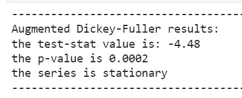

作者图片

# 最低贷款利率（minimumlendingrate）

我们将从简单开始，尝试应用多元线性回归(MLR)。该模型快速、简单，并且没有要调整的超参数。它经常获得很高的精确度，即使使用更先进的方法也很难被击败。

它假设模型中的所有组件可以以线性方式组合，以预测最终输出:

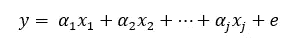

作者图片

其中 *j* 是添加的回归量的数量(在我们的例子中，是 AR、季节和趋势分量),α是相应的系数。在我们的代码中，调用这个函数类似于:

```
f.set_estimator('mlr')
f.manual_forecast()
```

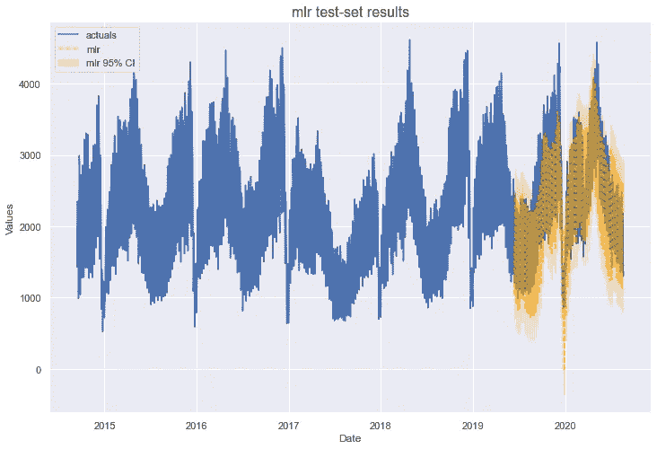

作者图片

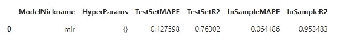

作者图片

值得注意的是，时间序列的线性方法的一个更常见的应用是 [ARIMA](/forecast-with-arima-in-python-more-easily-with-scalecast-35125fc7dc2e) ，它也使用序列的误差作为回归变量。MLR 假设序列的误差是不相关的，这在时间序列中是虚假的。也就是说，在我们的分析中，MLR 获得了 13%的测试集平均绝对百分比误差和 76%的 R2。让我们看看是否可以通过增加复杂性来解决这个问题。

# 套索

接下来回顾的三个模型，Lasso、Ridge 和 ElasticNet，都使用 MLR 的相同基础函数进行预测，但是估计系数的方式不同。有 L1 和 L2 正则化参数，用于减少系数的大小，从而减少过拟合，并可以导致更好的样本外预测。在我们的案例中，这可能是一个很好的尝试技术，因为 MLR 的样本内 R2 得分为 95%，明显大于样本外 R2 的 76%，表明过度拟合。

使用 lasso 可以估计一个参数，即 L1 惩罚参数或 alpha 的大小。我们可以通过对验证数据集的 100 个 alpha 值进行网格搜索来做到这一点。看起来是这样的:

```
f.add_sklearn_estimator(Lasso,'lasso')
f.set_estimator('lasso')
lasso_grid = {'alpha':np.linspace(0,2,100)}
f.ingest_grid(lasso_grid)
f.tune()
f.auto_forecast()
```

Lasso(以及 Ridge 和 ElasticNet)使用缩放输入很重要，这样惩罚参数就能平衡所有系数。默认情况下，Scalecast 使用最小最大缩放器。

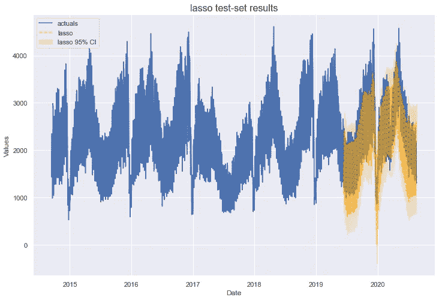

作者图片

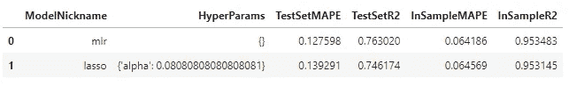

作者图片

选择的最佳 alpha 值为 0.081。该模型既没有提高 MLR 模型的样本外精度，也没有减少过拟合。我们可以用山脊模型再试一次。

# 山脉

山脊类似于套索，除了它使用 L2 惩罚。这里的区别在于，L1 罚函数可以将某些系数降低到零，而里奇罚函数只能将系数降低到接近零。通常，两种模型产生相似的结果。我们可以使用为套索模型创建的相同网格来调整山脊模型。

```
f.set_estimator('ridge')
f.ingest_grid(lasso_grid)
f.tune()
f.auto_forecast()
```


作者图片

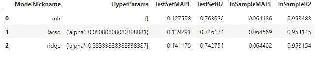

作者图片

为脊模型选择的最佳α是 0.384，其结果与套索模型相似，如果不比套索模型差一点的话。我们还有一个可以将正则化应用于 MLR 的模型:ElasticNet。

# 弹性网

Scikit-learn 提供的 ElasticNet 模型将使用线性模型预测输出，但现在它将混合 L1 和 L2 惩罚。现在要调整的关键参数是:

*   L1/L2 罚款比率(`l1_ratio`)
*   惩罚值(`alpha`)

Scalecast 为 ElasticNet 提供了一个很好的默认验证网格，所以我们不必创建一个。

```
f.set_estimator('elasticnet')
f.tune()
f.auto_forecast()
```

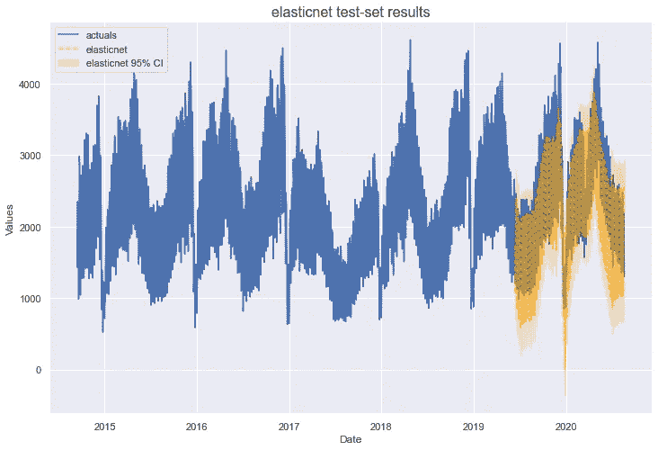

作者图片


作者图片

ElasticNet 的最佳参数是 1 的 `l1_ratio`,这使得它相当于套索模型，以及 0.3 的 alpha。它的表现与套索和脊模型一样好，并且没有减少过度拟合。

# 随机森林

在用尽了几种线性方法来估计这个数列之后，我们可以转向非线性方法。其中最流行的是随机森林，一种基于树的集成方法。它通过用原始数据集的自举样本(替换采样)聚集几个树估计器来起作用。每个样本可以利用原始数据集的不同行和列，最终结果是应用于每个样本的特定数量的基础决策树估计器的平均值。

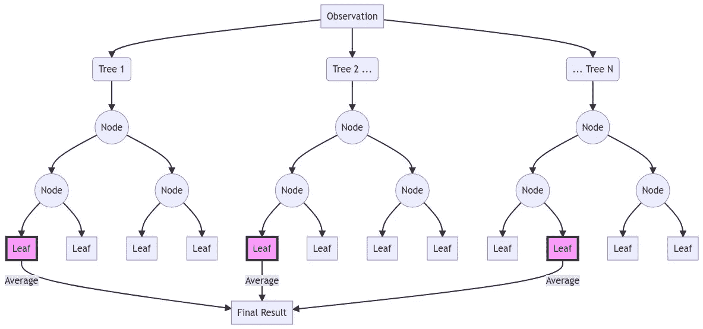

作者图片

对使用随机森林进行时间序列预测的一些批评不时出现，例如估计值不能大于最大观测值或小于最小观测值。有时，这个问题可以通过确保只将平稳数据提供给估计器来解决。但总的来说，这个模型并不以其时间序列的威力而闻名。让我们看看它在这个例子中的表现。我们可以指定自己的验证网格。

```
rf_grid **=** {
     'max_depth':[2,3,4,5],
     'n_estimators':[100,200,500],
     'max_features':['auto','sqrt','log2'],
     'max_samples':[.75,.9,1], 
}
```

然后运行预测。

```
f**.**set_estimator('rf')
f**.**ingest_grid(rf_grid) 
f**.**tune() 
f**.**auto_forecast()
```

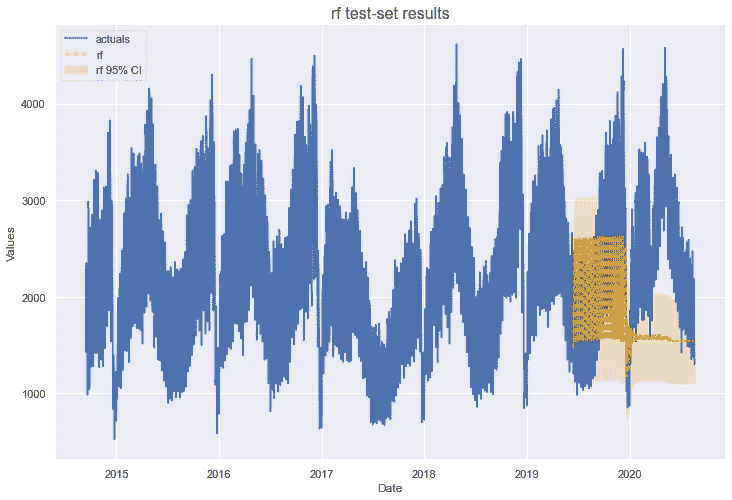

作者图片

从现在开始，我必须粘贴两个表来进行模型基准测试，否则就无法阅读了。底部表格中的行与顶部表格中列出的型号相对应。

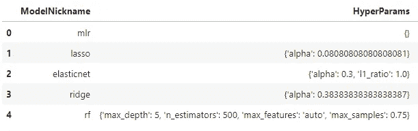

作者图片

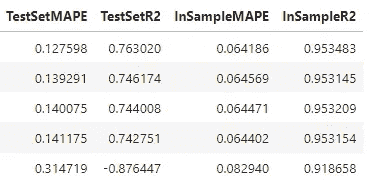

作者图片

不幸的是，我们在随机森林没什么运气。它的表现明显不如之前评估的那些。然而，一旦我们用 BaggingRegressor 模型概述预测，这里介绍的自举抽样的概念将是完整的。

# XGBoost

XGBoost 是一个很难简单解释的模型，所以如果读者感兴趣的话，我将在这里的文章(针对初学者)和这里的文章(针对深入研究)中进行解释。基本思想是，类似于随机森林，通过一系列决策树进行估计，最终结果是每个基础估计的一种加权平均值。与随机森林不同，树是按顺序构建的，其中每个后续的树都对之前的树的残差进行建模，希望尽可能地最小化最终残差。采样不是随机的，而是基于先前树的弱点。通过这种方式，通过提升样本来获得结果，而随机森林使用引导聚合，其中每个树和样本都相互独立。这是对引擎盖下真正发生的事情的过度简化，所以如果这种解释不能让你满意，请阅读链接的文章。在这种模型中有许多超参数需要调整，我们可以构建这样一个网格:

```
xgboost_grid = {
     'n_estimators':[150,200,250],
     'scale_pos_weight':[5,10],
     'learning_rate':[0.1,0.2],
     'gamma':[0,3,5], 
     'subsample':[0.8,0.9]
}
```

评估模型:

```
f.set_estimator('xgboost')
f.ingest_grid(xgboost_grid)
f.tune()
f.auto_forecast()
```

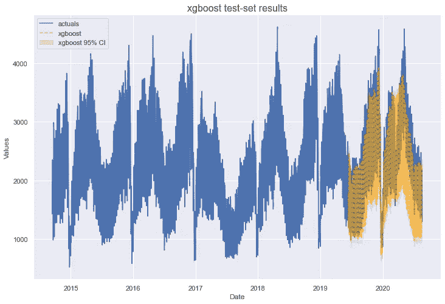

作者图片

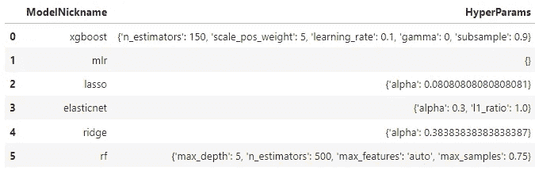

作者图片

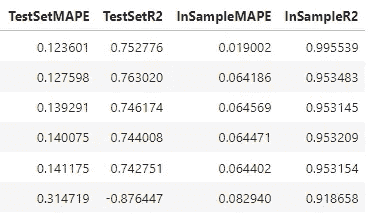

作者图片

XGBoost 表现优于 MLR，测试集 MAPE 为 12%。然而，它似乎更加过度，样本内 R2 得分接近 100%。

到目前为止，希望您已经了解了这些模型是如何构建和评估的。在提供的笔记本中，您还可以看到 [LightGBM](https://medium.com/@pushkarmandot/https-medium-com-pushkarmandot-what-is-lightgbm-how-to-implement-it-how-to-fine-tune-the-parameters-60347819b7fc) (微软的 boosted tree 模型，类似于 XGBoost)、随机梯度下降和 K-最近邻的示例。为了简洁起见，我将跳到打包和堆叠模型来结束这篇文章。

# 制袋材料

Scikit-learn 的 BaggingRegressor 使用了本文随机森林部分介绍的相同的采样概念，但不是每个底层估计器都是决策树，我们可以使用任何我们喜欢的模型。在这种情况下，我指定了 10 个[多层感知器](https://scikit-learn.org/stable/modules/generated/sklearn.neural_network.MLPRegressor.html)神经网络模型，每层 100 个单元，以及 LBFGS 解算器。允许每个数据子集使用原始数据集大小的 90%来对观察值进行采样，还可以随机使用原始数据集的 50%的特征。在代码中，它看起来像这样:

```
f**.**add_sklearn_estimator(BaggingRegressor,'bagging')
f**.**set_estimator('bagging')
f**.**manual_forecast(
     base_estimator **=** MLPRegressor(
         hidden_layer_sizes**=**(100,100,100),
         solver**=**'lbfgs'
     ),
     max_samples **=** 0.9,
     max_features **=** 0.5,
)
```

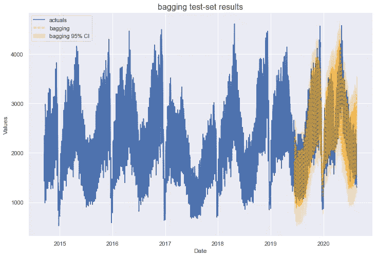

作者图片

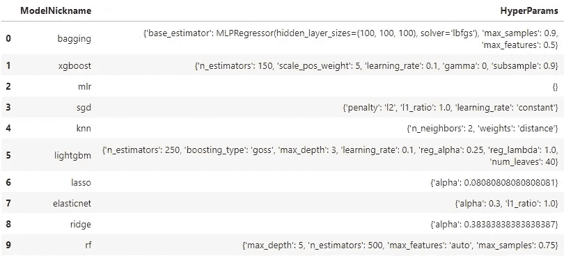

作者图片

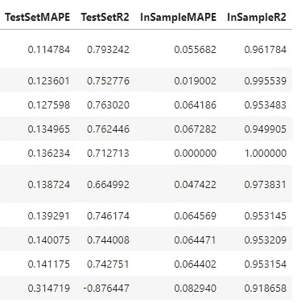

作者图片

这个模型迄今为止表现最好，测试集 MAPE 为 11%，测试集 R2 得分为 79%。从 XGBoost 和 MLR 这两个指标来看，这比第二好的模型要好得多。

# 堆垛

最后一个模型是 StackingRegressor。它创建了一个新的估计器，该估计器使用来自其他指定模型的预测来创建最终预测。它使用传递给`final_estimator` 参数的估计量进行最终预测。

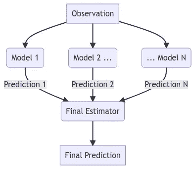

作者图片

在我们的示例中，我们堆叠了四个模型，这些模型评估了该数据集上的最佳样本外数据:

*   k-最近邻(KNN)
*   XGBoost
*   LightGBM
*   随机梯度下降

最后一个估计量是我们在上一节定义的 bagging 估计量。


作者图片

使用 BaggingRegressor 作为最终估计器的优点是，即使 KNN 和 XGBoost 模型高度过拟合，MLP 模型也应该相应地在概念上人为地将它们的预测加权，因为这个模型只使用任何给定 MLP 模型的一半特征输入来训练，它也应该学会信任来自两个没有过拟合的模型的预测:LightGBM 和 SGD。因此，该模型被评估为:

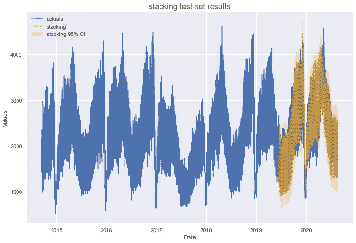

作者图片

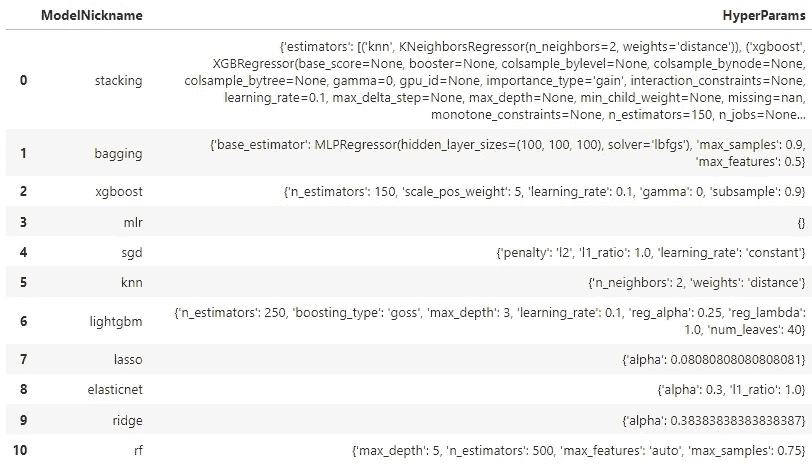

作者图片

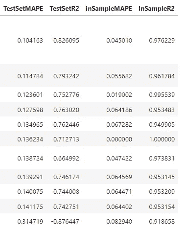

作者图片

增加模型的复杂性并不总是会改善结果，但这似乎是正在发生的事情。我们的堆叠模型明显优于其他模型，测试集 MAPE 为 10%，测试集 R2 得分为 83%。它还具有与评估的 MLR 相当的样本内指标。

# 回溯测试

为了进一步验证我们的模型，我们可以对它们进行回溯测试。这是一个迭代地评估它们在最后 n 个预测范围内的准确性的过程，以查看如果该模型被实施、仅在每个预测范围之前的观测值上被训练，实际上会实现什么结果。默认情况下，scalecast 选择 10 个预测时段，其长度由对象中生成的未来日期数决定(在我们的示例中为 60)。下面是它在代码中的样子:

```
f**.**backtest('stacking')
f**.**export_backtest_metrics('stacking')
```

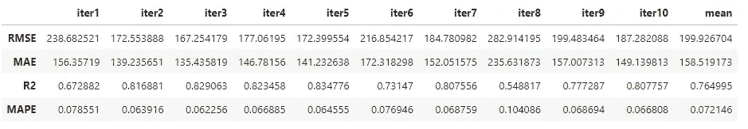

作者图片

这告诉我们，平均而言，使用 60 天的预测长度，我们的模型将获得 7%的 MAPE 分数和 76%的 R2 分数。这是一个很好的方法来验证模型不仅仅是幸运地得到了特定的测试集，而且实际上可以推广到看不见的数据。

# 结论

这篇文章介绍了几种用于预测的建模概念，包括线性方法(MLR、Lasso、Ridge)、树集合(Random Forest、XGBoost、LightGBM)、装袋和堆叠。通过提高应用于它的非线性方法的复杂性，并使用巧妙的采样方法，我们在一个有大约 400 个观察值的测试集上获得了 10%的测试集 MAPE 分数。我希望这个例子能够激发你自己的一些想法，我很感谢你的参与！如果你觉得这个概述有帮助，在 GitHub 上给 scalecast 包打个星吧。

[](https://github.com/mikekeith52/scalecast) [## GitHub - mikekeith52/scalecast:使用多种工具轻松、动态地预测时间序列

### Scalecast 是一个轻量级的建模过程和模型包装器，是为那些至少有中级…

github.com](https://github.com/mikekeith52/scalecast)