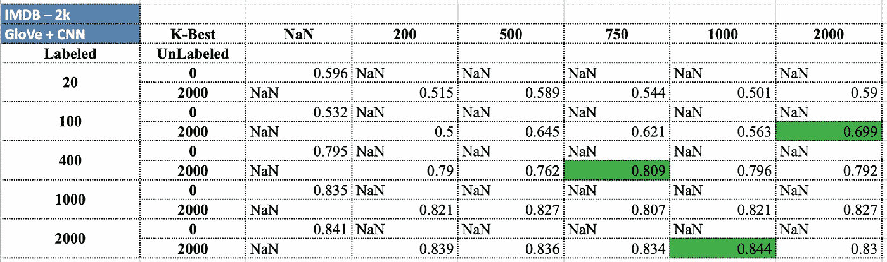
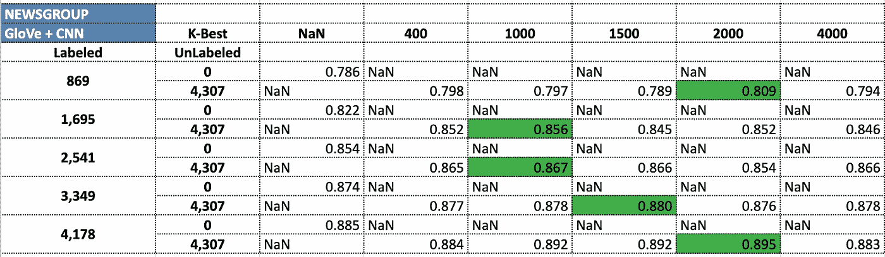
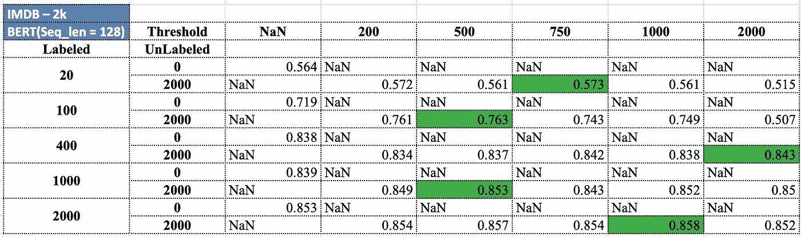
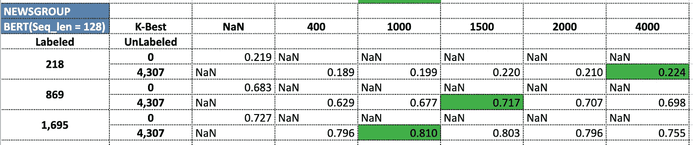
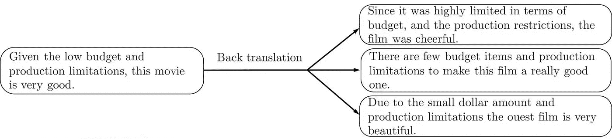
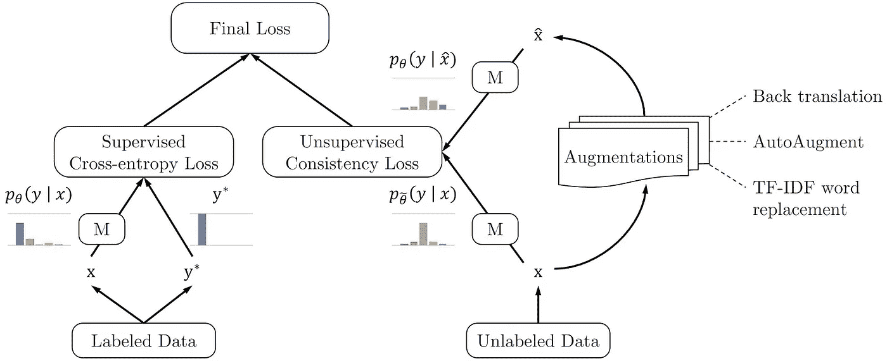
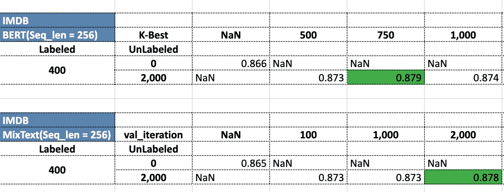

# 不同公共数据集上 SOTA 半监督学习 NLP 算法的经验

> 原文：<https://towardsdatascience.com/experiences-with-sota-semi-supervised-learning-nlp-algorithms-on-different-public-datasets-a368132ed6f>

## 在 NLP 中，我们如何处理少量的训练数据？半监督学习——拯救我们！


来源:此处见[。](/explained-deep-learning-in-tensorflow-chapter-0-acae8112a98)

半监督学习是机器学习领域中一个活跃的研究领域。它通常用于通过利用大量未标记的数据(即输入或特征可用但基础事实或实际输出值未知的观察值)来提高监督学习问题的概化能力(即基于提供的输入和基础事实或每个观察值的实际输出值来训练模型)。

## 实验设置

我们有以下两个不同的数据集(从分类的角度来看，以复杂性递增的顺序排列):

[IMDB 评论](https://ai.stanford.edu/~amaas/data/sentiment/)数据:由斯坦福主持，这是一个电影评论的情感(二元-正面和负面)分类数据集。更多详情请参考[此处](https://ai.stanford.edu/~amaas/data/sentiment/)。

20Newsgroup 数据集:这是一个多类分类数据集，其中每个观察都是一篇新闻文章，并标有一个新闻主题(政治、体育、宗教等)。这些数据也可以通过开源库 [scikit-learn](http://scikit-learn.org/stable/modules/generated/sklearn.datasets.fetch_20newsgroups.html) 获得。关于这个数据集的更多细节可以在[这里](http://qwone.com/~jason/20Newsgroups/)阅读。

我们已经进行了实验，以观察这些算法在低、中和高数据量下对未标记数据的表现。我们已经了解了 sklearn 的 SelfTrainingClassifier，它作为一个包装器函数来支持任何基于 sklearn 的算法的自我训练。我们已经看到了简单逻辑回归模型和 ANN(人工神经网络)模型的自我训练前后结果的比较。

在本文的第[部分-1](https://medium.com/@naveen.rathani/improve-your-models-performance-with-unlabeled-data-d6e78a57fadb) 中，对该领域中使用的一些初始方法进行了彻底的讨论——随后是更复杂的第[部分-2](https://medium.com/@naveen.rathani/improving-model-performance-using-semi-supervised-wrapper-methods-31d8712ca20) 部分，您可以从中了解如何在实践中应用这些方法。

在这一部分，我们将介绍一些最新的半监督学习(SSL)方法，以及它们在我们的实验中的表现。我们先来看看一个先进的 NLP 模型——比如 LSTM/CNN(是的，你没看错！！CNN 可以是一个很好的 NLP 模型。下一节将详细介绍)或像 BERT 这样的先进(SOTA)模型在半监督学习(SSL)环境中执行。然后，我们继续讨论这一领域的最新方法——UDA 和 mixt，它们采用了一些新颖的思想来解决 SSL 问题。最后，我们对这些算法进行了详细的比较，并提出了进一步的研究方向。

让我们开始吧！

# LSTM

我们已经看到 LSTMs 从一开始就扰乱了 NLP 空间。因此，我们认为使用 LSTM 将是下一个合乎逻辑的步骤。[这篇](/a-battle-against-amnesia-a-brief-history-and-introduction-of-recurrent-neural-networks-50496aae6740)文章很好地提供了 LSTMs 和 rnn 的简史和用法。

由于 LSTM 是一个序列模型，tf-idf 嵌入帮助不大。因此，我们决定使用[手套](https://nlp.stanford.edu/projects/glove/)嵌入，它可以作为顺序输入提供给模型。我们使用了一个相当简单的架构来创建 LSTM 模型。它由三个 LSTM 层组成，每个层后面都有一个下降层。最后，我们有一个密集层，后面是输出层。

以下代码显示了该架构的外观:

请注意，本系列中的所有代码都可以在这个 [github](https://github.com/abhinivesh-s/Semi-Supervised-Text) 页面上找到。

官方`[sklearn.semi_supervised](https://scikit-learn.org/stable/modules/classes.html#module-sklearn.semi_supervised)`。SelfTrainingClassifier 不适用于模型中包含功能模块的 TensorFlow 组件。在这种情况下，我们将使用 scikeras.wrappers 中的 KerasClassifier，它的工作方式与 SelfTrainingClassifier 完全相同，并且支持 TensorFlow 模型的功能模块。

我们在这一点上没有包括 LSTM 的结果，因为即使是相对较浅的架构，运行它也需要相当长的时间，甚至性能也无法与 CNN 模型相提并论——这是我们将在下一节中看到的。

# 美国有线新闻网；卷积神经网络

现在，像 CNN 这样主要用于计算机视觉的模型在我们的 NLP 实验中做什么呢？人们已经尝试使用这种方法，并取得了巨大的成功。参见[这篇](https://aclanthology.org/S15-2079.pdf)论文，了解关于此类工作的更多细节。

回到我们的问题，我们认为尝试 CNN 是值得的，原因有二:

1.  与 CNN 相比，LSTMs 执行起来相对较慢。
2.  在许多使用案例中，CNN 的性能几乎与 LSTMs 一样好，甚至更好。

我们使用相同的手套嵌入和训练我们的 CNN。参见[这篇](/convolutional-neural-network-in-natural-language-processing-96d67f91275c)综合文章，了解如何对文本数据应用 CNN 的更多细节。

这里有一段代码可以帮助你理解我们的 CNN 架构:

我们使用了我们在 LSTM 实验中使用的来自 scikeras.wrappers 的相同的 KerasClassifier。

我们已经看到 CNN 的表现至少和 LSTM 一样好，有时甚至更好！运行时间也大大减少了。

结果如下:



CNN 关于 IMDB 数据



CNN 新闻组数据

# 伯特

如果没有试用 BERT，这些天的任何 NLP 模型构建练习都是不完整的。BERT 是一个预训练的语言模型，由谷歌在 2018 年推出，从那时起，它扰乱了 NLP 空间。它使用一组具有编码器-解码器架构的转换器，并使用一种称为**掩蔽语言模型(MLM)** 的新技术在大量数据上进行训练。如果这些听起来不熟悉，你可以通过[这篇](https://medium.com/@samia.khalid/bert-explained-a-complete-guide-with-theory-and-tutorial-3ac9ebc8fa7c)文章来更深入地理解 BERT 背后的思想和机制。

在 BERT 之后，出现了许多预训练模型的变体，它们具有不同的架构，并使用不同的技术进行训练。总而言之，像 BERT 这样的预训练模型携带了大量关于它们被训练的语料库的信息和知识。这些模型唯一的缺点是它们需要大量的 GPU 形式的计算能力。

我们不需要为 BERT 单独使用任何单词嵌入，因为它产生的 BERT 嵌入在上下文嵌入的意义上优于 GloVe、单词到 vec 和其他嵌入..*即*根据出现的上下文，同一个单词可以有不同的嵌入。例如:

1.  苹果是我最喜欢的水果。
2.  我买了一部 ***苹果*** iPhone。

上面两个句子中的单词“apple”在不同的上下文中会有不同的 BERT 嵌入。

由于 BERT 是一个已经预先训练好的模型，我们不再从头开始训练它。但是我们会微调它。微调 BERT 是一种受监督的方法，包括传递一些带标签的训练示例，之后，它将准备好为我们的测试数据给出标签。

[出于本文的目的，我们在 BERT 的上下文中交替使用训练和微调这两个词。]

出于训练/微调的目的，我们使用了一个非常用户友好的 BERT API，名为 [sklearn-bert](https://github.com/charles9n/bert-sklearn) 。这是一个无附加条件的 API，我们可以像使用其他 sklearn 模型一样使用它。这就是我们安装 sklearn-bert 的方法。

下面的代码片段显示了如何训练 sklearn-bert:

由于我们的计算限制，我们将序列长度和 batch_size 分别限制为 128 和 16。我们使用了最大序列长度为 512 的“bert-base-uncased”模型。我们可以只做一个模型。fit()然后瞧！我们已经完成了微调。我们可以做一个 model.predict()来获得预测的标签。

这种 API 的优点是，我们不需要手动对 BERT 进行任何类型的标记化或最后一层添加——如果我们使用 PyTorch 或 TensorFlow 训练 BERT，就必须这样做。

现在，我们如何在这个 BERT 模型上做 SSL 呢？因为这是一个 sklearn 模型，所以我们认为可以使用以前使用过的来自 scikeras.wrappers 的相同的 KerasClassifier。但不幸的是，这并没有奏效。我们认为这是因为 BertClassifier 没有实现我们的 KerasClassifier 需要的所有 sklearn 方法。因此，我们必须自己实现 SSL 逻辑——这相当简单。查看下面的代码片段，了解我们的 BERT SSL 实现:

让我们快速回顾一下我们是如何实现 SSL 算法的。

*X_u* 表示未标记的数据集。迭代次数— *num_iter* 最多是 *X_u* 和 *kbest* 值的比值。

我们做一个 model.fit()，然后使用模型进行预测。然后，我们选择概率最大的预测作为最终的模型输出。

然后，我们基于 *n_to_select* 对其进行划分，这是 *kbest* 值和 *X_u.* 大小中较小的一个，它与已经存在的 *new_X* 数据集连接在一起。最后一步，不管 *kbest* 值是多少，我们都将剩下的内容(在*if not _ selected _ update = = ' yes ':*子句中完成)添加到数据中。

下面是我们使用 SSL 和 BERT 获得的结果:



IMDB 数据上的 BERT



新闻组数据上的 BERT

由于内存和计算资源的限制，我们无法使用 BERT 来处理新闻组数据集中更多的标记数据。

# 无监督数据增强(UDA)

到目前为止，我们所做的一切只涉及改变模型和尝试不同的架构，以提高性能。但是现在，我们从根本上改变了处理这个问题的方式。

在 [UDA](https://arxiv.org/abs/1904.12848) 中，我们使用数据扩充和一致性训练来进一步提高现有性能，而不是相同的 SSL。我们现在将简要讨论 UDA 是如何工作的，特别是在 NLP 的环境中。

无监督的数据增强试图通过使用一组数据增强来有效地增加标记数据的数量，如反向翻译、单词替换等。

## 反向翻译

反向翻译把一个英语句子翻译成不同的语言——比如说，俄语、德语、汉语等等，然后再把它们翻译回英语，这样我们就会得到一个重新措辞的句子，意思相同，因此标签也相同。这些回译可以通过使用任何*机器翻译*模型作为服务来完成。

```
Sentence in English — S, Rephrased sentence — S”.S’ = EnglishToGerman(S);S” = GermanToEnglish(S’).
```

我们可以控制回译的质量，得到不同种类的重组句子，它们的结构和措辞略有不同，但意思相似。在下图中，我们可以看到一个句子的三种不同的回译。



一个反向翻译的例子。【[图片来源](https://arxiv.org/abs/1812.00677)

## 单词替换

单词替换是另一种数据扩充方法。我们通过从整个词汇表中取样单词来替换具有低 TF-IDF 分数的句子中的单词。这可能有助于生成多样且有效的示例。

UDA 使用标记数据和扩充的未标记数据进行训练。我们可以使用任何通用的 NLP 模型来执行 UDA，只需稍微改变损失函数。下图显示了损失函数是如何调整的:



UDA [ [图像源](https://arxiv.org/abs/1812.00677)概述

损失函数有两个部分:有标记数据的监督交叉熵损失，这是传统的损失函数，以及无标记数据的 ***无监督一致性损失*** 。

直观地说，无监督的一致性损失做了一件非常简单的事情:它迫使所有增强的例子具有相同的标签。这似乎是合理的，因为我们知道，我们所做的扩充给了我们具有相同含义的重组句子，因此，相同的标签。

我们有一个稍微更新的 UDA 版本——叫做 mixt，这就是我们已经实现的。现在就来看看吧。

# 混合文本

[mixt](https://arxiv.org/pdf/2004.12239.pdf)最初做的正是我们在 UDA 中讨论的事情——接受标记数据和未标记数据，进行扩充，并预测未标记数据的标签。但是在应用交叉熵和一致性损失之前，它执行了另一个称为 **TMix 的增强。**

## TMix

TMix 提供了一种扩充文本数据的通用方法，因此可以独立地应用于任何下游任务。TMix 在文本隐藏空间做— *插值。*已经表明，从两个隐藏向量的插值中解码生成具有两个原始句子的混合含义的新句子。

对于具有 L 层的编码器，我们选择在第 m 层混合隐藏表示，其中 m ∈ [0，L]。简单来说，TMix 取两个带有标签 *y 和 y`* 的文本样本 *x 和 x`* ，将它们在层 *m* 的隐藏状态表示 *h 和 h`* 混合到*h"*中，然后继续向前传递以预测混合标签*y"*。混合隐藏状态(带有参数λ)的情况如下:

实验表明，一些特定的 BERT 层{3，4，6，7，9，12}最具代表性。基于此，mixt 的作者选择了一些随机子集，并且{7，9，12}给出了最佳结果，因此，这就是我们所使用的。

运行 MixText 要求我们按照他们的 [GitHub 页面上的说明进行操作。](https://github.com/GT-SALT/MixText)我们必须稍微修改 code/read_data.py 文件中的代码，以便读取我们的 IMDB/新闻组数据格式。

结果如下:



IMDB 数据上的 mixt 与 BERT

# 最终比较

我们可以看到，BERT 和 CNN 在 SSL 设置中表现得相当好。由于没有明确的赢家，我们可以根据手头的任务来测试和选择它们。

在我们固定的序列长度下，我们无法观察到 mixt 和 BERT+SSL 之间的任何显著差异。作者提到的结果可能是因为在更好的计算资源的帮助下，使用了更长的序列长度和更有效和多样的扩增。

包括本文在内的 3 部分系列是由 Pilani-IN 和热情的 NLP 数据科学家 Sreepada Abhinivesh 共同完成的，Naveen Rathani 是一位拥有 BITS 硕士学位的应用机器学习专家和数据科学爱好者。