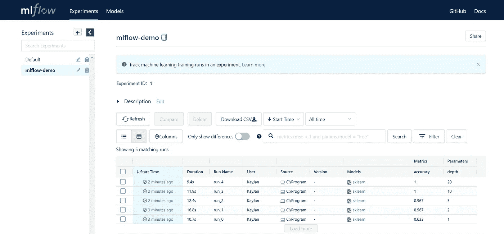
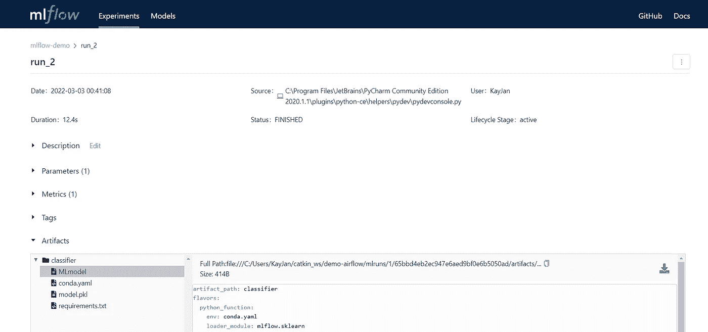
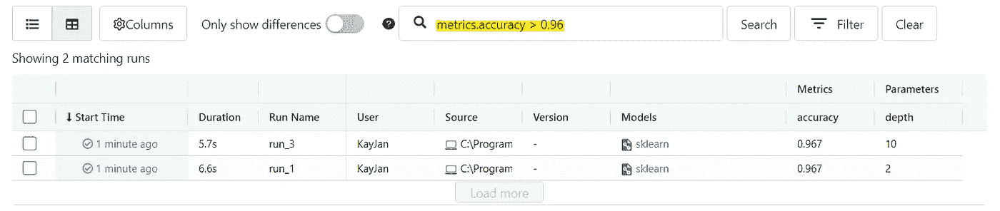

# 10 分钟内使用 MLflow 进行实验跟踪

> 原文：<https://towardsdatascience.com/experiment-tracking-with-mlflow-in-10-minutes-f7c2128b8f2c>

## 轻松管理机器学习生命周期——用 Python 示例解释


艾萨克·梅海根在 [Unsplash](https://unsplash.com?utm_source=medium&utm_medium=referral) 上拍摄的照片

Databricks MLflow 是一个管理机器学习生命周期的开源平台。通俗地说，它可以跟踪和存储数据、参数和指标，以便以后检索或在 web 界面上很好地显示。这在实验或 A/B 测试中非常有用，因为跟踪超参数和评估指标对于透明度和再现性非常重要。MLflow 还可以实现集中的模型治理，并鼓励协作，因为它是一个集中的模型库。

本文将涉及 MLflow 中使用的组件和术语，如何设置、跟踪和查询 MLflow 的 Python 示例，以及如何启动 MLflow web 界面。

***更新*** *:本文是系列文章的一部分。查看其他“10 分钟内”话题* [*此处*](https://medium.com/@kayjanwong/list/in-10-minutes-eeaa9aa67055) *！*

# 目录

*   [什么是 MLflow](https://medium.com/p/f7c2128b8f2c/#ae8f)
*   [物流跟踪组件](https://medium.com/p/f7c2128b8f2c/#27f4)
*   [安装 MLflow](https://medium.com/p/f7c2128b8f2c/#2026)
*   [通过 Python 使用 ml flow](https://medium.com/p/f7c2128b8f2c/#5514)
*   [启动网页界面](https://medium.com/p/f7c2128b8f2c/#6dab)

# 什么是 MLflow

MLflow 是一个管理机器学习(ML)生命周期的平台，包括 ETL、特征工程、培训、评分和监控模型。MLflow 可以集成到 ML 生命周期的任何阶段，这取决于用户想要跟踪的内容。

MLflow 有 4 个组件，它们可以独立使用。

*   **MLflow Tracking** :使用代码或 web 界面记录和查询实验(代码、数据、配置、超参数、评估指标、结果)
*   MLflow 项目:代码打包格式，可在任何平台上重复运行，结合 Git 进行源代码控制，结合环境进行依赖跟踪
*   **MLflow 模型**:支持多样化批量和实时评分的模型封装格式
*   **MLflow 模型注册中心**:支持和管理 ML 生命周期的集中式模型存储、一组 API 和 web 界面

# 物流跟踪的组件

MLflow 跟踪可能是数据科学家最常用的工具，本文将重点介绍使用 MLflow 跟踪的实验跟踪。可以跟踪几个项目，

*   **参数**:输入参数的键值对，即随机森林模型的深度
*   **指标**:评估指标，即 RMSE、ROC-AUC
*   **工件**:任意格式的任意输出文件，包括图像、酸洗模型、数据文件
*   **Source** :原始代码，如果链接到 GitHub，包括提交散列

给一个预览，上面所有的项目都可以用一行代码来跟踪！在后面的章节中，我们将更深入地探讨如何将下面的代码集成到代码库中，以及如何使用代码和 UI 来查询被跟踪的项目。

```
# Track parameters
mlflow.log_param("max_depth", 20)

# Track metrics
mlflow.log_metric("rmse", 0.5)

# Track artifact
mlflow.log_artifact("/path/graph.png", "myGraph")

# Track model (depends on model type)
mlflow.sklearn.log_model(model, "myModel")
mlflow.keras.log_model(model, "myModel")
mlflow.pytorch.log_model(model, "myModel")
```

# 安装 MLflow

可以使用以下命令将 MLflow 安装为 Python 包，

```
$ pip install mlflow
```

现在你可以去追踪一些东西了！

# 将 MLflow 与 Python 结合使用

为了与现有的代码库集成，有两个更重要的术语很重要——实验和运行。实验用于查询和比较不同的运行，通常是项目级的设置。另一方面，run 只是指一次运行，多次运行可以标记到同一个实验中。

> 请注意，有一个实验 ID 和实验名称、运行 ID 和运行名称不能混淆的概念！

用相同的 ***运行名*** 初始化 MLflow 被认为是不同的运行，跟踪的项目将分开存储，而用相同的 ***运行 id*** 初始化 MLflow 将一起存储跟踪的项目。如果您在同一运行的代码库的多个部分中使用 MLflow，建议检索运行 id 并使用运行 id 在后面的部分中初始化 MLflow。

## 使用 MLflow 进行跟踪

正如引言中提到的，MLflow 可以在任何阶段集成到 ML 生命周期中。让我们看一个例子，其中使用简单的 Iris 数据集在数据科学工作流中跟踪参数、指标和模型。

从上面的代码中，我们在第 14 行定义了`EXPERIMENT_NAME`,在第 15 行检索了`EXPERIMENT_ID`。实际的跟踪从第 25 行开始，其中记录了不同运行的参数、度量和模型。通过这样做，MLflow 在您的代码库中创建了一个名为`mlruns`的文件夹，可以使用代码或 MLflow web 界面查询该文件夹。

## 使用 MLflow 查询

可以使用代码或 MLflow 交互式 web 界面访问跟踪的项目。使用代码访问提供了一种更自动化的方法来检索最佳模型或最高度量分数，因为它可以立即集成到代码中，绕过 web 界面。

为了查询被跟踪的项目，通常的做法是我们检索与实验的单次运行相关的数据，并通过**运行 id** 获得最佳运行信息。使用最佳运行信息，我们可以查询被跟踪的项目，即检索参数，下载模型工件。下面是查询 MLflow 项目的代码片段，上接上一节的数据科学工作流示例。

# 启动 Web 界面

可以在`http://localhost:5000`访问 MLflow web 界面，并使用以下命令启动。

```
$ mlflow ui
```



图 MLflow web 界面的主页—作者图片

交互式网络界面允许您在侧面板上查看实验，并在一页上以表格形式显示与实验相关的所有运行信息。



图 2:查看一个运行信息—按作者排序的图像

单击其中一个运行，除了跟踪的项目之外，您还可以查看该运行的更多元数据，例如运行时间、运行状态和生命周期阶段。如果您不想对其进行编码，也可以在这里手动添加或更改描述或标签！在工件下，这次运行生成了一些文件，如`MLmodel`、`conda.yaml`和`requirements.txt`。这些文件现在并不重要，除非您计划使用 MLflow Projects 组件，例如，它在一次运行中将所有项目打包在一起以便发送部署。



图 MLflow 上的搜索结果—按作者排序的图片

如果需要，您还可以使用搜索栏来查询满足特定参数和/或指标标准的运行！如果你想知道你最后一次使用某个参数是在什么时候，而没有经历所有的运行，这是非常有用的。

希望您已经了解了 Databricks MLflow 的基础知识，以及如何通过 Python 和 MLflow web 界面设置和使用 MLflow。在此介绍之后，您应该能够更好地跟踪和理解 MLflow 文档、论坛或其他文章。

**感谢您的阅读！如果你喜欢这篇文章，请随意分享。**

# **相关链接**

MLflow 文档:[https://www.mlflow.org/docs/latest/index.html](https://www.mlflow.org/docs/latest/index.html)

MLflow 教程:[https://docs . databricks . com/applications/ml flow/quick-start-python . html](https://docs.databricks.com/applications/mlflow/quick-start-python.html)

MLflow 官方 GitHub:[https://github.com/mlflow/mlflow](https://github.com/mlflow/mlflow)