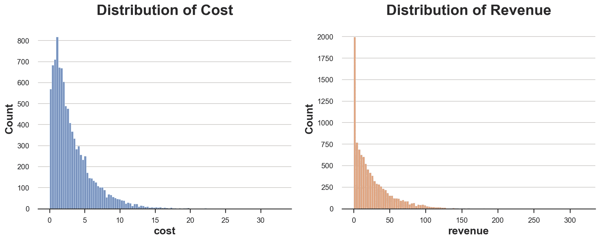
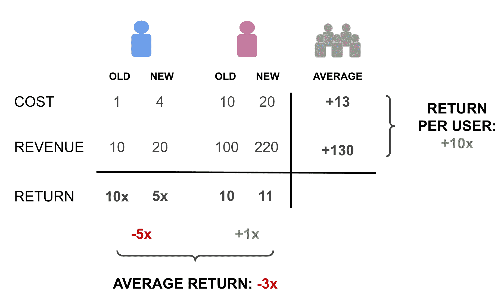
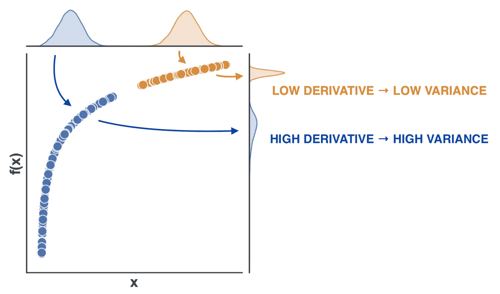
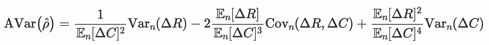

# 投资回报实验

> 原文：<https://towardsdatascience.com/experiments-on-returns-on-investment-34a1953c5f16>

## [因果数据科学](https://towardsdatascience.com/tagged/causal-data-science)

## *比率度量推断的 delta 方法介绍。*

封面图片，由作者使用[nightcafe](https://creator.nightcafe.studio/)生成

当我们进行一项实验时，我们通常不仅对一项治疗(新产品、新功能、新界面……)对收入的影响感兴趣，还对其成本效益感兴趣。换句话说，投资是否值得？常见的例子包括计算资源投资、广告回报、点击率和其他比率指标。

当我们调查因果关系时，金标准是[随机对照试验](https://en.wikipedia.org/wiki/Randomized_experiment)，也就是 **AB 测试**。将治疗随机分配给人群的一个子集(用户、患者、顾客等)，我们确保平均而言，结果的差异可以归因于治疗。然而，当感兴趣的目标是成本效益时，AB 测试提出了一些额外的问题，因为我们不仅对一种治疗效果感兴趣，而且对两种治疗效果的**比率**感兴趣，即投资的结果超过其成本。

在本帖中，我们将看到当感兴趣的对象是**投资回报率(ROI)** 时，如何分析随机实验。我们将探索衡量投资是否有回报的替代指标。我们还将介绍一个非常强大的复杂度量推断工具:delta 方法。虽然代数可能很密集，但结果很简单:我们可以使用简单的线性回归来计算比率估计量的置信区间。

# 投资云计算

为了更好地说明这些概念，我们将在整篇文章中使用一个玩具示例:假设我们是一个在线市场，我们想要投资云计算，我们想要通过切换到一个更高层的服务器来提高我们内部搜索引擎的计算能力。这个想法是，更快的搜索将改善用户体验，潜在地导致更高的销售额。所以，问题是:投资值不值这个成本？感兴趣的对象是**投资回报率**。

作者使用[nightcafe](https://creator.nightcafe.studio/)生成的图像

与通常的 AB 测试或随机实验不同，我们对单一的因果影响不感兴趣，而是对两个指标的**比率**感兴趣:对收入的影响和对成本的影响。我们仍将使用**随机对照试验**或 **AB 测试**来估算投资回报率:我们将用户随机分配到治疗组或对照组。接受治疗的用户将受益于更快的云机器，而控制用户将使用旧的较慢的机器。随机化确保我们可以通过比较治疗组和对照组中的用户来估计新机器对成本或收入的影响:平均值的**差异**是平均治疗效果的无偏估计值。然而，事情因为它们的比例而变得更加复杂。

我从`[src.dgp](https://github.com/matteocourthoud/Blog-Posts/blob/main/notebooks/src/dgp.py)`导入数据生成过程`dgp_cloud()`。关于以前的文章，我生成了一个新的 DGP 父类，它处理随机化和数据生成，而它的子类包含特定的用例。我也从`[src.utils](https://github.com/matteocourthoud/Blog-Posts/blob/main/notebooks/src/utils.py)`导入绘图函数和库。为了不仅包括代码，还包括数据和表格，我使用了 [Deepnote](https://deepnote.com) ，一个类似 Jupyter 的基于网络的协作笔记本环境。

该数据包含一个月内一组 10.000 个用户的总数`cost`和`revenue`的信息。我们也有关于治疗的信息:搜索引擎是运行在旧的还是`new machines`上。正如商业指标经常发生的那样，成本和收入的分布都非常不均衡(T21)。此外，大多数人不购买任何东西，因此产生零收入，即使他们仍然使用该平台，产生正成本。

成本和收入分布，按作者分类的图像

我们可以通过回归治疗指标的结果来计算`cost`和`revenue`的**均值差**估计值。

平均每个用户增加了 0.5152 美元。营收呢？

每个用户的平均`revenue`也增加了 1.0664 美元。那么，这笔投资**盈利了吗**？

要回答这个问题，我们首先必须决定使用哪个指标作为我们的**结果指标**。在比率度量的情况下，这不是微不足道的。

# 平均回报还是平均回报？

这是一个非常诱人的解决问题的方法:的确，我们有两个变量，所以我们可以计算它们的比率，然后像往常一样，使用一个**单变量**:个人水平回报来分析一切。

个人回报，作者图片

如果我们使用这个单一的度量来分析实验，会发生什么？

估计效果为**负且显著**，-0.7392！新机器似乎不是一项好的投资，回报率下降了 74%。

这个结果似乎与我们先前的估计相矛盾。我们之前已经看到，收入的平均增长超过了成本(1.0664 美元对 0.5152 美元)。为什么会这样呢？问题是我们给重度用户和轻度用户的权重是一样的。让我们用一个简单的有两个用户的**例子**。第一个(蓝色)是轻度用户，以前花费 1 美元并返回 10 美元，而现在花费 4 美元并返回 20 美元。另一个用户(violet)是一个重度用户，以前花费 10 美元并返回 100 美元，现在花费 20 美元并返回 220 美元。

高使用率和低使用率用户示例，按作者排序

平均回报率为-3 倍:平均每个用户的回报率下降了 300%。然而，每个用户的总回报是 1000%:13 美元的成本增加产生了 130 美元的收入！结果大相径庭，完全由两个用户的**权重**决定:重度用户的影响在**相对**方面较低，但在**绝对**方面较高，而轻度用户则相反。因此，平均相对效果主要由轻度用户驱动，而相对平均效果主要由重度用户驱动。

**哪个指标**与我们的设置更相关？当谈到投资回报时，我们通常感兴趣的是了解我们所花的钱是否得到了回报。所以**总收益**比平均收益更有意思。

从现在开始，感兴趣的对象将是**投资回报率(ROI)** ，由预期收入增长超过预期成本增长给出，我们将用希腊字母 rho， *ρ* 表示。

投资回报，作者图片

我们可以**估计**ROI 为之前两次估计的比率:治疗组和对照组之间的平均收入差异，与治疗组和对照组之间的平均成本差异(差异用希腊字母 delta 表示)。

投资回报的估算者，图片由作者提供

请注意与前面的公式有一个微妙但至关重要的**差异**:我们用经验期望运算符𝔼ₙ替换了[期望值](https://en.wikipedia.org/wiki/Expected_value) 𝔼，也称为[样本平均值](https://en.wikipedia.org/wiki/Arithmetic_mean)。符号上的差异很小，但概念上的差异是巨大的。第一个，𝔼，是一个理论上的概念，而第二个，𝔼ₙ，是经验上的:它是一个依赖于实际数据的数字。我个人喜欢这个符号，因为它强调了两个概念之间的紧密联系(第二个概念是第一个概念的经验对应)，同时也清楚地表明第二个概念取决于样本大小 *n* 。

估计值为 2.0698:在新机器上每多花 1 美元，收入就多 2.0698 美元。听起来很棒！

但是我们应该在多大程度上相信这个数字呢？是和一个显著不同，还是只是被噪音驱动？

# 推理

为了回答这个问题，我们想计算一个 [**置信区间**](https://en.wikipedia.org/wiki/Confidence_interval) 来进行我们的估计。我们如何计算比率度量的置信区间？第一步是计算估计量的标准差。一种始终可用的方法是 [**bootstrap**](https://en.wikipedia.org/wiki/Bootstrapping_(statistics)) :通过多次替换对数据进行重新采样，并使用样本上估计值的分布来计算估计值的标准偏差。

让我们在自己的案例中尝试一下。我计算了 10.000 个引导样本的标准偏差，使用带有选项`frac=1`的函数`pd.DataFrame().sample()`获得相同大小的数据集，并使用选项`replace=True`进行替换采样。

标准差的 bootstrap 估计等于 0.979。有多好？

由于我们完全控制数据生成过程，我们可以模拟估计量的“真实”分布。我们对 10.000 次模拟进行此操作，然后计算估计量的标准偏差。

使用“真实”数据生成过程的估计量的估计方差略高，但非常相似，约为 1.055。

bootstrap 的问题是它的计算量非常大，因为它需要重复估计过程数千次。我们现在要探索另一个*极其*强大的替代方案，它只需要一个估计步骤，即 [**增量法**](https://en.wikipedia.org/wiki/Delta_method) 。delta 方法通常允许我们对随机变量的函数进行推断，因此它的应用比比率更广泛。

⚠️ **警告**:下一部分将会是代数密集型的。如果你愿意，你可以跳过它，直接进入最后一节。

# 德尔塔法

什么是 **delta 法**？简而言之，对于随机变量函数来说，这是一个非常强大的**渐近推断**方法，它利用了泰勒展开式。简而言之，德尔塔法需要四个要素

*   一个或多个[随机变量](https://en.wikipedia.org/wiki/Random_variable)
*   函数(一元或多元，一元或多维)
*   [中心极限定理](https://en.wikipedia.org/wiki/Central_limit_theorem)
*   [泰勒展开式](https://en.wikipedia.org/wiki/Taylor_series)

我将假设所有四个概念的一些基本知识。假设我们有一组满足**中心极限定理(CLT)** 要求的随机变量的实现 X₁、…、Xₙ:独立性，期望值同分布 *μ* ，有限方差 *σ* 。在这些条件下，CLT 告诉我们，样本平均𝔼ₙ[X]在分布上收敛于正态分布，或者更准确地说

中心极限定理，作者图片

等式是什么意思？它表示“归一化样本平均值，按系数√n 缩放，在分布上收敛于标准正态分布，即对于足够大的样本，它近似为高斯分布。

现在，假设我们对样本平均值 *f* 的**函数**感兴趣(𝔼ₙ[X]).注意，这不同于函数𝔼ₙ[ *f* (X)】的样本平均值。delta 方法告诉我们样本平均值的函数在分布中收敛到什么。

Delta 方法，图片由作者提供

其中*f’(μ)*是函数 *f* 的导数，在 *μ* 处计算。

这个公式背后的**直觉**是什么？我们在方差的表达式里面有一个新的项，平方一阶导数*f’(μ)*(≠二阶导数)。如果函数的导数很低，方差就会减小，因为不同的输入会转化为相似的输出。相反，如果函数的导数很高，则分布的方差会放大，因为不同的输入会转化为更多不同的输出。

德尔塔法背后的直觉，作者图片

这个结果直接来自泰勒近似的 *f* (𝔼ₙ[X]):

一阶泰勒展开，作者图片

重要的是，渐近地，最后一项消失，线性近似完全成立！

这与**比率估算器**有什么联系？为了理解这一点，我们需要更多的数学知识，从一维转换到二维。在我们的例子中，我们有两个随机变量的二元函数，δ*R*和δ*C*，它返回它们的比率。在多元函数 *f* 的情况下，估计量的渐近方差由下式给出

ROI 估计值的渐近方差，图片由作者提供

其中，∇表示函数的[梯度](https://en.wikipedia.org/wiki/Gradient)，即方向导数的向量，σₙ是 x 的经验方差-协方差矩阵，在我们的例子中，它们对应于

ROI 估计值的梯度，图片由作者提供

和

经验方差-协方差矩阵，图片由作者提供

，其中下标 *n* 表示经验对应物，至于期望值。

将前面三个方程与一点矩阵代数结合起来，我们得到了投资回报估计量的渐近方差公式。

ROI 估计值的渐近方差，图片由作者提供

由于估计量由*ρ̂*=𝔼ₙ[δ*r*/𝔼ₙ[δ*c*给出，我们可以将渐近方差改写为

ROI 估计值的渐近方差，图片由作者提供

最后一个表达式非常有趣，因为它表明我们可以将估计量的渐近方差重写为新辅助变量的均值差异估计量的**方差。事实上，我们可以将上面的表达式重写为**

ROI 估计值的渐近方差，图片由作者提供

这个表达式非常有用，因为它给了我们直觉，允许我们通过**线性回归**来估计估计量的标准偏差。

# 线性回归推断

你跳过前一部分了吗？没问题！

经过一些代数运算后，我们得出结论，估计 ROI 估计量 *ρ̂* 的方差**等价于估计辅助变量***r̃*的均值差异估计量的方差**，定义为**

****

**辅助变量，作者图片**

**这个表达式起初可能看起来晦涩难懂，但它非常有用。事实上，它给了我们(1)对估计量方差的直观**解释**和(2)估计方差的**实用**方法。**

**先解读！上面的表达应该怎么读？我们可以将经验估计量的方差估计为均值差异估计量的方差，对于新变量 *R̃* ，我们可以很容易地从数据中计算出来。我们只需要获得收入 *R* ，减去成本 *C* 乘以估计的投资回报率 *ρ̂* 并按预期成本差|𝔼ₙ[δ*c*】将其缩减。我们可以将这个变量解释为**基准收入**，即不受投资影响的收入。它与预期成本差异成比例的事实告诉我们，它的方差在总投资中是递减的:我们花得越多，我们就能越精确地估计这笔支出的回报。**

**现在，让我们通过**四个步骤**来估计 ROI 估计量的方差。**

1.  **我们需要估计投资回报率 *ρ̂* 。**

**2.术语|𝔼ₙ[δ是治疗组和对照组之间平均费用的绝对差异。**

**3.我们现在拥有了生成辅助变量 *R̃* 的所有要素。**

**4.治疗-对照差异的方差δ*r̃*可以通过线性回归直接计算，如均值差异估计量的随机对照试验(见 Angrist 和 Pischke，2008)。**

**ROI 的估计标准误差为 0.917，非常接近 bootstrap 估计值 0.979 和模拟值 1.055。然而，关于引导，delta 方法允许我们在一个单一的步骤中计算它，使它明显地**更快**(在我的本地机器上大约 1000 倍)。**

**注意，这个估计的标准差意味着 95% **的置信区间**为 2.0698 +- 1.96 × 0.917，等于[-0.2735，3.8671]。这似乎是个好消息，因为置信区间不覆盖零。然而，请注意，在这种情况下，一个更有趣的**零假设**是 ROI 等于 1:我们收支平衡。大于 1 的值意味着盈利，而小于 1 的值意味着亏损。在我们的案例中，我们不能拒绝新机器投资无利可图的无效假设。**

# **结论**

**在本文中，我们探讨了一个非常常见的因果推断问题:评估投资回报率。无论是新硬件的物理投资、虚拟成本还是广告支出，我们都有兴趣了解这种增量成本是否有回报。额外的复杂性来自于这样一个事实，我们正在研究的不是一个，而是两个相互交织的因果量。**

**我们首先探索和比较不同的结果指标，以评估投资是否有回报。然后，我们引入了一个非常强大的方法来对复杂的随机变量进行推理:T2 德尔塔法。在比率的特定情况下，delta 方法为估计量的渐近方差提供了一种非常有见地和实用的函数形式，可以通过简单的线性回归进行估计。**

## **参考**

**[1] A. Deng，U. Knoblich，J. Lu，[《在度量分析中应用 Delta 方法:具有新颖想法的实用指南》](https://arxiv.org/pdf/1803.06336.pdf) (2018)。**

**[2] R. Budylin，A. Drutsa，I. Katsev，V. Tsoy，[高效在线受控实验的比率度量的一致变换](https://dl.acm.org/doi/abs/10.1145/3159652.3159699) (2018)。 *ACM* 。**

**[3] J. Angrist，J. Pischke，[大多无害的计量经济学:一个经验主义者的伴侣](https://www.mostlyharmlesseconometrics.com/) (2009)。*普林斯顿大学出版社*。**

## **相关文章**

*   **[贝叶斯自举](https://medium.com/towards-data-science/the-bayesian-bootstrap-6ca4a1d45148)**
*   **[异常值、杠杆、残差和有影响的观察值](/df3065a0388e)**
*   **[A/B 测试、隐私和在线回归](/b07ab46aa782)**

## **密码**

**你可以在这里找到 Jupyter 的原始笔记本:**

** [## Blog-Posts/delta . ipynb at main matter courthoud/Blog-Posts

### 此时您不能执行该操作。您已使用另一个标签页或窗口登录。您已在另一个选项卡中注销，或者…

github.com](https://github.com/matteocourthoud/Blog-Posts/blob/main/notebooks/delta.ipynb)** 

## **感谢您的阅读！**

**我真的很感激！🤗*如果你喜欢这个帖子并且想看更多，可以考虑* [***关注我***](https://medium.com/@matteo.courthoud) *。我定期发布与因果推理和数据分析相关的主题。我尽量让我的帖子简单而精确，总是提供代码、例子和模拟。***

***还有，一个小小的* ***免责声明*** *:我写作是为了学习所以错误是家常便饭，尽管我尽力了。当你发现他们的时候，请告诉我。也很欣赏新话题的建议！***