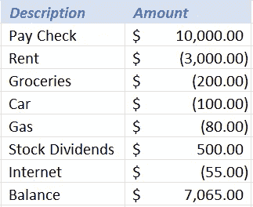
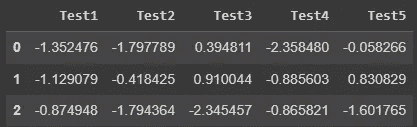
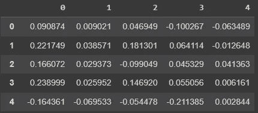
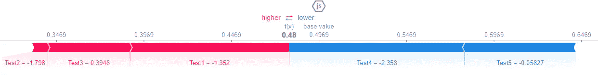
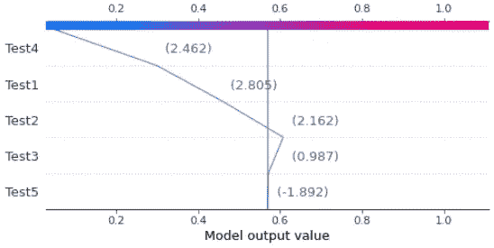
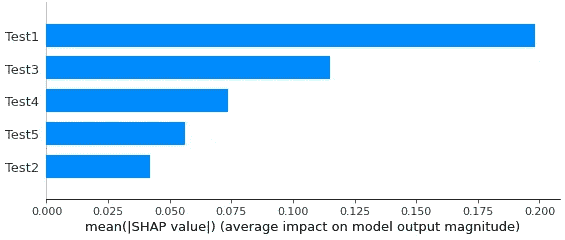
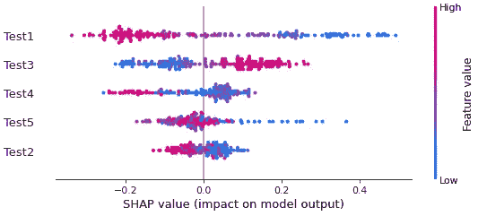
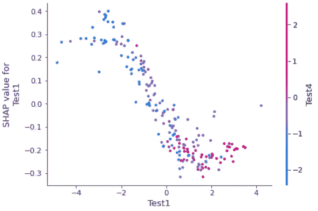
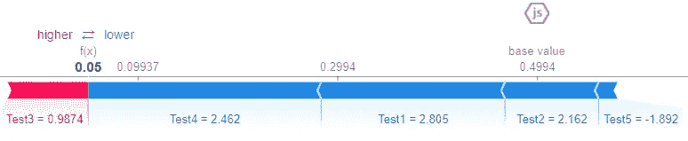

# 使用 SHAP 图书馆解释机器学习模型

> 原文：<https://towardsdatascience.com/explain-machine-learning-models-using-shap-library-e05a1583c34f>

## Python 的 Shapley 附加解释可以帮助您轻松解释模型如何预测结果


萨姆·莫格达姆·卡姆西在 [Unsplash](https://unsplash.com/s/photos/black-box?utm_source=unsplash&utm_medium=referral&utm_content=creditCopyText) 上的照片

# 介绍

复杂的机器学习模型经常被称为“*黑盒*”。这里有一个很好的概念解释。

> 在科学、计算和工程中，黑匣子是一种设备、系统或物体，它产生有用的信息，但不透露任何关于其内部工作的信息。对其结论的解释仍然模糊不清，或者说是“黑的”。( [Investopedia](https://www.investopedia.com/terms/b/blackbox.asp#:~:text=book%20of%20business.-,What%20Is%20a%20Black%20Box%20Model%3F,remain%20opaque%20or%20%E2%80%9Cblack.%E2%80%9D) )

因此，简单地说，就是当你创建一个 ML 模型，它工作得很好，但是如果有人问你是如何得到那个答案的，你不知道如何解释。“它就这样发生了”。

然而，作为数据科学家，我们与企业和高管一起工作，他们会经常要求解释，以确保他们做出正确的决定。或者，至少，他们想知道模型在做什么，它是如何得出结论的，什么有助于理解结果。

在这篇文章中，我们将学习如何使用 Python 中的 SHAP 模块来使“黑盒”模型更易于解释。这不仅有利于展示数据科学领域的领域，也有利于向客户推销您的模型，方法是演示数据如何进入以及如何出来、转换为预测。

# 沙普利值

[沙普利价值观](https://en.wikipedia.org/wiki/Shapley_value)以*劳埃德·沙普利*命名，他因此获得了 2012 年诺贝尔奖。这个概念是基于博弈论，提出了一个解决方案，以确定每个球员的重要性，整体合作，游戏。

> 将这个概念转用到机器学习上，我们可以**说 Shapley 值将告诉我们每个数据点对模型决策的重要性。**

打个比方，我们来想象一个银行账户，最后的余额是怎么确定的。

有些钱进来(工资、股票收益)，有些钱出去(账单、食物、交通、房租)。每一笔交易都会增加或减少最终余额，对吗？有些收入会很高，有些不会很高。同样，有些费用会很大，有些会很小…

月底，余额将是所有收支的总和。所以，这些数字中的每一个都像 Shapley 值，它们更容易告诉我们每个交易在一个月中对余额的贡献是积极的还是消极的。

例如，工资支票有很大的积极影响，而租金是最大的下降影响。



每个值对最终结果都有积极或消极的影响。图片由作者提供。

# 如何使用 SHAP 模块

好了，现在我们知道了什么是 Shapley 值，我们如何实际使用它们呢？这是我们将在序列中看到的。

我们将安装并导入名为`shap`的 Python 模块。

```
# Install
pip install shap#import
import shap
```

我们应该为这个练习导入一些其他的需求。

```
import pandas as pd
from sklearn.ensemble import RandomForestClassifier
from sklearn.model_selection import train_test_split
from sklearn.datasets import make_classification
```

接下来，让我们创建一个用于训练目的的分类数据集，并将其分为训练集和测试集。

```
# Create dataset
X, y = make_classification(n_samples=1000, n_features=5, n_informative=3,n_redundant=2, n_repeated=0, n_classes=2,scale=10, shuffle=True, random_state=12)# Train Test Split
X_train, X_test, y_train, y_test = train_test_split(X, y, test_size=0.2, random_state=12)
```

好的。我们有自己的一套。现在让我们训练一个随机森林分类器。

```
# Model
rf = RandomForestClassifier().fit(X_train, y_train)
```

接下来，我们可以创建一个`X_test`的副本，并添加一些列名，以帮助 SHAP 的可解释性。我们可以假设数据集中的随机数是对给定产品的测试分数。要预测的标签是二进制的(0 或 1)，这可能意味着 0=失败，1 =通过。

```
X_test_df = pd.DataFrame(X_test, columns=['Test1', 'Test2', 'Test3', 'Test4', 'Test5'])
```



测试数据集。图片由作者提供。

## 解释者和 SHAP 价值观

下一步是为基于树的模型创建一个解释器。为此，我们将输入训练好的模型。在序列中，我们用最近创建的带有特性名称的测试集来计算`shap_values()`。

```
# Create Tree Explainer object that can calculate shap values
explainer = shap.explainers.Tree(rf)# Calculate shap values
shap_values = explainer.shap_values(X_test_df)
```

现在让我们来看看这个数据集的 Shapley 值。注意代码中有切片符号`[1]`，因为`.shap_values()`函数返回一个张量，每个类有一个数组。片`[0]`中的一个将类 0 的预测视为参考，片`[1]`将 1 的预测视为参考。

```
# SHAP values for predictions with (1 = passed) as reference
pd.DataFrame(shap_values[1])
```



数据集的 Shapley 值。图片由作者提供。

好吧，酷，但这是什么意思？这些数字中的每一个都意味着该数据点对预测结果 **1** 的贡献有多大。因此，例如，第一行的*变量 0* 贡献更多，增加了它成为 1 的机会，而*变量 3* 具有最大的负面影响，减少了它被分类为 1 的机会。

## 力图

我们可以在这个很酷的力图中直观地看到贡献。

```
# Check Single Prediction# Choose observation
observation = X_test_df.loc[[0]]# Calculate Shapley values
shap_values2 = explainer.shap_values(observation)# Initiate Java script for plotting
shap.initjs()# Plot
shap.force_plot(explainer.expected_value[1], shap_values2[1], observation)
```



第一个条目的预测组成。图片由作者提供。

让我们一点一点地理解这个图形。

*   SHAP 从一个基础值开始，即目标变量的平均值。`y.mean()`为 0.505。因此，如果类 0 的基值是这样，则类 1 的基值将是 1–0.505，大约是 0.495。
*   由此，算法计算出是什么增加或减少了类为 0 或 1 的机会。粉色使机会增加，蓝色使机会减少。
*   测试 4 和 5 将分类推回到 0 类，而测试 1、2 和 3 将分类推回到 1 类。
*   我们看到，在每个贡献之后，最终结果是 0.48，低于 0.5，因此它使该观察的预测为 0 类(在我们的示例中，*失败*)。

## 决策图

与力图类似的一个选项是决策图，它显示了算法决策的相同步骤，但以不同的可视化方式显示。

```
# Choose observation
observation = X_test_df.loc[[195]]# Calculate Shapley values
shap_values2 = explainer.shap_values(observation)# Decision Plot
shap.decision_plot(explainer.expected_value[1], shap_values2[1], observation)
```



来自 SHAP 的决策图。图片由作者提供。

## 力图(特征重要性)

为了有一个总体的观点，非常类似于随机森林中的*特性重要性*图，我们可以绘制一个摘要条形图。下面是代码，后面是生成的图像。

```
# Summary bar plot
shap.summary_plot(shap_values[1], x_test_df, plot_type='bar')
```



汇总条形图。图片由作者提供。

变量 *Test1* 对预测最重要，其次是测试号 3、4、5 和 2。

## 数据点汇总图

另一个有趣的情节是摘要散点图。它显示了每个数据点如何影响分类的摘要。代码很简单:只需调用`summary_plot()`并用 SHAP 值和要绘制的数据来填充它。

```
# Summary scatterplot
shap.summary_plot(shap_values[1], x_test_df)
```

这个结果起初看起来很可怕，但是很容易解释。首先，观察颜色是数据点的值。所以，值越高，越红，值越低，越蓝。

第二个注意点，X 轴是 SHAP 值出现的地方。向右为正值意味着对分类为 1 的影响更大，因为我们使用的是带切片的数组`shap_values[1]`。Y 轴显示变量名。



汇总散点图。图片由作者提供。

所以，解释一下:

*   *Test1* 值越高，对分类的负面影响就越大，越倾向于 0 类。
*   对于*测试 3* ，该值越高，对 1 级分类的影响越大。
*   Test4 和 *Test2* 也显示了与 SHAP 负面影响更相关的较高值，这意味着它们将分类推至 0 级。
*   *测试 5* 看起来更加混合，但是较低的值影响分类为 1。

## 依赖图

最后，我们来看依赖情节。这种可视化可以帮助我们在算法对观察结果进行分类时确定哪些变量关系更密切。

下面是创建它的代码。使用`shap.dependence_plot()`并输入特征索引号、SHAP 值和绘图数据集。

```
# Dependence plot
shap.dependence_plot(0, shap_values[1], x_test_df)
```

结果是这样的。



来自 SHAP 模块的依赖图。图片由作者提供。

它带来的有趣之处是:

*   该图显示了预测时关系更密切的两个变量。在我们的例子中，*测试 1* 与*测试 4* 有很大关系。
*   X 上的值是数据点。y 为同一变量带来 SHAP 值。
*   颜色取决于第二个变量 *Test4* 。
*   这里，它表明对于高值的*测试 1 和测试 4* ，在分类中的影响是负面的(SHAP 值低)。因此，在*测试 1* 上具有高值的观察值，在*测试 4* 上具有高值的观察值更有可能被分类为 0 级。
*   请参见下图，这两个变量都是分类值的主要减损因素。



Test1 和 Test4 的高值对 SHAP 有负面影响，将分类推到 0 类。图片由作者提供。

# 在你走之前

我一直在研究这个包，我知道还有很多东西要学。我强烈建议你阅读下面这些来自[data man](https://medium.com/@dataman-ai)博士的参考资料，它们对我了解这个令人敬畏的图书馆和创建这个帖子帮助很大。

促使我这样做的是来自 [Aayush Agrawal](https://medium.com/@aayushmnit) 的一篇很棒的文章，我也附上这篇文章作为关于微软研究院`interpret`模块的参考。他们也将这个概念包装在一个很好的 Python 模块中。我鼓励你去看 ML 可解释性的“艺术”部分**，那真是太棒了！**

**概述:**

*   **SHAP 值计算每个数据点对给定分类的影响。**
*   **SHAP 是一种加法方法，因此重要性的总和将决定最终结果**
*   **探索图并解释每个观察的分类。**

**如果你喜欢这个内容，关注我的博客或者考虑使用这个[推荐链接](https://gustavorsantos.medium.com/membership)加入 Medium(部分资源归作者所有)。**

**<http://gustavorsantos.medium.com/>  

上 [Linkedin](https://www.linkedin.com/in/gurezende/) 找我。

# 参考

</mixing-art-into-the-science-of-model-explainability-312b8216fa95>  <https://medium.com/dataman-in-ai/explain-your-model-with-the-shap-values-bc36aac4de3d>  </explain-any-models-with-the-shap-values-use-the-kernelexplainer-79de9464897a>  <https://www.kaggle.com/code/vikumsw/explaining-random-forest-model-with-shapely-values>  <https://shap.readthedocs.io/en/latest/api.html#explainers>   **