# 关于 K 均值聚类的 7 个最常见问题

> 原文：<https://towardsdatascience.com/explain-ml-in-a-simple-way-k-means-clustering-e925d019743b>

## 最常用的无监督聚类算法

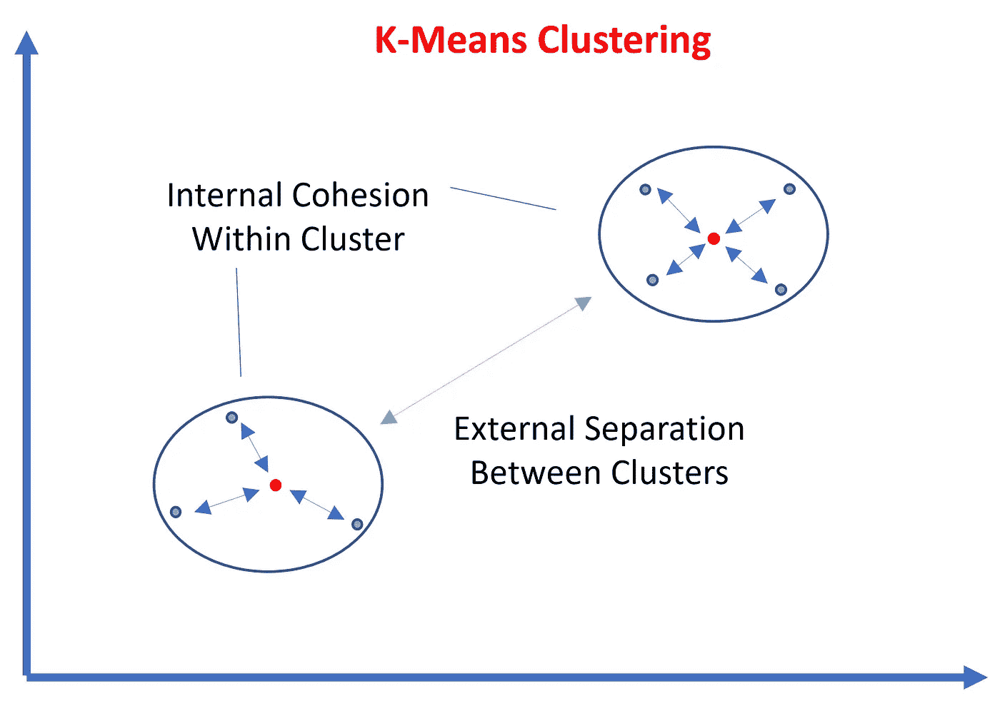

作者图片

## 背景

我们每天大约产生 2.5 万亿字节的数据。这些数据采用字符、数字、文本、图像、声音等形式。不足为奇的是，这些数据中的大部分都没有标签，有用的见解被淹没在数据的大山中。**聚类**是一种**无监督学习**方法，广泛用于寻找具有相似特征*的数据点组(称为聚类),而不需要现有的标记数据*。

借助聚类方法，我们可以将原始数据转化为可操作的见解。例如，我们可以对共享相同主题的消息进行聚类，对属于同一对象的图像进行分组，将具有相似行为的客户归类到同一组中。在本文中，我们将讨论最常用的聚类方法: **K-Means 聚类**。

## #1:什么是 K 均值？

用通俗的语言来说，K-Means 的目的就是把具有相似特征的数据点放在同一个聚类中(即内部内聚)，把具有不同特征的数据点分离到不同的聚类中(即外部分离)。


作者图片

从技术上讲，我们需要数学公式来量化内部内聚和外部分离。

*   **群内方差**(也称为平方误差函数或内平方和(SSW)或平方和误差(SSE))用于量化内部凝聚力。它被定义为平均点(称为**质心**)和簇中每个点之间的平方距离之和。*值越小，聚类越好。*

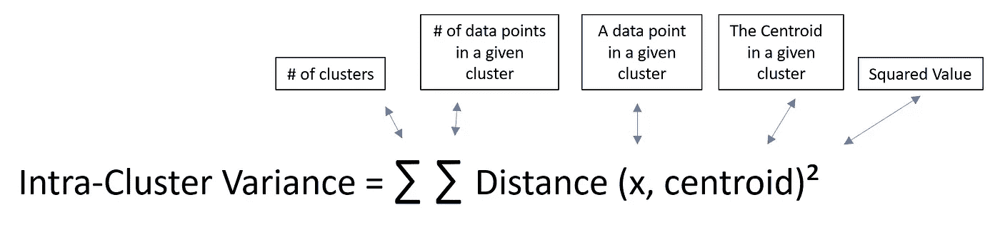

作者图片

*   **组间方差**(又名,( SSB)之间的平方和)用于量化外部分离。它被定义为全局平均点和每个质心之间的平方距离之和。*值越大，聚类越好*。

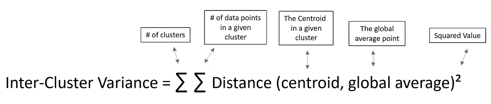

作者图片

在实践中，我们只需要最小化组内方差，因为最小化 SSW(组内平方和)必然会最大化 SSB(组间平方和)

我们用一个简单的例子来证明。在下面的例子中，我们希望根据得分值创建聚类。如果我们简单地将前三个观察值归入第一组，后三个观察值归入第二组。第一组的平均分数是 25 分，第二组是 16 分。我们知道，不管集群是如何创建的，全局平均值(20.5)总是保持不变。所以 ***SST*** *(每个点与全局平均点之间距离的平方和)也将一直保持不变*。数学上，证明 SST = SSW + SSB 并不难。因此，*找到最小化 SSW 的簇将间接最大化 SSB* 。

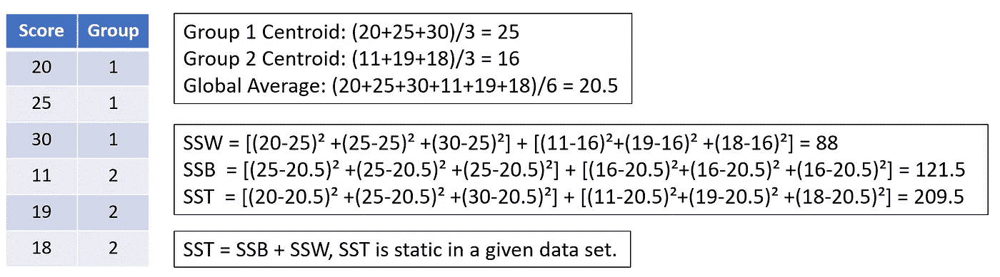

作者图片

## # 2:K-Means 聚类是如何工作的？

步骤 1:通过随机选取 K 个起始点来初始化聚类质心

步骤 2:将每个数据点分配到最近的质心。K-Means 聚类常用的距离计算是**欧几里德距离，这是一个度量两个数据点之间距离的尺度值。**

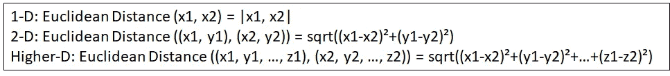

作者图片

步骤 3:更新聚类质心。质心计算为聚类中数据点的平均值。*更新的质心可能是也可能不是实际的数据点。如果他们是，那将是一个巧合。*

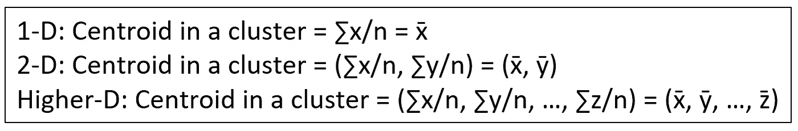

作者图片

步骤 4:重复步骤 2-3(将每个数据点分配给新的质心并更新聚类质心)，直到满足其中一个停止条件。

*   更新后的质心与前一次迭代中的质心保持一致(这是一种理想的情况，但在实践中，这可能太耗时了)
*   上证指数至少没有提高 x %
*   达到了最大迭代次数(明智地选择最大迭代次数，否则，我们会得到较差的聚类。)

## #3:如何对 K-Means 的原始数据进行预处理？

K-Means 使用基于距离的测量(例如欧几里德距离)来计算每个数据点与使用所有特征的值的质心的相似程度。这些特征通常采用*不可比单位*的值(例如，以美元表示的货币、以千克表示的重量、以华氏度表示的温度)。为了产生公平的结果，建议将原始数据标准化。我们可以转换原始数据，使**的平均值为 0，标准偏差为 1**，这样所有特征的权重**都相等**。

## #4: **如何挑选 K-Means 中的 K 值？**

如果我们事先知道 K 值或者从领域专家那里得到建议，那将是理想的。如果没有，我们将需要依靠替代方法。虽然没有关于如何选择 K-Means 聚类的 K 值的最终方法，但是有一些流行的方法可以用来估计最佳的聚类数。

**肘法**:用 SSE(又名，**集群惯性**)来评价拆分的好坏。然后，我们为范围从 2 到 N 的 K 值创建一个 SSE 肘图(您可以为您的研究设置 N 的值)。随着 K 的增加，对应的 SSE 会减少。我们将观察 K 和 SSE 之间的权衡(我们希望 SSE 低，同时将 K 保持在合理的值)。*当我们看到上证综指开始变平并形成肘形时，我们通常会选择 K 的最佳值*。

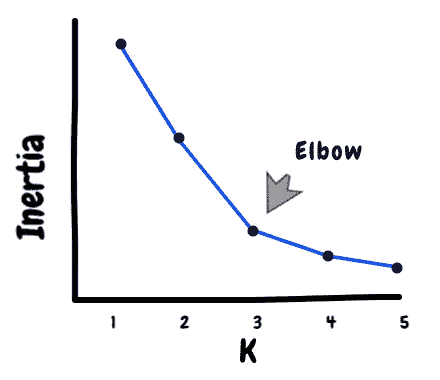

**剪影分析**:用**剪影系数**来评价分割的好坏。轮廓系数计算如下


作者图片

S(i)是给定数据点的轮廓系数。a(i)是该给定数据点和同一聚类中所有其他数据点之间的平均距离。b(i)是该给定数据点和来自最近聚类的所有数据点之间的平均距离。S(i)的范围可以从-1 到 1。

*   如果 S(i) = 1，则意味着该数据点靠近同一聚类内的点，而远离相邻聚类。
*   如果 S(i) = 0，则意味着该数据点接近其聚类的边界。
*   如果 S(i) = -1，则意味着该数据点被分配到错误的簇。

最终轮廓系数计算为所有数据点的平均轮廓系数。然后，我们计算范围从 2 到 n 的 K 值的轮廓系数。*轮廓系数越高，聚类可能越好。*

**戴维斯-波尔丁指数:**用**戴维斯-波尔丁指数**来评价分割的好坏。戴维斯-波尔丁指数计算如下


作者图片

D(i，j)是给定的一对簇(例如，簇 I 和 j)的 Davies-Bouldin 指数。d(i)和 d(j)分别是聚类 I 和聚类 j 中每个点与其质心之间的平均距离。d(i，j)是簇 I 和 j 的质心之间的距离。

对于一个给定的簇，我们将计算它自己和所有其他簇之间的 Davies-Bouldin 指数。然后我们取这个集群的最大戴维斯-波尔丁指数。最后，我们将最终的戴维斯-波尔丁指数计算为这些最大值的平均值。然后我们计算 K 值范围从 2 到 n 的 Davies-Bouldin 指数*Davies-Bouldin 指数越小，这些聚类越远，聚类越好。*

## #5:如何挑选 K 均值的起点？

即使我们选择了最佳的 K 值，K-Means 方法也不一定能产生最佳的聚类。由于 K-Means 算法很可能陷入局部最优，并且永远不会收敛到全局最优，因此得到的聚类可能会基于不同的起点而变化。因此，强烈建议使用不同的随机起点集运行 K-Means，并根据上面提到的三种评估方法选择最佳结果。

有一种先进的初始化方法，如 **K-Means++和**，这使得它能够克服陷入局部最优的问题，并提高聚类的质量。直觉很简单。*我们将挑选彼此远离的初始质心，这样更有可能从不同的簇中挑选点。* K-Means++可以通过以下步骤实现。

*   步骤 1:我们随机选取一个数据点作为第一个质心。
*   步骤 2:我们用最近的质心计算剩余点之间的距离。
*   步骤 3:我们选取下一个质心，使得选取给定点作为质心的概率与这个给定点和它最近的所选质心之间的距离成比例。换句话说，*一个点离选择的质心越远，它就越有可能被选为下一个质心。*
*   重复步骤 2–3，直到拾取 K 个质心。

## #6:如何用 Python 实现 K-Means 聚类？

在下面的例子中，我将用 Python 在 Iris 数据集上实现 K-Means 聚类。虹膜数据集包括 4 个特征变量(例如，“萼片长度”、“萼片宽度”、“花瓣长度”、“花瓣宽度”)和 1 个描述鸢尾花种类的变量(例如，Setosa、Versicolor、Virginica)。

```
from sklearn.preprocessing import StandardScaler
import pandas as pd
import matplotlib.pyplot as plt
import matplotlib.cm as cm
import seaborn as sns
from sklearn.cluster import KMeans
from sklearn.metrics import davies_bouldin_score, silhouette_score, silhouette_samples
import numpy as npdf = pd.read_csv("[https://archive.ics.uci.edu/ml/machine-learning-databases/iris/iris.data](https://archive.ics.uci.edu/ml/machine-learning-databases/iris/iris.data)", names = ['SepalLength', 'SepalWidth', 'PetalLength', 'PetalWidth', 'Species'])
# standardize the data to have a mean of zero and a standard deviation of one
df.iloc[:,:4] = StandardScaler().fit_transform(df.iloc[:,:4])
# Exploratory Data Analysis
sns.pairplot(df, diag_kind= 'kde')
sns.pairplot(df, hue="Species", diag_kind= 'kde')
```

在图 1 中，我们可以看到数据点的分离。我们希望在应用 K-means 聚类之后，能够得到尽可能接近图 2 的结果。

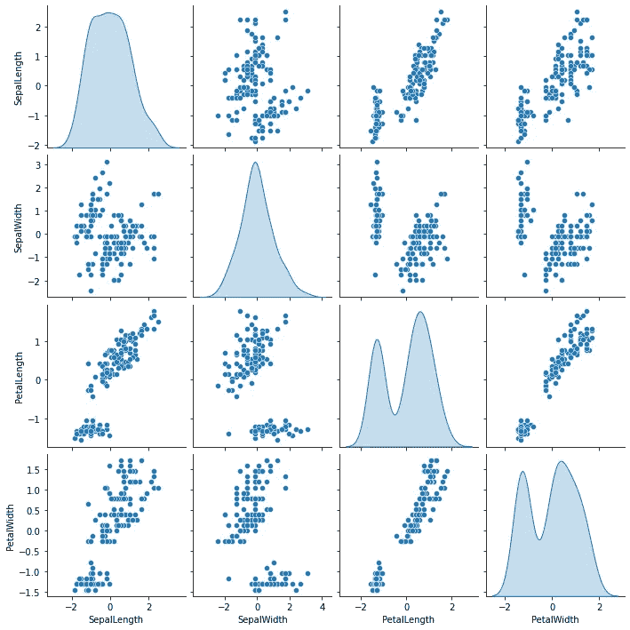

图 1:没有标签的原始数据(图片由作者提供)

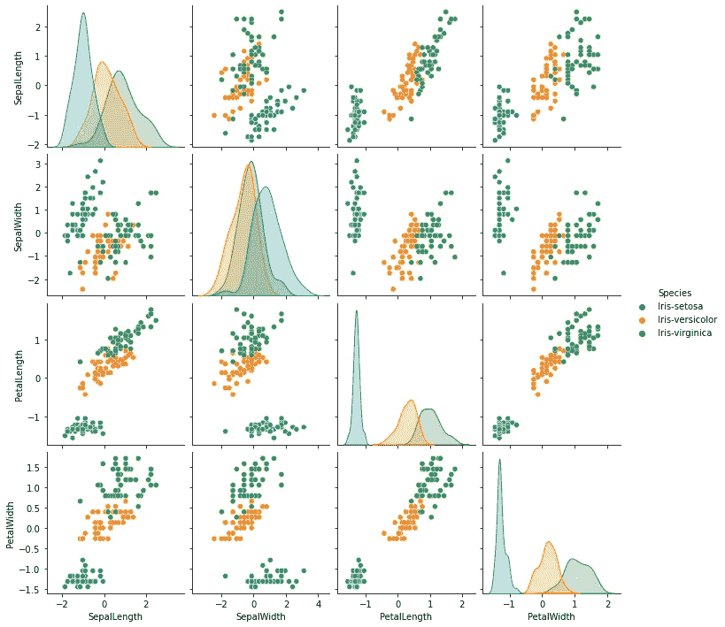

图 2:带有正确标签的原始数据(图片由作者提供)

我们将使用 Python 中“sklearn”库中的“KMeans”算法。“n_clusters”表示要形成的簇的数量。“max_iter”表示单次运行中执行的最大迭代次数。“n_init”表示 K-Means 将在不同的起始点集合上运行的次数。init = "random|k-means++ "将指示是使用随机初始化方法还是 k-means++初始化。“random_state”用于确保结果是可重复的。

要计算 SSE，我们可以使用"。惯性 _ "来自 K-Means 输出。“戴维斯-波尔丁分数”和“侧影分数”分别用于计算戴维斯-波尔丁指数和侧影分数。

```
x = df.iloc[:,:4]
sse, db, slc = {}, {}, {}
for k in range(2, 10):
    kmeans = KMeans(n_clusters = k, max_iter = 1000, n_init = 10, init = 'k-means++', random_state=123).fit(x)
    clusters = kmeans.labels_
    sse[k] = kmeans.inertia_
    db[k] = davies_bouldin_score(x, clusters)
    slc[k] = silhouette_score(x, clusters)
```

**肘方法**:在图 3 中，我们有一个 SSE 与集群数量的关系图。该图表明，弯头的 K 值约为 3-5。K=5 后，上证指数开始缓慢下降。

```
plt.figure(figsize=(8, 6))
plt.plot(list(sse.keys()), list(sse.values()), marker='o')
plt.xlabel('Number of Clusters', fontsize=24)
plt.ylabel('SSE', fontsize=24)
plt.show()
```


图 3(作者图片)

**侧影分析:**在图 4 中，我们有一个侧影指数与聚类数的关系图。该图表明高轮廓指数出现在较低的 K 值(例如，2，3)。

```
plt.figure(figsize=(8, 6))
plt.plot(list(slc.keys()), list(slc.values()), marker='o')
plt.xlabel('Number of Clusters', fontsize=24)
plt.ylabel('Silhouette Score', fontsize=24)
plt.show()
```

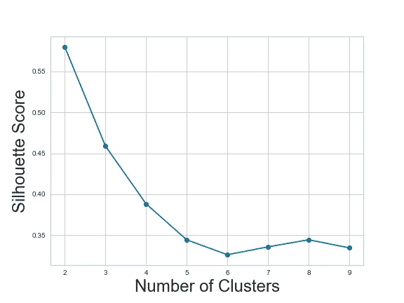

图 4(作者图片)

**戴维斯-波尔丁指数:**在图 5 中，我们绘制了戴维斯-波尔丁指数与集群数量的关系图。该图还表明，低戴维斯-波尔丁指数出现在较低的 K 值(例如 2，3)。

```
plt.figure(figsize=(8, 6))
plt.plot(list(db.keys()), list(db.values()), marker='o')
plt.xlabel('Number of Clusters', fontsize=24)
plt.ylabel('Davies-Bouldin Values', fontsize=24)
plt.show()
```

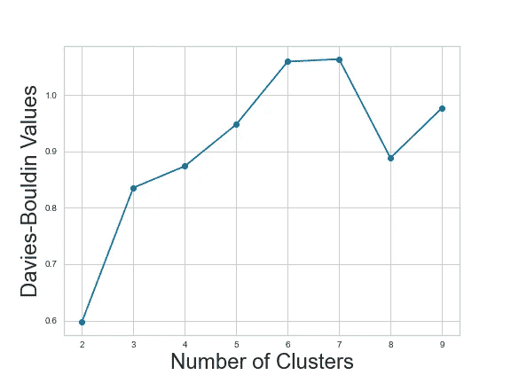

图 5(作者图片)

**侧影图**:我们可以创建另一个信息图来确定 K 的最佳值，这就是侧影图。它为不同聚类中的所有点绘制轮廓系数。该图包括每个集群的一个刀形。宽度代表每个点的轮廓系数。高度表示给定聚类中的点数。我们可以用下面的标准来选择最佳 K 值。

*   平均轮廓指数高。
*   聚类大致平衡，即聚类具有大致相同的点数。
*   大多数点的轮廓系数高于平均轮廓指数。

在图 6 中，K=2，3 具有相对较高的轮廓指数。但是 K=3 具有更平衡的集群。所以 3 更有可能是最优 K 值。

```
def make_Silhouette_plot(X, n_clusters):
    plt.xlim([-0.1, 1])
    plt.ylim([0, len(X) + (n_clusters + 1) * 10])clusterer = KMeans(n_clusters=n_clusters, max_iter = 1000, n_init = 10, init = 'k-means++', random_state=10)
    cluster_labels = clusterer.fit_predict(X)
    silhouette_avg = silhouette_score(X, cluster_labels)
    print(
        "For n_clusters =", n_clusters,
        "The average silhouette_score is :", silhouette_avg,
    )# Compute the silhouette scores for each sample
    sample_silhouette_values = silhouette_samples(X, cluster_labels)y_lower = 10
    for i in range(n_clusters):
        ith_cluster_silhouette_values = sample_silhouette_values[cluster_labels == i]
        ith_cluster_silhouette_values.sort()
        size_cluster_i = ith_cluster_silhouette_values.shape[0]
        y_upper = y_lower + size_cluster_i
        color = cm.nipy_spectral(float(i) / n_clusters)
        plt.fill_betweenx(
            np.arange(y_lower, y_upper),
            0,
            ith_cluster_silhouette_values,
            facecolor=color,
            edgecolor=color,
            alpha=0.7,
        )plt.text(-0.05, y_lower + 0.5 * size_cluster_i, str(i))
        y_lower = y_upper + 10plt.title(f"The Silhouette Plot for n_cluster = {n_clusters}", fontsize=26)
    plt.xlabel("The silhouette coefficient values", fontsize=24)
    plt.ylabel("Cluster label", fontsize=24)
    plt.axvline(x=silhouette_avg, color="red", linestyle="--")
    plt.yticks([])  
    plt.xticks([-0.1, 0, 0.2, 0.4, 0.6, 0.8, 1])

range_n_clusters = [2, 3, 4, 5]
for n_clusters in range_n_clusters:
    make_Silhouette_plot(x, n_clusters)   
    plt.savefig('Silhouette_plot_{}.png'.format(n_clusters))
    plt.close()
```

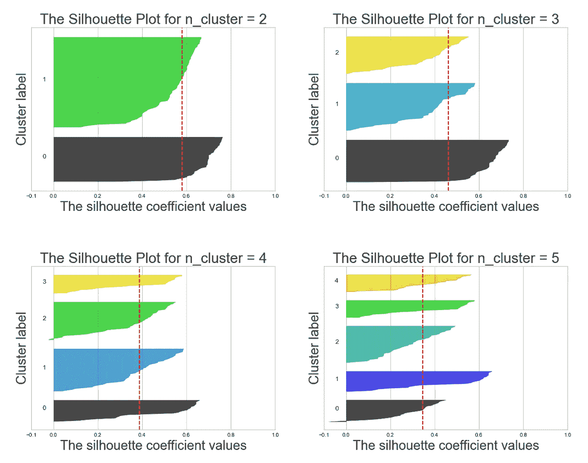

图 6(作者图片)

基于所有不同的度量，3 似乎是 K 均值聚类的最佳 K 值。最后，让我们使用 K=3 来产生 K 均值输出。在图 7 中，考虑到 K-Means 没有使用任何预先标记的训练数据，预测的聚类看起来相当准确。

```
kmeans = KMeans(n_clusters = 3, max_iter = 1000, n_init = 10, init = 'k-means++', random_state=123).fit(x)
clusters = kmeans.labels_
x['K-Means Predicted'] = clusters
sns.pairplot(x, hue="K-Means Predicted", diag_kind= 'kde')
```

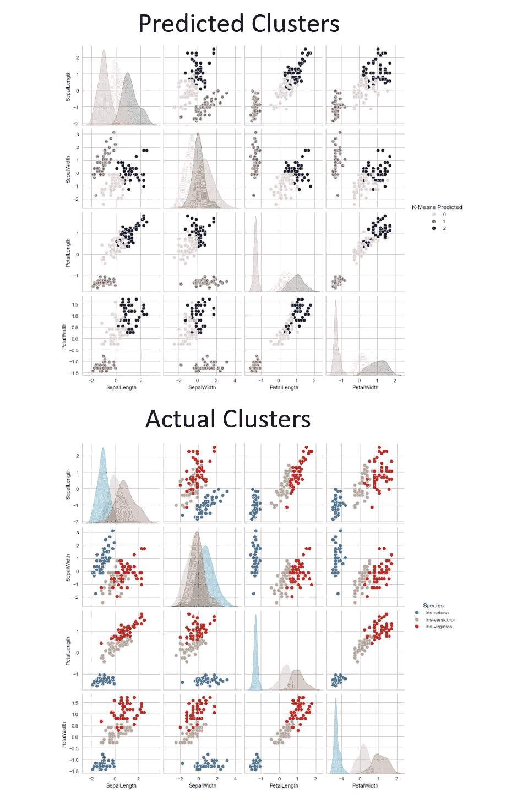

图 7(作者图片)

## # 7:K 均值的优缺点是什么？

K-Means 是最常用的聚类算法，因为它非常容易实现和解释。只有一个超参数(K 值)需要优化。它是一个有效的工具，可以应用于几乎所有不同的数据类型。

然而，K-Means 有一些明显的缺点。它假设

*   不同的簇有不同的质心，它们彼此相距很远。
*   如果点(A)比点(B)离给定质心更远，则点(A)比点(B)更不可能属于该给定聚类

在图 8 的第一个例子中，内圈应该属于一个集群，外圈应该属于另一个集群。但是 K-Means 不能正确地聚类这些点，因为它不能克服质心重叠的问题。

在第二个例子中，两个半圆应该属于两个不同的聚类，K-Means 再次未能识别出明显的模式。

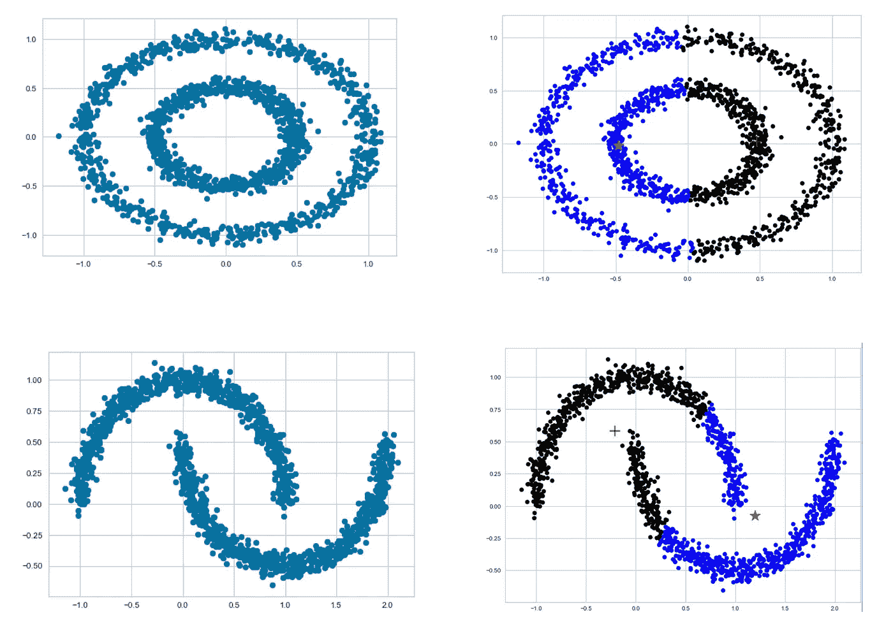

图 8(作者图片)

现实生活中的数据几乎总是复杂的，因为它们由噪声和异常组成。虽然 K-Means 聚类是一个强大的工具，但我们也应该意识到它的局限性。

# 感谢您的阅读！！！

如果你喜欢这篇文章，并且想**请我喝杯咖啡，**请[点击这里](https://ko-fi.com/aaronzhu)。

您可以注册一个 [**会员**](https://aaron-zhu.medium.com/membership) 来解锁我的文章的全部访问权限，并且可以无限制地访问介质上的所有内容。如果你想在我发表新文章时收到电子邮件通知，请订阅。