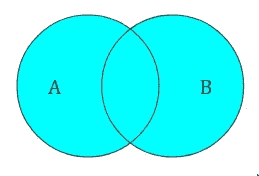
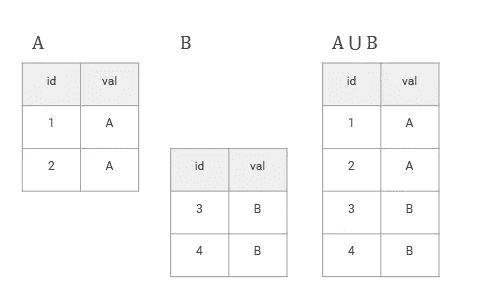
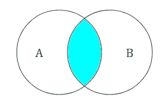
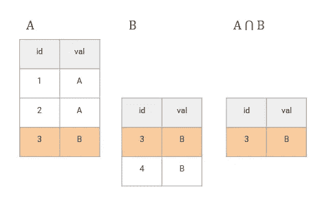
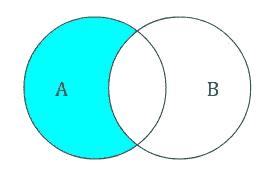
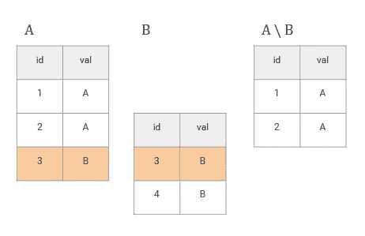
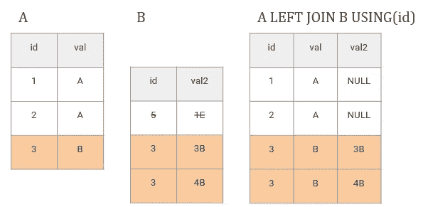

# 正确解释 SQL 连接

> 原文：<https://towardsdatascience.com/explain-sql-joins-the-right-way-f6ea784b568b>


(作者供图)

本文从需要向人们介绍数据库中连接概念的人的角度出发，例如`LEFT JOIN`。这可以是高级分析师角色、数据科学家或实际的教师和导师。这在实践层面上结合了数据和教育科学。

在讲授 SQL 中的连接时，您可能会使用或看到维恩图——只需[图片搜索连接 SQL](https://duckduckgo.com/?q=SQL+JOINS&iax=images&ia=images) ，它们就随处可见。但是维恩图是错误的 [*心智模型*](https://userpages.umbc.edu/~norcio/papers/1993/Staggers-MM-IJMMS.pdf)*【1】！心理模型是一个有用的概念，它将学习描述为外部事件的内部建模——有点像机器学习，但结果集成在一个完整的模型网络中，帮助人类预测和生存其社会和物理环境[7]。*

*使用维恩来解释连接，大脑将它们建模为*集合运算*(像`UNION`)，并将对它们的结果做出错误的预测。因此，结果不像预期的那样，导致沮丧和与`SELECT DISTINCT`的可疑的解决办法。*

*我想展示一下*

*   *维恩图适用于集合运算，如并集等。—不适用于连接*
*   *连接是组合运算，所以我们需要这样教它们。即`A CROSS JOIN B`是来自 A 的所有元素与来自 B 的所有元素的组合*
*   *所有的连接都是某种(过滤的)交叉连接——所以我们可以从交叉连接开始介绍连接，并从那里继续深入。*

# *垂直运算:集合代数与并集*

*但是首先，为什么要比较 Join 和 Union 呢？因为维恩图是 SQL 中`UNION`等集合运算的*正确心智模型*！它们甚至以相似的方式命名:*

*   *`A UNION DISTINCT B` = *A ⋃ B* :“碗运算符”将集合 a 和 b 组合成一个具有不同元素的集合(或“碗”)。*

**

*集合联合(图片由作者提供)*

**

*在表格中设置联合(作者图片)*

*a⋂b:“cookie cutter”操作符只保留两个集合中的元素。*

**

*设置交叉点(图片由作者提供)*

**

*在表格中设置交叉点(图片由作者提供)*

*`A EXCEPT B` = *A \ B* :用“铲运算符”从 A 中减去所有 B 元素，得到一个精简的集合 A(如果它们共享任何元素的话)。*

**

*设置减法(图片由作者提供)*

**

*在表格中设置减法(图片由作者提供)*

*由于表不是真正的集合，我们也有像 UNION ALL 这样的构造，其中记录/元素允许出现不止一次。*

*SQL 中的一个*集合*是一个表，其中*元素是行*，所以我们要把*想成垂直*。*

*但是`JOIN`被解释为*好像列是元素*——因为我们`join`列。`Joins`是**和*给一个元素添加属性*。他们不会添加新元素，但是*会将新属性*关联到现有的集合——这将创建一个全新的集合，其中包含从原始表中创建的新元素。***

**还是那句话:不是加法，是联想。新元素是通过关联新属性(列)产生的，而不是通过添加另一个集合中的元素(行)产生的。**

**这比集合运算更接近矩阵乘法。**

**" *joins 的*心智模型*是集合运算"*，维恩图很容易将它们可视化:例如，如果任一表中的键不是惟一的，您可以使用`LEFT JOIN`创建新行。这是主键/外键思想中的标准情况:外键不应该是惟一的。**

*从右表*的角度来看，在具有主键的`left join`中，元素**的数量减少了左表中缺少主键的数量**，因为我们只连接左表中存在的东西。所以右边的表丢失了元素。**

**

*当 A 左连接 B 时，A 从关联中获得行，但是 B 丢失了不能关联的行(图片由作者提供)*

*但是从左边*表*的角度来看，元素的数量**增加了**外键倍数的数量，因为我们必须连接右边表中的所有信息，而不仅仅是一个键的第一次出现。因此左边的表根据新组合的数量增加元素。*

*维恩图没有传达这些想法，这很糟糕，因为它非常重要——它改变了结果表的形状，从而改变了我们对它们进行的任何聚合。*

*如果您查看了一些初级同事的 SQL，您可能会看到有人试图在奇怪的地方使用 DISTINCT 来修复连接问题，以消除最终输出表中不需要的重复项。但是这可能会改变含义，从而改变对聚合和分析的解释。对转换数据的错误解释会让公司损失惨重。*

*那么对于连接，什么是更好的心理模型呢？*

# *备选方案:*带 JOIN 的组合学**

*从技术上讲，连接是创建新集合的元组操作([元组组合学](https://en.wikipedia.org/wiki/Relational_algebra#Joins_and_join-like_operators) [2】)。维恩图给人的印象是集合大小保持不变，而实际上`joins`并没有给你对集合的控制，而是通过创建一个具有所需组合的新集合来控制记录的组合。*

*我们需要根据*组合学*，**而不是**集合代数来思考。*

## *交叉连接*

*在交叉连接中，我们将一个表中的每一行与另一个表中的每一行结合起来。这个概念非常容易理解，因为它将一切与一切结合起来——非常直观。结果表大小是各个表大小的乘积。*

*让我们在更高级的连接中使用这种直觉…*

## *条件连接*

*当使用一个需要匹配的键时，我们可以把那个**键**想象成**定义了**一个**子域** *，我们在其中交叉连接*。*

*以一个简单的键为例:在表 A 和表 B 中找到带有某个值 x_1 的键的每个实例——交叉连接它们！对键的下一个值 *x_2* 重复，依此类推…*

*这种连接只告诉我们如何处理*不匹配*的元素:*

*   *`INNER`:丢弃任何一方导致`NULL`的东西——但是在`ON`定义的子域内进行交叉连接。*
*   *`LEFT`:只在左侧表格中找到的子域内进行交叉连接。*
*   *`RIGHT`:仅在右侧表格中找到的子域内进行交叉连接。*
*   *`FULL OUTER`:在任一表格中找到的子域内进行交叉连接。有点像`INNER`，但保留`NULLs`。*

## *例子*

*让我们看一些代码。用匹配和非匹配键建立一些简单的表，并用子域中新的*交叉连接思想解释它。**

*你现在可以使用[db-fiddle.com](https://db-fiddle.com)或者类似的东西来尝试(复制/粘贴)。*

```
*/* Schema SQL, */
/* prepare tables and add some data */
CREATE TABLE A (
  id INT,
  val VARCHAR
);
CREATE TABLE B (
  id INT,
  val VARCHAR
);
INSERT INTO A (id, val) VALUES (1, 'xxx');
INSERT INTO A (id, val) VALUES (2, 'def');
INSERT INTO A (id, val) VALUES (4, 'ghi');INSERT INTO B (id, val) VALUES (1, 'xxx');
INSERT INTO B (id, val) VALUES (1, 'zzz');
INSERT INTO B (id, val) VALUES (2, 'aaa');
INSERT INTO B (id, val) VALUES (3, 'bbb');*
```

*现在是一些简短的查询:*

```
*SELECT * FROM A; /* Query 1: table A */
SELECT * FROM B; /* Query 2: table B *//* Query #3: cross join without subdomains */
SELECT * FROM A **CROSS JOIN** B;/* Query #4: A left join B 
 * = cross join within subdomain id found in A:
 * There's no id 3 because it doesn't exist in A! 
 * 
 * We have two id=1 because they're both in B 
 * and two id=2 because they're both in A.
 * Sub-domain cross-join in action!
 */
SELECT * FROM A **LEFT JOIN** B ON A.id=B.id;/* Query #5: cross join within subdomain id found in B: no id 4! */
SELECT * FROM A **RIGHT JOIN** B ON A.id=B.id;/* Query #6: cross join within subdomain id found in A or B: all ids! */
SELECT * FROM A **FULL OUTER JOIN** B ON A.id=B.id;/* Query #7: cross join within subdomain id found in A or B: 
 * All ids that have a matching partner in the other table! 
 * So don't keep NULL rows!
 */
SELECT * FROM A **INNER JOIN** B ON A.id=B.id;*
```

*特别是`inner join`表明我们正在进行子域交叉连接。将其与`INTERSECT`进行比较，后者是一个真实的设置操作:*

```
*SELECT * FROM A **INTERSECT** SELECT * FROM B;*
```

*我们只得到在两个集合/表格中匹配的一个集合元素，而由于组合学的原因，`inner join`返回 doubles。*

## *关键场景*

*在理想的主键/外键场景中，我们是安全的:我们只向表中加入唯一的信息，并且大小不会改变。但是这个用例是有欺骗性的——它只显示了查询引擎实际在做什么的边缘情况。如果查询引擎是围绕这个用例构建的，那么当右边的键不是惟一的或者左边没有主键时，左连接应该会给我们一个警告。但是他们通常不关心——而且 CTE 和子查询没有任何主键，也不可能实现。*

*如果您从集合的角度考虑，并期望 A 中的行数+B 中的一定数量的行(匹配 id ),但是您的连接组合学突然创建了一个奇怪的意外行数和 id 重复数，您无法解释，这很快就会令人沮丧。*

# *结论*

*我们需要教授正确的心智模型，这样让人们从电子表格世界进入数据库世界(变得越来越有用)就更容易了。*

*当解释连接时，用组合学的术语来说，避免维恩图，不惜一切代价使用代数术语。按以下顺序引入联接:*

1.  *交叉连接，因为我们还没有键，而且“把所有的东西和所有的东西结合起来”是很容易理解的。*
2.  *内部连接，因为它类似于交叉连接，但是通过我们连接的键引入了子域。不匹配的案例会被直接删除。*
3.  *左/右/外连接，因为它增加了对不匹配情况的控制，我们希望保留前面介绍的概念。*

*总的来说:为了避免指令错误，确保你用类似于[动作映射](https://blog.cathy-moore.com/2013/05/is-training-really-the-answer-ask-the-flowchart/) [3]的东西开始课程规划。对于评估，使用[学习文件夹](https://mi.mcmaster.ca/learning-portfolio/)，或者——如果你被迫给人打分——使用并分享事先制定的带有[建设性一致性](https://www.johnbiggs.com.au/academic/constructive-alignment/)的标准【4】。对于更复杂的课程，使用 [4CID](https://www.4cid.org/publications/) [5]。为了发展实际的学习经验，使用来自[爱立信](https://hbr.org/2007/07/the-making-of-an-expert)【6】和[德阿纳](https://www.google.com/books/edition/_/zpp9zQEACAAJ?hl=en)【7】的见解。*

# *参考*

*[1] N. Staggers，A. F. Norcio，心智模型:人机交互研究的概念(1993)，Int。人机研究*

*[2]连接和类连接运算符。维基百科(2022)。URL:[https://en . Wikipedia . org/wiki/Relational _ algebra # Joins _ and _ join-like _ operators](https://en.wikipedia.org/wiki/Relational_algebra#Joins_and_join-like_operators)*

*[3] C .摩尔，训练真的是答案吗？问流程图。(2013)，网址:[https://blog . cathy-Moore . com/2013/05/is-training-true-the-answer-ask-the-flow trade/](https://blog.cathy-moore.com/2013/05/is-training-really-the-answer-ask-the-flowchart/)*

*[4] J. Biggs，Constructive Alignment(无日期)，网址:[https://www . John Biggs . com . au/academic/Constructive-Alignment/](https://www.johnbiggs.com.au/academic/constructive-alignment/)*

*[5] J.J.G .范·梅林波尔，《四要素教学设计模式:其主要设计原则概述》(2019 年)网址:[https://www.4cid.org/publications/](https://www.4cid.org/publications/)*

*[6] K. A .埃里克森、M. J .普列图拉和 E. T .科克里，《专家的形成》。(2007 年)网址:[https://hbr.org/2007/07/the-making-of-an-expert](https://hbr.org/2007/07/the-making-of-an-expert)*

*[7]s·德阿纳《我们如何学习》。教育和大脑的新科学。(2021)爱尔兰:企鹅图书有限公司*