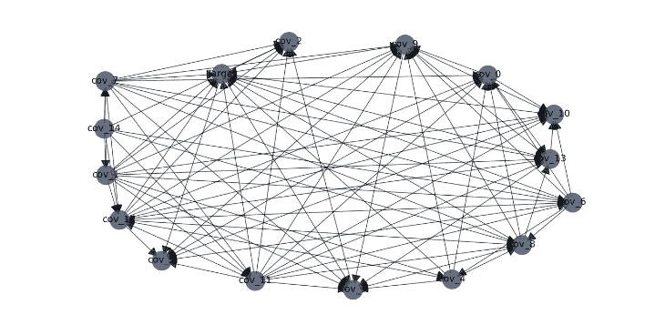
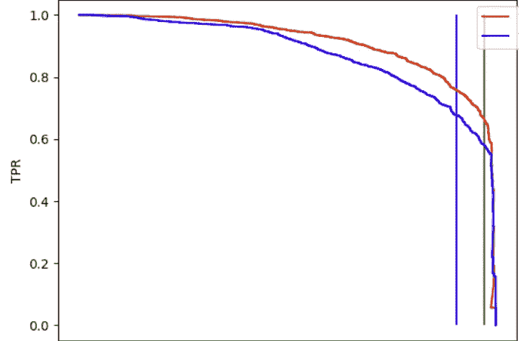
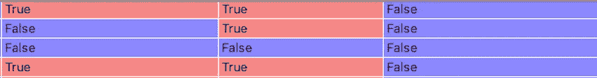
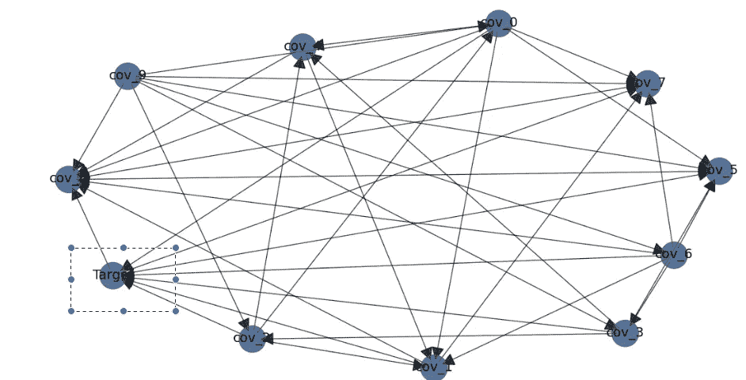
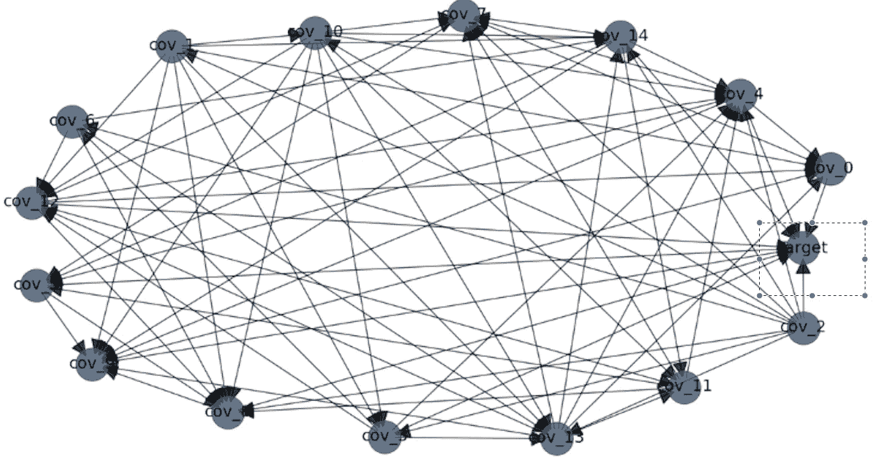
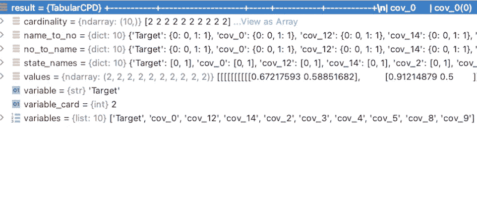
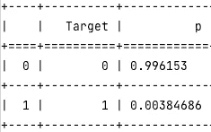

# 使用贝叶斯网络的可解释性

> 原文：<https://towardsdatascience.com/explainability-using-bayesian-networks-4dc706680294>

# 使用贝叶斯网络的可解释性

## 我们可以使用 DAG 来满足 DL 需求吗？



作者

## 介绍

这篇文章是作为上一篇[文章](/a-dl-solution-for-tab-text-data-f92e2b68eb16)的相邻研究步骤而写的。在那篇文章中，我们介绍了一种 DL 方法，它接收文本和表格数据的组合，目标是超越经典的 ML 工具，比如 XGBoost。回想一下，这些机制之间的比较提供了这个图:



作者-红色曲线是 DL 引擎，蓝色曲线是由大量数据训练的现有 XGBoost，这是一个 precision\TP 图表

数据科学家可能会认为这是成功的:处理表格数据的 DL 引擎比处理这种数据的常见 ML 领先算法取得了更好的结果。然而，当我们考虑现实世界的 ML 解决方案时，其要求不仅限于模型性能，还包括其他问题，如可解释性风险和因果关系，这种“数据科学家期望的结果”可能会给业务部门和客户留下一些未解决的问题和挑战。众所周知，虽然经典的 ML 算法几乎总是提供特征重要性分数。DL 不仅避免提供这种索引，而且经常掩盖这种信息。

# 什么是贝叶斯网络？

使用贝叶斯网络( **BN** )的动机是学习一组随机变量之间的依赖关系。网络本身是**有向无环图** ( [**DAG**](https://en.wikipedia.org/wiki/Directed_acyclic_graph) )，模拟随机变量的联合分布。图结构遵循联合分布的概率依赖性分解:节点 V 仅依赖于其父节点(即，独立于其他节点的 r.v X 将被表示为父自由节点)。关于这个主题的教程可以在[这里](https://www.youtube.com/watch?v=SkC8S3wuIfg)找到

# BN 学习的步骤

*   **构建 DAG**——正如我们所描述的，BN 训练的结果是一个非常近似的 DAG。此图旨在说明变量之间的相关性和联合分布的最简单的因子分解。显然，有了专家知识，这项任务可以更好地完成。即当它的一些弧已知时。作为一个例子，如果我们有一个问题，很明显有一个目标变量，那么我们可以启动包含它的边，并让训练机制使用它作为先验知识。为了获得 DAG，有两类主要的训练 BN 的方法:

[**基于约束的结构学习**](https://arxiv.org/pdf/1406.7648.pdf)——为了理解这种方法，我们使用以下定义:

**Markov Blanket-**r . v Y 的 Markov Blanket 是 r.v {X1，…Xn}的集合 A，其中对于 A 的任何子集 S， **Y 独立于 A\S |S，**即如果我们对 S 上的随机变量进行条件化，我们得到一个独立于 Y 的余集

因此，寻找 DAG 的算法由三个阶段组成:学习 Markov Blanket、寻找邻居和确定弧方向。在第一阶段，我们使用 chi 评分(通常用于 t 检验)来确定变量之间的条件独立性

[**基于分数的结构学习**](https://www.jmlr.org/papers/volume9/perrier08a/perrier08a.pdf)——这个类实际上更有用，因为“**由于统计评分方法”**它被认为更有前途。

我们预先确定一个搜索和评分方法。定义初始 DAG(也可以是空 DAG)。在每一步，我们增加，撤回或恢复一个优势，并计算一个统计分数。我们重复这个过程，直到收敛。我们很少有少量的变量，因此强力方法(**穷举搜索**)很少实用。但是我们可以使用启发式算法。这种算法的一个常见示例如下:

**爬山** - 简单定义一个 DAG，只要分数提高就跑。

另一种常用的算法是 Chow Liu 树。

**Chow Liu-** 该算法通过分解 KL 散度项(类似于变分推断的概念)将分布 Q 近似为未知的联合分布 P。显然，评分依赖于对数似然性。

构建 DAG 后，可能希望优化其参数:

*   **参数学习** -在此阶段，我们假设 DAG 的结构，并在此基础上优化贯穿其条件组件的联合分布。实际上，我们可以使用 MLE 方法，该方法与分布上的贝叶斯先验信念相结合。

当我们完成这两个步骤(构造 DAG 并学习其参数)时。我们可以通过网络进行推理。即在数据输入时确定概率(类似于某些特征未被观察到的情况下的 DL 引擎)

# 真实世界的例子

在下一节课中，我将介绍一个简短的研究，这个研究使用了我之前介绍的 DL 引擎的表格数据。为了这个研究，我安装了 python 包 [**bnlearn**](https://github.com/erdogant/bnlearn) 。在这里可以找到这个图书馆的杰出指南。

在我们开始之前，我要说明的是，由于这个项目是商业性的，我已经屏蔽了变量名，因此它们将有无意义的名字。

## **构建我们的 DAG**

我们从寻找最佳 DAG 开始。

```
**import** bnlearn **as** bn
DAG = bn.structure_learning.fit(dataframe)
```

我们现在有一条匕首。它有一组节点和一个邻接矩阵，如下所示:

```
print(DAG[**'adjmat'**])
```

结果是这样的:



作者

其中行是源(即弧线的方向是从左列到行中的元素)，列是目标(即列的标题接收弧线)。

当我们开始绘制获得的 DAG 时，我们获得了一组变量，如下图所示:



作者

我们可以看到矩形中的目标节点是许多节点的源。我们可以看到它仍然将箭头指向两个节点。我们将在讨论部分讨论这个问题

显然我们有更多的变量，因此我增加了节点的数量。

添加为目标提供的 now 源的信息(即，其整行为“假”)

获得的图形如下:



作者

所以我们知道如何构建 DAG。现在我们需要训练它的参数。

在代码方面，我们执行如下:

```
model_mle = bn.parameter_learning.fit(DAG, dataframe, methodtype=**'maximumlikelihood'**)
```

我们可以用' **bayes** '来改变'**maximum likelihood**'，如下所述。

该训练的结果是反映 DAG 结构的一组分解的条件分布。

对于给定的变量，它的形式是这样的



作者

字段**变量**是作为目标的节点的名称

字段**变量**是其来源

字段“**值**”是确定每个“变量”值的条件概率的 n 维立方体。

现在，我们可以对这个矩阵进行分析，以确定信息(条件分布)存在于何处。

对于推论，我们决定关于**证据**(即我们正在调节目标的哪个源)并且我们希望得到低条件熵

```
bn.inference.fit(model_mle, variables=[**'Target'**], evidence={**'cov_0'**:0,**'cov_1'**:1  })
```

这一行的结果如下表所示:



作者

也就是说，如果我们以这些值作为目标的条件，我们可以很好地预测目标结果。

# 讨论

我们已经介绍了贝叶斯网络的一些理论概念，以及它们在为一组变量构建近似 DAG 时提供的用法。此外，我们提出了一个端到端 DAG 学习的真实世界的例子:使用 BN 构建它，使用 MLE 方法训练它的参数，以及执行和推理。我们现在可以讨论这个主题与 DL 问题的关系。为什么贝叶斯网络对这类问题有益？

**可解释性** -从 BN 训练中获得 DAG，提供关于数据库中独立变量的一致信息。在一般的 DL 问题中，特征是这些变量的函数。因此，我们可以得出哪些变量在我们的系统中占主导地位。当客户或业务单位对神经网络结果的原因感兴趣时，该 DAG 结构可以是提供重要性以及阐明模型的来源。

*   **降维** — BN 提供了变量的联合分布及其关联。后者可能会在减少我们归纳的 DL 引擎的特征方面发挥作用:如果我们知道对于随机变量 X，Y，X 在 Y 中的[条件熵](https://en.wikipedia.org/wiki/Conditional_entropy)很低，我们可以省略 X，因为 Y 提供了它的几乎全部信息。因此，我们有一个工具，可以从统计上排除多余的变量
*   **标记行为** -这一部分对于那些在视觉或语音等领域工作的人来说可能不太明显。在一些框架中，标记可能是一项模糊的任务(举例说明考虑一个具有大量可能重叠的类别的情感问题)。当一个人标记数据时，他可以依赖于数据集中的一些特征并生成条件概率。当我们初始化空 DAG 时，训练 BN 可以提供其中目标 target 是其他节点的父节点的结果。观察几个被测试的例子，这些结果只是反映了这种“标记者的方式”。因此，我们可以不使用 Dag 来满足 ML 需求，而是学习 taggers 策略，并在需要时进行改进。
*   **逻辑推理与因果推理的结合** — [因果推理](https://www.youtube.com/watch?v=CfzO4IEMVUk&list=PLoazKTcS0Rzb6bb9L508cyJ1z-U9iWkA0)是数据分析中一个非常成熟的领域。它提供了解决问题的工具，这些问题一方面是 DL 模型通常没有的，另一方面是现实世界提出的。需要找到这些工具协同工作框架。事实上，这种框架已经存在(例如 GNN)。但是合并典型 DL 问题因果关系的机制不太常见。我相信这篇文章中描述的心流是从这种结合中获益的一个很好的步骤

## 感谢

我要感谢齐夫·巴尔-约瑟夫教授向我介绍了这个主题，并感谢尤里·伊泰进行了富有成效的讨论