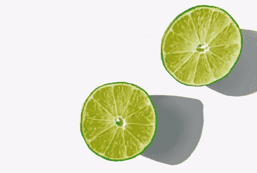
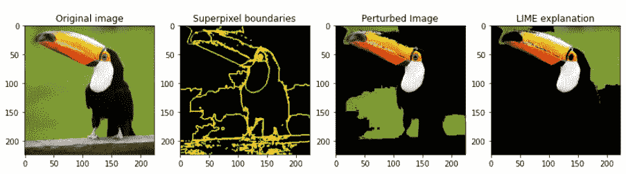
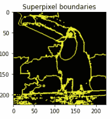
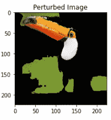
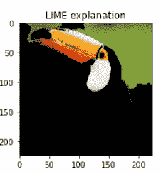

# 可解释的人工智能:理解卷积神经网络的决策——第 1 部分

> 原文：<https://towardsdatascience.com/explainable-ai-understanding-the-decisions-of-a-convolutional-neural-network-part-1-1a9cf26364fd>

## 深入局部可解释的模型不可知解释(LIME)


丹尼·米勒在 [Unsplash](https://unsplash.com/s/photos/network?utm_source=unsplash&utm_medium=referral&utm_content=creditCopyText) 上的照片

我们如何定义一个卷积神经网络(CNN)的质量？一个模型在给定任务中的性能通常由一些(简单的)预定义的度量来衡量。甚至还有一个[的地方](https://paperswithcode.com/task/image-classification)用来比较标准化数据集上最先进的图像分类模型的准确性。然而，如果你在现实世界中从事一个项目，如果一个模型有惊人的最高精确度，那么它的质量和价值是什么？除了这些简单的量化指标之外，我们还能对模型的质量提出什么要求呢？

这就是可解释的人工智能(XAI)的用武之地。XAI 系统可以被定义为“一个自我解释的智能系统，描述了其决策和预测背后的推理”。[1]向您的 ML 管道中添加一个可解释的组件不仅提供了*模型的可解释性*，而且还可以使业务利益相关者获得对您的模型的信任，或者可以用于评估(并修复)您的模型中的系统偏差。[1]

在几个部分中，我将讨论可用于图像分类项目的几种 XAI 方法的内部工作原理和利弊。在文献中，这些方法通常被称为*像素属性方法*、*显著图、*或*灵敏度图*。对于某些方法，提供了代码，因此可以在您自己的项目中实现。所有的代码都可以在这里找到。这是第一个博客，旨在解释基于输入的归因模型，重点是本地可解释的模型不可知的解释(在短期内)。[2]

# **方法**

存在许多不同的方法来获得*像素属性图。*一般来说，这些方法可以分为两个主流:基于前向传递(或输入)的归因模型和基于后向传递(或梯度)的归因模型。

# **第 1 部分:基于正向传递(或输入)的归因模型**

这些方法是模型不可知的。这些模型背后的主要直觉非常简单。拍摄输入图像；对输入进行一些调整，并观察对预测的影响。调整可以包括例如输入部分的部分遮挡或扰动。可能最著名的例子是局部可解释的模型不可知解释(或 LIME)。[2]



石灰|照片由 [Shaun Meintjes](https://unsplash.com/@shaunmcreatives?utm_source=unsplash&utm_medium=referral&utm_content=creditCopyText) 在 [Unsplash](https://unsplash.com/photos/8B6AdgoB5xA?utm_source=unsplash&utm_medium=referral&utm_content=creditCopyText) 拍摄

# 局部可解释的模型不可知解释(LIME)

LIME 可用于所有类型的数据，不仅限于图像分类。虽然当用于解释图像分类模型时，它通常被称为*像素属性方法，* LIME 对单个像素不起作用，因为这些可能不会改变预测太多。相反，LIME 利用了所谓的“超像素”,即按位置颜色分组的图像小区域。这些超像素区域用于多次扰乱图像，并识别这些变化对预测的影响。最终，对这些扰动图像的预测被用于训练更简单(且可解释)的模型，例如线性回归，以识别哪些超像素区域对预测特定类别最重要。

## **概述**

最初阅读原始论文可能会令人望而生畏，但提取后创建属性地图的步骤非常容易理解:

```
1\. Generate superpixel areas2\. Create perturbed images by randomly filling some of the superpixel areas with a solid black color3\. For each perturbed image: 
    a. Make predictions for the perturbed image
    b. Create weights based on the difference between the perturbed image and the original image (smaller distance == larger weight)4\. Fit a simple interpretable model using the predictions on all perturbed images and the created weights.5\. Define the number of superpixels that should be plotted and plot the superpixels with the highest importance in the simple model (i.e. coefficient if a Linear Regression is used).
```

为了更直观地概述这些步骤，请参见下图。左图为原图。此外，该图还展示了所有超像素区域的轮廓。第三个图描绘了扰动图像的样本，其将用于识别通过扰动原始图片的黑色区域将改变多少预测。最后一个图表示根据 LIME 预测‘巨嘴鸟’级的最重要区域。



多个图展示了 a)原始输入图像，b)所有超像素区域的边界，c)扰动图像的样本，以及 d)预测“巨嘴鸟”类别的最重要的超像素区域(图片由作者提供)

# 利弊

LIME 的主要优点之一是它是模型不可知的，可以用于任何模型。这也意味着底层模型可以很容易地被替换，而不必用 LIME 调整代码进行解释。此外，LIME 使用“简单”的可理解模型来解释模型的决策，因此作为一名数据科学家，很容易向最终用户解释。这也是唯一可以用于图像、文本和表格数据的方法之一。因此，如果你在一个生产中有几个模型的公司工作，选择 LIME 来解释可能是一个好的选择，因为最终用户只需要理解一个方法的直觉。

该方法也有一些缺点。这可能是计算密集型的，尤其是当使用大型 CNN 时，因为必须对每个受干扰的图像进行预测。在应用石灰时也有很多选择要做:多少超像素区域合适？对于可解释性，应该使用什么简单的模型？在可解释图中应该画出多少超像素区域？这些都是应该根据您自己的情况进行调整的参数，找到最佳解决方案可能需要一些时间。最后，拟合的简单(可解释的)模型近似于 CNN，但并不能真正解释它。这款合体没有质量检查，所以可能会有误导。

# 亲自动手

关于如何使用石灰的笔记本范例可以在 https://github.com/RikKraanVantage/explainable_AI[的以下储存库中找到。这里包括了为你自己的项目复制 LIME 解释所必需的代码。](https://github.com/RikKraanVantage/explainable_AI)

在接下来的部分中，将通过代码片段来介绍为您自己的项目复制 LIME 解释的步骤。本例中使用的基本模型是一个具有预训练的`imagenet`权重的`tf.keras.applications.EfficientNetB0`，但是可以使用任何 CNN。

1.  **生成超像素区域**



超像素边界(图片由作者提供)

为了生成超像素区域，使用由`scikit-image`实现的`quickshift`算法。该算法基于颜色(和位置)分割图像，但是也可以使用更高级的聚类算法。对于这个算法，一些参数可以被调整(`kernel_size`、`max_distance`和`ratio`)。基本上，这些参数定义了创建多少超像素区域。有关如何调整这些参数的更多信息，请参见[https://sci kit-image . org/docs/stable/API/skim age . segmentation . html # skim age . segmentation . quick shift](https://scikit-image.org/docs/stable/api/skimage.segmentation.html#skimage.segmentation.quickshift)。

2.**生成扰动图像**



扰动图像(作者提供的图像)

通过创建`perturbation vectors`生成扰动图像。这些是长度为`super_pixel_count`的二进制向量。这些向量为特定的扰动图像定义了哪些超像素区域应该被扰动，哪些不应该被扰动。`perturbation vectors`的数量是可以调整的，但是要知道增加它会带来所需计算能力的增加。

为了生成`perturbation vectors`，我们使用 Numpy 的`np.random.binomial()`函数。

现在我们有几个向量可以用来扰乱图像:

3.**对扰动图像进行预测并生成权重**

预测所有扰动的图像是简单的，计算权重稍微复杂一些。为了创建权重，我们首先计算原始图像和扰动图像之间的距离。更具体地，我们计算原始图像的扰动向量(只有一个，因为没有扰动)`[1, 1, 1, 1, 1, 1, ..., 1]`和随机扰动向量`[1, 0, 1, 0, 0, 0, 1 ..., 1]`之间的距离。为此，我们利用了`sklearn`的[成对距离](https://scikit-learn.org/stable/modules/generated/sklearn.metrics.pairwise_distances.html)度量。随后，我们对距离应用核函数来创建权重。这最后一步确保扰动向量越接近原始图像，权重就越高。为什么这是必要的？让我们假设我们有一个只有 1 个扰动超像素区域的扰动图像。该样本非常有价值，因为它提供了关于特定超像素区域的大量信息(即，如果扰动图像上特定类别的预测与原始图像上的预测非常不同，则我们知道该超像素区域对于预测特定类别非常重要)。此外，如果我们有一个图像，其中所有区域都被扰动(零的向量)，对特定类别的预测可能会非常不同，只是它提供了很少的关于哪个超像素区域对预测是重要的信息。

4.**拟合一个简单的可解释模型**

下一步是使用`perturbation_vectors`对扰动图像的预测和新创建的权重来拟合一个简单(且可解释)的模型。可以使用多种型号，最简单的方法是使用开箱即用的`sklearn`型号。对于这个例子，使用了一个`DecisionTreeRegressor`。

注意，输入到函数中的`predictions`应该只包含对感兴趣类别的每个扰动图像的预测。所以这个向量的形状是`(num_perturbations, 1)`。结果是包含用于预测指定类别的每个超像素区域的`feature_importance`的向量。

5.**剧情解说**



石灰说明(图片由作者提供)

最后，解释可以被绘制出来。首先，应该定义将要描绘的超像素区域的数量。这可以通过设置重要性阈值、取超像素区域总数的一部分或者仅仅通过硬编码一个数字来实现。在这个例子中，我总共绘制了 4 个超像素区域。根据 LIME 的说法，似乎巨嘴鸟的喙和眼睛周围的白色区域是模型检测它的重要区域(因为这些区域是拟合的简单模型的最重要特征)。

**结论**

这篇博客展示了 XAI 最常用的方法之一的直觉和利弊。代码片段显示实现它相当简单。下一部分将讨论和实现基于梯度的属性方法。检查仓库中的所有代码示例:【https://github.com/RikKraanVantage/explainable_AI

# 关于作者

[Rik Kraan](https://www.linkedin.com/in/rikkraan/) 是一名放射学博士，在荷兰数据科学咨询公司 **BigData Republic** 担任数据科学家。通过 rik.kraan@bigdatarepublic.nl 联系。

# **来源**

[1]西纳·莫塞尼、尼卢法尔·扎雷和埃里克·拉冈。2020.可解释人工智能系统设计和评估的多学科调查和框架。ACM Trans 互动。智能。系统。1、1、第一条(2020 年 1 月)，46 页。[https://doi.org/10.1145/3387166](https://doi.org/10.1145/3387166)
【2】里贝罗、马尔科·图利奥、萨梅尔·辛格、卡洛斯·盖斯特林。“我为什么要相信你？:解释任何分类器的预测。第 22 届 ACM SIGKDD 知识发现和数据挖掘国际会议论文集。美国计算机学会(2016 年)。