# 可解释的人工智能:打开黑盒

> 原文：<https://towardsdatascience.com/explainable-ai-unfold-the-blackbox-5488253c01fd>

## 与 XAI 一起建立对机器学习的信任,《SHAP &沙普利价值观指南》

塔拉·温斯泰德在[的照片](https://www.pexels.com/)

随着 AI 变得更加先进，成为我们生活中至关重要的一部分，当我们不了解 AI 的效果和副作用时，危险就来了。重要的是要理解如何区分人工智能决策过程的事实和幻想，同时保持人工智能的效率，并为结果提供最大的透明度。所有这些都可以通过可解释的人工智能(XAI)来实现。

# 什么是 XAI 及其好处？

> 可解释的人工智能是一种旨在创造人类可解释的机器学习的技术。这些技术将帮助人类理解、解释和信任机器学习模型做出的预测。

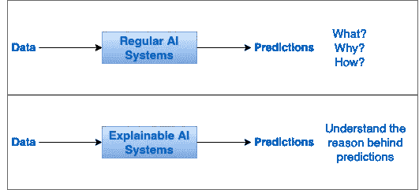

作者图片

上图展示了常规人工智能与可解释人工智能的对比，以及它如何影响最终用户。

> 当我们理解了 ML 算法预测背后的逻辑，它就不再是一个黑箱了。这不仅有助于数据科学家和 ML 工程师解释预测背后的故事，也有助于企业和整个组织信任和采用人工智能。

可解释的人工智能在高风险人工智能领域更重要，如金融投资、医疗诊断、自动驾驶汽车以及法律或国防相关的决策。目前，很难相信这些地方的“黑匣子”人工智能模型的推断。

**好处**

1.  建立对人工智能驱动的商业决策的信心- 可解释的人工智能将有助于建立对商业决策的信任&信心。来自可解释的人工智能系统的推理往往会增加系统的信心，因为它有可能看到这些决定的主要驱动因素。
2.  **透明和可问责的人工智能系统-** 随着人工智能对项目的影响越来越大，可解释性将确保研究和决策透明。因此，更容易让工程师/团队/组织对决策负责。
3.  **减轻法律、合规性&声誉风险-** 使用人工智能是不够的，我们有义务公平使用人工智能。保持人工智能模型的可解释性和透明性，可以大大降低错误结果的影响，组织可以减轻监管合规机构带来的风险&。
4.  **减轻偏见&促进公平-** 有了可解释的人工智能，更容易看到数据中影响 ML 模型输出的模式。因此，可解释的系统可以减少有偏见的预测的影响，减轻它们的风险，并培养对预测的公平信任。

# 模型复杂性-可解释性权衡

> 在创建一个 ML 模型时，总是要在模型的准确性/复杂性和模型的可解释性之间进行权衡。

大多数简单的预测模型，如线性模型，精确度较低，复杂性较低，并且易于解释。而先进的方法，如神经网络更准确，能够对更复杂的数据进行预测，并且不容易解释。因此平衡可解释性和模型复杂性总是一个挑战。当模型复杂性增加时，可解释性降低。

下图显示了不同 ML 模型在模型复杂性和可解释性之间的权衡。

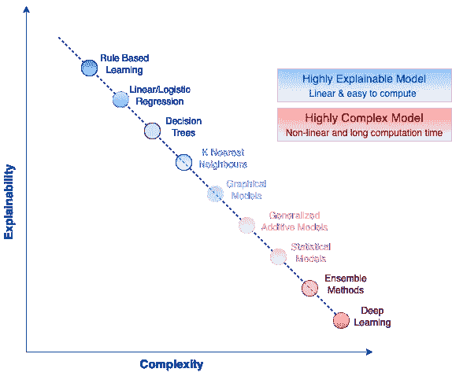

作者图片

可解释的人工智能可以在增加高度复杂模型的可解释性方面发挥至关重要的作用。不能自我解释的模型可以与 XAI 方法接口，该方法可以基于局部和全局解释提供基于特征重要性的洞察。有许多开源框架和技术可以用来向非人工智能专家解释复杂的 ML 方法。让我们看看技术。

# XAI 技术

XAI 技术可以分为两类

1.  透明方法
2.  事后方法

**透明方法**是模型的内在架构易于解释并且特性关联不复杂的地方。线性/逻辑回归、决策树、KNN 和贝叶斯模型都是透明模型的例子。

**事后方法**适用于数据中存在复杂决策界限且模型复杂性难以解释的情况。临时方法进一步分为两类-

*   **特定于模型-** 特定于模型的方法作用于单个或一组模型，并且依赖于特定模型类型的功能和能力。
*   **模型不可知-** 模型不可知方法通过分析模型输入&输出特征对任何 ML 模型起作用，并且不依赖于模型功能或复杂性。当无法解释模型功能时，这些方法非常有用。

下图显示了各种 XAI 技术-

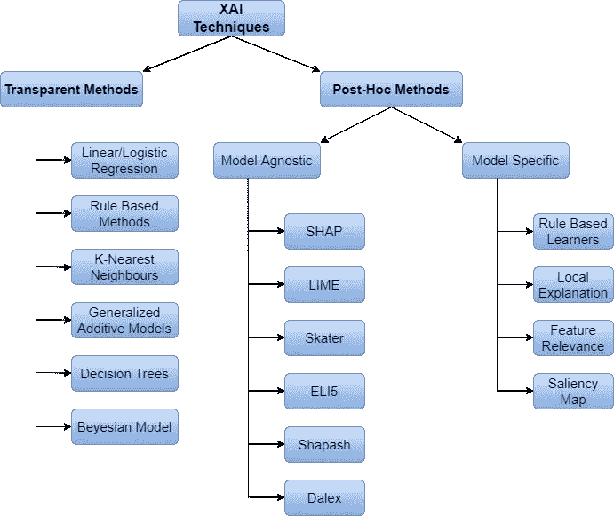

作者图片

上图只显示了一种看待不同类型的 XAI 方法的方式。XAI 还有其他的分类方法

1.  范围-全局或本地
2.  访问——解释方法对模型的访问是有限的或者完全的
3.  解释阶段——在模型开发(培训)期间或培训之后应用解释

XAI 幅员辽阔，方法很多。在这篇文章中，我将只讨论 SHAP 方法。其余的模型不可知和特定于模型的技术将在 XAI 帖子的下一部分中讨论。

# SHAP

[SHAP](https://github.com/slundberg/shap)(SHapley Additive explaints)方法是 python 中的一种博弈论方法，使用 SHapley 值来解释任何机器学习模型的输出。

要了解 SHAP，让我们首先了解什么是沙普利价值观。

**沙普利值**

Shapley 值是博弈论中的一个概念，用于测量预测中某个要素实例的平均边际贡献。

我们先来了解一下为什么沙普利值很重要。以收入预测为例，我们必须对收入是≤50K 还是> 50K 进行分类。我们已经使用 xgboost 分类器来预测收入(你可以在这里找到完整的代码)。现在我们必须检查哪些特征对预测有贡献，我们可以使用 **plot_importance** 方法来检查。该 plot_importance 方法有一个名为 importance_type 的参数，该参数基于**权重(特征在树中出现的次数)、增益(使用该特征的分割的平均增益)和覆盖(使用该特征的分割的平均覆盖范围)**来计算特征重要性。

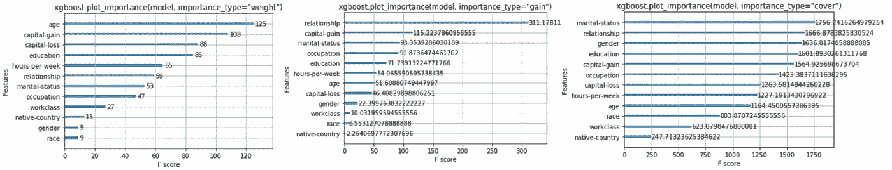

作者图片

查看 importance_type 的这 3 个值，我们使用 Xgboost 获得 3 组不同的特征贡献，但是我们不知道哪一种方法是最好的，也不知道如何获得实际上对模型有贡献的可靠特征。**使用这种方法的第二个问题是，这种方法只能有助于*全局可解释性*，如果我们必须获得特定记录的重要特征(*局部可解释性*** *)* )，这种方法将不起作用。

**python 中的 SHAP 方法可以帮助我们解决这两个问题。**但在研究 SHAP 实施以及如何解决这些问题之前，首先让我们了解什么是 Shapley 值，以及如何使用相同的收入预测示例来计算它们。

> 虽然 SHAP 方法对于获得特征对于模型预测的重要性是有用的，但是它不是评估预测本身的度量。

为了预测收入是否大于 50K，假设有这三个特征的贡献——年龄、婚姻状况和资本收益。现在让我们来理解这些特性的边际贡献。如下图所示，这里——

*   年龄贡献:2.5 万美元
*   婚姻状况贡献:4.5 万美元
*   资本收益贡献:7 万美元
*   年龄和婚姻状况:3.2 万美元
*   年龄和资本收益贡献:6 万美元
*   资本收益和婚姻状况贡献:7.5 万美元
*   年龄、婚姻状况和资本收益:9.5 万美元

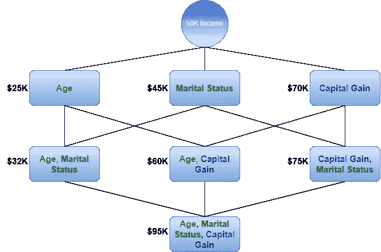

作者图片

为了找到年龄的边际贡献，我们必须计算年龄的边际贡献

1.  50K 美元收入组
2.  年龄和婚姻状况组
3.  年龄和资本收益组
4.  年龄、婚姻状况和资本收益组

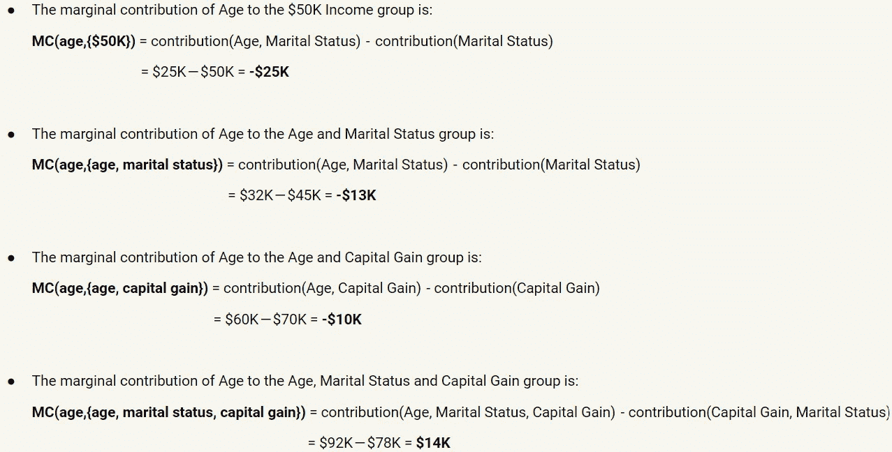

如下图所示。同样的，我们可以计算所有特性的边际贡献。

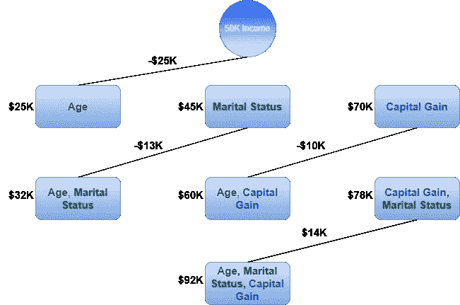

作者图片

现在让我们来计算每个级别的权重。

*   第一层有 3 条边，所以这一层上每条边的权重是 1/3——我们称之为 **w1**
*   第二层有 6 条边，所以这一层上每条边的权重是 1/6——我们称之为 **w2**
*   第三层有 3 条边，所以这一层上每条边的权重是 1/3——我们称之为 **w3**

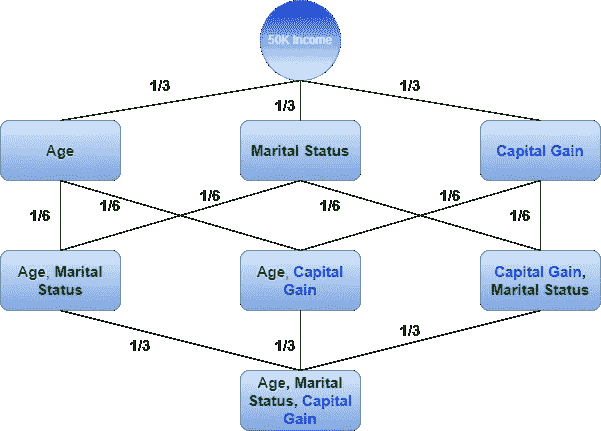

作者图片

现在我们有了所有级别的特征和权重的边际贡献，让我们计算特征的总贡献。

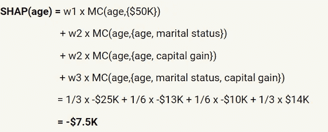

这表明年龄对收入预测的贡献为-7.5K 美元，因此-7.5K 美元是年龄的 Shapley 值。

同样，我们可以计算婚姻状况和资本收益的 Shapley 值。

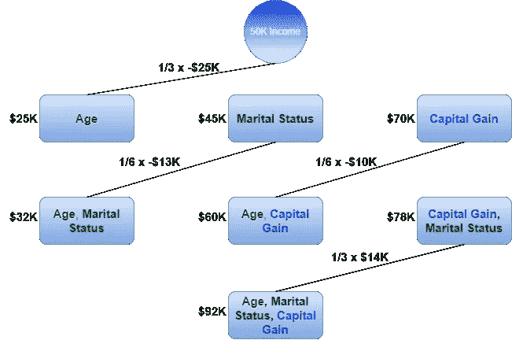

作者图片

**SHAP(年龄)= -$7.5K**

**SHAP(婚姻状况)=＄11.5k**

**SHAP(资本收益)=＄38K**

如果我们对这 3 个特性的 Shapley 值求和，结果是$42K (-$7.5K+$11.5K+$38K)，相当于从$50K 到$92K 的收入路径($92K-$50K)。

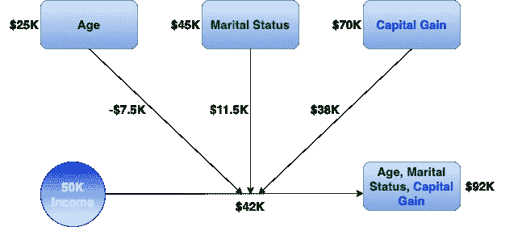

作者图片

现在我们已经了解了什么是 Shapley 值以及如何计算它们，让我们看看用 python 实现 SHAP 库的实际方法。

# Python 实现

要使用 SHAP，首先 pip 安装 [SHAP](https://github.com/slundberg/shap) 库并导入它。然后创建一个 SHAP 解释器对象，并使用它来获得 shap 值，以解释模型的预测。

现在让我们使用 Shapley 值来理解全局和局部*可解释性。*

## **全局可解释性**

**汇总条形图-** 该图以降序显示特征重要性。图顶部的要素对模型预测的贡献较大，而图底部的要素贡献较小。

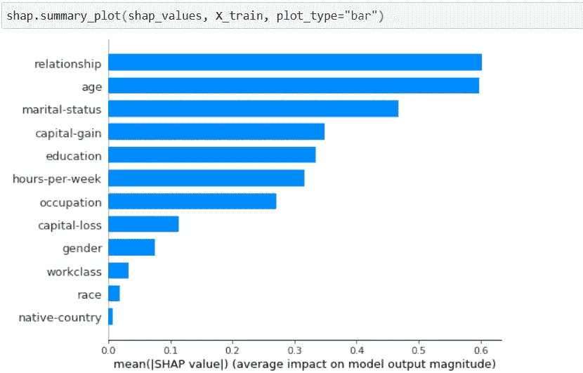

作者图片

**汇总图-** 汇总图还以降序显示特征重要性，并显示每个特征与目标变量的影响和相关性。对于每次观察，我们可以看到颜色从蓝色(低)变为红色(高)的高/低影响。我们可以看到这种相关性，因为高资本收益(红色)对收入有积极影响(向+ve 轴移动)，而年龄与收入呈负相关。

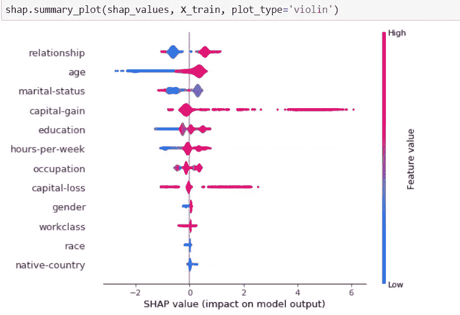

作者图片

**依赖图-依赖图**显示了一个特性对模型预测的影响。y 轴变量是自动选择的，通常情况下，该变量是要素在进行模型预测时更频繁交互的变量。

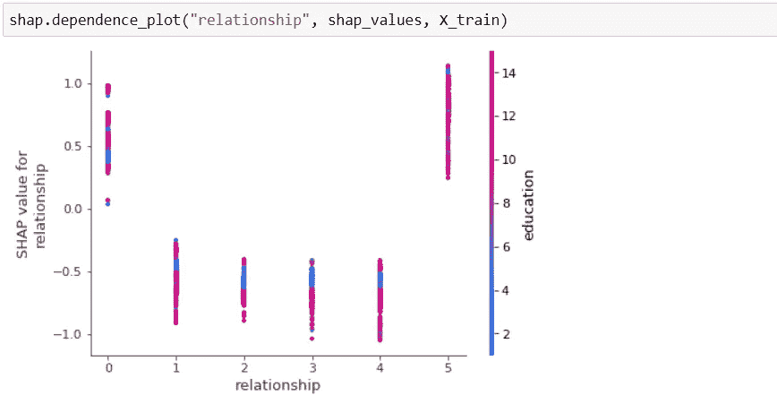

作者图片

我们还可以通过使用参数 **interaction_index** 并为 y 轴提供另一个变量来改变 y 轴变量和特征交互图。

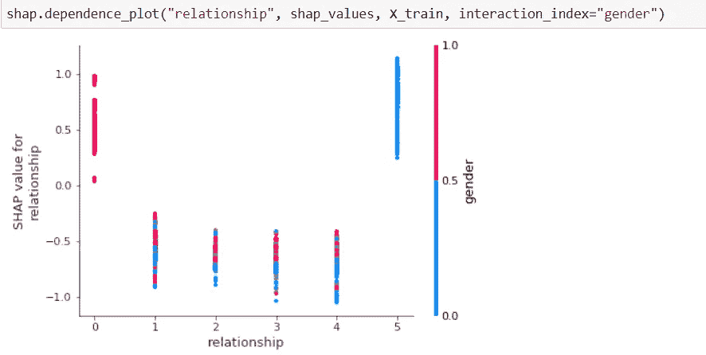

作者图片

**力图-** 力图显示特征如何影响模型输出。贡献较大的要素用红色表示，贡献较小的要素用蓝色表示。

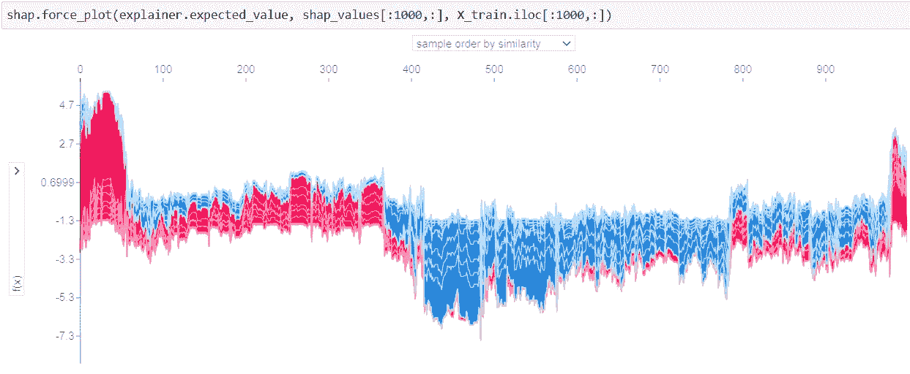

作者图片

## **本地可解释性**

**条形图-** 该图显示了特定观察中特征的贡献。下图显示了资本损失、关系和教育是对这一观察最有贡献的特征。

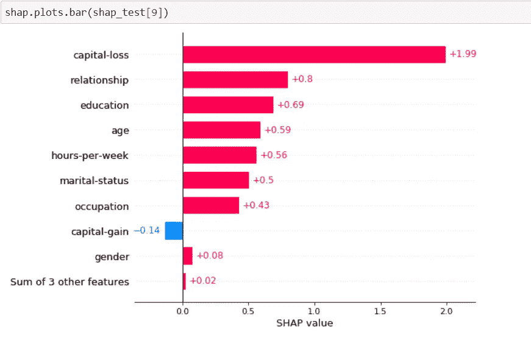

作者图片

**瀑布图-** 水流图是另一种在特定观察中绘制特征贡献的方式，如下所示。

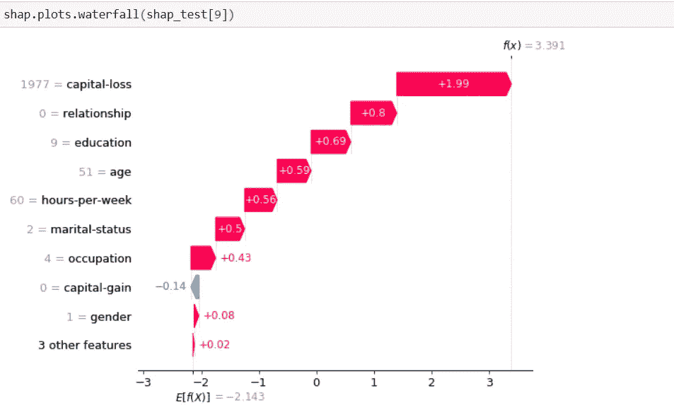

作者图片

**力图-** 对于一个具体的观察，力图显示了哪些特征最有贡献。

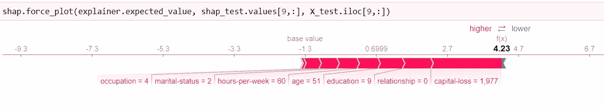

作者图片

使用 SHAP，我们不仅在全球和本地级别获得了可解释性，而且特征集也不会随着不同的情节而改变。多酷啊！！

# 最后的想法

我们已经在上面看到了 XAI 是如何帮助我们得到关于人工智能系统的为什么和如何的答案的。随着人工智能在许多行业变得越来越主流，对可解释性的需求也在增加。然而，尽管对可解释的人工智能越来越感兴趣，但可解释的人工智能愿景和实践之间存在巨大差距。同一个人工智能算法可能需要多种解释，因此可解释的人工智能在这种情况下将如何有所帮助仍是一个问题。此外，缺乏来自真实世界用例的指导来实现和测试这些解释。

> 最后，XAI 是一个新兴的领域，有许多挑战和未解决的问题，但毫无疑问，XAI 将在人工智能文学的未来扮演不可或缺的角色。

要访问使用 Xgboost 进行收入预测的完整代码并使用 SHAP 进行解释，请参考 GitHub [链接](https://github.com/charumakhijani/explainable-ai-shap)。

<https://github.com/charumakhijani/explainable-ai-shap>  

谢谢你的阅读。如果你喜欢这个故事，请喜欢，分享和关注更多这样的内容。如往常一样，请联系我们以获得任何问题/评论/反馈。

*Github:*[https://github.com/charumakhijani](https://github.com/charumakhijani) *LinkedIn:*https://www.linkedin.com/in/charumakhijani/

**参考-**

[https://towards data science . com/shap-explained-the-way-I-wish-someone-explained-it-to-me-ab 81 cc 69 ef 30](/shap-explained-the-way-i-wish-someone-explained-it-to-me-ab81cc69ef30)