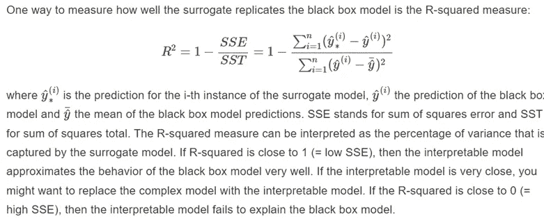
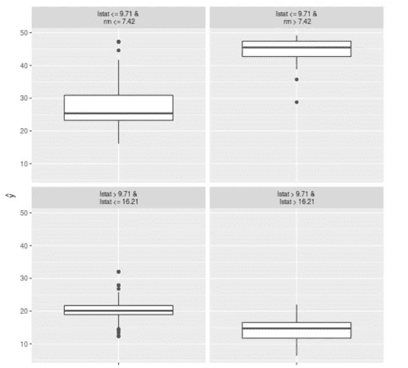

# 可解释的人工智能(XAI)方法第五部分——全局代理模型

> 原文：<https://towardsdatascience.com/explainable-ai-xai-methods-part-5-global-surrogate-models-9c228d27e13a>

## 如果你使用的算法是一个黑盒模型，为什么不使用一个模拟原始行为的可解释模型呢？


免费使用来自[像素](https://www.pexels.com/ko-kr/photo/7108092/)的照片

# 对以前职位的审查

可解释的机器学习(XAI)指的是努力确保人工智能程序在目的和工作方式上是透明的。[1]这是我打算写的 XAI 系列文章中的第五篇。

到目前为止，我已经向您介绍了四种 XAI 方法——部分相关图(PDP)、个体条件期望图(ICE)、累积局部效应(ALE)曲线和排列重要性。在这篇文章中，我提供了关于全球代理模型的初级读本。如果你好奇或者需要一些回顾，请查看我之前的四篇帖子！

[XAI 方法第一部分](/explainable-ai-xai-methods-part-1-partial-dependence-plot-pdp-349441901a3d?source=your_stories_page----------------------------------------)

[XAI 方法第二部分](/explainable-ai-xai-methods-part-2-individual-conditional-expectation-ice-curves-8fe76919aab7?source=your_stories_page----------------------------------------)

[XAI 方法第三部分](/explainable-ai-xai-methods-part-3-accumulated-local-effects-ale-cf6ba3387fde?source=your_stories_page----------------------------------------)

[XAI 方法第四部分](https://medium.com/geekculture/explainable-ai-xai-methods-part-4-permutation-feature-importance-72b8a5d9be05)

# 高级概念

顾名思义,“代理”模型是可以代替原始模型用于各种目的的算法——提高可解释性、降低计算成本等。假设您使用随机森林模型来预测回归结果。虽然它可能具有出色的预测性能，但与线性回归等固有的可解释模型不同，很难理解为什么以及如何做出这些预测。在这种情况下，可以用随机森林模型替换训练起来既便宜又快速的代理模型。

这里的关键是要确保，引用可解释的机器学习书中的话，你使用的*代理模型尽可能准确地逼近底层模型的预测，同时是可解释的。[2]*

# 代理模型的类型

有两种类型的代理模型——全局的和局部的。全局代理模型用于解释黑盒模型的“整体/全局预测”，而局部代理模型，最好由局部可解释模型不可知解释(LIME)方法表示，用于解释“个体”预测。在这篇文章中，我们只讨论全局代理模型。我的下一篇文章将会谈到酸橙这个话题。

# 如何建立全球代理模型——理论

1.  您首先需要一个可用于训练代理模型的数据集。它可以是用于训练原始黑盒模型的完全相同的数据。它也可以是在分布及其特征方面与原始数据相似的新数据。对于这些选定的数据，检索由黑盒模型预测的输出值。
2.  选择可用作全局代理模型的内在可解释算法。示例包括广义加法模型、逻辑回归和树算法(例如，不像线性回归那样透明，但解释起来仍然相对简单)
3.  根据步骤 1 中选择的数据训练代理模型，并保存生成的预测集。
4.  检查经过训练的代理模型对黑盒模型所做预测的逼近程度。这很重要，因为如果代理模型不能模仿原始黑盒模型的行为，那么我们从代理模型的解释中获得的信息就不能再解释原始模型了。

我们怎么做第四步？

我们可以使用几个指标来完成第 4 步，但一个常用的指标是 R 平方。还记得回归设置中的 R 平方是由训练模型解释的数据中方差的比例吗？这里的概念是类似的。代理模型上下文中的 R 平方是代理模型捕获的方差的百分比。[2]参见下面引用可解释的机器学习书籍的[第 9.2 章计算 R 平方的精确公式。](https://christophm.github.io/interpretable-ml-book/lime.html)



来自[可解释机器学习书](https://christophm.github.io/interpretable-ml-book/lime.html)的第 9.2 章

# 如何建立全球代理模型——实现

你可以很容易地实现上面的步骤。首先保存来自原始黑盒模型的预测，然后使用它们和训练数据来训练选择的代理模型。从代理模型中检索预测。将原始模型和代理模型的预测值代入上面的 R 平方公式，计算代理模型在预测行为上与原始模型的相似程度。最后，解释一下代理模型！

然而，R 和 Python 都有允许我们简化整个过程的包！(眨眼)

对于 R 用户来说， **iml** 包就派上用场了。让我们看一个来自官方 [R-CRAN 文档](https://cran.r-project.org/web/packages/iml/vignettes/intro.html)的例子。

```
set.seed(42)
**library**(“iml”)
**library**(“randomForest”) **data**(“Boston”, package = “MASS”) 
rf <- randomForest(medv ~ ., data = Boston, ntree = 50)
X <- Boston[which(names(Boston) != "medv")] 
predictor <- Predictor$new(rf, data = X, y = Boston$medv)# fit surrogate decision tree model
tree <- TreeSurrogate$new(predictor, maxdepth = 2)

# how well does this model fit the original results
tree$r.squared
```

数据集是著名的波士顿住房数据。我们想用随机森林来做预测。但这不是很好解释。在这种情况下，我们使用树算法作为代理模型。如上所示，rf 是存储随机森林模型的变量，predictor 是存储随机森林模型所有预测的变量。

树变量是由 iml 包中的 **TreeSurrogate** 函数创建的 iml 对象。这个函数有一个 maxdepth 参数，允许用户控制正在形成的树的最大深度。iml 包的一个缺点是只有树算法可以作为代理模型的选项。最后，iml 对象上的 **r.squared** 函数(在本例中是 tree 变量)返回代理模型的 R 平方值。

```
plot(tree)
```



应用于 iml 对象的绘图函数将返回上面的方框图可视化效果。我们可以看到，对于 lstat > 9.71 & lstata > 16.21，y 平方值特别低。

对于 Python 用户，有**解释**包可用。interpret 项目由微软研究团队牵头，旨在为用户提供各种可解释的机器学习(XAI)方法。它不是专门为代理模型开发的，但是它包含了构建代理模型的方法和功能。

解释包主要有两个模块流——黑盒模块和玻璃盒模块。“玻璃盒子”可以理解为“白盒”的同义词，指的是透明且可解释的模型。黑盒是黑盒或白盒的反义词。

```
from interpret.ext.blackbox import MimicExplainer
from interpret.ext.glassbox import LinearExplainableModel
```

MimicExplainer 是一个代理模型函数，可以包装任何可解释的算法。在这种情况下，我们使用线性模型，因此我们导入 LinearExplainableModel 函数。还有其他可用的选项，包括*decisiontreeexplaineablemodel 和 GBMExplainableModel。*

完整的示例代码，我推荐下面的[博文](https://santiagof.medium.com/model-interpretability-making-your-model-confesses-surrogate-models-3dbf72bee8e)。

# **优点和需要谨慎的事情！**

## 优势

任何可解释的模型都可以用作代理模型，因此它给用户带来了灵活性！此外，根据听 XAI 解释的目标受众，你可以训练多种替代模型，最适合不同的受众群体，帮助他们清楚地理解这些见解。

## 缺点和需要注意的事项

在某些情况下，您会遇到这样的情况:您尝试训练的可解释模型中没有一个具有足够高的 R 平方值，从而能够做出代理模型近似于原始黑盒模型的预测的声明。此外，R 平方值的可接受阈值是多少？是 50%以上的吗？至少应该是 80%吧？到目前为止，还没有一种独立的方法可以让我们衡量代理模型是否与原始模型“足够相似”。

另一件要记住的事情是，代理模型只提供关于原始模型的解释，而不是感兴趣的一般数据。如果原始模型是垃圾，几乎没有任何概括的预测能力，那么我们从替代模型中得到的解释就没有价值。

我的下一篇文章将讨论局部代理模型，即可解释的模型不可知解释(LIME)。敬请期待！

# 参考

[1] [可解释的人工智能(XAI)](https://www.techopedia.com/definition/33240/explainable-artificial-intelligence-xai) (2019)，Technopedia

[2] C .莫尔纳尔*，* [可解释机器学习](https://christophm.github.io/interpretable-ml-book/global.html) (2020)

[3] F. [圣地亚哥](https://santiagof.medium.com/?source=post_page-----3dbf72bee8e-----------------------------------)，模型可解释性——让你的模型坦白:代理模型(2020)，中等

# 关于作者

Seungjun (Josh) Kim 是一名数据科学家，在密歇根大学刑事司法行政记录系统(CJARS)实验室担任副研究员。他计划从今年秋天开始攻读统计学或信息方面的博士学位(等待结果)。在空闲时间，他喜欢做礼拜、读圣经、看韩剧、健身、制作和播放音乐，并尝试新的亚洲美食食谱。

[他的个人网站](https://seungjun-data-science.github.io/)